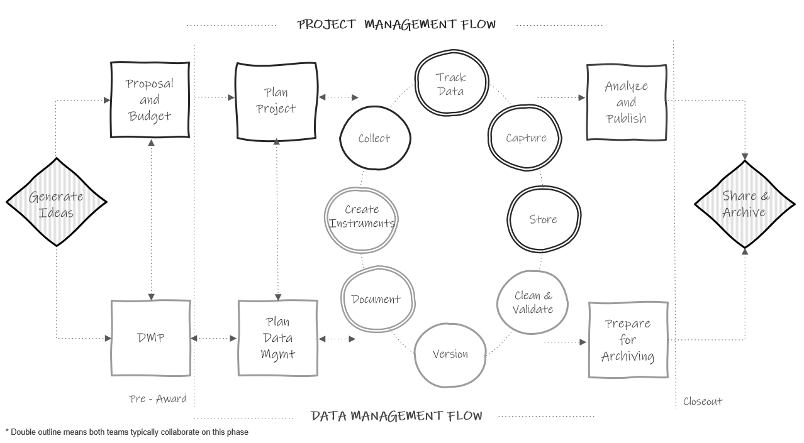

# Research Data Management

## What is research data management?

Research data management (RDM) involves the organization, storage, preservation, and dissemination of research study data [@bordelon_guides_nodate]. Research study data includes materials generated or collected throughout a research process [@national_endowment_for_the_humanities_data_2018]. As you can imagine, this broad definition includes much more than just the management of digital datasets. It also includes physical files, documentation, artifacts, recordings, and more. RDM is a substantial undertaking that begins long before data is ever collected, during the planning phase, and continues well after a research project ends during the archiving phase. 

## Standards

Data management standards refer to rules for how data should be stored, organized, and described [@borghi_promoting_2022]. Some fields have adopted standards across the research life cycle, such as CDISC standards used by clinical researchers [@cdisc_cdisc_nodate], other fields have adopted standards specifically around metadata, such as the TEI standards used in digital humanities [@burnard_what_2014], and through grassroots efforts, other fields such as psychology are developing their own standards for things such as data structure and documentation based on the FAIR principles [@kline_technical_2018]. Yet, it is common knowledge that there are currently no agreed-upon norms for how to structure and share data in the field of education [@institute_of_education_sciences_frequently_nodate]. The rules for what data should be produced and how it should be documented is often left up to each individual team, as long as external compliance requirements are met [@tenopir_data_2016-1]. However, with a growing interest in open science practices and expanding requirements for federally funded research to make data publicly available [@office_of_science_and_technology_policy_ostp_2022], data repositories will most likely begin to play a stronger role in promoting standards around data formats and documentation [@borghi_promoting_2022].

While field standards for the structure and format of publicly shared products that aid in the preservation and re-use of data are very much needed, there are actually good reasons to not impose standardization on all data management activities across the field. Granting some flexibility in the process of managing data during active data collection allows teams to implement the best practices that work for their projects, as long as those projects implement practices consistently during their project and produce similar quality outputs across the field.


## Why care about research data management?

Without current agreed-upon standards in the field, it is important for research teams to develop their own data management standards that apply within and across all of their projects. Developing internal standards, implemented in a reproducible data management workflow, allows practices to be implemented consistently and with fidelity. There are both external pressures and personal reasons to care about developing research data management standards for your projects.

### External Reasons

1. **Funder compliance**: Any researcher applying for federal funding will be required to submit a data management plan (DMP) along with their grant proposal[@office_of_science_and_technology_policy_ostp_2022]. The contents of these plans may vary slightly across agencies but the shared purpose of these documents is to facilitate good data management practices and to mandate open sharing of data to maximize scientific outputs and benefits to society. Along with this mandatory data sharing policy, comes the incentive to manage your data for the purposes of data sharing [@borghi_promoting_2022].

1. **Journal compliance**: Depending on what journal you publish with, providing open access to the data associated with your publication may be a requirement (see PLOS ONE[@plos_one_data_nodate] and AMPPS[@noauthor_advances_nodate] as examples). Again, along with data sharing, comes the incentive to manage your data in a thoughtful, responsible, and organized way.

1. **Compliance with legal and ethical mandates**: If you are required to submit your research project to the Institutional Review Board (IRB), they will monitor how you manage your data. The IRB is concerned with the welfare, rights, and privacy of research participants and will have rules for how data is managed and stored securely. Additionally your organization may have their own institutional data policies that mandate how data must be cared for and secured [@association_of_academic_health_science_libraries_institutional_2022].

1. **Open science practices**: With a growing interest in open science practices, sharing well managed and documented data helps to build trust in the research process [@renbarger_champions_2022]. Sharing data that is curated in a reproducible way is "a strong indicator to fellow researchers of rigor, trustworthiness, and transparency in scientific research" (Alston & Rick, 2021, p.2 [@alston_beginners_2021]). It also allows others to replicate and learn from your work, validate your results to strengthen evidence, as well as potentially catch errors in your work, preventing decisions being made based on incorrect data [@alston_beginners_2021]. Well-managed data with sufficient documentation can also lead to more collaboration and greater impact as collaborators are able to access and understand your data with ease [@borghi_promoting_2022; @cowles_research_nodate; @eaker_what_2016].

### Personal reasons

Even if you never plan to share your data outside of your research group, there are still many compelling reasons to manage your data in a reproducible and standardized way. 

1. **Reduces data curation debt**: Taking the time to plan and implement quality data management through the entire research study reduces data curation debt caused by suboptimal data management practices [@butters_recognizing_2020]. Having poorly collected, managed, or documented data may make your data unusable, either permanently or until errors are corrected. Decreasing or removing this debt reduces the time, energy, and resources spent possibly recollecting data or scrambling at the end of your study to get your data up to acceptable standards.

1. **Facilitates use of your data**: Every member of your research team being able to find and understand your project data and documentation is a huge benefit. It allows for the easy use and re-use of your data, and hastens efforts like the publication process [@markowetz_five_2015]. Not having to search around for numbers of consented participants or asking which version of the data they should use allows your team to spend more time analyzing and less time playing detective.

1. **Encourages validation**: Implementing reproducible data management practices encourages and allows your team to internally replicate and validate your processes to ensure your outputs are accurate.

1. **Improves continuity**: Data management practices such as documentation ensures project continuity through staff turnover. Having developed thorough protocols allows new staff to pick up right where the former staff member left off and implement the project with fidelity [@borghi_data_2021; @cowles_research_nodate]. Furthermore, good data management enables continuity when handing off projects to collaborators or when picking up your own projects after a long hiatus [@markowetz_five_2015].

1. **Increases efficiency**: Documenting and automating tasks reduces duplication of efforts for repeating tasks, especially in longitudinal studies.

1. **Upholds research integrity**: Errors come in many forms, from both humans and technology[@kovacs_role_2021; @strand_error_nodate]. We've seen evidence of this in the papers cited as being retracted for "unreliable data" in the blog Retraction Watch [@noauthor_retraction_nodate]. Implementing quality control procedures reduces the chances of errors occurring and allows you to have confidence in your data. Without implementing these practices, your research findings could include extra noise, missing data, or erroneous or misleading results.

1. **Improves data security**: Quality data management practices reduce the risk of lost or stolen data, the risk of data becoming corrupted or inaccessible, and the risk of breaking confidentiality agreements.


## Existing Frameworks

Data management does not live in a space all alone. It co-exists with other frameworks that impact how and why data is managed and it is important to be familiar with them as they will provide a foundation for you as you build your data management structures. 

### FAIR {#fair}

In 2016, the FAIR Principles [@noauthor_fair_nodate] were published in Scientific Data, outlining four guiding principles for scientific data management and stewardship. These principles were created to improve and support the reuse of scholarly data, specifically the ability of machines to access and read data, and are the foundation for how all digital data should be publicly shared [@wilkinson_fair_2016]. The principles are:

F: Findable

All data should be findable through a persistent identifier and have thorough, searchable metadata. As we move towards automation in our work and life, the need for machine-readable data and metadata becomes more prevalent for automatic discovery of information.

A: Accessible

Users should be able to access your data. This can mean your data is available in a repository or through a request system. At minimum, a user should be able to access the metadata, even if the actual data are not available.

I: Interoperable

Your data and metadata use standardized vocabularies as well as formats. Both humans and machines should be able to read and interpret your data. Software licenses should not pose a barrier to usage. Data should be available in open formats that can be accessed by any software (ex: .csv, .txt, .dat).

R: Reusable

In order to provide context for the reuse of your data, your metadata should give insight into data provenance, providing a project description, an overview of the data workflow, as well what authors to cite for appropriate attribution. You should also have clear licensing for data use.

### SEER

In addition to the FAIR principles, the SEER principles, developed in 2018 by Institute of Education Sciences (IES), provide Standards for Excellence in Education Research [@noauthor_standards_nodate]. While the principles broadly cover the entire life cycle of a research study, they provide context for good data management within an education research study. The SEER principles include:

- Pre-register studies
- Make findings, methods, and data open
- Identify interventions’ core components
- Document treatment implementation and contrast
- Analyze interventions’ costs
- Focus on meaningful outcomes
- Facilitate generalization of study findings
- Support scaling of promising results

### Open Science

The concept of Open Science has pushed quality data management to the forefront, bringing visibility to its cause, as well as advances in practices and urgency to implement them. Open Science aims to make scientific research and dissemination accessible for all, making the need for good data management practices absolutely necessary. Open science advocates for transparent and reproducible practices through means such as open data, open analysis, open materials, preregistration, and open access [@van_dijk_open_2021]. Organizations such as the Center for Open Science [@science_center_nodate], have become a well-known proponents of open science, offering the open science framework (OSF) [@foster_open_2017] as a tool to promote open science through the entire research life cycle. Furthermore, many education funders have aligned their fundee requirements with these open science practices, such as openly sharing study data and pre-registration of study methods [@education_sciences_ies_nodate].

## Terminology

Before diving into the content of this training, I think it is helpful to cover terminology that will be used in data management. Many concepts in education research have multiple terms and can be used interchangeably. Across different institutions, researchers may use all or some of these terms.

```{r, echo = FALSE, message=FALSE, warning=FALSE, fig.cap="Commonly used data management terms"}

library(tidyverse)
library(kableExtra)

data <- readxl::read_excel(here::here("img", "def_table.xlsx")) %>% 
  arrange(Term)

gt::gt(data)

```


## The Research Life Cycle

The remainder of this book will be organized into chapters that dive into phases of the research data life cycle. It is imperative to understand this research life cycle in order to see the flow of data through a project, as well as to see how everything in a project is connected. If phases are skipped, the whole project will suffer.

You can see in the image below how, throughout the project, data management roles and project coordination roles work in parallel and collaboratively. These teams may be made up of the same people or different members, but either way, both workflows must happen and they must work together.

```{r fig2-1, fig.cap="The research project life cycle"}



```

Let's walk through this chart.

  1. In a typical study we first begin by **generating ideas**, deciding what we want to study.
  2. Then, most likely, we will look for grant funding to implement that study. This is where the two paths begin to diverge. If the team is applying for federal funding, the proposal and budget are created in the project management track, while the supplemental required **[data management plan](#dmp)** is created in the data track. Again, it may be the same people working on both of these pieces.
  3. Next, if the grant is awarded, the project team will begin planning things such as hiring, recruitment, data collection, and how to implement the intervention. At the same time, those working on the data team will begin to **plan** out how to specifically implement the 2-5 page data management plan submitted to their funder and start putting any necessary structures into place.
  4. Once planning is complete, the team moves into the cycle of data collection. It is called a cycle because if your study is longitudinal, every step here will occur cyclically. Once one phase of data collection wraps up, the team re-enters the cycle again for the next phase of data collection, until all data collection is complete for the entire project.
     - The data management and project management team begin the cycle by starting **documentation**. You can see that this phase occurs collaboratively because it is denoted with a double outline. Both teams begin developing documentation such as data dictionaries and standard operating procedures.
     - Once documentation is started, both teams collaboratively begin to create any necessary **data collection instruments**. These instruments will be created with input from the documentation. During this phase the teams may also develop their participant tracking database.
     - Next, the project management team moves into the **data collection** phase. In addition to actual data collection, this may also involve preliminary activities such as recruitment and consenting of participants, as well as hiring and training of data collectors. At this point, the data management team just provides support as needed. 
     - As data is collected, the project team will **track data** as it is collected in the participant tracking database. The data management team will collaborate with the project management team to help troubleshoot anything related to the actual tracking database or any issues discovered with the data during tracking.
     - Next, once data is collected, the teams move into the **data capture** phase. This is where teams are actively retrieving or converting data. For electronic data this may look like downloading data from a platform or having data sent to the team via a secure transfer. For physical data, this may look like teams entering paper data into a database. Oftentimes, this again is a collaborative effort between the project management team and the data team.
     - Once the data is captured, it needs to be **stored**. While the data team may be in charge of setting up and monitoring the storage efforts, the project team may be the ones actively retrieving and storing the data.
     - Next the teams move into the **cleaning and validation** phase. At this time the data team is reviewing data cleaning plans, writing data cleaning scripts, and actively cleaning data from the most recent data collection round.
     - And last, the data team will **version** data as it is updated or errors are found.
  5. The teams then only move out of the active data collection phase when all data collection for the project is complete. At this time the project team begins analyzing study data and working on publications as well as any final grant reports. They are able to do this because of the organized processes implemented during the data collection cycle. Since data was managed and cleaned throughout, data is ready for analysis as soon as data collection is complete. Then, while the project team is analyzing data, the data team is doing any additional **preparation to archive** data for public sharing.
  6. Last, as the grant is closing out, the team submits data for **public sharing**.
    
As you work through the remaining chapters of this book, this chart will be a guide to navigating where each phase of practices fits into the larger picture. 

