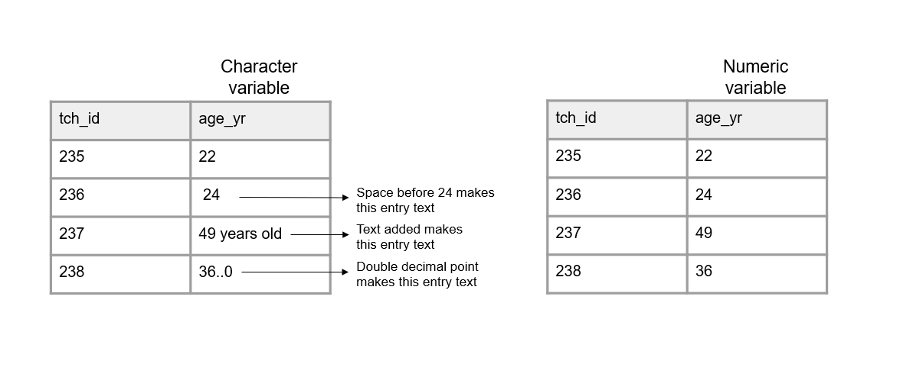
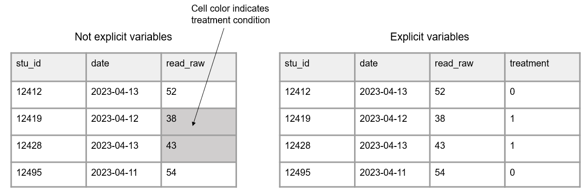
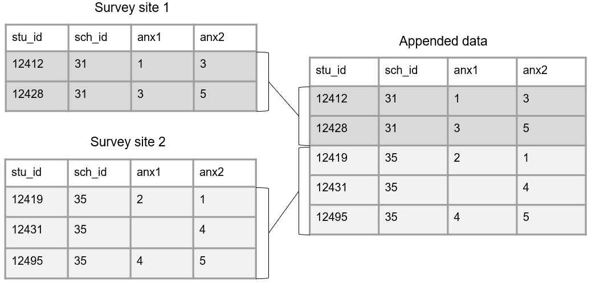

# Data Organization {#structure}

Before jumping into the project life cycle, we need to have a basic understanding of what data looks like. Understanding the basics of data organization helps us to make informed decisions throughout the research life cycle that will result in clear, analyzable information.

## Basics of a dataset

In education research, data is often collected internally by a team using an instrument such as a questionnaire, an observation form, an interview guide, or an assessment. However, data may also be collected by external entities, such as districts, states, or other agencies.

Those data come in many forms (e.g., video, transcripts, documents, data files), represented as text, numbers, or multimedia [@usgs_what_2023]. In the world of quantitative education research, we are often working with digital data in the form of a dataset, a structured collection of data. A dataset is organized in a rectangular format which allows the information to be machine-readable. Rectangular, also called tabular, datasets are made up of columns and rows (see Figure \@ref(fig:fig3-1)). 

```{r fig3-1, fig.cap="Basic format of a dataset."}


```

### Columns {#structure-columns}

The columns in your dataset will consist of the following types of variables:

- Variables you collect
  - These are variables collected from an instrument or external source.
- Variables you create
  - These may be indicators you create (e.g., cohort, treatment, time).
  - Or they me be variables derived for summary purposes (e.g., means, sum scores).
- Identifier variables
  - You must also include values that uniquely identify subjects in your data (e.g., a student unique identifier).
  - See Section \@ref(track-ids) for more information on creating unique identifier variables.

#### Column attributes

The columns, or variables, in your dataset also have the following attributes:

1. Variable names
    - A variable name is the short representation of the information contained in a column.
    - Variable names must be unique. No variable name in a dataset can repeat. We will talk more about variable naming when we discuss style guides in Chapter \@ref(style).
2. Variable types
    - A variable's type determines allowable values for a variable, the operations that can be performed on the variable, and how the values are stored.
    - Example types include numeric, character (also called text or string), or date. Types can also be more narrowly defined as needed (e.g., continuous, categorical).
3. Variable values 
    - Variable values refer to the information contained in each column. Every variable has pre-determined allowable values. 
    - Examples of setting allowable values for different types of variables include:
      - Categorical character variable: "yes" | "no"
      - Numeric variable: *1--25*
      - Date variable: *2023-08-01 to 2023-12-15*
      - Free text character variable: any value is allowed
    - Anything outside of your expected values or ranges is considered an error.
4. Variable labels
    - A variable label is the human readable description of what a variable represents.
    - This may be a label that you, as the variable creator, assigns (e.g., "Treatment condition") or it may be the actual wording of an item (e.g., "Do you enjoy pizza?").

### Rows

The rows in your dataset are aligned with subjects (also called records or cases) in your data. Subjects in your dataset may be students, teachers, schools, locations, and so forth. The unique subject identifier variable mentioned in Section \@ref(structure-columns), will denote which row belongs to which subject. 

### Cells

The cells are the observations associated with each case in your data. Cells are made up of key/value pairs, created at the intersection of a column and a row (see Figure \@ref(fig:fig3-2)). Consider an example where we collect a survey (also called a questionnaire) from students. In this dataset, each row is made up of a unique student in our study, each column is an item from the survey, and each cell contains a value that corresponds to that row/column pair (i.e., that participant and that question).

```{r fig3-2, fig.cap="Representation of a cell value."}

knitr::include_graphics("img/fig3-2.PNG")

```

## Dataset organization rules {#structure-rules}

In order for your dataset to be machine-readable and analyzable, it should adhere to a set of organizational rules [@broman_data_2018; @wickham_tidy_2014]. 

1. The first rule is that data should make a rectangle (Figure \@ref(fig:fig3-3)). The first row of your data should be your variable names (only use one row for this). The remaining data should be made up of values in cells.

```{r fig3-3, fig.cap="A comparison of non-rectangular and rectangular data."}

knitr::include_graphics("img/fig3-3.PNG")

```

2. Column values should be consistent (Figure \@ref(fig:fig3-4)). Both humans and machines have difficulty categorizing information that is not measured, coded, or formatted consistently.
    - For text categorical values, use controlled vocabularies and keep consistent spelling, case, and spacing.
    - For date values, keep the format consistent.
    - For numeric values, measure in consistent units and keep consistent decimal places.

```{r fig3-4, fig.cap="A comparison of inconsistent and uniform variable values."}

knitr::include_graphics("img/fig3-4.PNG")

```


3. Columns should adhere to your expected variable type (Figure \@ref(fig:fig3-5)).
    - For example, if you have a numeric variable, such as `age`, but you add a cell value that is text, your variable no longer adheres to your variable type. Machines will now read this variable type as character.
  
```{r fig3-5, fig.cap="A comparison of variables adhering and not adhering to a data type."}



```
  
4. A variable should only collect one piece of information (Figure \@ref(fig:fig3-6)). This allows you to more easily work with your variables.
    - For example, rather than combining the number of incidents and the number of enrolled students in the same variable, separate this information into two variables. This allows you to aggregate information as needed (e.g., calculate an incident rate).
  
```{r fig3-6, fig.cap="A comparison of two things being measured in one variable and two things being measured across two variables."}


```

5. All cell values should be explicit (Figure \@ref(fig:fig3-7)). This means all cells that are not missing values should be filled with a value. 
    - Consider why a cell value is empty
      - If a value is actually missing, you can either leave those cells blank or fill them with your pre-determined missing values (e.g., *-99*). See Section \@ref(style-missing) for ideas on coding missing values.
      - If a cell is left empty because it is implied to be the same value as above, the cells should be filled with the actual data.
      - If an empty cell is implied to be *0*, fill the cells with an actual *0*.

```{r fig3-7, fig.cap="A comparison of variables with empty cells and variables with not empty cells."}

knitr::include_graphics("img/fig3-7.PNG")

```

6. All variables should be explicit (Figure \@ref(fig:fig3-8)). No variables should be implied using color coding.
    - If you want to indicate information, add an indicator variable to do this rather than cell coloring.   

```{r fig3-8, fig.cap="A comparison of information being indicated through cell color and information being provided in an indicator variable."}



```

## Linking data {#structure-link}

Up until now we have been talking about one, standalone dataset. However, it is more likely that your research project will be made up of multiple datasets, collected from different participants, using a variety of instruments, and possibly across different time points. At some point you will most likely need to link those datasets together. 

In order to think about how to link data, we need to discuss two things, database design and data structure.

### Database design {#structure-database}

A database is "an organized collection of data stored as multiple datasets" [@usgs_what_2023]. Sometimes this database is actually housed in a database software system (such as SQLite or FileMaker), and other times we are loosely using the term database to simply define how we are linking datasets together that are stored individually (i.e., flat files). No matter the storage system, the general concepts here will be applicable.

In database terminology, each dataset we have is considered a "table". Each table includes one or more variables that uniquely define rows in your data (i.e., a primary key). Tables may also contain variables associated with unique values in another table (i.e., foreign keys) [@wickham_r_2023]. See Figure \@ref(fig:fig3-9) for an example of three tables that contain primary keys (denoted by rectangles) and foreign keys (denoted by ovals). Furthermore, tables can be joined either horizontally or vertically.

```{r fig3-9, fig.cap="Three tables with primary and foreign keys."}

knitr::include_graphics("img/fig3-9.PNG")

```

#### Horizontal joins

Joining tables horizontally, also called merging, involves matching rows by one (e.g., `stu_id`) or more (e.g., `first_name` and `last_name`) keys, resulting in a table of combined information. With the exception of primary and foreign keys which are often identically named across tables, it is important that all variables are uniquely named across tables when joining horizontally. 

There are several different types of horizontal joins (e.g., left, right, inner, full). While diving into the different types of joins is outside of the scope of this book, resources for further learning will be provided at the end of this section. For now, just assume that the joins we discuss are all left joins (i.e., all records from our first table will be matched to any available records in our second table).

To better understand horizontal joins, let's take the simple example in Figure \@ref(fig:fig3-10), where we only have a primary key (`stu_id`) in each table, no foreign keys. Here we collected data from students using two different instruments (a survey and an assessment). When we join these tables on our primary key, it will be a one-to-one merge because each student only appears once in each table. 

```{r fig3-10, fig.cap="Linking data through primary keys.", out.width="70%"}


```

However, we are often not only collecting data using a variety of instruments, we are also collecting nested data across different entities (e.g., students, nested in classrooms, nested in schools). Let's look at another example where we collected data from both students (an assessment) and teachers (a survey). Figure \@ref(fig:fig3-11) shows how we can now link the foreign key in the student assessment (`tch_id`) with the primary key in the teacher survey (`tch_id`). In this scenario, we are doing a many-to-one join (i.e., multiple students are associated with the same teacher), meaning upon merging, teacher data will be repeated for all students in their classroom. 

```{r fig3-11, fig.cap="Linking data through foreign keys."}

knitr::include_graphics("img/fig3-11.PNG")

```

As you can imagine, as we add more tables, the database structure begins to become even more complex. Figure \@ref(fig:fig3-12) is an example where we collected data from students (a survey and an assessment), from teachers (a survey and an observation), and from schools (an intake form). While the linking structure begins to look more complex, we see that we can still link all of our data through primary and foreign keys. Tables within participant types can be linked by primary keys, and tables across participant types can be linked by foreign keys.

```{r fig3-12, fig.cap="Linking data through primary and foreign keys."}


```

> **Note**
>
> It is important to note here, that if you do not have common unique identifiers across tables, as is in the case of anonymous data, you will be unable to join data horizontally.

#### Vertical joins

Joining tables vertically, also called appending, involves stacking tables on top of each other. Here, rather than joining by primary and foreign keys, we are matching columns by variable names. In this case, variable names and variable types should be identical across tables for the matching to work. 

Let's take a simple example where we collected a survey from two different sites. Those surveys were entered into two separate tables and we want to combine that data. Figure \@ref(fig:fig3-13) shows how we could vertically join those tables.

```{r fig3-13, fig.cap="Appending data across sites."}



```

> **Note**
>
> In this Section (\@ref(structure-link)) I am loosely using the term "join" to provide a unifying framework for the different ways you can combine data. However, stacking data vertically is not technically considered a join, commonly defined as matching dataset rows by a common key. Terms such as append or union are more conventionally used in the field to describe stacking data in this way.

**Resources**

|Source|Resource|
|--------|-----------|
|Crystal Lewis | A review of horizontal and vertical joins^[https://cghlewis.com/blog/joins/]|
|Data Carpentry | A review of different types of horizontal joins^[https://tavareshugo.github.io/r-intro-tidyverse-gapminder/08-joins/index.html]|
|David E. Caughlin| A review of horizontal and vertical joins^[https://rforhr.com/join.html]|

### Data structure {#structure-datastructure}

When working with longitudinal data, it’s important to consider data structure before linking data. Collecting longitudinal, or repeated measures data, typically results in multiple, identically formatted tables, each representing a different wave of data collection. It is common for researchers to join these waves of data for storage or analysis purposes. However, there are two different ways to structure combined longitudinal data---in wide format or long format---and it is important to choose this structure before joining your data. 

#### Wide format

When we structure our data in a wide format, all data collected on a unique subject will be in one row. Subjects should not be duplicated in your data in this format. 

To structure data in wide format, we join our tables horizontally. Before joining though, each wave of data collection will be appended to a variable name to create unique names. Figure \@ref(fig:fig3-14) shows of an example of how we could structure two waves of data collection in wide format. 

```{r fig3-14, fig.cap="Example linking tables across time in wide format.", out.width= "80%"}

knitr::include_graphics("img/fig3-14.PNG")

```

#### Long format

Another way to structure longitudinal data is in long format. Here a participant can, and often will, repeat in your dataset, and unique rows will now be identified through a combination of variables (e.g., `stu_id` and `wave` together will be your primary key). 

To structure data in long format, we join our tables vertically. In this scenario, we no longer add the data collection wave to variable names. However, a time period variable should be added to denote the wave associated with each row of data. Figure \@ref(fig:fig3-15) shows an example of how we could structure two waves of data collection in long format. 

```{r fig3-15, fig.cap="Example linking tables across time in long format."}

knitr::include_graphics("img/fig3-15.PNG")

```

#### Choosing wide versus long {#structure-reshape}

There are different reasons for structuring your longitudinal data one way or another. Storing data in long format is usually considered to be more efficient than storing in wide format, potentially requiring less memory. However, when it comes time for analysis, specific data structures may be required. For example, repeated measure procedures typically require data to be in wide format, where the unit of analysis is the subject. While mixed model procedures typically require data to be in long format, where the unit of analysis is each measurement for the subject [@grace-martin_wide_2013]. It may be that you structure data in one format for one reason (e.g., storing or sharing), and then restructure data into another format a different reason (e.g., analysis). Luckily, this type of restructuring can be done fairly quickly in many statistical programs^[https://osf.io/xumg4]. We will further review decision making around data structure in Chapters \@ref(clean) and \@ref(share).
