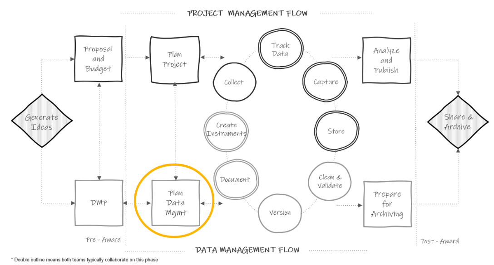

# Planning Data Management

```{r fig.cap="Data management plan in the research project life cycle", out.width = "70%"}



```

## Why spend time on planning?

The 2-5 page data management plans (DMPs) discussed in the previous chapter are hopeful outlines for future practices and our impetus for detailed planning. However, the broad theory behind our DMPs do not actually prepare us for the complex implementation of those plans in practice[@borycz_implementing_2021]. Therefore, it is important to spend time, before your project begins, laying out detailed instructions for how you plan to manage data according to your DMP. It is an upfront time investment but this sort of slow science leads to better data outcomes. Reproducibility begins in the planning phase and without taking time to thoughtfully create standards as well as document and train staff on those standards, your data management practices are likely to be implemented inconsistently. 

Planning the day to day management of your project data has many other benefits as well. It allows you to anticipate and overcome barriers to managing your data, such as communication issues, training needs, or 
potential tool issues. This type of planning also saves you time in the long run, removing the last minute scrambling that can occur when trying to organize your data at the end of a project. Last, this type of planning can mitigate errors. If there is one constant that we should all accept about data management, it is that mistakes happen. We should both acknowledge and prepare for this. Viewing errors as problems created by poorly planned workflows, rather than individual failures, helps us to see how data management planning can lead to better data[@strand_error_nodate]. While data management planning can not remove all chances of errors creeping into your data[@eaker_what_2016], it can most certainly reduce those errors and prevent them from "compounding over time"(Alston & Rick, 2021, p.4 [@alston_beginners_2021]).
 
## Planning checklists

This data management planning happens at the same time that the project team is planning for project implementation (things like how to collect data, how to hire staff, planning supplies, how to recruit participants, how to communicate with sites, etc). This planning phase should involve all relevant parties: PIs, coordinators, data managers and so forth. Initially it may take a few weeks to a few months of ongoing meetings, with information being gathered and decisions being fleshed out between and at each meeting. 

Checklists can help you kick off this planning process. Below I have provided some sample checklists. These checklists can be added to or amended and brought to your planning meetings to help your team think through the various data management decisions that need to be made at each phase of your research project.

1. Roles and Responsibilities
2. Documentation
3. Data Collection
4. Data Tracking
5. Data Capture
6. Data Storage and Security
7. Data Cleaning
8. Data Sharing

### Considerations

As you start to work through these planning checklists, it's important to consider how each team and project are unique. A technique that might work well for one team, may not work out so well for another. Make sure to consider the following:

1. All external requirements
2. The skill set of your team
3. Your available tools
4. Your budget
5. Interpersonal skills
6. Shared investment


## How to move from a planning checklist to a workflow

