# Documentation {#document}

```{r fig7-1, fig.cap="Data documentation in the research project life cycle", out.width = "70%"}

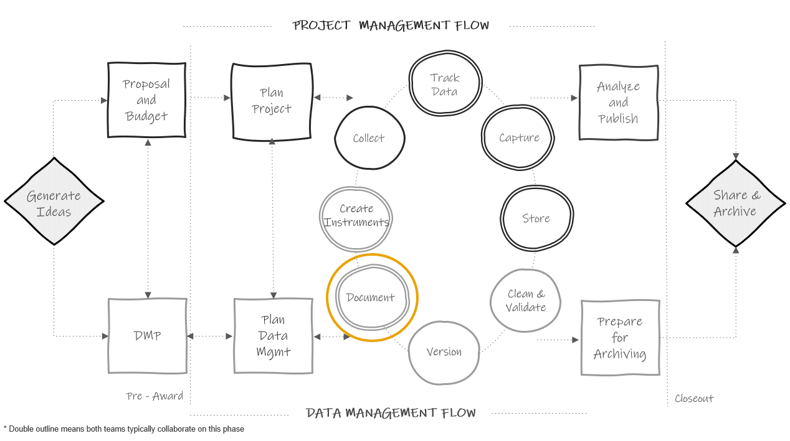

```

Documentation is a collection of files that contain procedural and descriptive information about your team, your project, your workflows, and your data. Creating thorough documentation during your study is equally as important as collecting your data. Documentation serves many purposes including:

- Standardizing procedures
- Securing data and protecting confidentiality
- Tracking data provenance
- Discovering errors
- Enabling reproducibility
- Ensuring others use and interpret data accurately
- Providing searchability through metadata

We are going to cover four levels of documentation in this chapter: team-level, project-level, dataset-level, and variable-level. While most of the documentation discussed does fall within its eponymous phase in the research life cycle, some documents will be created earlier or later and the timing will be discussed in each section. During a project, while you are actively using your documents, the format of these documents does not matter. Choose a human-readable format that works well for your team (e.g., Word, PDF, plain text file, Google Doc, Excel, HTML, OneNote, etc.). When projects are closing out and you are preparing to share your data, you can consider, at that time, how to best make your documents more sustainable, interoperable, and searchable. See Chapter \@ref(share) for more information.

The documents below are all recommended and will help you successfully run your project. You can create as many or as few of these documents as you wish. The documents you choose to produce should be based on what is best for your project and your team, as well as what is required by your funder (see Chapter \@ref(dmp)) and other governing bodies such as your Institutional Review Board. No matter which documents you choose to implement, it is important to create templates for your documents and implement them consistently within, and even across projects. Implementing documentation using templates, or consistent formats and fields, reduces duplication in efforts (no need to reinvent the wheel) and allows your team to interpret the document more easily. These documents are best created by the team member that directly oversees the process and sometimes that may include a collaborative effort (for example both a project coordinator and a data manager may build documents together).

Each type of documentation discussed below is a living document to be updated as procedures change or new information is received. As seen in the cyclical section of Figure \@ref(fig:fig7-1) above, team members should revisit documentation each time new data is collected, or more often if needed, to ensure documentation still aligns with actual practices. If changes are made and not added to documentation over long periods of time, you will find that you no longer remember what happened and that information will be lost. It will also be important to version your documents along the way so that staff know that they are working with the most recent version and can see when documents have been updated and why. 

> **Note** <br> <br> 
Creating and maintaining these documents **is an investment**. Make sure to account for this time and expertise in your proposal budget (see Chapter \@ref(dmp)). With that said, the return for the investment is well worth the effort. 


## Team Level

Team-level data management documentation typically contains data governance rules that apply to the entire team, across all projects. While these documents can be amended any time, they should be started long before you apply for a grant, when your lab, center, or institution is formed. 

```{r fig7-2, fig.cap="Team-level documentation in the research project life cycle", out.width = "70%"}

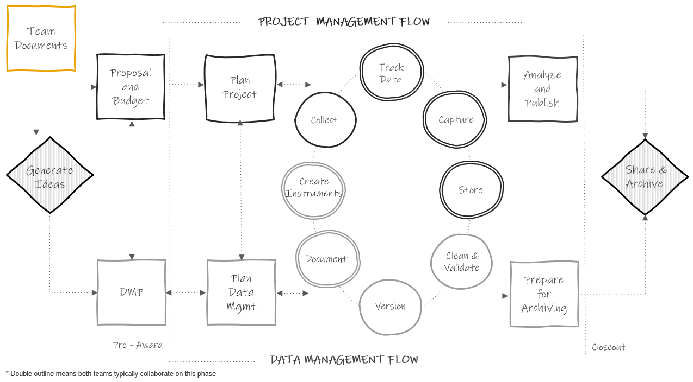

```

### Lab manual

A lab manual, or team handbook, creates common knowledge across your team [@mehr_how_2020]. It provides staff with consistent information about lab culture---how the team works and why they do the things they do. It also sets expectations, provides guidelines, and can even be a place for passing along career advice [@aczel_crowdsourced_nodate; @the_turing_way_community_turing_2022]. While a lab manual will primarily consist of administrative, procedural, and interpersonal types of information, it can be helpful to include data management content, including general rules about accessing, storing, sharing, and working with data securely and ethically. 

**Template and Resources**

|Source|Resource|
|--------|-----------|
|Balazs Aczel, et al.| Crowdsourced lab manual template ^[https://docs.google.com/document/d/1LqGdtHg0dMbj9lsCnC1QOoWzIsnSNRTSek6i3Kls2Ik]|
|Hao Ye, et al.| Crowdsourced list of public lab manuals ^[https://docs.google.com/spreadsheets/d/1kn4A0nR4loUOSDn9Qysd3MqFJ9cGU91dCDM6x9aga-8]|
|Samuel Mehr |Common Topics in Lab Handbooks ^[https://www.rsb.org.uk/images/biologist/2020/Apr_May_2020_67-2/67.2_Handbook.pdf]|


### Wiki {#wiki}

A wiki is a webpage that allows users to collaboratively edit and manage content. It can either be created alongside the lab manual or as an alternative to the lab manual is a team wiki. Wikis can be built and housed in many tools such as SharePoint, Teams, Notion, GitHub or Open Science Foundation (OSF). While some lab wikis are public (as you'll see in the examples below), most are not and can be restricted to invited users only. Wikis are a great way to keep disparate documents and pieces of information, for both administrative and data related purposes, organized in a central, accessible location. Your wiki can include links to important documents, or you can also add text directly to the wiki to describe certain procedures. Rather than sending team members to multiple different folders for frequently requested information, you can refer them to your one wiki page.

```{r fig7-3, fig.cap="Example team wiki with links to frequently requested information"}

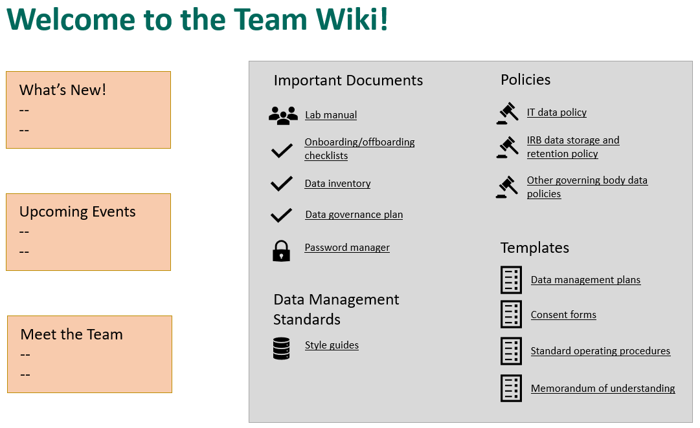

```

> **Note** <br> <br>
Project-level wikis can also be created and be very useful in centralizing frequently referenced information pertaining to specific projects.

**Templates and Resources**

|Source|Resource|
|--------|-----------|
|Aly Lab| Example public lab wiki ^[https://osf.io/mdh87/wiki/home/]|
|Notion|Company home wiki template ^[https://www.notion.so/Company-home-240047f7526c4b0091681dc6c95b7e76]|
|SYNC Lab| Example public lab wiki ^[https://eur-synclab.github.io/]|


### Onboarding/Offboarding

While **onboarding** checklists will mostly consist of non-data related, administrative information such as how to sign up for an email or how to get set up on your laptop, it should also contain several data specific pieces of information to get all new staff generally acclimated to working with data in their new role. 
  
Similarly, while **offboarding** checklists will contain a lot of procedural information about returning equipment and handing off tasks, it should also contain information specific to data management and documentation that help maintain data integrity and security.

Data related topics to consider adding to your onboarding and offboarding checklists are included in Figure \@ref(fig:fig7-4).

```{r fig7-4, fig.cap="Sample data topics to add to onboarding and offboarding checklists"}

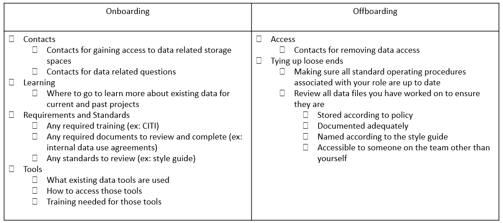

```

**Template and Resources**

|Source|Resource|
|--------|-----------|
|Crystal Lewis | Sample data topics to add to an onboarding checklist ^[https://docs.google.com/document/d/1xyU5Q0uUD-PqRKRmMJKpD9lKaGQI6pjs]|
|Crystal Lewis | Sample data topics to add to an offboarding checklist ^[https://docs.google.com/document/d/1W57cYuYyiqltQNXUITP-jVIf84jao4Ef]|

### Data Inventory

A data inventory maps all data sources collected by the research team [@salfen_building_2018]. As a team grows, the number of data sources typically expands as well. It can be very helpful to keep an inventory of what data sources are available for team members to use, as well as details about those data sources.

-   Project associated with each data source
-   Dates that each data sources was collected
-   Storage location of each data source
-   Details about each dataset (what the dataset contains, how it is organized, what questions can be answered with the data)
-   How data sources are related

### Data governance plan

A data governance plan is a set of formal guidelines for working with data within an organization [@nyu_web_communications_data_nodate]. Most often used in administrative offices and in industry, these types of plans can also be beneficial for research teams. This plan should broadly cover how team members are allowed to work with data, considering things such as access controls, research participant privacy, and data destruction rules. Documenting this information ensures a cohesive understanding among team members regarding the terms and conditions of project data use [@cessda_training_team_cessda_2017]. A data governance plan can be added to a lab manual, or can be created as a separate document where team members can even sign [@filip_san_2023] or check a box acknowledging that they have read and understand the plan.

Ideas of content to include in a data governance plan are included in Figure \@ref(fig:fig7-5).

```{r fig7-5, fig.cap="Example of content to include in a data governance plan"}

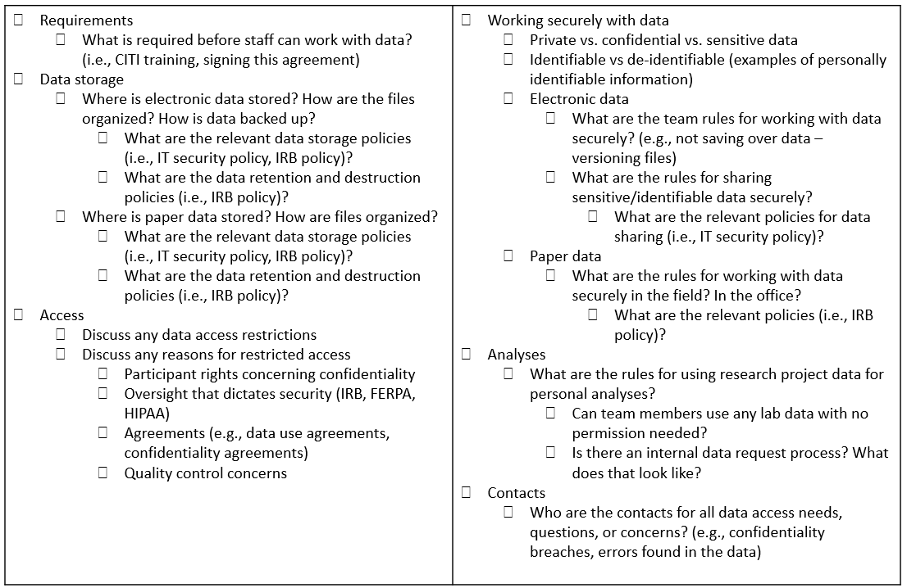

```

**Template and Resources**

|Source|Resource|
|--------|-----------|
|Crystal Lewis | Example of content to include in a data governance plan ^[https://docs.google.com/document/d/1fCFBULZeCBRyt0v2k4-Jb_9zBrk9En29]|

### Style guide {#styleshort}

A style guide is a set of standards for the formatting of information [@noauthor_style_2023]. It improves consistency and a shared understanding within and across files and projects. This document includes conventions for procedures such as variable naming, variable value coding, file naming, versioning, file structure, and even coding practices. It can be created in one large document or separate files for each type of procedure. I highly recommend applying your style guide consistently across all projects, hence why this is included in the team documentation. Since style guides are so important, and there are so many recommended practices to cover, I have given this document its own chapter. See Chapter \@ref(style) for more information.

**Template and Resources**

|Source|Resource|
|--------|-----------|
|Hadley Wickham | Example R coding style guide ^[https://style.tidyverse.org/]|
|Strategic Data Project| Example style guide ^[https://hwpi.harvard.edu/files/sdp/files/sdp-toolkit-coding-style-guide.pdf]|


## Project level

Project-level documentation is where all descriptive information about your project is contained, as well as any planning decisions and process documentation specifically related to your project. Again, while most of these documents are created in the documentation phase, some documents such as the data management plan (started before your project is funded), checklists and meeting notes (started during the planning phase), or a participant flow diagram (started after data is collected) will begin at other points throughout the cycle.

### Data management plan

As discussed in Chapter \@ref(dmp), if your project is federally funded it is likely that a data management plan was required. This project-level document is created in the DMP phase, long before a project begins. However, your DMP can continue to be modified throughout your entire study. If any major changes are made, it may be helpful to reach out to your program officer to keep them in the loop as well.

### Checklists and meeting notes

Checklists, as discussed in Chapter \@ref(plan), are documents that are created (or copied from existing sources) and reviewed during the planning phase. Using checklists facilitates discussion and allows your team to build a cohesive understanding for how data will be managed throughout your entire project. As you work through the checklists, all decisions made should be documented in meeting notes. After the planning phase is complete, decisions should be formally documented in applicable team, project, data, or variable-level documents (e.g. research protocol, SOPs, style guide, or roles and responsibilities documents). Even beyond the planning phase though, all meeting decisions and discussions should continue to be documented in meeting notes and used to update formal documentation as needed.

### Roles and responsibilities document

Using the checklists reviewed during the planning phase, your team should begin assigning roles and responsibilities for your project. In the planning and documentation phase, those designations should be formally documented and shared with the team. In Chapter \@ref(roles) we reviewed ways to structure this document. Once this document is created, make sure to store it in a central location for easy referral and update the document as needed.

**Templates and Resources**

|Source|Resource|
|--------|-----------|
|Crystal Lewis | Three roles and responsibilities templates ^[https://drive.google.com/drive/folders/1nhDgOVfESrZLYfvcrTU_I2dnsOtq3TkV]|


### Research protocol {#protocol}

The research protocol is a comprehensive project plan document that describes the what, who, when, where, and how of your study. Many of the decisions made in your data management plan and while reviewing your planning checklists will be summarized in this document. If you are submitting your study to your Institutional Review Board, you will most likely be required to submit this document as part of your application. A research protocol assists the board in determining if your methods provide adequate protection for human subjects. In addition to serving this required purpose, the research protocol is also an excellent document to share along with your data at the time of data sharing, and an excellent resource for you when writing technical reports or manuscripts. This document provides all context needed for you and others to effectively interpret and use your data. Make sure to follow your university's specific template if provided, but common items typically included in a protocol are provided in Figure \@ref(fig:fig7-6).

```{r fig7-6, fig.cap="Common research protocol elements"}

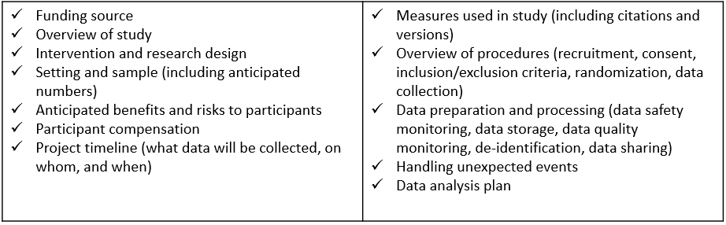

```

When it comes time to deposit your data in a repository, the protocol can be revised to contain information helpful for a data end user, such as known limitations in the data. Content such as risks and benefits to participants might be removed, and numbers such as study sample count should be updated to show your final numbers. Additional [supplemental information](#supplement) can also be added as needed.

**Template and Resources**

|Source|Resource|
|--------|-----------|
|Crystal Lewis|A template to create a project-level summary document for data sharing (based on an IRB research protocol) ^[https://docs.google.com/document/d/1wOLFFurs0t2rANxyD6rQ7xoFbg5LPmeA]|
|Jeffrey Shero, Sara Hart|IRB protocol template with a focus on data sharing ^[https://figshare.com/articles/preprint/IRB_Protocol_Template/13218797]|
|The Ohio State University| Protocol template ^[http://orrp.osu.edu/files/2011/10/GuidelinesforWritingaResearchProtocol.pdf]|
|University of Missouri| Protocol template ^[https://docs.research.missouri.edu/human_subjects/templates/Social_Behavioral_Educational_Protocol_Template.docx]|
|University of Washington| Protocol checklist ^[https://depts.washington.edu/wildfire/resources/protckl.pdf]|

### Supplemental documents {#supplement}

There is a series of documents, that while they can absolutely be standalone documents, I am calling supplemental documents here because they can be added to your research protocol as an addendum at any point to further clarify specifics of your project.

1. Timeline

The first supplemental document that I highly recommend creating is a visual representation of your data collection timeline. When you first create these timelines they will be based on your best estimates of the time it will take to complete milestones, but like all documents we've discussed, they can be updated as you learn more about the reality of the workload. This document can be both a helpful planning tool (for both project and data teams) in preparing for times of heavier and lighter workloads, as well as an excellent document to share with future data users to better understand waves of data collection. There is no one format for how to create this document. Figure \@ref(fig:fig7-7) is an example of one way to visualize a data collection timeline.

```{r fig7-7, fig.cap="Example data collection timeline"}

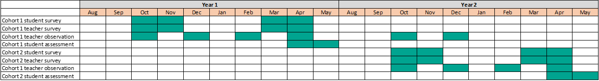

```

2. Participant flow diagram

A participant flow diagram displays the movement of participants through a study, assisting researchers in better understanding milestones such as eligibility, enrollment, and final sample counts. These diagrams are helpful for assessing study attrition and reasons for missing data can be described in the diagram [@nahmias_effects_2022]. In randomized controlled trial studies, these visualizations are more formally referred to as CONSORT (Consolidated Standards of Reporting Trials) diagrams, [@schulz_consort_2010] as seen in Figure \@ref(fig:fig7-8) [@noauthor_consort_nodate]. They provide a means to understand how participants are randomized and assigned to treatment groups. As you can imagine though, this diagram cannot be created until at least one wave of data has been collected, and must be updated as more waves are collected. Your participant tracking database, which we will discuss in Chapter \@ref(track), will inform the creation of this diagram.

```{r fig7-8, fig.cap="2010 CONSORT flow diagram template", out.width = "70%"}

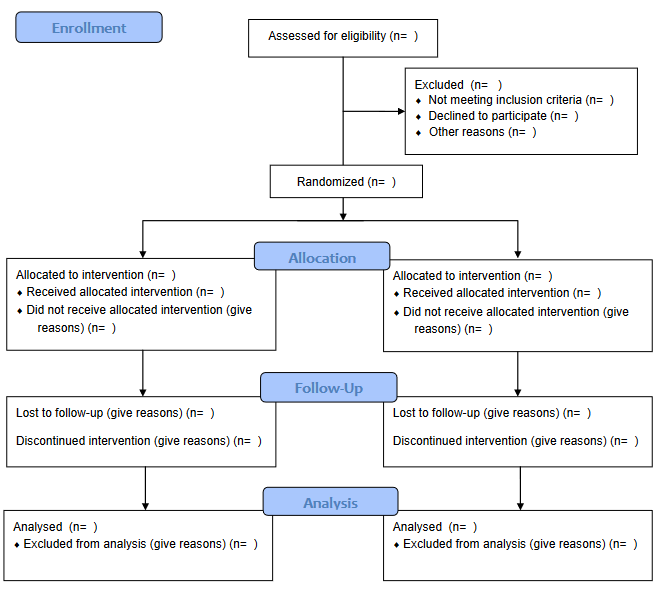

```

3. Instruments 

Actual copies of instruments can be included as supplemental documentation. This includes copies of surveys, assessments, forms, and so forth. It can also include any technical documents associated with your instruments or measures (i.e. a technical document for an assessment or a publication associated with a measure you used). Sometimes researchers will annotate instruments to show how items were named or coded.

4. Flowchart of data collection instruments/screeners

You can also include flowcharts of how participants were provided or assigned to different instruments or screeners to help users better understand issues such as missing data [@tourangeau_early_2015].

```{r fig7-9, fig.cap="Flowchart of an ECLS-K:2011 kindergarten assessment", out.width = "70%"}

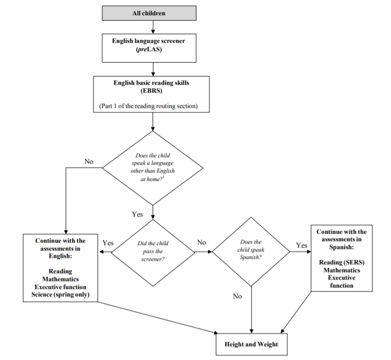

```

5. Consent forms

Consent forms(see Chapter \@ref(collect)) can also be added as an addendum to research protocols to give further insight into what information was provided to study participants.

6. Related publications

You may also choose to attach any publications that have come from your data as an addendum to your protocol.

### Standard operating procedures {#sop}

While the research protocol provides summary information for all decisions and procedures associated with a project, we still need documents to inform how the procedures are actually implemented on a daily basis [@nucats_standard_nodate]. Standard operating procedures (SOPs) provide a set of detailed instructions for routine tasks and decision making processes. If you recall from Chapter \@ref(plan), every step that we added to a data collection workflow is then added to an SOP and the details fleshed out. Not only will you have an SOP for each type of data you are collecting (i.e., survey, assessments, observations), you should also have SOPs for any other decisions or processes that need to be repeated in a reproducible manner or followed in a specific way to maintain compliance [@hollmann_ten_2020]. Many of the decisions laid out in your protocol will be further detailed in an SOP. Examples of data management procedures to include in an SOP are provided in Figure \@ref(fig:fig7-10). Additional project management tasks such as recruitment procedures, personnel training, data collection scheduling, or in-field data collection routines, should also be documented in SOPs, ensuring fidelity of implementation for all project procedures.

```{r fig7-10, fig.cap="Examples of data management processes or decisions to develop an SOP for"}

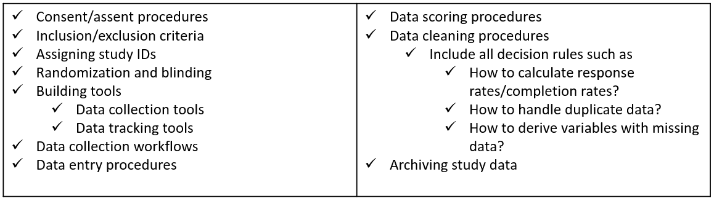

```

In addition to giving staff instruction on how to perform tasks, SOPs also create transparency in practices, allow for continuity when staff turnover or go out on leave, create standardization in procedures, and last, because an SOP should include versioning information, they allow you to accurately report changes in procedures throughout the project. You will want to create a template that is used consistently across all procedures, by all staff who build SOPs. 

```{r fig7-11, fig.cap="Standard operating procedure minimal template", out.width = "75%"}

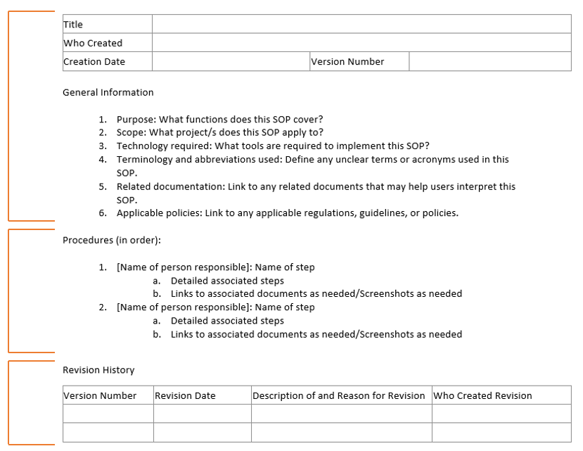

```

In developing your SOP template, like the one in Figure \@ref(fig:fig7-11), you should begin with **general information** about the scope and purpose of the procedure, as well as any relevant tools, terminology, or documentation. This provides context for the user and gives them the background to use and interpret the SOP. The next section in the SOP template, **procedures**, lists all steps in order. Each step provides the name of the staff member/s associated with that activity to ensure no ambiguity. Each step should be as detailed as possible so that you could hand your SOP over to any new staff member with no background in this process and be confident they can implement the procedure with little trouble. Specifics such as names of files and links to their locations, names of contacts, methods of communication (e.g., email vs instant message), and so forth should be included. Additions such as screenshots, links to other SOPs or workflow diagrams, or even links to tutorials can also be embedded. Last, any time revisions are made to the SOP, clarifying information about the update is added to the **revision** section and a new version of the SOP is saved. This allows you to keep track of what changes were made over time, including when they were made and who made them. 

**Template and Resources**

|Source|Resource|
|--------|-----------|
|Crystal Lewis|SOP template ^[https://docs.google.com/document/d/1q84UCsn_DVL9aaO_n5T_LCjwLy96FPPB]|


## Dataset Level

Our next type of documentation applies solely to your datasets and includes information about what data they contain and how they are related. It also captures things such as planned transformations for the data, potential issues to be aware of, and any alterations to the data. In addition to being helpful descriptive documentation, a huge reason for creating dataset documentation is authenticity. Datasets go through many iterations of processing which can result in multiple versions of a dataset [@cessda_training_team_cessda_2017; @uk_data_service_quality_2023]. Preserving data lineage by tracking transformations and errors found is key to ensuring that you know where your data come from, what processing has already been completed, and that you are using the correct version of the data. 

Not **all** of your dataset-level documentation will be created in the documentation phase and we will talk about the timing as we review each document.  

### Readme

A Readme is a plain text document that contains information about your files. These stem from the field of computer science but are now prevalent in the research world. These documents are a way to convey pertinent information to collaborators in a simple, no frills manner. Readmes can be used in many different ways but I will cover three ways they are often used in data management.

1. For conveying information to your colleagues
    - An example of this is if a study participant reaches out to a project coordinator to let them know that they entered the incorrect ID in their survey. When the project coordinator downloads the raw data file to be cleaned by the data manager for instance, they also create a file named "readme.txt" that contains this information and is saved alongside the file in the raw data folder. That way when the data manager goes to retrieve the file, they will see that a Readme is included and know to review that document first.
  
```
  - ID 5051 entered incorrectly. Should be 5015.
  - ID 5089 completed the survey twice
    - First survey is only partially completed
```
  
2. For conveying steps in a process (sometimes also called a setup file)
    - There may be times that a specific data pipeline or reporting process requires multiple steps, opening different files and running different scripts. This information **can** go in an SOP, but if it is a programmatic type process completed using a series of scripts, it might be easiest to put a simple file named "readme_setup.txt" in the same folder as your scripts so that someone can easily open the file to see what they need to run.

```
  Step 1: Run the file 01_clean_data.R to clean the data  
  Step 2: Run the file 02_check_errors.R to check for errors  
  Step 3: Run the file 03_run_report.R to create report 
```

3. For providing information about a set of files in a directory
    - It can be helpful to add Readmes to the top of your directories when both sharing data internally with colleagues, or when sharing files in an external repository. Doing so can provide information about what datasets are available in the directory and pertinent information about those datasets, including how the datasets are related and can be linked, information associated with different versions, definitions of common prefixes or suffixes used in datasets, or instrument response rates. Figure \@ref(fig:fig7-12) is an example readme that can be used to describe all data sources shared in a project repository [@neild_sharing_2022]. 

```{r fig7-12, fig.cap="Institute of Education Sciences example Readme for conveying information on files in a directory", out.width = "75%"}

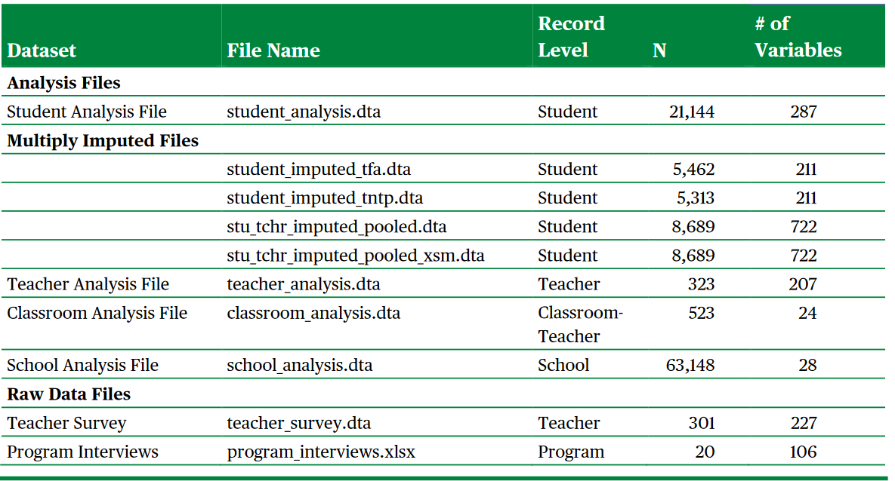

```

**Template and Resources**

|Source|Resource|
|--------|-----------|
|Crystal Lewis | Readme template for sharing information about a set of files in a directory ^[https://docs.google.com/document/d/1JWeKLDqtuk79beNJBv5xHueMwki0c7xD]|
|Crystal Lewis| Readme template for sharing project-level information ^[https://docs.google.com/document/d/1rbED1r0fGAk5CREslc8qQ5378EBV5759eSqdQbp4fHc]|

### Changelog {#change}

A changelog is a record of all of the versions of your data and code [@uk_data_service_versioning_2023; @wilson_good_2017]. While there are automatic ways to track your data and code through programs such as Git and GitHub, in the education field where researchers often work with human subjects and identifiable data, users are most often not keeping their study data, during an active project, in a remote repository. Instead, data are usually kept in an institution-approved storage location. Even if a storage location has versioning such as Box or SharePoint, unless users are able to add contextual messages about changes made when saving versions (like a commit message with Git), users will still want to keep a changelog.

A changelog provides data lineage, allowing the user to understand where the data originated as well as all transformations made to the data. It also supports data confidence, allowing the user to understand what version of the data they are currently using and to see if more recent versions have been created and why. 

In its simplest form a changelog should contain the following:

  - The file name (versioned consistently)
  - The date the file was created
  - A description of the dataset (including what changes were made compared to the previous version)
  
It could also include additional information such as who made the change and a link to any code used to transform the data.

```{r fig7-13, fig.cap="Example changelog for a clean student survey data file"}

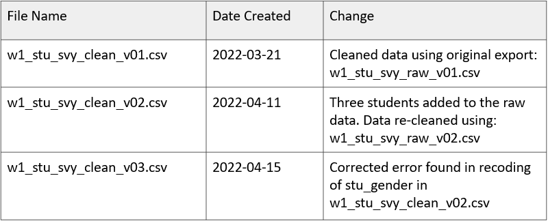

```

These changelogs will most likely not be created until the data capture and data cleaning phases of the life cycle when data transformations begin happening, and can be updated at any point as needed.

**Template and Resources**

|Source|Resource|
|--------|-----------|
|Crystal Lewis|Changelog template ^[https://docs.google.com/spreadsheets/d/1fVFv_QOk90NmDW_9R_h9UnvOY79TbcPOub-dL9zqDuo]|


### Data cleaning plan

A data cleaning plan is a written proposal outlining how you plan to transform your raw data into clean, usable data. This document contains no code and is not technical skills dependent. A data cleaning plan is created for each dataset you plan to collect (e.g., student survey, student assessment, teacher survey, district student demographic data). Because this document lays out your intended transformations for each raw dataset, it allows any team member to provide feedback on the data cleaning process. 

This document can be started in the documentation phase, but will most likely continue to be updated throughout the study, especially as you start digging in to your collected raw data and seeing what additional transformations are needed. Typically the person responsible for cleaning the data will write the data cleaning plans, but those documents can then be brought to a planning meeting allowing other team members, such as PIs, to provide input on the plan. This ensures that everyone agrees on the transformations to be performed. Once finalized, this data cleaning plan serves as a guide in the cleaning process. In addition to the changelog, this data cleaning plan (as well as any syntax used) provides all documentation necessary to assess data provenance, a historical record of a data file's journey. 

Before writing any data cleaning plans, it can be very helpful for your team to have agreed upon general norms for what constitutes a clean dataset to help ensure that all datasets are cleaned and formatted consistently. These standards can be written down and stored in a central team or project location for referral and then used to guide your process as you write your data cleaning plan. We will review what types of transformations you should consider adding to this type of norms document in Chapter \@ref(clean). 

```{r fig7-14, fig.cap="A simplistic data cleaning plan", out.width = "60%"}

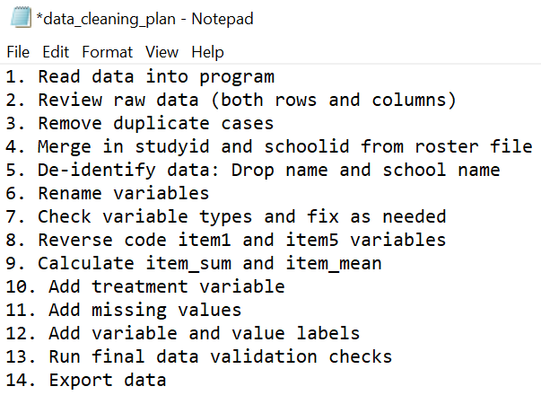

```


## Variable Level

Our last category of documentation is variable-level documentation. When we think about data management, I think this is most likely the first type of documentation that pops into people's minds. This documentation tells us all pertinent information about the variables in our datasets: variable names, descriptions, types, and allowable values. While variable-level documentation is often used to interpret existing datasets, it can also serve many other vital purposes including guiding the construction of data collection instruments, assisting in data cleaning, or validating the accuracy of data [@lewis_using_2022]. We will discuss this more throughout the chapters in this book.

### Data dictionary

A data dictionary is a rectangular formatted collection of names, definitions, and attributes about variables in a dataset [@bordelon_guides_2023; @gonzales_ten_2022; @uc_merced_library_what_nodate]. This document is both a planning tool and a tool used for interpretation. A data dictionary is most useful if created in the documentation phase, before a project begins, because it is integral to many other phases of a study [@lewis_using_2022; @van_bochove_data_nodate]. 

This document should be structured similar to a dataset, with variable names in the first row [@broman_data_2018]. What tool you use to build your data dictionary is up to you, but there are key pieces of information that should be included, as well as optional fields that can be helpful as well [@johns_hopkins_institute_for_clinical_and_translational_research_data_nodate].

```{r fig7-15, fig.cap="The many uses for a data dictionary", out.width = "90%"}

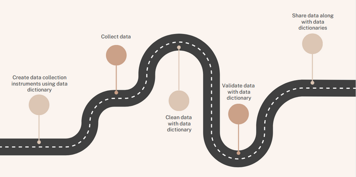

```


#### Creating a data dictionary for an original data source

Before you begin to build these dictionaries you will need to have the following:

1. Your style guide already created
    - We will talk more about style guides in Chapter \@ref(style), but this document will provide team or project standards for naming variables and coding response values.  
2. Documentation for your measures
    - If you are collecting data using existing measures (i.e. existing scales, existing standardized assessments), you will want to collect any documentation on those measures such as technical documents or copies of instruments. You will want your documentation to provide information such as:  
      - What items make up the measures/scales/assessment? What is the exact wording of the items?  
      - How are items coded? What are allowable values? 
      - Are there any calculations/scoring/reverse coding needed?  
      - If items are entered into a scoring program and then exported, what variables are exported?
    - See Figure \@ref(fig:fig7-16) for example of the information that could be pulled from a publication if using the Connor Davidson Resilience Scale (CD-RISC) [@connor_development_2003].
3. Any data element standards that you plan to use
    - See Chapter \@ref(collect) for an overview of existing data element standards

```{r fig7-16, fig.cap="Pulling relevant information for the Connor Davidson Resilience Scale (CD-RISC)", out.width = "90%"}

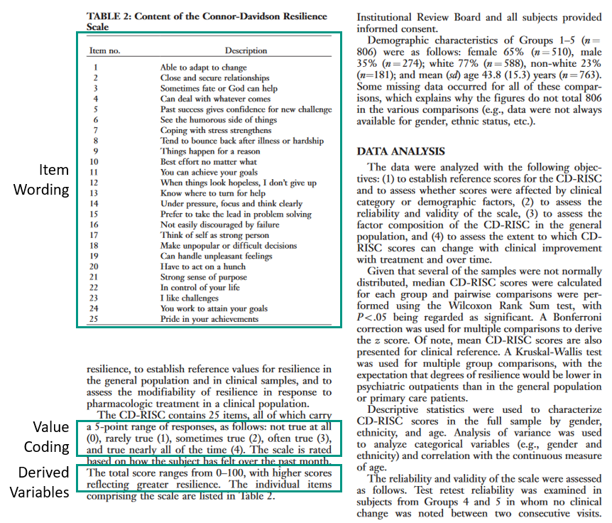

```

You will then build one data dictionary for each instrument you plan to collect (e.g., student survey data dictionary, teacher survey data dictionary, student assessment data dictionary). All measures/items for each instrument will be included in the data dictionary (see Figure \@ref(fig:fig7-17)). 

```{r fig7-17, fig.cap="Fields to include in a data dictionary", out.width = "90%"}

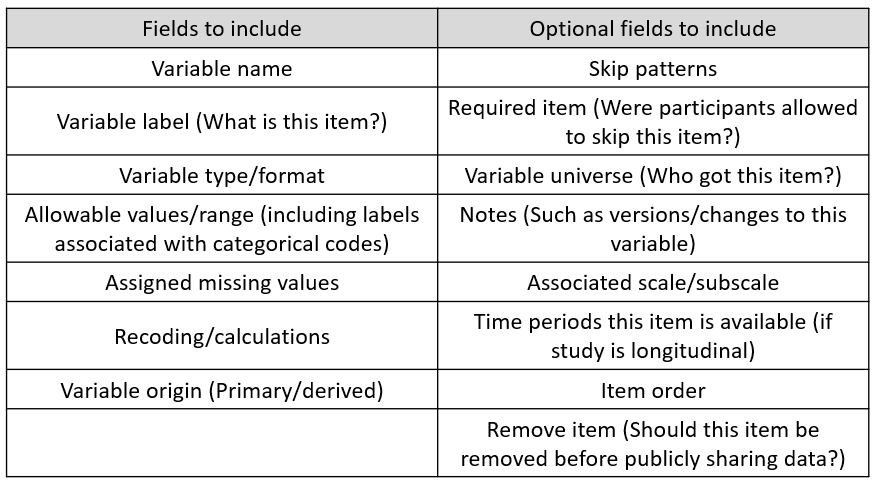

```

As you build your data dictionary, consider the following:

  - Item names
    - Are your variable names meeting the requirements laid out in your style guide? 
    - Are there any field standards that dictate how an item should be named?
  - Item wording
    - If your items come from an existing scale, does the item wording match the wording in the scale documentation? Do you plan to reword the item?
    - Are there any field standards that dictate how an item should be worded?
  - Item value codes for categorical items
    - If your items come from an existing scale, does your value coding (the numeric values assigned to response options) align with the coding laid out in the scale documentation? 
    - If your items do not come from an existing scale, does your value coding align with the requirements in your style guide? 
    - Are there any field standards that dictate how an items values should be coded?
  - Additional Items
    - What additional items will make up your final dataset? Consider items that will be derived, collected through metadata, or added in. All of these should be included in your data dictionary. 
      - Identifiers (unique ids)
      - Grouping variables (treatment)
      - Derived variables
        - This includes both variables your team derives (e.g., mean scores, reverse coded variables, variable checks) as well as variables derived from any scoring programs (e.g., percentile ranks, grade equivalent scores)
      - Metadata (Variables that your tool collects such as IPAddress, completion, language)
  - What items should be removed before public data sharing (i.e., personally identifiable information)

For demonstration purposes only, the data dictionary in Figure \@ref(fig:fig7-18) uses items from Patterns of Adaptive Learning Scales (PALS) [@midgley_manual_2000]. In an actual research study your dictionary would most likely include many more items and a variety of measures.

```{r fig7-18, fig.cap="Example student survey data dictionary"}

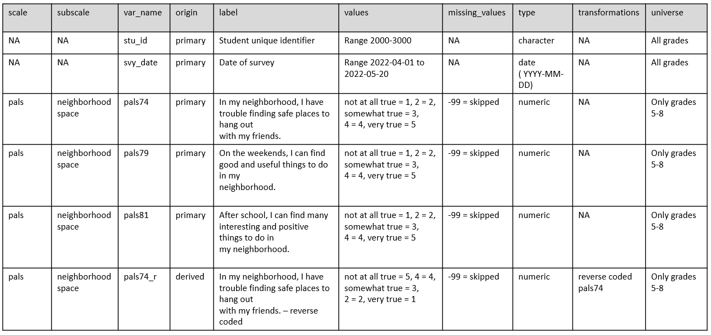

```

The last step of creating your data dictionary, as it should be for every document you create in this documentation phase, is to review the document/s with your team.

  - Is everyone in agreement about how variables are named, how values are coded, and our variable types? 
  - Is everyone in agreement about who gets each item?  
  - Does the team want to adjust any of the question/item wording? 
  - Does the data dictionary include everything the team plans to collect? Are any items missing?
      - If additional items are added to instruments at later time points, adding fields to your data dictionary, such as "time periods available", can be really helpful to future users in understanding why some items may be missing data at certain time points.

#### Creating a data dictionary from an existing data source

Not all research study data will be gathered through original data collection methods. You may be collecting external data sources from organizations like school districts or state departments of education. In these cases, you will begin building your data dictionaries later in the cycle, when data is received. Rather than the forward-moving flow we discussed before where the dictionary is built first, we will now have to work backwards to answer questions about our data.

The first step in building your data dictionary is to review your existing data. Yet, it turns out that all this tells you is what **does** exist in the data, not what **should** exist in the data. Items could be incorrectly coded, columns could be assigned the incorrect variable type, etc. As you review your data, start to collect questions such as:

1. What do these variables represent? 
    - What was the wording of these items?
2. Who received the items?
3. What do these values represent? 
    - Am I seeing the full range of values/categorical options for each item? Or was the range larger than what I am seeing?
    - Do I have values in my data that don't make sense for an item?
4. What data types are the items currently? What types should they be?

To answer those questions, you may need to do some additional detective work.

1. Contact the person who originally collected the data to learn more about the instrument and the data.  
2. Contact the person who cleaned the data (if cleaned) to see what transformations they completed on the raw data.  
3. Request access to the original instruments to review exact question wording, item response options, skip patterns, etc. 
4. Request any documentation that the original owners have. For example, do they have their own data dictionaries, codebooks, or syntax that might help you understand what is going on in the data?  

Ultimately you should end up with a data dictionary structured similarly to the one above. You may add additional fields that help you keep track of further changes (e.g., a column for the old variable name and a column for your new variable name), and your transformations section may become more verbose as the values assigned previously may not align with the values you prefer based on your style guide or the existing measures. Otherwise, the data dictionary should still be constructed in the same manner mentioned above.

#### Time well spent

The process described in this section is a manual, time consuming process. This is intentional. Building your data dictionary is an information seeking journey where you take time to understand your dataset, create standardization of items, and plan for data transformations. Spending time manually creating this document before collecting data prevents many potential errors and time lost fixing data in the future. While there are absolutely ways you can automate the creation of a data dictionary using an existing dataset, the only time I can imagine that being useful is when you have a clean dataset that you have confidently already verified is accurate and ready to be shared. However, as mentioned before, a data dictionary is so much more than a document to be shared alongside a public dataset. It is a tool for guiding many other processes in your research data life cycle.

**Template and Resources**

|Source|Resource|
|--------|-----------|
|Crystal Lewis|Data dictionary template ^[https://docs.google.com/spreadsheets/d/1R-5TIUvAhJRDucVhq4dNg00RR1CG7uQ6MRhje0BBC20]|


### Codebook

Codebooks provide descriptive, variable-level information as well univariate summary statistics which allow users to understand the contents of a dataset without ever opening it. Unlike a data dictionary, a codebook is created **after** your data is collected and cleaned and its value lies in data interpretation and data validation. 

The codebook contains some information that overlaps with a data dictionary, but is more of a summary document of what actually exists in your dataset [@icpsr_guide_2011].

```{r fig7-19, fig.cap="Codebook content that overlaps and is unique to a data dictionary", out.width = "90%"}

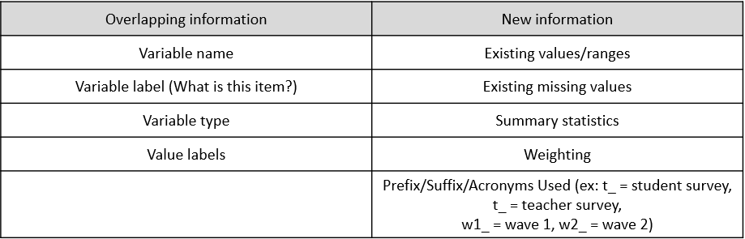

```

Figure \@ref(fig:fig7-20) is an example codebook from the United States Department of Health and Human Services [-@united_states_department_of_health_and_human_services_study_2022].

```{r fig7-20, fig.cap="Example codebook from the SCOPE Coach Survey", out.width = "80%"}

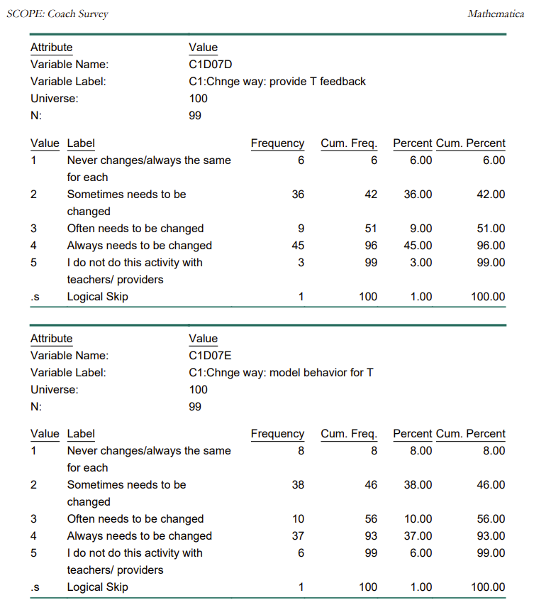

```

In addition to being an excellent resource for users to review your data without ever opening the file, this document may also help you catch errors in your data is out of range or unexpected values appear.

You can create separate codebooks per dataset or have them all contained in one document, clickable through a table of contents. Unlike a data dictionary, which I recommend creating manually, a codebook should be created through an automated process. Automating codebooks will not only save you tons of time, but it will also reduce errors that are made in manual entry. You can use many tools to create codebooks, including point and click statistical programs such as SPSS, or with a little programming knowledge you can more flexibly design codebooks using programs like R or SAS. For example, the R programming language has many packages that will create and export codebooks in a variety of formats from your existing dataset by just running a few functions [@lewis_codebook_2023].

Last, you may notice as you review codebooks, that many will start with several pages of text, usually containing information about the project. When it comes time to share their data, it's common for people to combine information from their research protocol or Readme files, into their codebooks, rather than sharing separate documents.

**Template and Resources**

|Source|Resource|
|--------|-----------|
|ICPSR | Guide to Codebooks ^[https://www.icpsr.umich.edu/files/deposit/Guide-to-Codebooks_v1.pdf]|
|National Center for Health Statistics | Example codebook ^[https://ftp.cdc.gov/pub/Health_Statistics/NCHS/Dataset_Documentation/NHIS/2020/adult-codebook.pdf]|

## Metadata {#metadata}

The last type of documentation to discuss is metadata, which is created in the "prepare for archiving" phase. When depositing your data in a repository, you will submit two types of documentation, human-readable documentation, which includes any of the documents we've previously discussed, and metadata. Metadata, data about your data, is documentation that is meant to be processed by machines and serves the purpose of making your files searchable [@cessda_training_team_cessda_2017; @danish_national_forum_for_research_data_management_metadata_nodate]. Metadata aids in the cataloging, citing, discovering, and retrieving of data and its creation is a critical step in creating FAIR data [@go_fair_fair_nodate; @logan_data_2021; @uk_data_service_metadata_2023].

For the most part, no additional work is needed to create metadata when depositing your data in a repository. It will simply be created as part of the depositing process [@cessda_training_team_cessda_2017;@university_of_iowa_libraries_metadata_2023]. As you deposit your data, the repository may have you fill out a form that contains descriptive (description of project and files), administrative (licensing and ownership as well as technical information), and structural (relationships between objects) metadata [@cofield_libguides_2023; @danish_national_forum_for_research_data_management_metadata_nodate]. The information from this form will become your metadata. Figure \@ref(fig:fig7-21) is an example of an intake form for the the Figshare repository ([https://figshare.com/](https://figshare.com/)).

```{r fig7-21, fig.cap="Example intake metadata form for Figshare repository, captured January 13, 2023", out.width= "70%"}

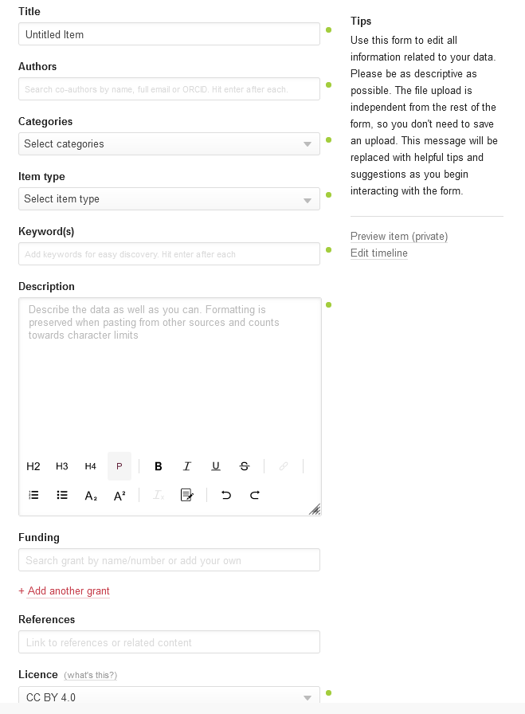

```

The most common metadata elements [@dahdul_research_2023; @hayslett_libguides_2022] are included in Figure \@ref(fig:fig7-22).

```{r fig7-22, fig.cap="Common metadata elements", out.width = "80%"}

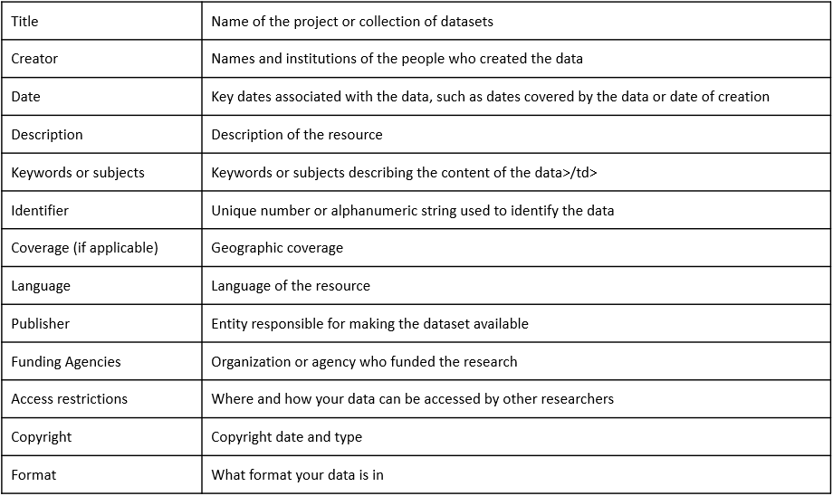

```


Depending on the repository, at minimum, you will enter basic project-level metadata similar to above, but you may be required or have the option to enter more comprehensive information, such as project-level information covered in your research protocol. You may also have the option to enter additional levels of metadata that will help make each level more searchable, such as file-level or variable-level metadata [@gilmore_practical_2018; @icpsr_icpsr_2023; @ldbase_information_nodate]. All of the information needed for this metadata can be gathered from the documents we've discussed earlier in this chapter. 

Once entered into the form, the repository converts entries into both human-readable and machine-readable, searchable formats such as XML [@icpsr_icpsr_2023] or JSON-LD. We can see what this metadata looks like to humans once it is submitted. Figure \@ref(fig:fig7-23) is an example of how ICPSR Open displays the metadata information on a project page [@page_design_2020]. Notice we even have the option to download the XML formatted metadata files in one of two standards (see Section \@ref(metastandards)) if we want as well. 

```{r fig7-23, fig.cap="Example metadata displayed on an ICPSR Open project page", out.width = "95%"}

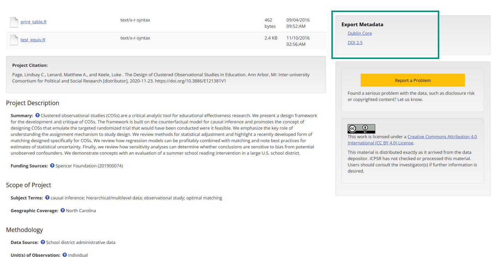

```

There are other ways metadata can be gathered as well. For instance, for variable-level metadata, rather than having users input metadata, repositories may create metadata from the deposited statistical data files that contain inherent metadata (such as variable types or labels) or from deposited documentation such as data dictionaries or codebooks [@icpsr_icpsr_2023].

If your repository provides limited forms for metadata entry, you can also choose to increase the searchability of your files by creating your own machine-readable documents. There are several tools to help users create machine-readable codebooks and data dictionaries that will be findable through search engines such as Google Dataset Search [@arslan_how_2019; @buchanan_getting_2021;@usgs_tools_2021]. 

### Metadata standards {#metastandards}

Metadata standards, typically field specific, establish a common way to describe your data which improves data interoperability as well as the ability of users to find, understand, and use data. Metadata standards can be applied in several ways [@bolam_guides_2022; @ddi_alliance_controlled_2023]. 

1. Formats: What machine-readable format should metadata be in?  
2. Schema: What fields are recommended verses mandatory for project, dataset, and variable level metadata?
3. Controlled vocabularies: A controlled list of terms used to index and retrieve data.

Many fields have chosen metadata standards to adhere to. Some fields, like psychology [@kline_technical_2018], are developing their own metadata standards, including formats, schemas, and vocabularies grounded in the FAIR principles and the Schema.org schema [@schemaorg_schemaorg_2023]. Yet, the Institute of Education Sciences recognizes that there are currently no agreed upon metadata standards in the field of education [@institute_of_education_sciences_frequently_nodate].

```{r fig7-24, fig.cap="A sampling of field metadata standards", out.width= "70%"}

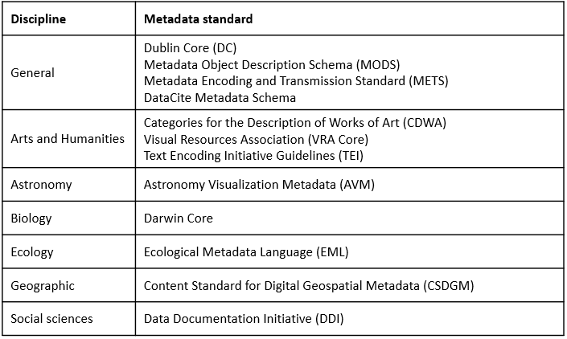

```

It can be helpful to see how standards differ as well as overlap. The @ddi_alliance_mapping_2023 put together this table in Figure \@ref(fig:fig7-25) for instance, mapping the DDI Elements (and vocabularies) to the Dublin Core, two commonly used standards.

```{r fig7-25, fig.cap="A comparison of DDI Version 2 standards to Dublin Core standards", out.width = "70%"}

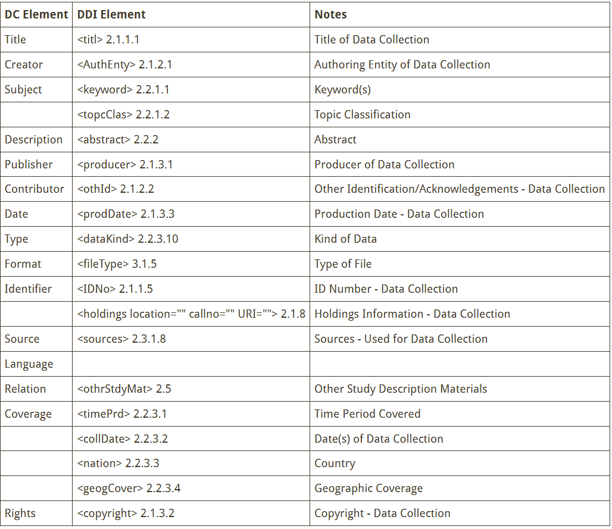

```

We can see what this metadata comparison actually looks like if we download the Dublin Core and the DDI 2.5 XML format metadata files from the ICPSR Open project we saw above [@page_design_2020]. You can start to see the differences and similarities across standards. 

```{r fig7-26, fig.cap="Metadata comparison from an AERA Open project"}

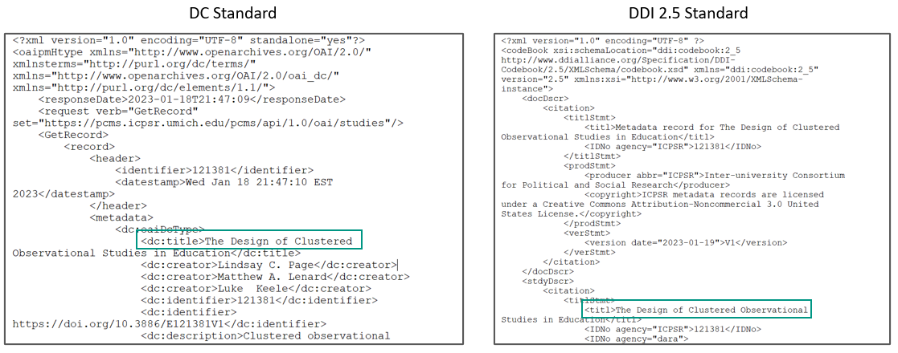

```

If you plan to archive your data, first check with your repository to see if they follow any standards. For example, both the OSF [@gueguen_new_2023] and Figshare [@figshare_figshare_2023] repositories currently use the DataCite schema , while ICPSR uses the DDI standard [@icpsr_icpsr_2023]. If the repository does use certain standards, work with them to ensure your metadata adheres to those standards. Some repositories may even provide curation support free or for a fee. But as I mentioned earlier, depending on your repository, adding metadata to your project may require no additional work on your part. The repository may simply have you enter information into a form and convert all information for you.

If no standards are provided by your repository and you plan to create your own metadata, you can choose any standard that works for you. Oftentimes researchers may choose to pick a more general standard such as DataCite or Dublin Core [@university_of_iowa_libraries_metadata_2023], and in the field of education, most researchers are at least familiar with the DDI standard so that is another good option. Remember, if you do choose to adhere to a standard, this decision should be documented in your data management plan.


## Wrapping it up

At this point your head might be spinning from the amount of documents we've covered. It's important to understand that while each document discussed provides a unique and meaningful purpose, you don't have to create every document listed. In data management we walk a fine line between creating sufficient documentation, and spending all of our working hours perfecting and documenting every detail of our project. Choose the documents that help you record and structure your processes in the best way for your project while also giving yourself grace to stop when the documents are "good enough". Each document you create that is well organized and well maintained will improve your data management workflow, decrease errors, and enhance your understanding of your data.
