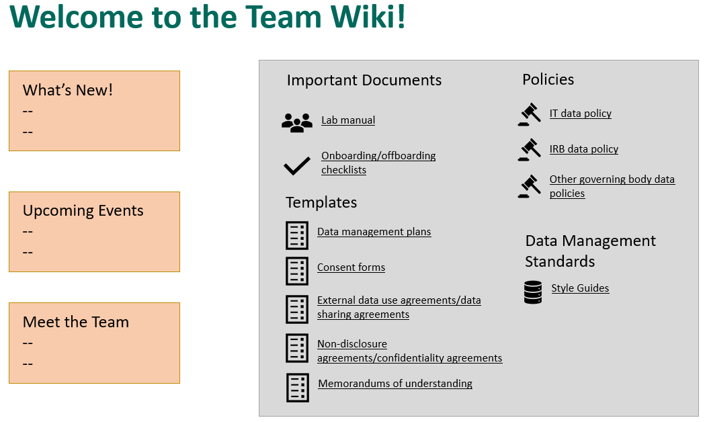
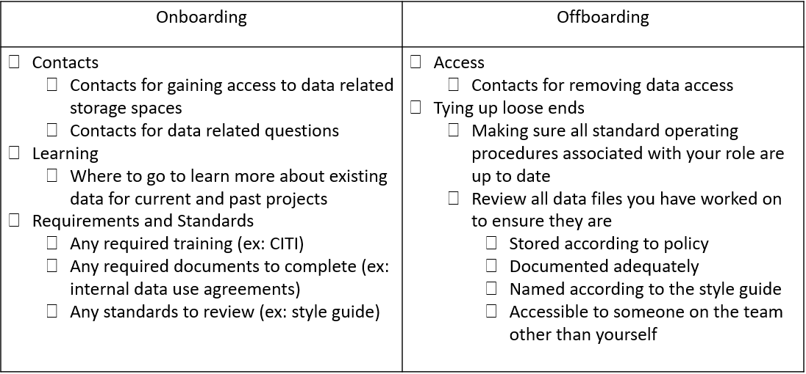
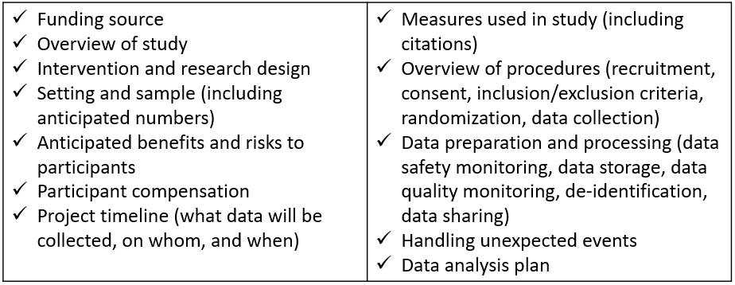
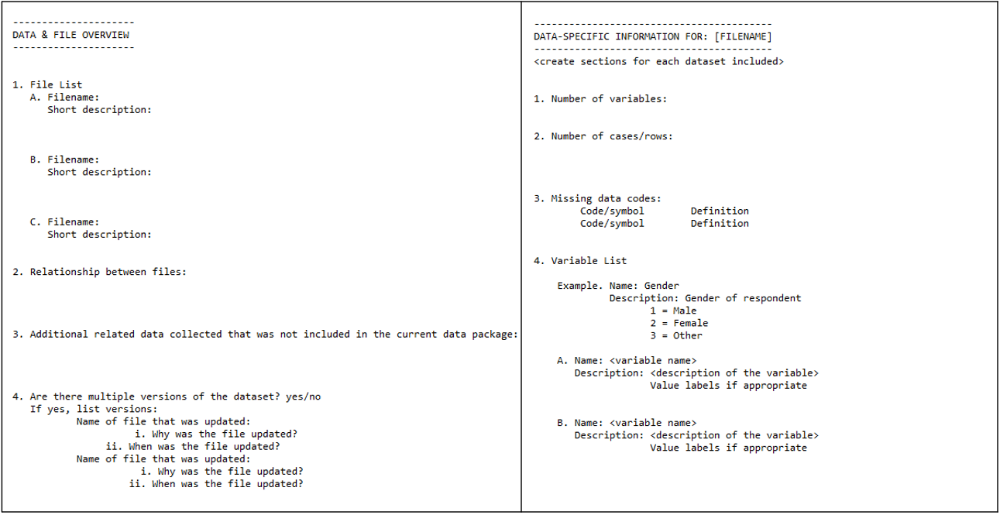

# Documentation

```{r fig.cap="Data documentation in the research project life cycle", out.width = "70%"}

knitr::include_graphics("img/lifecycle_doc.PNG")

```

Documentation is a collection of files that contain procedural and descriptive information about your team, your project, your workflows, and your data. Collecting thorough documentation during your study is unequivocally as important as collecting your data. Documentation serves many purposes including:

- Standardizing procedures
- Securing data and protecting confidentiality
- Tracking data provenance 
- Discovering errors
- Enabling reproducibility
- Ensuring others use and interpret data accurately
- Providing searchability through metadata

We are going to cover four levels of documents in this chapter: team level, project level, dataset level, and variable level. While most of the documentation we will discuss does fall within the documentation phase in the research life cycle, some documents will be created earlier or later and the timing will be discussed in each section. During a project, while you are actively using your documents, the format of these documents does not matter. Choose a format that is human readable and works well for your team (ex: Word document, PDF, Google Doc, Excel, HTML, OneNote, etc.). When projects are closing out and you are preparing to share your data, you can consider, at that time, how to best make your documents more sustainable, interoperable, and searchable [**see Data Sharing**].

The documents below are all recommended and will help you successfully run your project. You can choose to create as many or as few of these documents as you wish. You should choose which documents to create based on what is best for your project and your team, as well as what is required by your funder (**see DMP**) and other governing bodies such as your Institutional Review Board. Creating and maintaining these documents **are** an investment (make sure to account for this time in your proposal budget), but the return for the investment is well worth the effort. These documents are best created by the team member that directly oversees the process and sometimes that may include a collaborative effort (for example both a project coordinator and a data manager may build documents together).

As you review the these documents, remember that every single document mentioned is a living document to be updated as procedures change or new information is received. As seen in the cyclical section of our diagram above, team members should always revisit documentation each time new data is collected, or more often if needed. If changes are made and not added to documentation over long periods of time, you will find that you no longer remember what happened and that information will be lost. It will also be important to version your documents along the way so that staff know that they are working with the most recent version and can see when documents have been updated and why. 


## Team Level

Team level documentation typically contain data governance rules that apply to the entire team, across all projects. While these documents can be amended at any time, they should really be started long before you even apply for a grant, when your lab, center, or institution is formed. 

```{r fig.cap="Team level documentation in the research project life cycle", out.width = "70%"}

knitr::include_graphics("img/lifecycle_teamdoc.PNG")

```

### Lab Manual

One example of a team level document is a lab manual, or team handbook. A lab manual creates common knowledge across your team [@mehr_how_nodate]. It provides staff with consistent information about how the team works and why they do the things they do. It sets expectations, provides guidelines, and can even be a place for passing along helpful career advice [@balazs_crowdsourced_nodate]. While a lab manual will mostly consist of administrative, procedural, and interpersonal types of information, it can be helpful to also include data management content as well, including general rules about how to access, store, share, and work with data securely and ethically. 

**Example manuals:**  

- Crowdsourced lab manual template [@balazs_crowdsourced_nodate]  
- Faylab Lab Manual [@novak_faylab_2022]  
- The RAISE Lab Manual [@von_der_embse_raise_2019]  
- Common Topics in Lab Handbooks [FIX @mehr]


### Wiki

Another option that can either be created alongside the lab manual or as a replacement to the lab manual is a team wiki. A wiki is a webpage that allows users to collaboratively edit and manage content. It can be created and housed in many tools such as SharePoint, Teams, Notion, GitHub, OSF, and more. While some lab wikis are public (as you'll see in the examples below), most are not and can be restricted to only invited users. This is a great way to keep disparate documents and pieces of information, for both administrative and data related purposes, organized in a central, accessible location. Your wiki can include both links to important documents, or you can also add text directly to the wiki to describe certain procedures. Rather than sending team members to multiple different folders for frequently requested information, you can refer them to your one wiki page.

```{r fig.cap="Example team wiki with links to frequently requested information"}



```

\* Note: Project level wikis can also be created and be very useful in centralizing frequently referenced information.

**Example wikis:**

- Aly Lab Wiki [@aly_aly_2018]  
- SYNC Lab Wiki [@noauthor_sync_nodate]

### Onboarding/Offboarding

While **onboarding** checklists will mostly consist of non-data related, administrative information such as how to sign up for an email or how to get set up on your laptop, it should also contain several data specific pieces of information to get all new staff generally acclimated to working with data, for any project, in their new role. 
  
Similarly, while **offboarding** checklists will contain a lot of procedural information about returning equipment and so forth, it should also contain some basic data tasks that help maintain data integrity and security.

Data related topics to consider adding to your onboarding and offboarding checklists include the following.

```{r fig.cap="Sample data topics to add to onboarding and offboarding checklists"}



```

### Data Use Agreement

Typically when we think of a data use agreement (DUA) we think of a document that we draft in conjunction with an external partner that would like to access our data (or we want to access theirs). It usually covers the terms for how someone is allowed to use data, considering things like access controls, research participant privacy, data destruction rules, and so on [@geraghty_formalize_nodate]. However, it can be really helpful to document the terms and conditions of data use and have staff, at minimum, review or even sign an internal statement saying that they have reviewed all team policies regarding working securely with data [FIX @cessda]. These rules for working with data can be added to a lab manual, as many people do, or they can be added to a separate data use agreement where staff members can sign or check a box acknowledging that they have read and understand the policies. 

```{r fig.cap="Example of content to include in an internal data use agreement", out.width = "70%"}

knitr::include_graphics("img/dua.PNG")

```

### Style Guide

A style guide is a set of standards for the formatting of documents [FIX @wikipedia]. It improves consistency within and across files and projects. This document includes conventions for procedures such as variable naming, value coding, file naming, versioning, and file structure. It can be created in one large document or separate files for each type of style guide. I highly recommend applying your style guide consistently across all projects, hence why this is included in the team documentation. Since style guides are so important, and there is so many recommended practices to cover, I have given this document its own chapter. See [**Style Guides**] for more information.


## Project Level

Project level documentation is where all descriptive information about your project is contained, as well as any planning decisions and process documentation specifically related to your project. Again, while most of these documents are created in the documentation phase, some documents such as the DMP (started before your project is funded), checklists and meeting notes (started during the planning phase), or the consort diagram [**see consort**] (started after data is collected) will begin at varying times.

### Data Management Plan

This is the first project level document that will be created in your research project life cycle. See **Data Management Plan** to review details about this document. The only other note to mention here is that your DMP can continue to be modified throughout your entire study. If any major changes are made, it may be helpful to reach out to your program officer to keep them in the loop as well.

### Checklists and meeting notes

Since we've already discussed these documents in a previous chapter [**see planning**] I won't say much more here other than to acknowledge that these documents are also part of your portfolio of documentation and are really key planning documents as you start to build your other project as well as data and variable level documents.

### Roles and responsibilites document

Using the checklists during your planning phase, you hopefully decided on and assigned some roles and responsibilities for your project. Now is the time to document those decisions in a formal document to be shared with the team. In the previous chapter [**see roles and responsibilities**] we reviewed ways to structure this document. Once this document is created, make sure to store it in a central location for easy referral and update the document as needed.

### Research Protocol

The research protocol will be a comprehensive project summary document. If you are submitting your study to your Institutional Review Board, you most likely be required to submit this document as part of your application. A research protocol provides a means for the board to determine if your methods provide adequate protection for human subjects. In addition to serving this required purpose, the research protocol is also an excellent document to deposit along with your data at the time of data sharing, as well as an excellent resource for you when writing technical reports or manuscripts. This document provides all context needed for you and other users to effectively interpret and use your data. It generally provides the what, who, when, where, and how of your study. Make sure to follow your university's specific template if provided, but common items typically included in a protocol are:

```{r fig.cap="Common research protocol elements"}



```

**Example Templates:**

- University of Washington Protocol Template [@university_of_washington_developing_nodate]
- Ohio State Protocol Template [@the_ohio_state_university_institutional_review_board_guidelines_2014]  
- University of Missouri Protocol Template [@university_of_missouri_socialbehavioraleducational_nodate]

### Supplemental Documents

There is a series of documents, that while can absolutely be standalone documents, I am calling supplemental documents here because they can be added to your research protocol as an addendum at any point to further clarify specifics of your project.

1. Timeline

The first supplemental document that I highly recommend creating is a visual representation of your data collection timeline. This can be both a helpful planning tool (for both project and data teams) as well as an excellent document to share with future data users. There is no one format for how to create this document. Below is an example of one way to visualize a data collection timeline.

```{r fig.cap="Example data collection timeline"}

knitr::include_graphics("img/timeline.PNG")

```

2. CONSORT Diagram

A CONSORT (Consolidated Standards of Reporting Trials) diagram displays the flow of participants through a program [FIX @consort]. It visually portrays enrollment in the program, randomization, as well as attrition. As you can imagine though, this diagram cannot be created until at least one wave of data has been collected, and must be updated as more waves are collected. Your participant tracking database, which we will discuss in a later chapter, will inform the creation of this diagram.

```{r fig.cap="2010 CONSORT flow diagram template", out.width = "70%"}

knitr::include_graphics("img/consort.PNG")

```

3. Instruments 

Actual copies of instrument can be included as supplemental documentation. This includes copies of surveys, assessments, forms, and so forth. It can also include any technical documents associated with your instruments.

4. Flowchart of data collection instruments/screeners

You can also include flowcharts of how participants were provided or assigned to different instruments or screeners to help users better understand issues such as missing data [FIX @Tourangeau].

```{r fig.cap="Flowchart of an ECLS-K:2011 kindergarten assessment", out.width = "70%"}

knitr::include_graphics("img/flowchart.PNG")

```

5. Consent Forms

Consent forms can also be added as an addendum to research protocols to give further insight into what information was provided to study participants.

6. Related publications

You may also choose to attach any publications that have come from your data as an addendum to your protocol.

### Standard Operating Procedures

While the research protocol provides summary information for all procedures associated with a project, we still need documents to inform how the procedures are actually implemented on a daily basis [FIX @NUCATS]. If you recall from our [**planning chapter**], every step that we added to a data collection workflow is then added to an sop and the details fleshed out. Not only will you have an SOP for each type of data you are collecting, you can also have SOPs for other types of decisions as well. Examples include:

- Inclusion/exclusion criteria
- Assigning study IDs
- Building tools such as participant tracking database
- Randomization rules
- Consent/assent procedures
- Data entry procedures
- Data scoring procedures
- Rules for calculating response rate (full survey completed only?, half survey completed?)
- Decisions for how to consistently deal with duplicate data (ex: always keep the first most complete instance of a response)

SOPs not only help staff know how to perform tasks, it also creates transparency, allows for continuity when staff turnover or go out on leave, creates standardization in practices, and because a SOP should include versioning information, it allows you to accurately report your project procedures throughout the project. You will want to create a template that is used consistently across all procedures, by all staff who build SOPs. An example template is below. 

Notice how the SOP should always begin with **general information** about the scope and purpose of the procedure, as well as any tools or terminology. This help provides context for the user and gives them the background to use and interpret the SOP. The next section, **procedures**  list all procedures in order. Each step provides the name of the staff member/s associated with that step to ensure that there is no ambiguity. Each step should be as detailed as possible so that you could hand your SOP over to any new staff member, with no background in this process, can implement the procedure with little trouble. Specifics such as names of files and links to their locations, names of contacts, means of communication (ex: email vs teams message), and so forth should be included. Additions such as screenshots, links to other SOPs, or even links to tutorials can be embedded as well. Last, any time an update is made to the SOP you need to be sure to add information to the **revision** section. This allows you to keep track of changes over time: when were changes made, who made those changes, and why. 

```{r fig.cap="Standard operating procedure minimal template", out.width = "70%"}

knitr::include_graphics("img/sop.PNG")

```


**Example SOPs:**

- Northwestern University Writing Standard Operating Procedures and Templates [FIX @NUCATS]  
- IMPACCT Trials Coordination Centre Standard Operating Procedure for Allocation of Participant Identification Numbers [FIX @IMPACCT]  
- CITI Template SOP [FIX @CITI]

## Dataset Level

Our next type of documentation applies solely to your datasets and includes information about what data they contain, planned transformations, potential issues to be aware of, and alterations to the data. A huge reason for creating dataset documentation is for authenticity. Datasets going through many iterations of processing which can result in many versions of a dataset [FIX @cessda; @ukdata]. Preserving data lineage through tracking data errors and transformation is key to ensuring that you not only know you are using the correct version of your data, but that you know where your data come from and what processing has already been completed. As you've noticed I tend to break rules, and I plan to continue that trend by once again saying that not **all** of your dataset level documentation will be created in the documentation phase and well will talk about the timing as we review each document.  

### Readme

A readme is a plain text document that contains information about your files. These grew out of computer science but are now prevalent in the research world. They are a way to convey pertinent information to collaborators in a simple, no frills manner. Readmes can be used in many different ways but I am going to cover three ways they are often used in the context of data management.

1. For conveying information to your colleagues
  - An example of this is if a study participant reaches out to a project coordinator to let them know that they entered the incorrect ID in their survey. When the project coordinator downloads the raw data file to be cleaned by the data manager, they also create a "README" file named "readme.txt" that contains this information and is saved alongside the file in the raw data folder. That way when the data manager goes to retrieve the file, they will see that a readme is included and know to review that document first.

        - ID 5051 entered incorrectly. Should be 5015.
        - ID 5089 completed the survey twice  
            - first survey is only partially completed
 
2. For conveying steps in a process (sometimes also called a setup file)
  - There may be times that a specific data pipeline or reporting process requires multiple steps, opening different files and running different scripts. This information **can** go in an sop, but if it is a programmatic type process done using a series of scripts, it might be easiest to put a simple readme in the same file as your scripts so that someone can easily open the file to see what they need to run.
  
        Step 1: Run the file 01_clean_data.R to clean the data  
        Step 2: Run the file 02_check_errors.R to check for errors  
        Step 3: Run the file 03_run_report.R to create report  

3. For providing information about a set of files in a directory
  - If colleagues are accessing your clean datasets in your project directory, it can be helpful to add readmes to the top of those directories to provide information about what datasets are available in the directory as well as pertinent information about those datasets, including how the datasets are related/can be linked [FIX @washu].

```{r fig.cap="Washington University in St. Louis example readme for conveying information files in a directory"}



```

You can see that each of these readmes serve very different purposes and may be created at different times in your study. There will most likely be no need to create a readme before your study begins, but as you begin to collect and manage data you will have varying reasons to create these readmes.

### Changelog


### Data Cleaning Plan

A data cleaning plan is a written proposal outlining how you plan to transform your raw data into the clean, usable data. The document contains no code and is not technical skills dependent. A data cleaning plan is created for each dataset that you plan to collect (ex: student survey, student assessment, teacher survey, district student demographic data). Because this document lays out your intended transformations for each raw dataset it allows any team member to provide feedback on the data cleaning process. Typically the person who has the responsibility of cleaning the data will write out the data cleaning plans, but those documents can then be brought to a planning meeting allowing other team members, such as PIs, to provide input on the plan. This ensures that everyone agrees on the transformations to be performed. Once finalized, this data cleaning plan serves as your guide in the cleaning process. 

As a reminder, this data cleaning plan is for transforming the datasets only for the purposes of data sharing. This does not include any additional transformations needed for any specific analyses. We will talk much more about what types of transformations **should** go into a data cleaning plan in the **data cleaning** chapter of this book.

          1. Read data into program
          2. Review # of rows and columns
          3. Remove duplicate cases
          4. Merge in studyid and schoolid from roster file
          5. De-identify data: Drop name and school name
          6. Rename variables
          7. Check variable types and fix as needed
          8. Reverse code toca1 and toca5 variables
          9. Calculate toca_sum and toca_mean
          10. Add treatment variable
          11. Add missing values
          12. Add variable and value labels
          13. Export data

## Variable Level

## Metadata