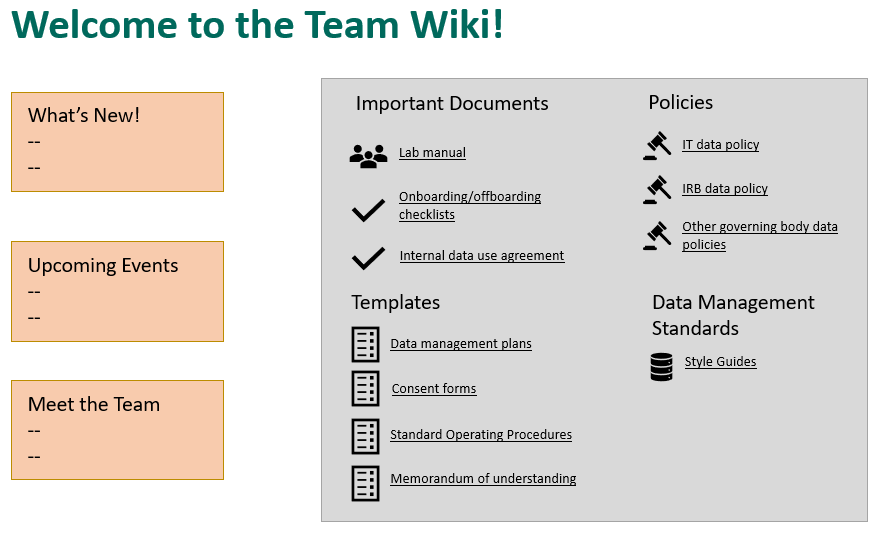
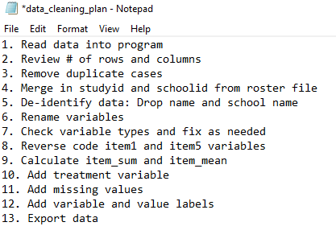
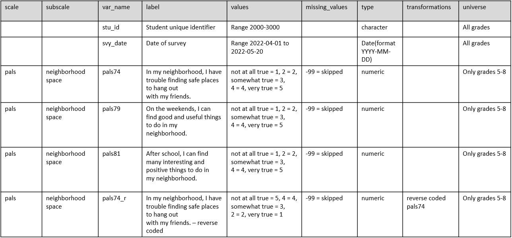

# Documentation

```{r fig.cap="Data documentation in the research project life cycle", out.width = "70%"}

knitr::include_graphics("img/lifecycle_doc.PNG")

```

Documentation is a collection of files that contain procedural and descriptive information about your team, your project, your workflows, and your data. Collecting thorough documentation during your study is unequivocally as important as collecting your data. Documentation serves many purposes including:

- Standardizing procedures
- Securing data and protecting confidentiality
- Tracking data provenance 
- Discovering errors
- Enabling reproducibility
- Ensuring others use and interpret data accurately
- Providing searchability through metadata

We are going to cover four levels of documents in this chapter: team level, project level, dataset level, and variable level. While most of the documentation we will discuss does fall within the documentation phase in the research life cycle, some documents will be created earlier or later and the timing will be discussed in each section. During a project, while you are actively using your documents, the format of these documents does not matter. Choose a format that is human-readable and works well for your team (ex: Word, PDF, plain text file, Google Doc, Excel, HTML, OneNote, etc.). When projects are closing out and you are preparing to share your data, you can consider, at that time, how to best make your documents more sustainable, interoperable, and searchable. See the chapter on [data sharing](#share) for more information.

The documents below are all recommended and will help you successfully run your project. You can choose to create as many or as few of these documents as you wish. You should choose which documents to create based on what is best for your project and your team, as well as what is required by your funder (see [Data Management Plan](#dmp)), and other governing bodies such as your Institutional Review Board. No matter which documents you choose to implement, it is important that you template your documents and implement them consistently within, and even across projects. Implementing documentation using templates, or consistent formats and fields, reduces duplication in efforts (no need to reinvent the wheel) and allows your team to more easily interpret the document.

Creating and maintaining these documents **is an investment** (make sure to account for this time in your proposal budget), but the return for the investment is well worth the effort. These documents are best created by the team member that directly oversees the process and sometimes that may include a collaborative effort (for example both a project coordinator and a data manager may build documents together).

As you review these documents, remember that every single one mentioned is a living document to be updated as procedures change or new information is received. As seen in the cyclical section of our diagram above, team members should revisit documentation each time new data is collected, or more often if needed. If changes are made and not added to documentation over long periods of time, you will find that you no longer remember what happened and that information will be lost. It will also be important to version your documents along the way so that staff know that they are working with the most recent version and can see when documents have been updated and why. 


## Team Level

Team level data documentation typically contain data governance rules that apply to the entire team, across all projects. While these documents can be amended at any time, they should really be started long before you apply for a grant, when your lab, center, or institution is formed. 

```{r fig.cap="Team level documentation in the research project life cycle", out.width = "70%"}

knitr::include_graphics("img/lifecycle_teamdoc.PNG")

```

### Lab Manual

One example of a team level document is a lab manual, or team handbook. A lab manual creates common knowledge across your team [@mehr_how_nodate]. It provides staff with consistent information about how the team works and why they do the things they do. It sets expectations, provides guidelines, and can even be a place for passing along helpful career advice [@balazs_crowdsourced_nodate]. While a lab manual will mostly consist of administrative, procedural, and interpersonal types of information, it can be helpful to also include data management content as well, including general rules about how to access, store, share, and work with data securely and ethically. 

**Example lab manuals**

|Document|Description|
|--------|-----------|
|Crowdsourced lab manual template [@balazs_crowdsourced_nodate]|Lab manual template
|Faylab Lab Manual [@fay_faylab_2022] |Example public lab manual|
|The RAISE Lab Manual [@von_der_embse_raise_2019]  | Example public lab manual|
|Common Topics in Lab Handbooks [@mehr_common_2020]| Common topics covered in lab manuals|


### Wiki

Another option that can either be created alongside the lab manual or as an alternative to the lab manual is a team wiki. A wiki is a webpage that allows users to collaboratively edit and manage content. It can be created and housed in many tools such as SharePoint, Teams, Notion, GitHub, OSF, and more. While some lab wikis are public (as you'll see in the examples below), most are not and can be restricted to only invited users. This is a great way to keep disparate documents and pieces of information, for both administrative and data related purposes, organized in a central, accessible location. Your wiki can include links to important documents, or you can also add text directly to the wiki to describe certain procedures. Rather than sending team members to multiple different folders for frequently requested information, you can refer them to your one wiki page.

```{r fig.cap="Example team wiki with links to frequently requested information"}



```

\* Note: Project level wikis can also be created and be very useful in centralizing frequently referenced information pertaining to specific projects.

**Example wikis**

|Document|Description|
|--------|-----------|
|Aly Lab Wiki [@aly_aly_2018] | Example public lab wiki|
|SYNC Lab Wiki [@noauthor_sync_nodate]| Example public lab wiki|

### Onboarding/Offboarding

While **onboarding** checklists will mostly consist of non-data related, administrative information such as how to sign up for an email or how to get set up on your laptop, it should also contain several data specific pieces of information to get all new staff generally acclimated to working with data, for any project, in their new role. 
  
Similarly, while **offboarding** checklists will contain a lot of procedural information about returning equipment and so forth, it should also contain some basic data tasks that help maintain data integrity and security.

Data related topics to consider adding to your onboarding and offboarding checklists are included below.

```{r fig.cap="Sample data topics to add to onboarding and offboarding checklists"}

knitr::include_graphics("img/onboard_offboard2.PNG")

```

### Data Use Agreement

Typically when we think of a data use agreement (DUA) we think of a document that we draft in conjunction with an external partner that would like to access our data (or we want to access theirs). It usually covers the terms for how someone is allowed to use data, considering things like access controls, research participant privacy, data destruction rules, and so on [@geraghty_formalize_nodate]. However, it can be really helpful to document the terms and conditions of data use and have staff, at minimum, review or even sign an internal statement saying that they have reviewed all team policies regarding working securely with data [@cessda_data_nodate]. These rules for working with data can be added to a lab manual, as many people do, or they can be added to a separate data use agreement where staff members can sign or check a box acknowledging that they have read and understand the policies.

Ideas of content to include in a DUA are included below.

```{r fig.cap="Example of content to include in an internal data use agreement"}

knitr::include_graphics("img/dua2.PNG")

```

### Style Guide

A style guide is a set of standards for the formatting of information [@noauthor_style_2023]. It improves consistency within and across files and projects. This document includes conventions for procedures such as variable naming, value coding, file naming, versioning, and file structure. It can be created in one large document or separate files for each type of procedure. I highly recommend applying your style guide consistently across all projects, hence why this is included in the team documentation. Since style guides are so important, and there is so many recommended practices to cover, I have given this document its own chapter. See the chapter on [style guides](#style) for more information.


## Project Level

Project level documentation is where all descriptive information about your project is contained, as well as any planning decisions and process documentation specifically related to your project. Again, while most of these documents are created in the documentation phase, some documents such as the DMP (started before your project is funded), checklists and meeting notes (started during the planning phase), or the CONSORT diagram (started after data is collected) will begin at other points throughout the cycle.

### Data Management Plan

This is the first project level document that will be created in your research project life cycle. See [Data Management Plan](#dmp) to review details about this document. The only other note to mention here is that your DMP can continue to be modified throughout your entire study. If any major changes are made, it may be helpful to reach out to your program officer to keep them in the loop as well.

### Checklists and meeting notes

Since we've already discussed these documents in a previous [chapter](#checklist) I won't say much more here other than to acknowledge that these documents are also part of your portfolio of documentation and are really key planning documents as you start to build your other project as well as data and variable level documents.

### Roles and responsibilites document

Using the checklists during your planning phase, you hopefully decided on and assigned some roles and responsibilities for your project. Now is the time to formally document those decisions in a way that you can share with the others. In the previous [chapter](#roledoc) we reviewed ways to structure this document. Once this document is created, make sure to store it in a central location for easy referral and update the document as needed.

**Examples roles and responsibilities**

|Document|Description|
|--------|-----------|
|Johns Hopkins Institute for Clinical and Translational Research Best Practices for Research Data Management [@johns_hopkins_institute_for_clinical_and_translational_research_best_nodate] | Example roles and responsibilities are assigned throughout this resource|

### Research Protocol

The research protocol will be a comprehensive project summary document. If you are submitting your study to your Institutional Review Board, you will most likely be required to submit this document as part of your application. A research protocol provides a means for the board to determine if your methods provide adequate protection for human subjects. In addition to serving this required purpose, the research protocol is also an excellent document to deposit along with your data at the time of data sharing, as well as an excellent resource for you when writing technical reports or manuscripts. This document provides all context needed for you and others to effectively interpret and use your data. It generally provides the what, who, when, where, and how of your study. Make sure to follow your university's specific template if provided, but common items typically included in a protocol are seen below.

```{r fig.cap="Common research protocol elements"}

knitr::include_graphics("img/protocol2.PNG")

```

When it comes time to submit your data in a repository, the protocol can be revised to contain information helpful for a data end user. Content such as risks and benefits to participants might be removed, and numbers such as final study sample count should be updated to show your final numbers. Additional [supplemental information](#supplement) can also be added as needed.

**Example protocols**

|Document|Description|
|--------|-----------|
|University of Washington Protocol Template [@university_of_washington_developing_nodate]| Protocol template|
|Ohio State Protocol Template [@the_ohio_state_university_institutional_review_board_guidelines_2014] | Protocol Template|
|University of Missouri Protocol Template [@university_of_missouri_socialbehavioraleducational_nodate]| Protocol Template|
| SCOPE User Guide[@united_states_department_of_health_and_human_services_administration_for_children_and_families_office_of_planning_research_and_evaluation_study_2022]|Example data sharing documentation that can be created from a research protocol|


### Supplemental Documents {#supplement}

There is a series of documents, that while they can absolutely be standalone documents, I am calling supplemental documents here because they can be added to your research protocol as an addendum at any point to further clarify specifics of your project.

1. Timeline

The first supplemental document that I highly recommend creating is a visual representation of your data collection timeline. This can be both a helpful planning tool (for both project and data teams) in preparing for times of heavier and lighter workloads, as well as an excellent document to share with future data users to better understand waves of data collection. There is no one format for how to create this document. Below is an example of one way to visualize a data collection timeline.

```{r fig.cap="Example data collection timeline"}

knitr::include_graphics("img/timeline.PNG")

```

2. CONSORT Diagram

A CONSORT (Consolidated Standards of Reporting Trials) diagram displays the flow of participants through a program [@consort_consort_nodate]. It visually portrays enrollment, randomization, as well as attrition in the study. As you can imagine though, this diagram cannot be created until at least one wave of data has been collected, and must be updated as more waves are collected. Your participant tracking database, which we will discuss in our [tracking](#track) chapter, will inform the creation of this diagram.

```{r fig.cap="2010 CONSORT flow diagram template", out.width = "70%"}

knitr::include_graphics("img/consort.PNG")

```

3. Instruments 

Actual copies of instrument can be included as supplemental documentation. This includes copies of surveys, assessments, forms, and so forth. It can also include any technical documents associated with your instruments.

4. Flowchart of data collection instruments/screeners

You can also include flowcharts of how participants were provided or assigned to different instruments or screeners to help users better understand issues such as missing data [@tourangeau_early_2015].

```{r fig.cap="Flowchart of an ECLS-K:2011 kindergarten assessment", out.width = "70%"}

knitr::include_graphics("img/flowchart.PNG")

```

5. Consent Forms

Consent forms can also be added as an addendum to research protocols to give further insight into what information was provided to study participants.

6. Related publications

You may also choose to attach any publications that have come from your data as an addendum to your protocol.

### Standard Operating Procedures {#sop}

While the research protocol provides summary information for all procedures associated with a project, we still need documents to inform how the procedures are actually implemented on a daily basis [@nucats_standard_nodate]. If you recall from our [planning chapter](#plan), every step that we added to a data collection workflow is then added to a standard operating procedure (SOP) and the details fleshed out. Not only will you have an SOP for each type of data you are collecting (survey, assessments, observations), you can also have SOPs for other types of decisions as well. Many of the decisions laid out in your protocol, will be further detailed in an SOP. Examples of procedures to include in an SOP are seen below.

```{r fig.cap="Examples of processes or decisions to develop an SOP for"}

knitr::include_graphics("img/sopchecks.PNG")

```

SOPs not only help staff know how to perform tasks, they also create transparency, allow for continuity when staff turnover or go out on leave, create standardization in practices, and last, because an SOP should include versioning information, they allow you to accurately report changes in project procedures throughout the project. You will want to create a template that is used consistently across all procedures, by all staff who build SOPs. 

```{r fig.cap="Standard operating procedure minimal template", out.width = "75%"}

knitr::include_graphics("img/sop.PNG")

```

In developing your template, the SOP should begin with **general information** about the scope and purpose of the procedure, as well as any tools or terminology. This provides context for the user and gives them the background to use and interpret the SOP. The next section, **procedures**,  lists all procedures in order. Each step provides the name of the staff member/s associated with that step to ensure that there is no ambiguity. Each step should be as detailed as possible so that you could hand your SOP over to any new staff member, with no background in this process, and they can implement the procedure with little trouble. Specifics such as names of files and links to their locations, names of contacts, methods of communication (ex: email vs instant message), and so forth should be included. Additions such as screenshots, links to other SOPs, or even links to tutorials can be embedded as well. Last, any time an update is made to the SOP, clarifying information about the update is added to the **revision** section. This allows you to keep track of changes over time: when were changes made, who made those changes, and why. 

**Example SOPS**

|Document|Description|
|--------|-----------|
|Northwestern University Writing Standard Operating Procedures and Templates [@nucats_writing_nodate]| SOP Template |
|IMPACCT Trials Coordination Centre Standard Operating Procedure for Allocation of Participant Identification Numbers [@impacct_trials_coordination_centre_itcc_standard_nodate]| Example SOP for assigning IDs|
|CITI Template and Sample SOP [@citi_program_citi_nodate]|Sample Activitiy Monitor Configuration SOP|


## Dataset Level

Our next type of documentation applies solely to your datasets and includes information about what data they contain and how they are related. It also includes things such as planned transformations for the data, potential issues to be aware of, and any alterations to the data. In addition to being helpful descriptive documentation to keep, a huge reason for creating dataset documentation is for authenticity. Datasets go through many iterations of processing which can result in multiple versions of a dataset [@cessda_data_nodate; @service_quality_nodate]. Preserving data lineage by tracking data errors and transformations is key to ensuring that you know where your data come from, what processing has already been completed, and that you are using the correct version of the data. 

Not **all** of your dataset level documentation will be created in the documentation phase and we will talk about the timing as we review each document.  

### Readme

A readme is a plain text document that contains information about your files. These grew out of computer science but are now prevalent in the research world. These documents are a way to convey pertinent information to collaborators in a simple, no frills manner. Readmes can be used in many different ways but I am going to cover three ways they are often used in the context of data management.

1. For conveying information to your colleagues
  - An example of this is if a study participant reaches out to a project coordinator to let them know that they entered the incorrect ID in their survey. When the project coordinator downloads the raw data file to be cleaned by the data manager, they also create a file named "readme.txt" that contains this information and is saved alongside the file in the raw data folder. That way when the data manager goes to retrieve the file, they will see that a readme is included and know to review that document first.

        - ID 5051 entered incorrectly. Should be 5015.
        - ID 5089 completed the survey twice  
            - first survey is only partially completed
 
2. For conveying steps in a process (sometimes also called a setup file)
  - There may be times that a specific data pipeline or reporting process requires multiple steps, opening different files and running different scripts. This information **can** go in an SOP, but if it is a programmatic type process done using a series of scripts, it might be easiest to put a simple file named "readme_setup.txt" in the same folder as your scripts so that someone can easily open the file to see what they need to run.
  
        Step 1: Run the file 01_clean_data.R to clean the data  
        Step 2: Run the file 02_check_errors.R to check for errors  
        Step 3: Run the file 03_run_report.R to create report  

3. For providing information about a set of files in a directory
  - If colleagues are accessing your clean datasets in your project directory, it can be helpful to add readmes to the top of those directories to provide information about what datasets are available in the directory, as well as pertinent information about those datasets, including how the datasets are related/can be linked. [@neild_sharing_2022]

```{r fig.cap="Institute of Education Sciences example readme for conveying information on files in a directory", out.width= "75%"}

knitr::include_graphics("img/readme3.PNG")

```


### Changelog

A changelog is a record of all of the versions of your data and code. While there are automatic ways to track your data and code through programs such as Git and GitHub, in the field of education where researchers are often working with human subject, identifiable data, users are most often not keeping their study data during an active project, in a remote repository. Data are usually kept in an institution approved storage location. Even if your storage location has versioning such as Box or SharePoint, unless you also have a way to commit messages along with those versions (like a commit message with Git), you will still want to keep a changelog.

A changelog provides data lineage, allowing the user to understand where the data originated as well as all transformations made to the data. It also supports data confidence, allowing the user to understand what version of the data they are currently using and to see if more recent versions have been created and why.

In its simplest form a changelog should contain the file name (versioned consistently), the date it was created, and a description of the dataset (including what changes were made compared to the previous version). It could include additional information as well such as who made the change, and a link to any code used to transform the data [@service_versioning_nodate].

```{r fig.cap="Example simple changelog for a clean student survey data file", out.width = "70%"}

knitr::include_graphics("img/changelog.PNG")

```

These changelogs will most likely not be created until the data capture and data cleaning phases of the life cycle when data transformations begin happening, and can be updated at any point as needed.

### Data Cleaning Plan

A data cleaning plan is a written proposal outlining how you plan to transform your raw data into clean, usable data. This document contains no code and is not technical skills dependent. A data cleaning plan is created for each dataset that you plan to collect (ex: student survey, student assessment, teacher survey, district student demographic data). Because this document lays out your intended transformations for each raw dataset, it allows any team member to provide feedback on the data cleaning process. 

This documents can be started in the documentation phase, but will most likely continue to be updated throughout the study. Typically the person who has the responsibility of cleaning the data will write out the data cleaning plans, but those documents can then be brought to a planning meeting allowing other team members, such as PIs, to provide input on the plan. This ensures that everyone agrees on the transformations to be performed. Once finalized, this data cleaning plan serves as a guide in the cleaning process. We will talk much more about what types of transformations **should** go into a data cleaning plan in the **data cleaning** chapter of this book.

```{r fig.cap="A simplified data cleaning plan", out.width = "70%"}



```


## Variable Level

Our last category of documentation is variable level documentation. When we think about data management, I think this is most likely the first type of documentation that pops into people's minds. This is documentation that tells us all pertinent information about the variables that exist in our datasets: variable names, descriptions, types, and so forth. While variable level documentation is often used for the interpretation of existing datasets, it can also serve many other vital purposes including guiding the construction of data collection instruments, assisting in data cleaning, or validating the accuracy of data [@lewis_using_nodate], and we will discuss this more throughout the chapters in this book.

### Data dictionary

A data dictionary is a rectangular format collection of names, definitions, and attributes about variables in a dataset [@uc_merced_library_what_nodate]. This document is both a planning tool and a tool used for interpretation, and is most useful if created in the documentation phase, before a project begins, because it is integral to many other phases of a study. 

A data dictionary is typically created in a rectangular format. What tool you use to build your data dictionary is up to you, but there are key pieces of information that should be included, as well as optional fields that can be helpful as well [@johns_hopkins_institute_for_clinical_and_translational_research_data_nodate].

```{r fig.cap="Fields to include in a data dictionary", out.width = "70%"}

knitr::include_graphics("img/dictionary.PNG")

```

#### Creating a data dictionary for an original data source

Before you begin to build these dictionaries you will need to have the following:

1. Your style guide already created: We will talk about [style guides](#style) in the next chapter, but this document will provide standards for how you should name variables and code response values.  
2. Documentation for your measures: If you are collecting data using existing measures, you will want to collect any documentation on those measures such as technical documents or copies of instruments. You will want your documentation to provide information such as:

  - What items make up the measures/scales? What is the exact wording of items?  
  - How are items coded?  
  - Are there any calculations/reverse coding needed?  

You will then build one data dictionary for each instrument you plan to collect (ex: student survey data dictionary, teacher survey data dictionary, student assessment data dictionary). All measures/items for each instrument will be included in the data dictionary. 

As you build your data dictionary, consider the following:   


  - Are your variable names meeting the requirements laid out in your style guide?   
  - If your items come from an existing scale, does your value coding align with the coding laid out in the documentation? If your items do not come from an existing scale, does your value coding align with the requirements in your style guide?  
  - What additional items will make up your final dataset (it could be items that you plan to add to the data after it is collected, i.e. treatment, unique identifiers, calculated variables)?  

For demonstration purposes only, the following data dictionary uses items from Patterns of Adaptive Learning Scales (PALS) [@midgley_manual_2000]. In an actual research study your dictionary would most likely include many more items and a variety of measures.

```{r fig.cap="Example student survey data dictionary"}



```

The last step of creating your data dictionary, as it should be for every document you create in this documentation phase, is to do a review with your team. 


  - Is everyone in agreement about how variables are named, how values are coded, and our variable types? 
  - Is everyone in agreement about who gets each item?  
  - Does the team want to adjust any of the question/item wording? 
  - You'll also want to confirm that the data dictionary includes everything the team plans to collect and no items are missing. 
  - If additional items are added to instruments at later time points, adding fields such as (time periods available), can be really helpful to future users in understanding why some items may be missing data in certain time points.

#### Creating a data dictionary from an existing data source

Not all research study data will be gathered through original data collection methods. You may be collecting external data sources from organizations like school districts or state departments of education. In these cases you will begin building your data dictionaries later in the cycle, when data is received, and rather than the forward moving flow we discussed before where the dictionary is built first, we will now have to work backwards to answer questions about our data.

The first step in building your data dictionary now is to review your existing data. Yet, it turns out that all this tells you is what **does** exist in the data, not what **should** exist in the data. Items could be incorrectly coded, columns could be assigned the incorrect variable type, and so forth. As you review your data, start to collect questions such as:

1. What do these variables represent? 
    - What was the wording of these item?
2. Who received the items?
3. What do these values represent? 
    - Am I seeing the full range of values/categorical options for each item? Or was the range larger than what I am seeing?
    - Do I have values in my data that don't make sense for an item?
4. What types are the items currently? What types should they be?

In order to answer those questions, you may need to do some additional detective work.

1. Contact the person who originally collected the data to learn more about the instrument and the data.  
2. Contact the person who cleaned the data (if cleaned) to see what transformations they completed on the raw data.  
3. Request access to the original instruments to review exact question wording, item response options, skip patterns, and so forth. 
4. Request any documentation they have. Do they have their own data dictionaries, codebooks, or syntax that might help you understand what is going on in the data?  

Ultimately you should end up with a data dictionary structured similarly to the one above. You may add additional fields that help you keep track of further changes (ex: a column for the old variable name and a column for your new variable name), and your transformations section may become more verbose as the values assigned previously may not align with the values you prefer based on your style guide or the existing measures. Otherwise, the data dictionary should still be constructed in the same manner mentioned above.

#### Time well spent

The process described in this section is a manual, time consuming process. This is intentional. Building your data dictionary is an information seeking journey where you take time to understand your dataset, create standardization of items, and plan for data transformations. Spending time manually creating this document before collecting data prevents many potential errors and time lost fixing data in the future. While there are absolutely ways you can automate the creation of a data dictionary using an existing dataset, the only time I can imagine that being useful is when you have a clean dataset that you have confidently already verified is accurate and ready to be shared. However, a data dictionary, as mentioned before, is so much more than a document to be shared alongside a public dataset. It is a tool for guiding many other processes in your research data life cycle.

**Example data dictionaries**

|Document|Description|
|--------|-----------|
|USDA data dictionary template [@usda_data_nodate]| Example data dictionary template|
|OSF data dictionary template [@center_for_open_science_how_nodate] | Example data dictionary template|


### Codebook

A codebook documents the contents, structure, and layout of a data file[@@icpsr_guide_2011]. It enables the user to quickly ascertain some of the details about a dataset without ever opening the file. Unlike a data dictionary, a codebook is created **after** your data is collected and cleaned and its value lies in data interpretation and data validation. 

The codebook contains some information that overlaps with a data dictionary, but is more of a summary document of what actually exists in your dataset.

```{r fig.cap="Codebook content that overlaps and is unique to a data dictionary", out.width = "80%"}

knitr::include_graphics("img/codebook.PNG")

```

Ultimately you want to export a codebook that contains variable level information like this document below from the United States Department of Health and
Human Services [@united_states_department_of_health_and_human_services_administration_for_children_and_families_office_of_planning_research_and_evaluation_study_2022].

```{r fig.cap="Example codebook content from the SCOPE Coach Survey", out.width = "80%"}

knitr::include_graphics("img/codebook2.PNG")

```

You can see how in addition to being an excellent resource for users to review your data without ever opening the file, this document may also help you catch errors in your data if out of range or unexpected values appear.

You can either create separate codebooks per datasets or have them all contained in one document, clickable through a table of contents. Unlike a data dictionary which I recommend to create manually, a codebook should be created through an automated process. Automating codebooks will not only save you tons of time, but it will also reduce errors that are made in manual entry. You can use many tools to create codebooks, including point and click statistical programs such as SPSS, or with a little programming knowledge you can more flexibly design codebooks using programs like R or SAS. Fo example, the R programming language has many packages that will create and export codebooks in a variety of formats from your existing dataset by just running a few functions[@lewis_codebook_nodate].

Last, you may notice as you review codebooks, many will start with several pages of text, usually containing information about the project. It's common for people, when it comes time to share their data, to combine information from their research protocol or readme files, into their codebooks, rather than sharing separate documents.

**Example codebooks**

|Document|Description|
|--------|-----------|
|ICPSR Guide to Codebooks [@icpsr_guide_2011]| Guide for creating codebooks|
|SCOPE Codebook, US Department of Health and Human Services [@united_states_department_of_health_and_human_services_administration_for_children_and_families_office_of_planning_research_and_evaluation_study_2022]|A codebook for this study can be obtained from their ICPSR repository|

## Metadata

The last type of documentation to discuss is metadata, which is created in the "prepare for archiving" phase. When it comes time to deposit your data in a repository, you will submit two types of documentation, human-readable documentation, which includes any of the documents we've previously discussed, and metadata. Metadata is documentation that is meant to be processed by machines and serves the purpose of making your files searchable [@cessda_documentation_nodate;@danish_national_forum_for_research_data_management_metadata_nodate]. Metadata aids in the cataloging, citing, discovering, and retrieving of data and its creation is a critical step in creating FAIR data[@noauthor_fair_nodate; @service_metadata_nodate; @logan_data_2021].

For the most part, no additional work is needed on your part to create metadata when depositing your data in a repository. It will simply be created as part of the depositing process [@cessda_documentation_nodate;@university_of_iowa_libraries_university_nodate]. As you deposit your data, the repository may have you fill out a form that contains descriptive (description of project and files - enables discovery), administrative (licensing and ownership), and structural metadata (technical considerations) [@danish_national_forum_for_research_data_management_metadata_nodate; @cofield_libguides_nodate]. The information from this form will become your metadata [@noauthor_figshare_nodate].

```{r fig.cap="Example intake metadata form for figshare repository", out.width= "70%"}

knitr::include_graphics("img/metadata4.PNG")

```

The most common metadata elements are included below[@dahdul_research_nodate].

```{r fig.cap="Common metadata elements", out.width = "80%"}

knitr::include_graphics("img/metadata.PNG")

```


Depending on the repository, at minimum you will enter basic project level metadata similar to above, but you may be required or have the option to enter more comprehensive information, such as elements covered in your research protocol. You may also have the option to enter additional levels of metadata that will help make each level more searchable, such as dataset-level or and variable-level metadata [@ldbase_information_nodate; @icpsr_icpsr_nodate]. All of the information needed for this metadata can be gathered from the documents we've discussed earlier in this chapter. 

Once entered into the form, the repository converts entries into both human-readable and machine-readable, searchable formats such as XML [@icpsr_icpsr_nodate] or JSON-LD. We can see what this metadata looks like to humans once it is submitted. Here is an example of how ICPSR Open displays the metadata information on a project page [@lindsay_c_page_design_2020]. Notice we even have the option to download the XML formatted metadata files in one of two [standards](#standards) if we want as well. 

```{r fig.cap="Example metadata displayed on an ICPSR Open project page", out.width = "95%"}

knitr::include_graphics("img/metadata_project.PNG")

```

There are other ways metadata can be gathered as well. For instance, for variable-level metadata, rather than having users input metadata, repositories may create metadata from the deposited statistical data files that contain inherent metadata (such as variable types or labels) or from deposited documentation such as data dictionaries or codebooks [@icpsr_icpsr_nodate].

If your repository provides limited forms for metadata entry, you can also choose to increase the searchability of your files by creating your own machine-readable documents. There are several tools to help users create machine-readable codebooks and data dictionaries that will be findable through search engines such as Google Dataset Search [@buchanan_getting_2021, @arslan_how_2018; @usgs_tools_nodate]. 

### Standards {#standards}

Metadata standards, typically field specific, establish common structuring and meaning of data and improve data interoperability in addition to increasing the ability of users to find and understand data [@university_of_iowa_libraries_university_nodate]. Metadata standards can be applied in several ways [@bolam_guides_nodate; @ddi_alliance_controlled_nodate]. 

1. Formats: What machine-readable format should metadata be in?  
2. Schema: What fields are recommended verses mandatory for project, dataset and variable level metadata?
3. Controlled vocabularies: A controlled list of terms used to index and retrieve data.

Many fields have chosen metadata standards to adhere to. Some fields, like psychology [@kline_technical_2018], are developing their own metadata standards, including formats, schemas, and vocabularies grounded in the FAIR principles and the Schema.org schema [@noauthor_schemaorg_nodate]. Yet, the Institute of Education Sciences recognizes that there are currently no agreed upon standards in the field of education [@institute_of_education_sciences_frequently_nodate].

```{r fig.cap="A sampling of field metadata standards", out.width= "70%"}

knitr::include_graphics("img/metadata_standards.PNG")

```

It can be helpful to see how standards differ as well as overlap. The DDI Alliance put together this table for instance, mapping the DDI Elements (and vocabularies) to the Dublin Core [@alliance_mapping_nodate], two commonly used standards.

```{r fig.cap="A comparison of DDI Version 2 standards to Dublin Core standards", out.width = "70%"}

knitr::include_graphics("img/metadata_mapping.PNG")

```

We can see what this metadata comparison actually looks like if we download the Dublin Core and the DDI 2.5 XML format metadata files from the ICPSR Open project we saw above [@lindsay_c_page_design_2020]. You can start to see the differences and similarities across standards. 

```{r fig.cap="Metadata comparison from an AERA Open project"}

knitr::include_graphics("img/standard_compare.PNG")

```

If you plan to archive your data, first check with your repository to see if they follow any standards. For example, the repository Dryad uses a combination of Dublin and Darwin Core [@lamar_soutter_library_necdmc_nodate], while ICPSR uses DDI [@icpsr_icpsr_nodate]. If the repository does use certain standards, work with them to ensure your metadata adheres to those standards. Some repositories may even provide curation support free or for a fee. But as I mentioned earlier, depending on your repository, adding metadata to your project may require no additional work on your part. The repository may simply have you enter information into a form and convert all information for you.


If no standards are provided by your repository and you plan to create your own metadata, you can choose any standard that works for you. Oftentimes researchers may choose to pick a more general standard such as DataCite or Dublin Core [@university_of_iowa_libraries_university_nodate], and in the field of education, most researchers are at least familiar with the DDI standard so that is another good option. Remember, if you do choose to adhere to a standard, this decision should be documented in your [data management plan](#dmp).


## Wrapping it up

At this point your head might be spinning from the amount of documents we've covered. It's important to understand that while each document discussed provides a unique and meaningul purpose, you don't have to create every document listed. Choose the documents that help you organize your project and your data processes in the best way. Each document you create that is well maintained, will improve your data management workflow, decrease errors, and enhance your understanding of your data.
