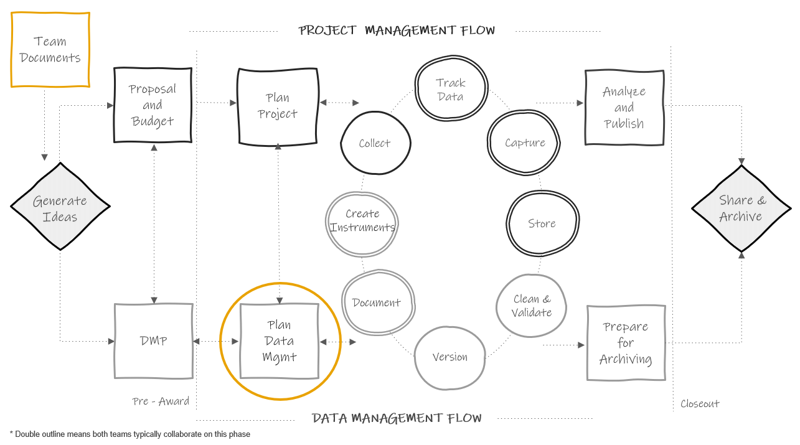
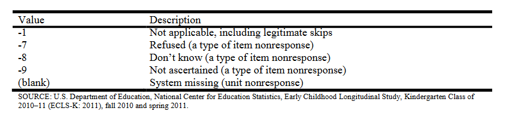

# Style guide {#style}

```{r fig.cap="Data documentation in the research project life cycle", out.width = "70%"}



```

A style guide provides general agreed upon rules for the formatting of information[@noauthor_style_2023]. As mentioned in the previous [chapter](#styleshort), style guides can be created to standardize procedures such as variable naming, variable value coding, file naming, file versioning, file structure, and even coding practices.

The benefits for creating style guides and using them consistently include:

- Creating standardization (within and across projects)
- Improving interpretation: Consistent and clear structure, naming, and coding allows your files and variables to be findable and understandable to humans and computers.
- Increasing reproducibility: If the organization of your file paths, file naming, or variable naming constantly change it undermines the reproducibility of any data management or analysis code you have written.

Style guides can be created for individual projects, but they can also be created at the team level, to be applied across all projects. Most importantly, they should be created before a project kicks off so you can implement them as soon as your project begins. If you do not have a team-wide style guide already created, you most likely will want to create a project-level style guide during your planning phase so that you can begin setting up your directory structures and file naming standards before you start creating and saving project-related files. 

Style guides can be housed in one large document, with a table of contents used to reference each section, or they can be created as separate documents. Either way, style guides should be stored in a central location that is easily accessible to all team members (such as a team or project [wiki](#wiki)), and all team members should be trained, and periodically retrained, on the style guide to ensure adherence to the rules. If all team members are not consistently implementing the style guide, then the benefits of the guide are lost.

For the remainder of this chapter, we will spend time reviewing some good practices for rules to add to your style guides for the following purposes:

1. Structuring directories
2. Naming files
3. Naming variables
4. Assigning variable values
5. Styling your syntax files

While some best practices will be provided below, ultimately the rules you choose to add to each style guide should be chosen based on which practices work best for your projects and your team. Whatever rules you settle on, write them in a style guide so that everyone is following the same rules within and across projects.

## Directory structure

When deciding how to structure your project directories (the organization of your operating systems folders and files), there are several things you want to consider.

- First, consider organizing your directory into a hierarchical folder structure to clearly delineate segments of your projects and improve searchability
  - The alternative to using a folder structure is using metadata and tagging to organize and search for files [@cakici_folders_2017; @staff_how_2019]
- When creating your folder structure, strike a balance between a deep and shallow structure
  - Too shallow leads to too many files in one folder which is difficult to sort through
  - Too deep leads to too many clicks to get to one file, plus file paths can max out with too many characters (for example, SharePoint and OneDrive have a path limit of 400 characters[@microsoft_restrictions_nodate])
- Create folders that are specific enough that you can limit access
  - For example you will want to limit user access to folders that hold Personally Identifiable Information (PII)
  - To protect any files that you don’t want others to accidentally edit (for example your clean datasets), also consider making some files "read only"
- Decide if you want an "archive" folder to move old files into or if you want to leave previous versions in the same folder
- Consider setting a character limit on folder names (again to reduce problems with hitting path character limits)
- Make your folder names meaningful and easy to understand
- Make your folder names machine-readable
  - Don’t use spaces. They can break a URL when shared.
  - Don't use special characters in your folder names, such as `,`, `%`, `!`, `\`, `/`, or `.`. Computers assign specific meaning to many of these special characters.
  - Consider using _ or - to separate words
- Be consistent with capitalization (use only lower case for example)

**Example directory structure style guide**

    1. All project directories follow this hierarchical metadata structure  
        - Level 1: Name of project  
        - Level 2: Life cycle folders  
        - Level 3: Data collection wave folders (if relevant)  
        - Level 4: Participant folder (if relevent)
        - Level 5: Specific content folder  
        - Level 6: Archive folders  
    2. All folders should be named according to these rules  
        - Meaningful name but no longer than 20 characters  
        - No spaces or special characters in folder names  
        - Only use lower case letters  
        - Use `-` to separate words  
    3. All previous versions of files must be placed into their respective "archive" folder
        - A changelog should be placed in each "archive" folder to document changes between document versions

**Example directory structure created using a style guide**

```{r comment=NA} 

library(data.tree)

project <- Node$new("project-new")
  intervention <- project$AddChild("intervention")
    ic1 <- intervention$AddChild("cohort-1")
    coach <- ic1$AddChild("coaching_materials")
     carchive <- coach$AddChild("archive")
      coachchange <- carchive$AddChild("changelog.txt")
  projectmgmt <- project$AddChild("project-mgmt")
    pY1 <- projectmgmt$AddChild("cohort-1")
    sched <- pY1$AddChild("scheduling-materials")
     scarchive <- sched$AddChild("archive")
      schedchange <- scarchive$AddChild("changelog.txt")
  documentation <- project$AddChild("documentation")
      sops <- documentation$AddChild("sops")
        proarchive <- sops$AddChild("archive")
        prochange <- proarchive$AddChild("changelog.txt")
      datadictionary <- documentation$AddChild("data-dictionaries")
        darchive <- datadictionary$AddChild("archive")
         dictchange <- darchive$AddChild("changelog.txt")
  data <- project$AddChild("data")
    y1 <- data$AddChild("cohort-1")
      studentd <- y1$AddChild("student")
      svy <- studentd$AddChild("survey")
        rawarchive <- svy$AddChild("archive")
        rachange <- rawarchive$AddChild("changelog.txt")
  track <- project$AddChild("tracking")
    tY1 <- track$AddChild("cohort-1")
      trackingdb <- tY1$AddChild("participant-database")
        trarchive <- trackingdb$AddChild("archive")
        trackchange <- trarchive$AddChild("changelog.txt")
      consent <- tY1$AddChild("parent_consents")

print(project)

```

## File naming

```{r fig.cap="xkcd comic on naming files", out.width = "40%"}

knitr::include_graphics("img/xkcd.PNG")

```

As xkcd[@noauthor_documents_nodate] so aptly points out in the comic above, many of us are pretty bad at naming files in a consistent and usable way. We are often in a rush to save our files and maybe don't consider how unclear our file names will be for future users (including ourselves). 

Our file names alone should be able to answer questions such as:

- What are these documents? 
- When were these documents created? 
- Which document is the most recent version?

Let's walk through several conventions to consider when naming your files.

- Never use spaces between words. They can often break a URL when shared.
- Never use special characters. They can have meaning within programming languages and can cause problems.
  - Consider using `-` or `_` to separate words. This not only helps to make the name human readable but also allows your computer to read and search files easier.
  - It is worth noting that `_` can be difficult to read when file names are included in links that are underlined to denote that the path is clickable (for example when sharing a SharePoint link to a document).
- Choose to either only use lower case letters, or be specific where to use upper case letters (for example at the start of every new word)
- Make names descriptive (a user should be able to understand the contents of the file without opening it)
- Consider limiting the number of characters to prevent hitting your path limit (as mentioned above)
- Keep redundant metadata in the file name
  - This reduces confusion if you ever move a file to a different folder or send a file to a collaborator. It also makes your files searchable.
    - For example, always put the data collection wave in a file name, even if the file is currently housed in a specific wave folder. Or always put the project name in the file name, even if the file is currently housed in a project folder.
- Do not use `\` in dates. The backslash can cause confusion for machines which often read them as a separator in file paths, or as an escape character. Format dates in one of two ways:
    - `YYYY-MM-DD` or `YYYYMMDD`
    - While the first format adds more characters to your variable names, it also may be clearer for users to interpret. Either of these date formats will be sortable
- When versioning your files, pick a format and add it to your style guide. 
  - If you plan to version using a number, consider left padding with 0 before single digit numbers to keep the file name the same length as it grows (`v01`, `v02`).
  - As mentioned in our chapter on documentation, it is possible to version programatically using tools like Git and GitHub. However, these tools are not always practical for education research. A more practical means of versioning may be to manually version files and track changes in a [changelog](#change).
- If your files need to be run in a sequential order, add the order number to the beginning of the file name, with leading zeros to ensure proper sorting (`01_`, `02_`)
- Choose abbreviations to use for common names/phrases and add them to your style guide (`student` = `stu`). This creates standard metadata and also helps reduce file name character lengths.
- Choose an order for file name metadata

**Example file naming style guide**

    1. Never use spaces between words.
    2. Never use special characters.
    3. Use _ to separate words
    4. Only use lower case letters
    5. Keep names under 35 characters
    6. Use the following metadata file naming order:
      - Order of use (if relevant–and always add a 0 before single digits)
      - Project
      - Cohort/Wave (if relevant)
      - Participant
      - Measure
      - Further description
      - Date (always add)
      - Version (if necessary)
    7. Format dates as YYYY-MM-DD
    8. If there are multiple versions of a document on the same date, version using v# with a leading 0.
    9. Use the following abbreviations
      - student = stu
      - survey = svy
      - wave = w
      - project math efficacy = me

**Example file names created using a style guide**

    me_stu_svy_sop_2022-08-01.docx
    me_w1_stu_svy_data_raw_2022-11-03.csv
    me_w1_stu_svy_cleaning_syntax_2023-01-22v01.R
    me_w1_stu_svy_cleaning_syntax_2023-01-22v02.R
    
## Variable naming

This style guide will be a necessary document to have before you start to create your data dictionaries. Below are several considerations to review before developing your variable naming style guide. These are broken into two types of rules, those that are non-negotiable requirements that really should be included in your style guide (if you do not follow these rules you will run into serious problems in interpretation for both humans and machines), and then best practices suggestions that are recommended but not required.

**Mandatory:**

- Don’t name a variable any keywords or functions used in any programming language (such as `if`, `for`, `repeat`)[@noauthor_r_nodate; @stangroom_rules_2019]
- Set a character limit
  - Most statistical programs have a limit on variable name characters
    - SPSS is 64
    - Stata is 32
    - SAS is 32
    - Mplus is 8
    - R is 10,000
  - With this said, do not limit yourself to 8 characters based on the fact that one future user may use a program like Mplus. Consider the balance between character limit and interpretation. It is very difficult to make good human-readable variable names under 8 characters. It is much easier to make them under 32. And the majority of your users will be using a program with a limit of 32 or more. If you have one potential Mplus user, they can always rename your variables for their specific analysis.
- Use the same variable name across time in a project
  - If an item is named `anx1` in the fall, name that same item `anx1` again in the spring
- Don’t use spaces or special characters (except`_`), they are not allowed in most programs.
  - The `-` is not allowed in programs such as R and SPSS as it can be mistaken for a minus sign
  - While `.` is allowed in R and SPSS it is not allowed in Stata so it’s best to avoid using it
- Do not start a variable name with a number. This is not allowed in many statistical programs.
- All variable names should be unique
  - This absolutely applies to variables within the same dataset, but it should also apply to all variables across datasets within a project. The reason is, at some point you may merge data across forms and end up with identical variable names (which programs will not allow).
  - So, for example if you collect student gender from a survey and you also collect student gender from school records, differentiate between the two (`s_gender` and `d_gender`)
- If you substantively change an item (substantive wording OR response options change) after at least one round of data has been collected, version your variable names in order to reduce errors in interpretation.
  - For example revised `anx1` becomes `anx1_v2`

**Suggested:**

- Names should be meaningful
  - Instead of naming gender `q1`, name it `gender`
  - If a variable is a part of a scale, consider using an abbreviation of that scale plus the scale item number (`anx1`, `anx2`, `anx3`)
- If you have used the question/scale before, consider keeping the variable name the same across projects. This can be very useful if you ever want to combine data across projects.
- Be consistent with delimiters and capitalization. Options include:
  - Pascal case (ScaleSum)
  - Snake case (scale_sum)–preferred method for variable names
  - Camel case (scaleSum)
  - Kebab case (scale-sum)–don’t use for variable names
  - Train case (Scale-Sum)–don’t use for variable names
- Consider denoting reverse coding in the variable name to reduce confusion (`anx1_r`)
- Choose abbreviations and standard phrases to use across all variables. Using controlled vocabularies improves interpretation and also makes data exploration and manipulation easier[@riederer_column_2020].
  - mean = mean
  - scaled score = ss
  - percentile rank = pr
- Include an indication of the measure in the variable name (for example as a prefix) so you always know what instrument the item came from. This can also help with the unique variable name requirement above.
  - s = student self-report
  - t = teach report on students
  - `s_anx1`, `t_conf2`

**Example variable naming style guide**

    1. Use snake case
    2. Keep names under 32 characters
    3. Use meaningful variable names
    4. If part of a scale, use scale abbreviation plus item number from the scale (not order number)
    5. Include an indication of the measure as a prefix in the variable name
      - student self-report survey = s_
      - teacher self-report survey = t_
      - district student level data = d_
    6. Denote reverse coded variables using suffix `_r`
    
**Example variable names created using a style guide**

    s_anx1
    s_anx1_r
    s_gender
    d_gender
    t_stress5

### Time

Before moving on there is one last consideration for variable names. If your data is longitudinal, you may need to add rules for accounting for time in your variable names as well.

Depending on how you plan to merge your data, there are two different ways to account for time.

1. Concatenate time to your variables. You do this if you plan to merge your data across time in [wide format](#structure). The reason you need to concatenate time to your variables here is because your variable names will repeat (`anx1` in wave 1, `anx1` in wave 2). And remember from our guidelines above, all variable names in a dataset **must** be unique. In order to both create unique variable names and correctly interpret when items were asked, we add time to our variable names. The only variables you will not assign time to are your [linking variables]{#columns} (such as student unique identifier, teacher unique identifier, and so on). Those variables need to stay identical for linking purposes and will only appear once in your data after merging.
2.  Create time variables and add them to your data. You do this if you plan to append your data over time in [long format](#structure). Appending your data in long format requires no additional work in terms of variable naming. As discussed in our data structure chapter, you actually want your variables to be identically formatted and named across time when appending. So here, in order to differentiate when items were asked, we add a new variable such as `time` or `wave` and add the appropriate value for each row.

Deciding how you want to combine your datasets across time does not need to happen early on in your project. It's typically best to store all datasets individually until you are either ready to internally use your data or you are ready to publicly share your data (during the archiving phase). At those times, you can make a decision on the best way to combine your data (if you need to combine them at all). Waiting to combine data prevents you from either wasting time combining your data in a way that ends up not actually being useful, or from wasting time merging datasets that later need to be re-combined because you find an error in an individual dataset at some point. 

We will further discuss merging and appending in our [data cleaning](#clean) chapter. With that said, if you do plan to potentially merge data in a **wide format** at some point, it can be helpful to go ahead and plan your rules for adding time to variable names, and add that rule to your style guide. 

There is no right or wrong way to assign time in your variable names necessarily. Just make sure you continue to follow the rules from above (such as never starting a variable name with a number). Below are some options for adding time.

- As a prefix or suffix with a generic abbreviation, such as `w1` for wave 1, added with a delimiter `_`
  - `w1_s_gender` or `s_gender_w1`
- As a prefix or suffix with a meaningful abbreviation, such as `f21` for fall 2021, added with a delimiter (`_`)
  - `f21_s_gender` or `s_gender_f21`
- One of the above options with no delimiter
  - `w1s_gender` or `s_genderw1`
- As a number embedded into your variable at a certain location, for instance, after an existing prefix such as `s` for `student survey`
  - `s1_gender`, `s2_gender`

While the first and second method do add additional characters to your variable name, there are also benefits to adding time in these ways. First, it can be easier to visually spot and interpret the time component when it is separated out like this. Also, adding time as a standalone component allows you to easily, programmatically, add, remove, or manipulate the time component of your variable. This allows you more flexibility in working with your data, especially in restructuring your datasets. When time is embedded in your variable names, it can become more inconvenient if you decide you want to remove the time component and restructure your data. 

## Value Coding

In addition to naming variables in a standardized way, variables values also need to be added consistently. Value codes apply to any of your categorical variable. This may be numeric categorical values with associated labels (ex: "no" = 1) or it may be character categorical values with associated labels (ex: "no" = 'n'). 

First, if you are using a pre-existing measure, assign values and labels in the manner that the technical documentation tells you to assign codes. That will be important for any further derivations you need to make later on based on those measures. Otherwise, you will be assigning your own values and labels. Some guidelines for assigning codes and labels (as well as examples for how to apply those guidelines) are below.

- Values must be unique
  - Do: Assign "yes" = 1 and "no" = 0 
  - Don't: Assign "yes" = 1 **and** "no" = 1
- Values must be consistent within a variable
  - Do: For `gender` assign "male" = 'm'
  - Don't: For `gender` allow "male" = 'm' or 'M' or 'Male' or 'male'
- Values must be consistent across time
  - Do: Assign `anx1` values of "yes" = 1 and "no" = 0 in wave 1 **and** wave 2
  - Don't: Assign `anx1` values of "yes" = 1 and "no" = 0 in wave 1 and values of "yes" = 1 and "no" = 2 in wave 2 
- Values should be consistent across the project
  - Do: Assign "yes" = 1 and "no" = 0 as the value for all yes/no items 
  - Don't: Assign "yes" = 1 and "no" = 0 for some variables, and "yes" = 1 and "no" = 2 for others (unless a pre-existing measure determines how some variables are coded).
- Order Likert-type scale response options in a logical way
  - Do: Assign "Strongly Disagree" = 1; "Disagree" = 2; "Agree" = 3; "Strongly Agree" = 4  
  - Don't: Assign "Strongly Disagree" = 1; "Disagree" = 3; "Agree" = 4; "Strongly Agree" = 2 (again, unless a pre-existing measure tells you to code variables in a different way)
- Define missing values
    - You may choose to leave all missing values as blank, NA, or NULL and that is okay
    - However, you may care about the specific reason for missing data and need to consider defining missing values based on their properties
      - The key in this case is to use extreme values that do not actually occur in your data and to also use values that match your variable type (ex: numeric missing values for numeric variables)[@tourangeau_early_2015]

```{r fig.cap="Missing values assigned in the ECLS-K:2011 data file"}



```

## Coding

If your team plans to clean data using code, it can be very helpful to create a coding style guide. This style guide can be tailored to a specific language that all staff will use (such as R or Stata), or it can be written more generically to apply to any coding language staff use to clean data. Below is a small sampling of good coding practices to consider adding to your guide. If you are looking for guides for a specific language, it can be very helpful to google existing style guides in that language.

- Consider building and implementing coding templates[@farewell_my_2018; @daskalova_coding_nodate] 
  - Templates can standardize the format of syntax files (such as using standard headers to break up code)
  - They also standardize the summary information provided at the beginning of your syntax (code author, project name, date created)
- Use comments throughout your code to clearly explain the purpose of each code chunk
  - The format of these comments will be dependent on your coding language
    - R uses `#`
    - SPSS and Stata uses `*`
- Improve code readability by using
  - spaces
  - indentation
  - setting a line limit for your code (ex: 80 characters)
- Use relative file paths for reproducibility
  - Setting absolute file paths in syntax reduces reproducibility because future users may have different file paths. It is important to set file paths relative the directory you are working in.[@wickham_8_nodate]
- If you create objects in your program (like you do in R or Python), consider adding object naming rules similar to variable naming rules
  - No spaces in object names
  - No special characters except `_` to separate words
  - No names that are existing program keywords (`if`, `for`, etc.)
- Reduce duplication, improve efficiency, and increase your ability to troubleshoot errors by using functions, loops, or macros for repetitive code chunks
- Record session information for future users
  - Record both version information as well as operating system information relevant to your code to increase the reproducibility of your code
