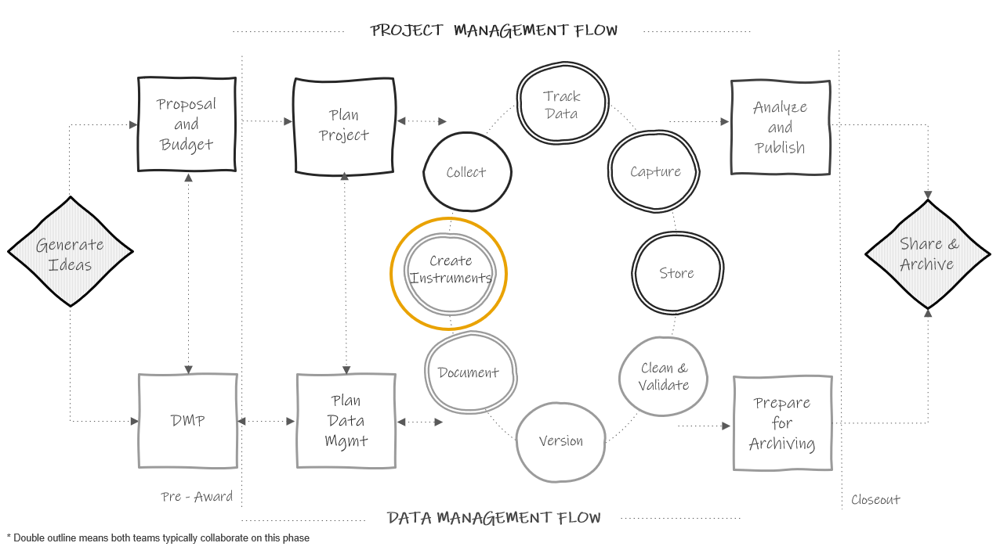

# Data Tracking {#track}

```{r fig.cap="Data documentation in the research project life cycle", out.width = "70%"}



```


## Why track data?

## Build a system

## Creating participant IDs {#ids}

## When to build it, who builds it, tools to build it in
