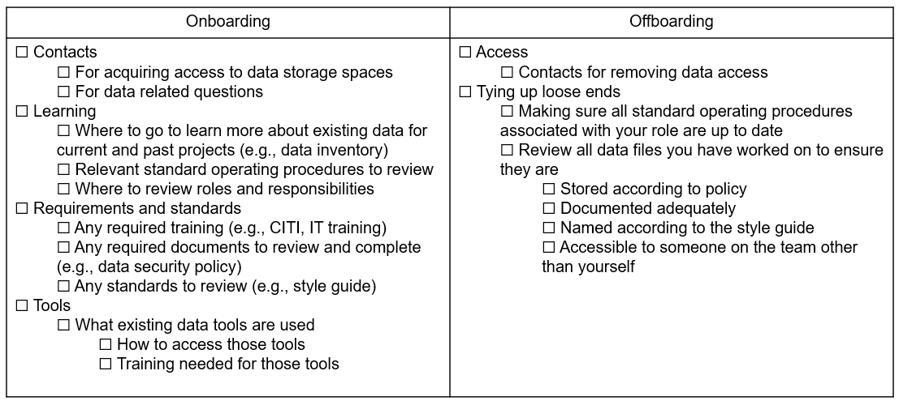
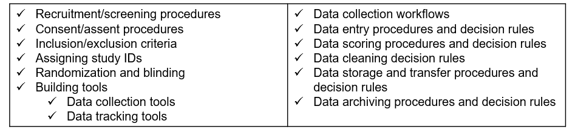
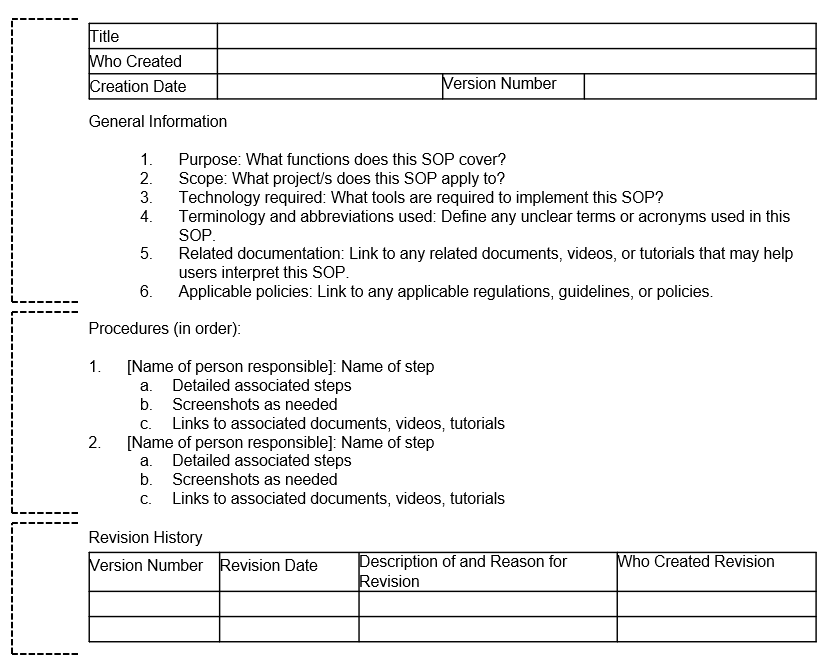
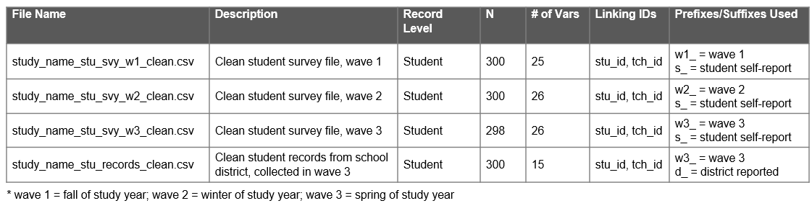
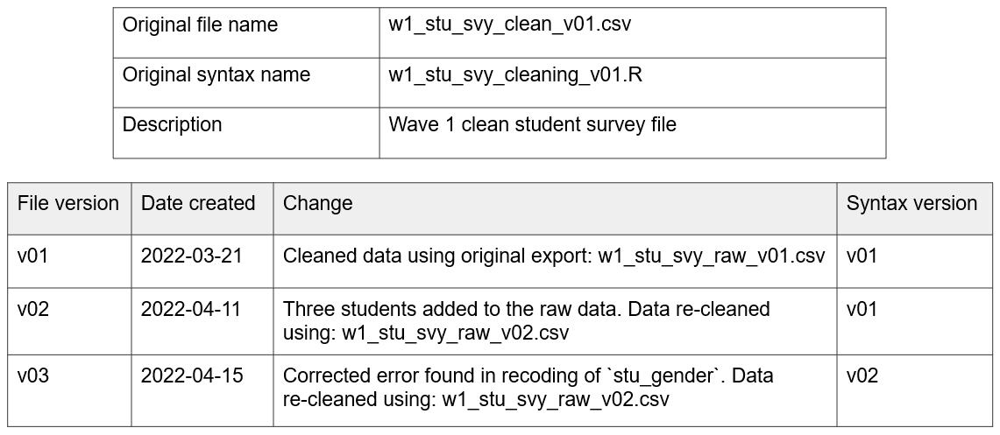
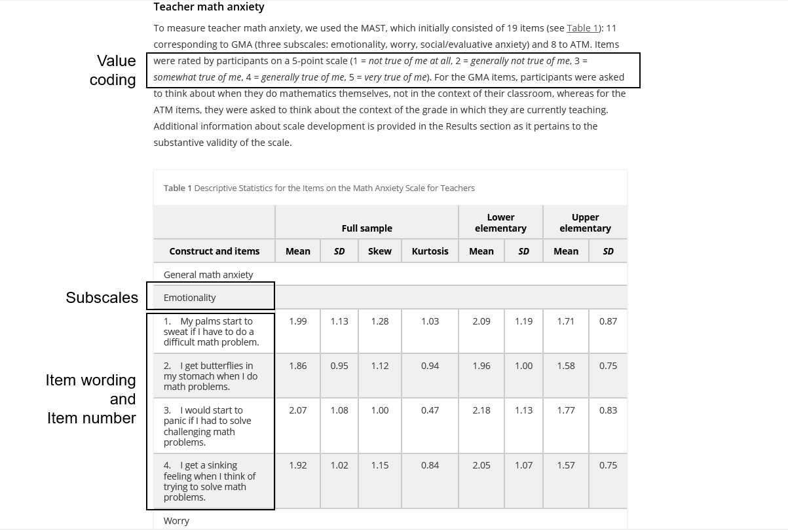
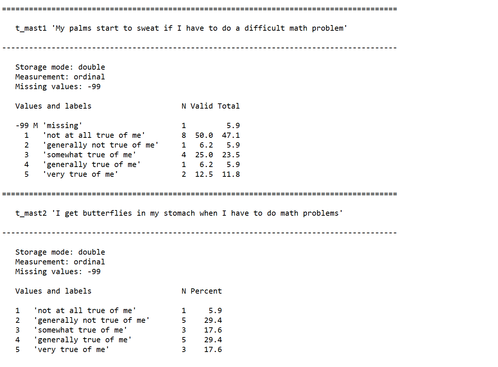
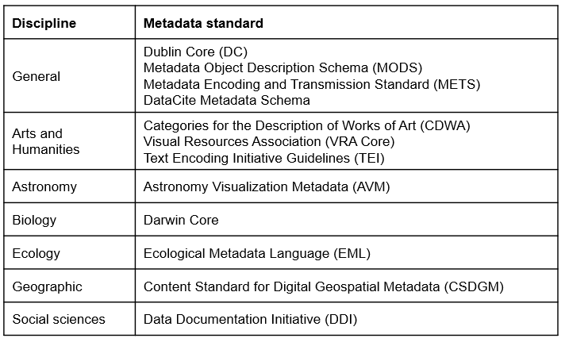

# Documentation {#document}

```{r fig8-1, fig.cap="Data documentation in the research project life cycle."}

knitr::include_graphics("img/fig8-1.PNG")

```

Documentation is a collection of files containing procedural and descriptive information about your team, project, workflows, and data. Creating thorough documentation during your study is equally as important as collecting your data. Documentation serves many purposes including:

- Standardizing procedures
- Strategic planning
- Securing data and protecting confidentiality
- Tracking data provenance
- Discovering errors
- Enabling reproducibility
- Ensuring others use and interpret data accurately
- Providing searchability through metadata

This chapter will cover four levels of documentation: Team-level, project-level, dataset-level, and variable-level. Even though we are currently discussing the documentation phase, some of these documents will be created earlier or later than this phase, and the timing will be discussed in each section. During a project, while you are actively using your documents, the format of these documents does not matter. Choose a human-readable format that works well for your team (Word, PDF, TXT, Google Doc, XLSX, HTML, OneNote, etc.). With that said, you will want to have a long-term plan for converting these documents, as needed, into formats that are both interoperable and sustainable for archiving and sharing (see Chapter \@ref(store-long) for more information).

The documents below are all recommended and will help you successfully run your project. You can create as many or as few of these documents as you wish. The documents you choose to produce should be based on what is best for your project and your team, as well as what is required by your funder and other governing bodies. No matter which documents you choose to implement, it is important to create templates for your documents and implement them consistently within, and even across projects. Creating documentation using templates, or consistent formats and fields, reduces duplication in efforts (no need to reinvent the wheel) and allows your team to interpret documents more easily. These documents are best created by the team member who directly oversees the process, and sometimes that may include a collaborative effort (for example, both a project coordinator and a data manager may build documents together). Ultimately, though, all your documents should be reviewed with your data management working group (DMWG) in order to gather feedback and reach consensus (see Chapter \@ref(plan)). 

Each type of documentation discussed below is a living document to be updated as procedures change, or new information is received. As seen in the cyclical section of Figure \@ref(fig:fig8-1), team members should revisit documentation each time new data is collected, or more often if needed, to ensure documentation still aligns with actual practices. If changes are made and not added to documentation over long periods of time, you will find that you no longer remember what happened and that information will be lost. It will also be important to version your documents (i.e., track major changes) along the way so that staff know that they are working with the most recent version and can see when and why documents have been updated. 

> **Note** <br> <br> 
Creating and maintaining these documents **is an investment**. However, the return on investment is well worth the effort. Make sure to account for this time and expertise in your proposal budget (see Section \@ref(dmp-budget)). 


## Team-level

Team-level data management documentation typically contains data governance rules that apply to the entire team, across all projects. While these documents can be amended any time, they should be started long before you apply for a grant, when your lab, center, or institution is formed (see Figure \@ref(fig:fig8-2)). 

```{r fig8-2, fig.cap="Team-level documentation in the research project life cycle."}

knitr::include_graphics("img/fig8-2.PNG")

```

### Lab manual

*When to create: Team document phase*

A lab manual, or team handbook, creates common knowledge across your team [@mehr_how_2020]. It provides staff with consistent information about lab culture---how the team works and why they do the things they do. It also sets expectations, provides guidelines, and can even be a place for passing along career advice [@aczel_crowdsourced_2023; @the_turing_way_community_turing_2022]. While a lab manual will primarily consist of administrative, procedural, and interpersonal types of information, it can be helpful to include data management content, including general rules about accessing, storing, sharing, and working with data securely and ethically. 

**Templates and resources**

|Source|Resource|
|--------|-----------|
|Balazs Aczel, et al.| Crowdsourced lab manual template ^[https://docs.google.com/document/d/1LqGdtHg0dMbj9lsCnC1QOoWzIsnSNRTSek6i3Kls2Ik]|
|Hao Ye, et al.| Crowdsourced list of public lab manuals ^[https://docs.google.com/spreadsheets/d/1kn4A0nR4loUOSDn9Qysd3MqFJ9cGU91dCDM6x9aga-8]|
|Samuel Mehr |Common Topics in Lab Handbooks ^[https://www.rsb.org.uk/images/biologist/2020/Apr_May_2020_67-2/67.2_Handbook.pdf]|


### Wiki {#wiki}

*When to create: Team document phase, planning data management phase*

A wiki is a webpage that allows users to collaboratively edit and manage content (Figure \@ref(fig:fig8-3)). It can either be created alongside the lab manual or as an alternative to the lab manual. Wikis can be built and housed in many tools (e.g., SharePoint, Teams, Notion, GitHub). While some lab wikis are public, most are not and can be restricted to invited users only. Wikis are a great way to keep disparate documents and pieces of information, for both administrative and data related purposes, organized in a central, accessible location. Your wiki can include links to important documents and policies, or you can also add text directly to the wiki to describe certain procedures. Rather than sending team members to multiple different folders for frequently requested information, you can refer them to your one wiki page.

```{r fig8-3, fig.cap="Example team wiki with links to frequently requested information."}

knitr::include_graphics("img/fig8-3.PNG")

```

> **Note** <br> <br>
Project-level wikis can also be created and are useful in centralizing frequently referenced information pertaining to specific projects.

**Templates and resources**

|Source|Resource|
|--------|-----------|
|Aly Lab| Example public lab wiki^[https://osf.io/mdh87/wiki/home/]|
|Notion|How to build a wiki for your company^[https://www.notion.so/help/guides/how-to-build-a-wiki-for-your-company]|
|SYNC Lab| Example public lab wiki^[https://eur-synclab.github.io/]|


### Onboarding and offboarding

*When to create: Team document phase*

While an **onboarding** checklist will mainly consist of non-data related, administrative information such as how to sign up for an email or how to get set up on your laptop, it should also contain several data-specific pieces of information to get staff generally acclimated to working with data in their new role. This ensures that everyone is receiving consistent information about data practices and standards [@briney_foundational_2020].
  
Similarly, while an **offboarding** checklist will contain a lot of procedural information about returning equipment and handing off tasks, it should also contain information specific to data management and documentation that help maintain data integrity and security.

Data-related topics to consider adding to your onboarding and offboarding checklists are included in Figure \@ref(fig:fig8-4).

```{r fig8-4, fig.cap="Sample data topics to add to onboarding and offboarding checklists"}



```

**Template and resources**

|Source|Resource|
|--------|-----------|
|Crystal Lewis | Sample data topics to add to an onboarding checklist^[https://osf.io/yzsc8]|
|Crystal Lewis | Sample data topics to add to an offboarding checklist^[https://osf.io/h4kwf]|

### Data inventory {#document-inventory}

*When to create: Team document phase, prepare for archiving phase*

A data inventory maps all datasets collected by the research team across all projects [@salfen_building_2018; @van_den_eynden_managing_2011] (Figure \@ref(fig:fig8-5)). As a team grows, the number of datasets typically expands as well. It can be very helpful to keep an inventory of what datasets are available for team members to use, as well as details about those datasets. Types of information to share in a data inventory include:

-   Project associated with each dataset
-   Dates that each dataset was collected
-   Details about each dataset (what the dataset contains, how it is organized, what questions can be answered with the data)
-   How datasets are related
-   Links to relevant documentation
-   Storage location of each dataset or who to contact for access

```{r fig8-5, fig.cap="Example data inventory document."}

knitr::include_graphics("img/fig8-5.PNG")

```

### Team data security policy {#document-security}

*When to create: Team document phase*

A team-level data security policy is a set of formal guidelines for working with data within an organization. While this policy may draw from information in broader institutional data security policies, this team-level policy is written specifically for your group and should broadly cover how team members are allowed to work with data in a way that protects research participant privacy, ensures quality control, and adheres to legal, ethical, and technical guidelines. Documenting this information ensures a cohesive understanding among team members regarding the terms and conditions of project data use [@cessda_training_team_cessda_2017]. A data security policy can be added to a lab manual, or created as a separate document where team members can even sign [@filip_san_2023] or check a box acknowledging that they have read and understand the policy.

Ideas of content to include in a team-level data security policy are included in Figure \@ref(fig:fig8-6).

```{r fig8-6, fig.cap="Example of content to include in a team data security policy."}

knitr::include_graphics("img/fig8-6.PNG")

```

**Templates and resources**

|Source|Resource|
|--------|-----------|
|Crystal Lewis | Data security policy template ^[https://osf.io/6rgfd]|
|SYNC Lab | Data security protocol ^[https://eur-synclab.github.io/data-management/data-security.html#data-security-protocol]|
|University of Nebraska-Lincoln|Research data and security checklist ^[https://uofnelincoln.sharepoint.com/:b:/s/ResearchComplianceServicesSharepoint/Ebr9awmFio1Mj3PTgb-GnSIBoS7xSua7uT-jePT2qtGTlw?e=RbRs50]

### Style guide

*When to create: Team document phase, planning data management phase*

A style guide is a set of standards for the formatting of information. It improves consistency and creates a shared understanding within and across files and projects. This document includes conventions for procedures such as variable naming, variable value coding, file naming, file structure, and even coding practices. It can be created in one large document or separate files for each type of procedure. I highly recommend applying your style guide consistently across all projects which is why this is included in the team documentation. Since style guides are so important, and there are many recommended practices to cover, I have given this document its own chapter. See Chapter \@ref(style) for more information.

**Templates and resources**

|Source|Resource|
|--------|-----------|
|Hadley Wickham | Example R coding style guide^[https://style.tidyverse.org/]|
|Strategic Data Project| Example style guide^[https://hwpi.harvard.edu/files/sdp/files/sdp-toolkit-coding-style-guide.pdf]|


## Project-level

Project-level documentation is where all descriptive information about your project is contained, as well as any planning decisions and process documentation specifically related to your project. 

### Data management plan

*When to create: DMP phase*

As discussed in Chapter \@ref(dmp), if your project is federally funded it is likely that a data management plan is required. This project-level summary document is created in the DMP phase, long before a project begins. However, your DMP can continue to be modified throughout your entire study. If any major changes are made, it may be helpful to reach out to your program officer to keep them in the loop as well.

### Data sources catalog {#document-catalog}

*When to create: DMP phase*

Also, as reviewed in Section \@ref(dmp-catalog), a data sources catalog is an excellent project planning tool that should be developed early on during the DMP phase. This spreadsheet helps you succinctly summarize the data sources you will collect for your project, as well as plan the details of how data will be collected, managed, and shared. This document serves as a referral source for the remaining planning phases of your project and should be updated as needed.

### Checklists and meeting notes

*When to create: DMP phase, planning data management phase*

Checklists, as discussed in Section \@ref(plan-checklist), are documents that are created, or copied from existing templates, and reviewed during the planning phase. Using checklists facilitates discussion and allows your team to build a cohesive understanding for how data will be managed throughout your entire project. As you work through the checklists, all decisions made should be documented in meeting notes. Consider creating and using a template to standardize the flow of your meeting notes across the various team members who may take notes. 

Example meeting notes template.

```
Date: YYYY-MM-DD

Attendees: Name1, Name2, Name3

Agenda Items:

  1. Topic 1
  2. Topic 2
  3. Topic 3

Action Items:

  Name1: 
    - Tasks
  Name2: 
    - Tasks
  Name3: 
    - Tasks

```

All meeting notes should be stored in a central location where team members can reference them as needed (e.g., a planning folder with notes ordered by date, a running document linked on a project wiki page). After the planning phase is complete, any decisions should be formally documented in applicable team-, project-, data-, or variable-level documents (e.g., research protocol, SOPs, style guide, or roles and responsibilities documents). Even beyond the planning phase, though, all meeting decisions and discussions should continue to be documented in meeting notes and used to update formal documentation as needed.

### Roles and responsibilities document

*When to create: DMP phase, planning data management phase*

Using the checklists reviewed during the DMP and planning phase, your team should begin assigning roles and responsibilities for your project. Those designations should be formally documented and shared with the team. In Chapter \@ref(roles) we reviewed ways to structure this document. Once this document is created, make sure to store it in a central location for easy referral and update the document as needed.

**Templates and resources**

|Source|Resource|
|--------|-----------|
|Crystal Lewis | Roles and responsibilities template organized by phase in wide format^[https://osf.io/5n2ke]|
|Crystal Lewis | Roles and responsibilities template organized by role^[https://osf.io/3yp7x]|


### Research protocol {#document-protocol}

*When to create: Documentation phase*

The research protocol is a comprehensive project plan that describes the what, who, when, where, and how of your study. Many of the decisions made while writing your data management plan and reviewing your planning checklists will be summarized in this document. If you are submitting your study to an Institutional Review Board, you will most likely be required to submit this document as part of your application. A research protocol assists the board in determining if your methods provide adequate protection for human subjects. In addition to serving this required purpose, the research protocol is also an excellent document to share along with your data at the time of data sharing, and an excellent resource for you when writing technical reports or manuscripts. This document provides the context needed for you and others to effectively interpret and use your data. Make sure to follow your institution's specific template if provided, but items commonly included in a protocol are shown in Figure \@ref(fig:fig8-7).

```{r fig8-7, fig.cap="Common research protocol elements."}

knitr::include_graphics("img/fig8-7.PNG")

```

When it comes time to deposit your data in a repository, the protocol can be revised to contain information helpful for a data end user, such as known limitations in the data. Content such as risks and benefits to participants might be removed, and numbers such as study sample count should be updated to show your final numbers. Additional supplemental information can also be added as needed (see Section \@ref(document-supplement)).

**Templates and resources**

|Source|Resource|
|--------|-----------|
|Crystal Lewis|A template to create a project-level summary document for data sharing (based on an IRB research protocol)^[https://osf.io/q6g8d]|
|Jeffrey Shero, Sara Hart|IRB protocol template with a focus on data sharing^[https://figshare.com/articles/preprint/IRB_Protocol_Template/13218797]|
|The Ohio State University| Protocol template^[http://orrp.osu.edu/files/2011/10/GuidelinesforWritingaResearchProtocol.pdf]|
|University of Missouri| Protocol template^[https://docs.research.missouri.edu/human_subjects/templates/Social_Behavioral_Educational_Protocol_Template.docx]|
|University of Washington| Protocol checklist^[https://depts.washington.edu/wildfire/resources/protckl.pdf]|

### Supplemental documents {#document-supplement}

While these documents can absolutely stand alone, I am calling these supplemental documents because they can also be added to your research protocol, at any point, as an addendum to further clarify specifics of your project.

1. Timeline

*When to create: Planning data management phase*

The first supplemental document that I highly recommend creating is a visual representation of your data collection timeline. When you first create a timeline, it will be based on your best estimate of the time it will take to complete milestones, but like all documents we've discussed, it can be updated as you learn more about the reality of the workload. This document can be both a helpful planning tool (for both project and data teams) in preparing for times of heavier and lighter workloads, as well as an excellent document to share with future data users to better understand waves of data collection. There is no one format for how to create this document. Figure \@ref(fig:fig8-8) is an example of one way to visualize a data collection timeline.

```{r fig8-8, fig.cap="Example data collection timeline."}

knitr::include_graphics("img/fig8-8.PNG")

```

2. Participant flow diagram

*When to create: After data collection*

A participant flow diagram displays the movement of participants through a study, assisting researchers in better understanding milestones such as eligibility, enrollment, and final sample counts. As seen in Figure \@ref(fig:fig8-9), these diagrams are helpful for assessing study attrition and reasons for missing data can be described in the diagram. In randomized controlled trial studies, these visualizations are more formally referred to as CONSORT (Consolidated Standards of Reporting Trials) diagrams [@schulz_consort_2010]. They provide a means to understand how participants are randomized and assigned to treatment groups. As you can imagine, though, this diagram cannot be started until participants are recruited and enrolled, and it must be updated as each wave of data is collected. Your participant tracking database, which we will discuss in Chapter \@ref(track), will inform the creation of this diagram.

```{r fig8-9, fig.cap="Example participant flow diagram."}

knitr::include_graphics("img/fig8-9.PNG")

```

3. Instruments

*When to create: Create instruments phase*

Unless a form is proprietary, actual copies of instruments can be included as supplemental documentation. This includes copies of surveys, assessments, and other forms. It can also include any technical documents associated with your instruments or measures (i.e., a technical document for an assessment or a publication associated with a measure you used). Sometimes researchers will annotate instruments to show how items were named or coded.

4. Flowchart of data collection instruments

*When to create: Create instruments phase*

You can also include flowcharts of how participants are provided or assigned to different instruments or screeners to help users better understand issues such as missing data (see Figure \@ref(fig:fig8-10)).

```{r fig8-10, fig.cap="Example instrument decision making flowchart."}

knitr::include_graphics("img/fig8-10.PNG")

```

5. Consent forms

*When to create: Create instruments phase*

Informed consent forms (see Section \@ref(collect-irb)) can also be added as an addendum to research protocols to give further insight into what information was provided to study participants.

### Standard operating procedures {#document-sop}

*When to create: Documentation phase*

While the research protocol provides summary information for all decisions and procedures associated with a project, we still need documents to inform how the procedures are actually implemented on a daily basis [@nucats_standard_2023]. Standard operating procedures (SOPs) provide a set of detailed instructions for routine tasks and decision-making processes. If you recall from Chapter \@ref(plan), every step we added to a data collection workflow is then added to an SOP, and the details fleshed out. Not only will you have an SOP for each source of data you are collecting (i.e., teacher survey, student assessments, teacher observation), you should also have SOPs for any other decisions or processes that need to be repeated in a reproducible manner or followed in a specific way to maintain compliance [@hollmann_ten_2020]. Many of the decisions laid out in your protocol will be further detailed in an SOP. Examples of data management procedures to include in an SOP are provided in Figure \@ref(fig:fig8-11). Additional project management tasks such as recruitment procedures, personnel training, data collection scheduling, or in-field data collection routines, should also be documented in SOPs, ensuring fidelity of implementation for all project procedures.

```{r fig8-11, fig.cap="Examples of data management SOPs to create."}



```

In addition to giving staff instruction on how to perform tasks, SOPs also create transparency in practices, allow for continuity when staff turnover or go out on leave, create standardization in procedures, and last, because an SOP should include versioning information, they allow you to accurately report changes in procedures throughout the project. You will want to create a template that is used consistently across all procedures, by all staff who build SOPs (see Figure \@ref(fig:fig8-12) for an example). 

```{r fig8-12, fig.cap="Standard operating procedure minimal template."}



```

In developing your SOP template, you should begin with **general information** about the scope and purpose of the procedure, as well as any relevant tools, terminology, or documentation. This provides context for the user and gives them the background to use and interpret the SOP. The next section in the SOP template, **procedures**, lists all steps in order. Each step provides the name of the staff member/s associated with that activity to ensure no ambiguity. Each step should be as detailed as possible so that you could hand your SOP over to any new staff member, with no background in this process, and be confident they can implement the procedure with little trouble. Specifics such as names of files and links to their locations, names of contacts, or methods of communication (e.g., email vs instant message) should be included. Additions such as screenshots, links to other SOPs or workflow diagrams, or even links to online tutorials or staff-created how-to videos can also be embedded. Last, any time revisions are made to the SOP, clarifying information about the update is added to the **revision** section and a new version of the SOP is saved (see Section 9.3 for ideas on how to version a file name). This allows you to keep track of what changes were made over time, including when they were made and who made them. 

**Templates and resources**

|Source|Resource|
|--------|-----------|
|Crystal Lewis|SOP template^[https://osf.io/yq3np]|


## Dataset-level {#document-dataset}

Dataset-level documentation applies solely to your datasets and includes information about what they contain and how they are related. It also captures things such as planned transformations, potential issues to be aware of, and any alterations made to the data. In addition to being helpful descriptive information, a huge reason for creating dataset documentation is authenticity. Datasets go through many iterations of processing which can result in multiple versions of a dataset [@cessda_training_team_cessda_2017; @uk_data_service_research_2023]. Preserving data lineage by tracking transformations and errors found is key to ensuring that you know where your data come from, what processing has already been completed, and that you are using the correct version of the data. 

### Readme {#document-read}

*When to create: At any time they are useful*

A README is a plain text document that contains information about your files. These stem from the field of computer science but are now prevalent in the research world. These documents are a way to convey pertinent information to collaborators in a simple, no-frills manner. READMEs can be used in many different ways, but I will cover three ways they are often used in data management.

1. For conveying information to your colleagues
    - Imagine a scenario where a study participant reaches out to a project coordinator to let them know that they entered the incorrect ID in their survey. When the project coordinator downloads the raw data file to be cleaned by the data manager, they also create a file named "readme.txt" that contains this information and it is saved alongside the data file in the raw data folder. Now, when the data manager goes to retrieve the data file, they will see that a README is included and know to review that document first.

Example README used to convey information about a file

```
  - ID 5051 entered incorrectly. Should be 5015.
  - ID 5089 completed the survey twice
    - First survey is only partially completed
```
  
2. For conveying steps in a process (sometimes also called a setup file)
    - There may be times that a specific data pipeline or reporting process requires multiple steps, opening different files and running different scripts. This information could go in an SOP, but if it is a programmatic-type process, completed using a series of scripts, it might be easiest to put a simple file named "readme_setup.txt" in the same folder as your scripts so that someone can easily open the file to see what they need to run.

Example README used to convey information about steps in a process

```
  Step 1: Run the file 01_clean_data.R to clean the data  
  Step 2: Run the file 02_check_errors.R to check for errors  
  Step 3: Run the file 03_run_report.R to create report 
```

3. For providing information about a set of files in a directory
    - It can be helpful to add README to the top of your directories when both sharing data internally with colleagues, or when sharing files in an external repository. Doing so can provide information about what datasets are available in the directory and pertinent information about those datasets. This README can include things like a description of the files, how the datasets are related and can be linked, information associated with different versions, definitions of common prefixes, suffixes, or acronyms used in datasets, or instrument response rates. Figure \@ref(fig:fig8-13) is an example README that can be used to describe all data sources shared in a project repository. 

```{r fig8-13, fig.cap="Example README for conveying information about files in a directory."}



```

**Templates and resources**

|Source|Resource|
|--------|-----------|
|Crystal Lewis | README template for sharing information about a set of files in a directory^[https://osf.io/tk4cb]|
|Crystal Lewis| README template for sharing project-level information^[https://osf.io/d3pum]|

### Changelog {#document-change}

*When to create: Version phase*

After a dataset has been collected, cleaned, and finalized, it is not uncommon to revise that file again at a later point due to errors found, or the addition of new data. However, rather than saving over previous files, it is important to use version control. Version control is a method of recording changes to a file in a way that allows you to track revision history and revert back to previous versions of a file as needed [@briney_data_2015; @the_turing_way_community_turing_2022]. While there are automatic ways to track updates to your files through version control programs such as Git, this may not always fit into an education research workflow. Institution-approved storage locations, such as Box or SharePoint, also often have versioning capabilities. These programs save copies of your files at different points in time, allowing you to go back to previous versions. However, unless users are able to add contextual messages about changes made when saving versions (e.g., a commit message with Git), users will want to manually version their files.

Manual version control involves a two-step process. First, add a version indicator to file names (see Section \@ref(style-file) for ideas on how to version a file name). When a file is revised, a copy is saved and the indicator is updated. Second, a description of the change is recorded in a changelog---a historical record of all major file changes [@uk_data_service_research_2023; @wilson_good_2017] (see Figure \@ref(fig:fig8-14)). 

Manually versioning file names and keeping an up to date changelog serves many purposes. First, it supports reproducibility. If a file is used for analysis but then that file is saved over with a new version, the original findings from that analysis can no longer be reproduced [@the_turing_way_community_turing_2022]. Version control also reduces data rot [@henry_data_2021] by providing data lineage, allowing a user to understand where the data originated as well as all transformations made to the data. Last, it supports data confidence, allowing a user to understand what version of the data they are currently using, and to decide if they should be using a more recently created version of the file.

In its simplest form a changelog should contain the following [@schmitt_data_2011]:

  - The file name
  - The date the file was created
  - A description of the dataset (including what changes were made compared to the previous version)
  
It can also be helpful to record additional information such as who made the change and a link to any code used to transform the data [@cessda_training_team_cessda_2017].

```{r fig8-14, fig.cap="Example changelog for a clean student survey data file."}



```

**Templates and resources**

|Source|Resource|
|--------|-----------|
|Crystal Lewis| Changelog template^[https://osf.io/trw6b]|


### Data cleaning plan {#document-plan}

*When to create: Documentation phase*

A data cleaning plan is a written proposal outlining how you plan to transform your raw data into clean, usable data. This document contains no code and is not technical skills dependent. A data cleaning plan is created for each dataset listed in your data sources catalog (see Section \@ref(document-catalog)). Since this document lays out your intended transformations for each raw dataset, it allows any team member to provide feedback on the data cleaning process. 

This document can be started in the documentation phase, but will most likely continue to be updated throughout the study. Typically, the person responsible for cleaning the data will write the data cleaning plans, but the documents can then be brought to a planning meeting allowing your DMWG to provide input on the plan. This ensures that everyone agrees on the transformations to be performed. Once finalized, this data cleaning plan serves as a guide in the cleaning process. In addition to the changelog, this data cleaning plan (as well as any syntax used and a changelog) provides all documentation necessary to assess data provenance, a historical record of a data file's journey. 

A data cleaning plan should be based on agreed-upon norms for what constitutes a clean dataset to help ensure that all datasets are cleaned and formatted consistently (see Section \@ref(clean-criteria)). These norms can be operationalized into a checklist of transformations that can inform your data cleaning plan, along with your data dictionary and other relevant documentation. We will review what types of transformations you should consider adding to your data cleaning plan in Section \@ref(clean-check). 

An example of a simple data cleaning plan for a student survey file.

```
1. Import raw data
2. Review data (rows and columns)
3. Remove duplicate cases if they exist (using rules from applicable SOP and README)
4. De-identify data (bring in study IDs and remove names)
5. Rename variables based on data dictionary
6. Fix variable types as needed
7. Reverse code anx1, anx2, anx3
8. Calculate anx_mean
9. Merge in treatment and tch_id variables from roster file
10. Add missing value codes
11. Add variable and value labels based on data dictionary
12. Run final data validation checks
13. Export data as an SPSS file

```

## Variable-level

When we think about data management, I think this is most likely the first type of documentation that pops into people's minds. Variable-level documentation tells us all pertinent information about the variables in our datasets: Variable names, descriptions, types, and allowable values. While this documentation is often used to interpret existing datasets, it can also serve many other vital purposes including guiding the construction of data collection instruments, assisting in data cleaning, or validating the accuracy of data. We will discuss this more throughout the chapters in this book.

### Data dictionary {#document-dictionary}

*When to create: Documentation phase, sometimes the data capture phase for external datasets*

A data dictionary is a rectangular formatted collection of names, definitions, and attributes about variables in a dataset [@gonzales_ten_2022; @uc_merced_library_what_2023]. This document is most useful if created during the documentation phase and used throughout a study for both planning and interpretation purposes (see Figure \@ref(fig:fig8-15)) [@lewis_using_2022; @van_bochove_data_2023]. 

```{r fig8-15, fig.cap="The many uses for a data dictionary"}

knitr::include_graphics("img/fig8-15.PNG")

```

A data dictionary is typically structured so that each row corresponds to a variable in your dataset, and each column represents a field of information about that variable [@broman_data_2018; @grynoch_resource_2024]. There are several necessary fields to include in a data dictionary, as well as several optional fields (see Table \@ref(tab:tab8-1)).

<br>

```{r tab8-1}

library(tidyverse)

tibble::tribble (~"Fields to Include", ~"Optional Fields to Include",
                "Variable name", "Skip patterns",
                 "Variable label (what is this item)", "Required item (were participants allowed to skip this item)",
                 "Variable type/format", "Variable universe (who received this item)",
                 "Allowable values/range (including labels associated with categorical codes)", "Notes (such as versions/changes to the variable)",
                 "Assigned missing values" , "Associated scale/subscale",
                "Transformations", "Time periods this item is available (if study is longitudinal)",
                "Variable origin (primary/derived)", "Item order",
                "", "Remove item (should this item be removed before publicly sharing data)") %>%
  knitr::kable(caption = "Fields to include in a data dictionary")
  
```


You should build one data dictionary for each instrument you plan to collect, including both original data collection instruments and external data sources (e.g., student education records). If there are five data sources in your data sources catalog, you should end up with five data dictionaries. 

#### Creating a data dictionary for an original data source {#document-original}

When you are collecting original data, there are a few things that are helpful to have when creating your data dictionaries: 

1. Your data sources catalog
    - This document (see Section \@ref(document-catalog)) will provide you an overview of all the data sources you plan to collect for your project, including what measures make up each instrument.
2. Your style guide
    - We will talk more about style guides in Chapter \@ref(style), but this document will provide team or project standards for naming variables and coding response values.  
3. Documentation for your measures
    - You will need a draft of all items that will be included in your instrument
      - If you are collecting data using existing measures (i.e., existing scales, existing standardized assessments), you will want to collect any documentation on those measures, such as technical documents or copies of instruments. 
        - You will want your documentation to provide information such as:  
          - What items are included in the measure? What is the exact wording of the items?  
          - How are items divided by subscales?
          - How are items coded? What are allowable values? 
          - Are there any calculations/scoring/reverse coding needed? 
          - If items are entered into a scoring program and then exported, what variables are exported?
        - See Figure \@ref(fig:fig8-16) for an example of the information that could be pulled from a publication if you were using the Math Anxiety Scale for Teachers (MAST)
 [@ganley_construct_2019].
      - If you have used any items in former projects, also pull data dictionaries from previous projects as it can be helpful to collect data consistently across projects
4. Any data element standards that you plan to use [@uc_merced_library_what_2023]
    - See Section \@ref(collect-design) for an overview of existing data element standards

```{r fig8-16, fig.cap="Pulling relevant information for the Math Anxiety Scale for Teachers (MAST)."}



```

All measures/items for each instrument will be included in the data dictionary. As you build your data dictionaries, consider the following:

  - Item names
    - Are your variable names meeting the requirements laid out in your style guide?
    - If you have used an item before, how was it named in the previous project?
    - Are there any field standards that dictate how an item should be named?
  - Item wording
    - If your items come from an existing scale, does the item wording match the wording in the scale documentation? Do you plan to reword the item?
    - If you have used an item before, how was it worded in the previous project?
    - Are there any field standards that dictate how an item should be worded?
  - Item value codes for categorical items
    - If your items come from an existing scale, does your value coding (the numeric values assigned to your categorical response options) align with the coding laid out in the scale documentation? 
    - If your items do not come from an existing scale, does your value coding align with the requirements in your style guide? 
    - If you have used an item before, how was it coded in the previous project?
    - Are there any field standards that dictate how an item's values should be coded?
  - What additional items will make up your final dataset? Consider items that will be derived, collected through metadata, or added in. All of these should be included in your data dictionary. 
    - Unique study identifiers (see Section \@ref(structure-database))
      - Primary keys (e.g., `stu_id`, `rater_id`)
      - Foreign keys as needed (e.g., `tch_id` in a student file)
    - Grouping variables (e.g., `treatment`, `cohort`, `cluster`, `block`)
    - Time component (e.g., `wave`, `time`, `year`, `session`)
    - Derived variables
      - This includes both variables your team derives (e.g., `mean scores`, `reverse coded variables`, `variable checks`) as well as variables derived from any scoring programs (e.g., `percentile ranks`, `standard scores`)
        - When describing how these variables will be calculated, make sure to account for anomalies such as calculating scores with missing data
    - Metadata (Variables that your tool collects such as `IP Address`, `completion`, `language`)
  - What items should be removed before public data sharing (i.e., personally identifiable information)?

Figure \@ref(fig:fig8-17) provides an example of simplified teacher survey data dictionary, including items from the MAST scale [@ganley_construct_2019]. 

```{r fig8-17, fig.cap="Example teacher survey data dictionary."}

knitr::include_graphics("img/fig8-17.PNG")

```

The last step of creating your data dictionary, is to review the document with your team. Gather your DMWG and review the following types of questions:

  - Is everyone in agreement about how variables are named, acceptable variable ranges, how values are coded, and the variable types and formats? 
  - Is everyone in agreement about which participants receive each item (e.g., everyone or only a specific group)?  
  - Does the team want to adjust any of the item wordings? 
  - Does the data dictionary include everything the team plans to collect? Are any items missing?
      - If additional items are added to instruments at later points in a longitudinal collection, adding fields to your data dictionary, such as `time periods available`, can be really helpful to future users in understanding why some items may be missing data at certain time points.
  - Does the dictionary include all the variables you plan to derive? (i.e., either derived by your team, or by an external scoring system)? 

#### Creating a data dictionary from an existing data source {#document-extant}

Not all research study data will be gathered through original data collection methods. You may be capturing supplemental external data sources from organizations like school districts or state departments of education. If at all possible, start gathering information about your external data sources early on, during the planning and documentation phases, and begin adding that information into a data dictionary. Starting this process early will help you prepare for future data capture and cleaning processes.

- If the data source is public, you may be able to easily find codebooks or data dictionaries for the data source. If not, download a sample of the data to learn what variables exist in the source and how they are formatted. 
- If the data source is non-public, request documentation ahead of time from your partner (see Section \@ref(capture-extant)).

However, it is possible that you may not be able to access this information until you acquire the actual data during the data capture phase. If documentation is provided along with the data, begin reviewing the data to ensure that the documentation matches what you see in the data. Integrate that information into your project data dictionary.

If documentation is not provided it is important to review the data and begin collecting questions that will allow you to build your data dictionary. 

1. What do these variables represent? 
    - What was the wording of these items?
2. Who were the items collected from (e.g., was it only students in a specific grade level)?
3. What do these values represent? 
    - Am I seeing the full range of values/categorical options for each item? Or was the range larger than what I am seeing?
    - Do I have values in my data that don't make sense for an item (e.g., a 999 or 0 in an age variable)?
4. What data types are the items currently? What types should they be?

In most situations these questions will not be easily answered without documentation and may require further detective work.

- Contact the person who originally collected the data to learn more about the instrument or data collection process. 
- Contact the person who cleaned the data (if cleaned) to see what transformations they completed on the raw data.  
- If applicable, request access to the original instruments to review exact question wording, item response options, skip patterns, etc.

Ultimately you should end up with a data dictionary structured similarly to Figure \@ref(fig:fig8-17). You may add additional fields that help you keep track of further changes (e.g., a column for the old variable name and a column for your new variable name), and your transformations section may become more verbose as the values assigned previously may not align with the values you prefer based on your style guide or the original measures. Otherwise, the data dictionary should still be constructed in the same manner mentioned in Section \@ref(document-original).

#### Time well spent

The process described in this section is a manual, time consuming process. This is intentional. Building your data dictionary is an information seeking journey where you take time to understand your dataset, standardize items, and plan for data transformations. Spending time manually creating this document before collecting data prevents many potential errors and time lost fixing data in the future. While there are absolutely ways you can automate the creation of a data dictionary using an existing dataset, the only time I can imagine that being useful is when you have a clean dataset that you have confidently already verified is accurate and ready to be shared. However, as mentioned before, a data dictionary is so much more than a document to be shared alongside a public dataset. It is a tool for guiding many other processes in your research life cycle.

**Templates and Resources**

|Source|Resource|
|--------|-----------|
|Crystal Lewis|Data dictionary template^[https://osf.io/ynqcu]|


### Codebook {#document-codebook}

*When to create: Data cleaning and validation phase, prepare for archive phase*

Codebooks provide descriptive, variable-level information as well as univariate summary statistics which allows users to understand the contents of a dataset without ever opening it. Unlike a data dictionary, a codebook is created **after** your data is collected and cleaned, and its value lies in data interpretation and data validation. 

The codebook contains some information that overlaps with a data dictionary, but is more of a summary document of what actually exists in your dataset [@icpsr_guide_2011] (see Table \@ref(tab:tab8-2)).

<br>

```{r tab8-2}

library(tidyverse)

tibble::tribble (~"Overlapping Information", ~"New Information",
                "Variable name", "Existing values/ranges",
                 "Variable label", "Existing missing values",
                 "Variable type/format", "Summary statistics",
                 "Value labels", "Weighting") %>%
  knitr::kable(caption = "Codebook content that overlaps and is unique to a data dictionary")
  
```

In addition to being an excellent resource for users to review your data without ever opening the file [@university_of_iowa_libraries_metadata_2024], this document may also help you catch errors in your data if out of range or unexpected values appear. 

You can create separate codebooks per dataset or have them all contained in one document, linked through a table of contents. Unlike a data dictionary, which I recommend creating manually, a codebook should be created through an automated process. Automating codebooks will not only save you tons of time, but it will also reduce errors that are made in manual entry. You can use many tools to create codebooks, including point and click statistical programs such as SPSS, or with a little programming knowledge you can more flexibly design codebooks using programs like R or SAS. The R programming language in particular has many packages that will create and export codebooks in a variety of formats from your existing dataset. Figure \@ref(fig:fig8-18) is an example codebook created in R using the `memisc` package^[https://osf.io/d3tx4] [@elff_memisc_2023].

```{r fig8-18, fig.cap="Example teacher survey codebook content."}



```

Last, you may notice as you review codebooks created by other researchers, many start with several pages of text, usually containing information about the project. When it comes time to share their data, it's common for people to combine information from their research protocol or README files, into their codebooks, rather than sharing separate documents.

**Templates and resources**

|Source|Resource|
|--------|-----------|
|ICPSR | Guide to Codebooks^[https://www.icpsr.umich.edu/files/deposit/Guide-to-Codebooks_v1.pdf]|
|National Center for Health Statistics | Example codebook^[https://ftp.cdc.gov/pub/Health_Statistics/NCHS/Dataset_Documentation/NHIS/2020/adult-codebook.pdf]|

## Repository metadata {#document-metadata}

*When to create: Share and archive phase*

When it comes time to deposit a project or resource in a repository, you will submit two types of documentation, human-readable documentation, which includes any of the documents we've previously discussed, and metadata. Metadata, data about your data, is documentation that is meant to be processed by machines and serves the purpose of making your files searchable [@cessda_training_team_cessda_2017; @danish_national_forum_for_research_data_management_metadata_2023]. Metadata aids in the cataloging, citing, discovering, and retrieving of data and its creation is a critical step in creating FAIR data (see Section \@ref(rdm-fair)) [@logan_data_2021; @uk_data_service_research_2023 ; @wilkinson_fair_2016].

For the most part, no additional work is needed to create metadata when depositing your data in a repository. It will simply be created as part of the depositing process [@cessda_training_team_cessda_2017;@university_of_iowa_libraries_metadata_2024]. As you deposit your data, the repository may have you fill out a form. The details collected from this intake form are converted into both human- and machine-readable information (i.e., metadata). Figure \@ref(fig:fig8-19) is an example of a metadata form for OSF ([https://osf.io](https://osf.io)).

```{r fig8-19, fig.cap="Example metadata intake form for OSF."}

knitr::include_graphics("img/fig8-19.PNG")

```

These metadata forms typically contain descriptive (description of project and files), administrative (licensing and ownership as well as technical information), and structural (relationships between objects) metadata [@cofield_libguides_2023; @danish_national_forum_for_research_data_management_metadata_2023]. Commonly collected metadata elements [@dahdul_research_2023; @hayslett_libguides_2022] are shown in Table \@ref(tab:tab8-3).

<br>

```{r tab8-3}

library(tidyverse)

tibble::tribble (~"Element", ~"Description",
                "Title", "Name of the resource",
                 "Creator", "Names and institutions of the people who created the resource",
                 "Date", "Key dates associated with the resource",
                "Description", "Description of the resource",
                 "Keyword/subject", "Keywords describing the content of the resource",
                 "Type" , "Nature of your resource",
                "Language", "Language of the resource",
                "Identifier", "Unique identification code, such as a Digital Object Identifier (DOI), assigned to the resource, usually generated by the repository",
                "Coverage", "Geographic coverage",
                "Funding agencies", "Organization who funded the research",
                "Access restrictions", "Where and how your resource can be accessed by other researchers",
                "Copyright", "Copyright date and type",
                "Format", "What format is your resource in") %>%
  knitr::kable(caption = "Common metadata elements")
  
```

Depending on the repository, at minimum, you will enter basic project-level metadata similar to what is shown in Table \@ref(tab:tab8-3). However, you may be required, or have the option, to enter more comprehensive information, such as project-level information covered in your research protocol (e.g., setting and sample, study procedures). You may also have the option to enter additional levels of metadata that will help make each level more searchable, such as file-level or variable-level metadata [@gilmore_practical_2018; @icpsr_icpsr_2023; @ldbase_information_2023]. All the information needed for this metadata can be gathered from the documents we've discussed earlier in this chapter. 

There are other ways metadata can be gathered as well. For instance, for variable-level metadata, rather than having users input metadata, repositories may create metadata from the deposited statistical data files that contain embedded metadata (such as variable types or labels) or from deposited documentation such as data dictionaries or codebooks [@icpsr_icpsr_2023].

If your repository provides limited forms for metadata entry, you can also choose to increase the searchability of your files by creating your own machine-readable documents. There are several tools to help users create machine-readable codebooks and data dictionaries that will be findable through search engines such as Google Dataset Search [@arslan_how_2019; @buchanan_getting_2021;@usgs_tools_2021]. 

### Metadata standards {#metastandards}

Metadata standards, typically field specific, establish a common way to describe your data which improves data interoperability as well as the ability of users to find, understand, and use data. Metadata standards can be applied in several ways [@bolam_guides_2022; @cofield_libguides_2023]. 

1. Formats: What machine-readable format should metadata be in (e.g., XML, JSON)? 
2. Schema: What elements are recommended verses mandatory for project-, dataset-, and variable-level metadata?
3. Controlled vocabularies: A controlled list of terms used to index and retrieve data.

Many fields have chosen metadata standards to adhere to [@berry_guides_2022; @bolam_guides_2022] (see Figure \@ref(fig:fig8-20)). Some fields, like psychology [@kline_technical_2018], are developing their own metadata standards, including formats, schemas, and vocabularies grounded in the FAIR principles and the Schema.org schema [@schemaorg_schemaorg_2023]. Yet, the Institute of Education Sciences recognizes that there are currently no agreed-upon metadata standards in the field of education [@institute_of_education_sciences_frequently_2023].

```{r fig8-20, fig.cap="A sampling of field metadata standards."}



```

If you plan to archive your data, first check with your repository to see if they follow any standards. For example, both the OSF [@gueguen_new_2023] and Figshare [@figshare_figshare_2023] repositories currently use the DataCite schema, while ICPSR uses the DDI standard [@icpsr_icpsr_2023]. If the repository does use certain standards, work with them to ensure your metadata adheres to those standards. Some repositories may even provide curation support free or for a fee. But as I mentioned earlier, depending on your repository, adding metadata to your project may require no additional work on your part. The repository may simply have you enter information into a form and convert all information for you.

If no standards are provided by your repository and you plan to create your own metadata, you can choose any standard that works for you. Oftentimes researchers may choose to pick a more general standard such as DataCite or Dublin Core [@university_of_iowa_libraries_metadata_2024], and in the field of education, most researchers are at least familiar with the DDI standard so that is another good option. Remember, if you do choose to adhere to a standard, this decision should be documented in your data management plan.

**Resources**

|Source|Resource|
|--------|-----------|
|Registry of Research Data Repositories|A searchable database of repositories and their metadata standards^[https://www.re3data.org/]|

## Wrapping it up

At this point your head might be spinning from the number of documents we've covered. It's important to understand that while each document discussed provides a unique and meaningful purpose, you don't have to create every document listed. In data management we walk a fine line between creating sufficient documentation and spending all of our working hours perfecting and documenting every detail of our project. Choose the documents that help you record and structure your processes in the best way for your project while also giving yourself grace to stop when the documents are "good enough". Each document you create that is well organized and well maintained will improve your data management workflow, decrease errors, and enhance your understanding of your data.
