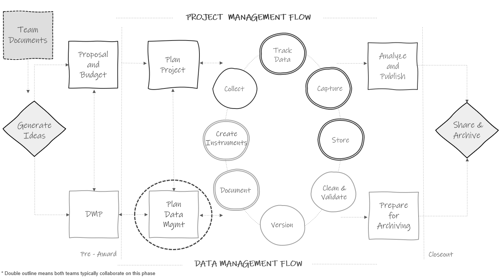
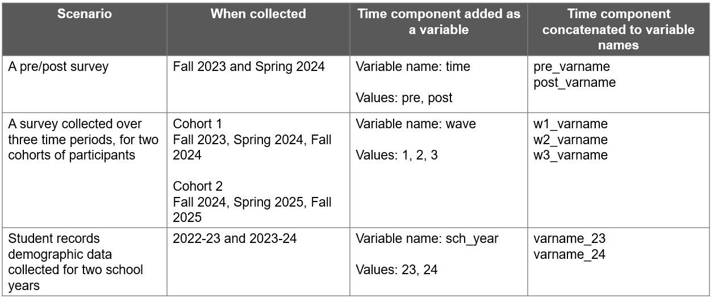

# Style Guide {#style}

```{r fig9-1, fig.cap="Style guide development in the research project life cycle."}



```

A style guide provides general rules for the formatting of information. As mentioned in Chapter \@ref(document), style guides can be created to standardize procedures such as variable naming, variable value coding, file naming, file structure, and even coding practices.

Style guides create standardization within and across projects. The benefits of using them consistently include:

- Creating interoperability: This allows data to easily be combined or compared across forms or time.
- Improving interpretation: Consistent and clear structure, naming, and coding allows your files and variables to be findable and understandable to both humans and computers. This in turn prevents errors such as accidentally using the wrong file or incorrectly interpreting a variable.
- Increasing reproducibility: If the organization of your file paths, file naming, or variable naming constantly change, it undermines the reproducibility of any data management or analysis code you have written.

Style guides can be created for individual projects, but they can also be created at the team level, to be applied across all projects. Most importantly, they should be created before a project kicks off so you can implement them as soon as your project begins. If you do not have a team-wide style guide already created, you most likely will want to create a project-level style guide during your planning phase so that you can begin setting up your directory structures and file naming standards before you start creating and saving project-related files. 

Style guides can be housed in one large document, with a table of contents used to reference each section, or they can be created as separate documents. Either way, style guides should be stored in a central location that is easily accessible to all team members (such as a team or project wiki), and all team members should be trained, and periodically retrained, on the style guide to ensure adherence to the rules. If all team members are not consistently implementing the style guide, then the benefits of the guide are lost.

For the remainder of this chapter, we will spend time reviewing best practices to consider when creating style guides for the following purposes:

1. Structuring directories
2. Naming files
3. Naming variables
4. Assigning variable values
5. Writing code

## General good practices {#style-practices}

Before we dive into particular types of style guides, there are a few things to know about how computers read names in order to understand the "why" behind some of these practices.

1. Avoid spaces. 
    - Command line operations and some operating systems do not support them, so it is best to avoid them all together. Furthermore, they can often break a URL when shared.
    - The underscore (`_`) and hyphen (`-`) are generally good delimiters to use in place of spaces. An exception to this rule is denoted in Section \@ref(style-varname).
2. With the exception of (`_`) and (`-`), avoid special characters.
    - Examples include but are not limited to `?`, `.`, `*`, `\`, `/`, `+`, `'`, `&`, `"`.
    - Computers assign specific meaning to many of these special characters.
3. There are several existing naming conventions that you can choose to add to your style guide. Different naming conventions may work better for different purposes. Using these conventions help you to be consistent with both delimiters and capitalization, which not only makes your names more human-readable but also allows your computer to read and search names easier.
    - Pascal case (ScaleSum)
    - Snake case (scale_sum)
    - Camel case (scaleSum)
    - Kebab case (scale-sum)
    - Train case (Scale-Sum)
4. Character length matters. Computers are unable to read names that surpass a certain character length. This applies to file paths, file names, and variable names. Considerations for each type of limit are reviewed below.

## Directory structure {#style-directory}

When deciding how to structure your project directories (the organization of folders and files within an operating system), there are several things you want to consider.

**When structuring your folders:**

- First, consider organizing your directory into a hierarchical folder structure to clearly delineate segments of your projects and improve searchability.
  - The alternative to using a folder structure is using metadata and tagging to organize and search for files [@cakici_folders_2017; @fuchs_making_2018; @krishna_how_2018].
- When creating your folder structure, strike a balance between a deep and shallow structure.
  - Too shallow leads to too many files in one folder which is difficult to sort through.
  - Too deep leads to too many clicks to get to one file, plus file paths can max out with too many. characters. A file path includes the full length of both folders and file name.
    - An example file path with 73 characters `W:\team\project_new\data\wave1\student\survey\pn_w1_stu_svy_clean_v02.csv`
  - Examples of file path limits:  
    - SharePoint/OneDrive path limit is 400 characters [@microsoft_restrictions_2023]
    - Windows path limit is 260 characters [@ashcraft_naming_2022]
- Create folders that are specific enough that you can limit access.
  - For example, you will want to limit user access to folders that hold personally identifiable information (PII).
  - To protect any files that you don’t want others to accidentally edit (for example your clean datasets), also consider making some files "read only".
- Decide if you want an "archive" folder to move old files into or if you want to leave previous versions in the same folder.
- Ultimately, create a structure that is consistently applied.
  - For example, if your project includes three phases of an intervention, consider creating "phase" folders at the top of your directory with content folders under each **or** creating content folders at the top of your directory and with phase folders in each. Do not mix and match methods. This leads to confusion when searching for files. 

Top level phase folders

```
project_new/
├── phase1
|   ├── documentation
|   |   └── ...
|   ├── planning
|   |   └── ...
|   └── ...
├── phase2
|   ├── documentation
|   |   └── ...
|   ├── planning
|   |   └── ...
|   └── ...
└── ...

```

Top level content folders

```
project_new/
├── documentation
|   ├── phase1
|   |   └── ...
|   ├── phase2
|   |   └── ...
|   └── ...
├── planning
|   ├── phase1
|   |   └── ...
|   ├── phase2
|   |   └── ...
|   └── ...
└── ...

```

**When naming your folders:**

- Consider setting a character limit on folder names (again to reduce problems with hitting path character limits).
- Make your folder names meaningful and easy to interpret.
- Don't use spaces in your folder names.
    - Use (`_`) or (`-`) to separate words.
- With the exception of (`-`) and (`_`), don't use special characters in your folder names.
- Be consistent with delimiters and capitalization. Follow an existing naming convention (as mentioned in Section \@ref(style-practices)).
- If you prefer your folders to appear in a specific order, add the order number to the beginning of the folder name, with leading zeros to ensure proper sorting (`01_`, `02_`).

**Example directory structure style guide**

```
1. All project directories follow this hierarchical metadata structure  
    - Level 1: Name of project  
    - Level 2: Life cycle folders  
    - Level 3: Data collection wave folders (if relevant)  
    - Level 4: Participant group folder (if relevant)
    - Level 5: Specific content folder/s  
    - Level 6: Archive folder  
2. All folders should be named according to these rules  
    - Meaningful name but no longer than 20 characters  
    - No spaces or special characters except (_)
    - Only use lower case letters  
    - Use (_) to separate words  
    - Consistently named across waves of data collection
3. All previous versions of files must be placed into their respective "archive" folder
    - A changelog should be placed in all data "archive" folders to document changes between file versions

```

**Example directory structure created using a style guide**

```
project_new/
├── 01_planning
|   ├── grant_mgmt
|   |   ├── proposal_docs
|   |   |   └── ...
|   ├── meetings
|   |   ├── agendas
|   |   |   └── ...
|   └── ...
├── 02_documentation
|   ├── consent_forms
|   |   └── ...
|   ├── data_dictionaries
|   |   └── ...
|   ├── data_sources_catalog.xlsx
|   ├── instrument_copies
|   |   └── ...
|   ├── research_protocol.docx
|   ├── sops
|   |   └── ...
|   └── ...
├── 03_data_collection
|   ├── hiring_materials
|   |   └── ...
|   ├── scheduling_materials
|   |   └── ...
|   └── ...
├── 04_tracking
│   ├── parent_consents
|   |   └── ...
│   └── participant_tracking_database.accdb
├── 05_data
│   ├── cohort1
│   |   ├── student
|   |   |   ├── survey
|   |   |   |   ├── clean
|   |   |   |   |   ├── archive
|   |   |   |   |   |   └── changelog.txt
|   |   |   |   ├── raw
|   |   |   |   |   ├── archive
|   |   |   |   |   |   └── changelog.txt
|   |   |   |   └── ...  
|   |   |   └── ... 
|   |   └── ...
|   └── ...   
└── ...

```

## File naming {#style-file}

```{r fig9-2, fig.cap="\"Documents\", from xkcd.com."}

knitr::include_graphics("img/fig9-2.PNG")

```

As seen in Figure \@ref(fig:fig9-2), naming files in a consistent and usable way is hard. We are often in a rush to save our files and maybe don't consider how unclear our file names will be for future users (including ourselves).

Our file names alone should be able to answer questions such as:

- What are these documents? 
- When were these documents created? 
- Which document is the most recent version?

A file naming style guide helps us to name files in a way that allows us to answer these questions. You can have one overarching file naming guide, or you may have file naming guides for different purposes that need different organizational strategies (e.g., one naming guide for project meeting notes, another naming guide for project data files). Let's walk through several conventions to consider when naming your files.

- Make names descriptive (a user should be able to understand the contents of the file without opening it).
- No PII should be used in a file name (e.g., participant name).
- Never use spaces between words.
  - Use (`-`) or (`_`) to separate words. 
  - It is worth noting that underscores may be difficult to read when file paths are shared in links that are underlined to denote that the path is clickable (for example when sharing a SharePoint link to a document).
- With the exception of (`_`) and (`-`), never use special characters.
- Be consistent with delimiters and capitalization. Follow an existing naming convention (see Section \@ref(style-practices)).
- Consider limiting the number of allowable characters to prevent hitting your path limit.
  - For instance, @harvard_longwood_research_data_management_file_2023 recommends keeping file names to 40-50 characters.
- Format dates consistently and do not use forward slashes (`/`) to separate parts of a date. It is beneficial to format dates using the ISO 8601 standard in one of these two ways [@international_organization_for_standardization_iso_2017]:
  - *YYYY-MM-DD* or *YYYYMMDD*
    - Using the ISO 8601 standard ensures that dates are consistently formatted and correctly interpreted (e.g., "06-01-2023" is interpreted as DD-MM-YYYY in Europe, while it is often interpreted as MM-DD-YYYY in the U.S.).
  - While using delimiters between parts of the date adds characters to your variable names, it also may be clearer for users to interpret. Either of these date formats will be sortable.
- When manually versioning file names (see Section \@ref(document-change)), pick a consistent indicator to use.
  - One method is to add a number to the file name. Using this method, consider left padding single numbers with a 0 to keep the file name the same length as it grows (`v01`, `v02`).
  - Another method is to add a date to the file name, using the ISO 8601 standard.
- If your files need to be run in a sequential order, add the order number to the beginning of the file name, with leading zeros to ensure proper sorting (`01_`, `02_`).
- Choose abbreviations to use for common phrases (student = `stu`). 
  - This helps reduce file name character lengths and also creates standardized, searchable metadata, which can allow you to more easily, programmatically retrieve files (for example, retrieve all files containing the phrase "stu_obs_raw").
- Keep redundant metadata in the file name.
  - This reduces confusion if you ever move a file to a different folder or send a file to a collaborator. It also makes your files searchable.
  - For example, always put the data collection wave in a file name, even if the file is currently housed in a specific wave folder, always put the project name in the file name, even if the file is currently housed in a project folder, or always put the word "raw" or "clean" in the file name, even if the file is housed in a "raw" or "clean" folder.
- Choose an order for file name metadata (e.g., project -> time -> participant -> instrument).

**Example file naming style guide**

```
1. Never use spaces between words
2. Never use special characters except (_) or (-)
3. Use (_) to separate words
4. Only use lower case letters
5. Keep names under 50 characters
6. Format dates as YYYY-MM-DD
7. Use the following metadata file naming order
  - Order of use (if relevant – add a 0 before single digits)
  - Project
  - Cohort/Wave (if relevant)
  - Participant group
  - Instrument
  - Further description
  - Version
    - For raw data files, use date
    - For clean data files, code files, or SOPs use version number (add a 0 before single digits)
8. Use the following abbreviations
  - student = stu
  - teacher = tch
  - survey = svy
  - observation = obs
  - wave = w
  - project new = pn

```

**Example file names created using a style guide**

```
pn_stu_svy_sop_v03.docx
pn_w1_tch_obs_raw_2023-11-03.csv
pn_w1_stu_svy_raw_entry1_2023-11-15.csv
pn_w1_stu_svy_raw_entry2_2023-11-15.csv
pn_w1_stu_svy_clean_syntax_v01.R
pn_w1_stu_svy_clean_syntax_v02.R

```
    
## Variable naming {#style-varname}

This style guide will be a necessary document to have before you start to create your data dictionaries. Below are several considerations to review before developing your variable naming style guide. These are broken into two types of rules, those that are non-negotiable requirements that really should be included in your style guide (if you do not follow these rules you will run into serious problems in interpretation for both humans and machines), and then best practice suggestions that are recommended but not required.

**Mandatory:**

- Don’t name a variable any keywords or functions used in any programming language (such as `if`, `for`, `repeat`) [@r_core_team_r_2023; @stangroom_rules_2019].
- Set a character limit.
  - Most statistical programs have a limit on variable name characters.
    - SPSS is 64
    - Stata is 32
    - SAS is 32
    - Mplus is 8
    - R is 10,000
  - With this said, do not limit yourself to 8 characters based on the fact that one future user may use a program like Mplus. Consider the balance between character limit and interpretation. It is very difficult to make good human-readable variable names under 8 characters. It is much easier to make them under 32. Also, most of your users will be using a program with a limit of 32 or more. If you have one potential Mplus user, they can always rename your variables for their specific analysis.
- Don’t use spaces or special characters, except (`_`). They are not allowed in most programs.
  - Even the (`-`) is not allowed in programs such as R and SPSS as it can be mistaken for a minus sign.
  - While (`.`) is allowed in R and SPSS it is not allowed in Stata so it’s best to avoid using it.
- Do not start a variable name with a number. This is not allowed in many statistical programs.  
- Do not embed indicator information into variable names.
  - Cohort, treatment, site, or other grouping information should be added as its own variable in a dataset, not embedded into variable names. This allows your data to be combined across groups as needed.
- All variable names should be unique.
  - This absolutely applies to variables within the same dataset, but it should also apply to all variables across datasets within a project (e.g., across a teacher survey and a student survey). The reason is, at some point you may merge data across forms and end up with identical variable names (which programs will not allow).
  - The exception to this rule is if you are collecting the same variables across time. In this case, identical variables should be named consistently across waves of data collection to allow easier comparison of information. 
    - If an item is named `anx1` in the fall, name that same item `anx1` again in the spring (see Section 9.4.1 for a discussion on accounting for time).
- If you substantively change an item (substantive wording OR response options change) after at least one round of data has been collected, version your variable names to reduce errors in interpretation.
  - For example, revised `anx1` becomes `anx1_v2`.

**Suggested:**

- Names should be meaningful.
  - Instead of naming gender `q1`, name it `gender`.
  - If a variable is a part of a scale, consider using an abbreviation of that scale plus the scale item number (`anx1`, `anx2`, `anx3`).
    - Not only does this allow you to easily associate an item with a scale, but it also allows you to programmatically select and manipulate scale items (for example, sum all items that start with "anx").
- If you have used an item before, consider keeping the variable name the same across projects. This can be very useful if you ever want to combine data across projects. It also allows you to easily reuse code snippets across projects (e.g., for scoring a measure).  
  - If you choose not to reuse variable names across projects, it will be important for your team to create a document mapping comparable names to facilitate potential future data integration.
- Choose standard abbreviations to denote the types of variables you are working with (standard score = `ss`). Using controlled vocabularies improves interpretation and makes data exploration and manipulation easier [@riederer_column_2020].
- Be consistent with delimiters and capitalization. Follow an existing naming convention. Most programming languages are case sensitive so consider this when choosing a convention that is feasible for your workflow.
  - Snake case (scale_sum) – preferred method for variable names
    - While pascal case and camel case are also options, the use of underscores helps more clearly delineate relevant pieces of metadata in your variable names.
  - Kebab case (scale-sum) – don’t use for variable names
  - Train case (Scale-Sum) – don’t use for variable names
- If a variable includes a "select all" option, start all associated variables with the same prefix (`cert_elem`, `cert_secondary`, `cert_leader`, `cert_other`). Again, this allows you to easily see grouped items, as well as easily programmatically manipulate those items as needed.
- Consider denoting reverse coding in the variable name to reduce confusion (`anx1_r`).
- Include an indication of the reporter in the variable name (student self-report = `s`, district student records = `d`, teacher self-report = `t`, parent report = `p`).
  - Doing this allows you to consistently name comparable variables to improve interpretation while still creating unique variable names. 
    - For example, if you collect student gender from a survey and from district student records you can use the names `s_gender` and `d_gender`
- Choose an order for variable name metadata (e.g., reporter -> variable name -> item number/type).

**Example variable naming style guide**

```
1. Use snake case
2. Keep names under 32 characters
3. Use meaningful variable names
4. Use unique variable names within and across data sources
5. Use consistent variable names across waves of data collection
6. If part of a scale, use scale/subscale abbreviation plus item number from the scale. 
  - If the scale has been used in another project, keep the same name from previous projects.
7. Include an indication of the reporter as a prefix in the variable name
  - student self-report = s_
  - teacher self-report = t_
  - district student records = d_
8. Denote reverse coded variables using suffix _r
9. Follow this metadata order for variable names
  - Reporter
  - Item name (or scale abbreviation)
  - Subscale abbreviation (if relevant)
  - Item number (if relevant)
  - Variable type (if relevant)
  - Recode (if relevant)
9. Use the following abbreviations
  - mean = m
  - standard score = ss
  - percentile rank = pr
  - other, open text = text
  - date = dt

```

**Example variable names created using a style guide**

```
s_wj_lwi_dt
s_wj_lwi1
s_wj_lwi2
s_wj_lwi_ss
s_wj_lwi_pr
s_gender
d_gender
t_profdev
t_profdev_text
t_stress5
t_stress5_r
t_stress_m

```

### Time {#style-time}

Before moving on there is one last consideration for variable names. If your data is longitudinal (i.e., you are collecting repeated measures), you may need to add rules for accounting for time in your variable names as well. Recall from Section \@ref(structure-datastructure), there are two ways you can link and structure longitudinal data, in wide format or long format. 

1. If combining data over time in long format, no changes need to be made to your variable names. Variable names should be identically named over time. To account for a time component, you will simply include a new variable (e.g., `time`, `year`, `wave`) and add the appropriate value for each row.

2. If combining data in wide format, you will need to concatenate time to all of your time-varying variable names (i.e., not your subject unique identifier). This removes the problem of having non-unique variable names (e.g., `anx1` in wave 1 and `anx1` in wave 2) and allows you to interpret when each variable was collected. How you concatenate time to your variable names is up to you. Just make sure to continue adding time consistently to all variable names (i.e., same location, same format) and remember to follow variable naming best practices (e.g., never start a variable name with a number). 

Before adding a time component, either as a new variable or as part of a variable name, it's important to decide what values you want to assign to time. This will depend entirely on your study design and how you intend to use time in your analyses. When working with cohorts, it can be helpful to choose generic time values that allow you to combine samples collected in the same relative time periods. For example:

  - `wave 1` = fall of the study year
  - `wave 2` = spring of the study year
  - `wave 3` = fall of the follow up year
    
However, when not working with cohorts or if you have a dataset that does not fall within your pre-defined data collection periods, you can choose any values that work for you. Figure \@ref(fig:fig9-3) provides just a few examples of how you might account for time in your data based on different scenarios. 

```{r fig9-3, fig.cap="Examples of adding time to your data based on a variety of scenarios."}



```

With all of that said, **during an active project, it is actually best to not add a time component to your data**, and to store each dataset as a distinct file, with a clear file name that denotes the appropriate time period (e.g., `pn_w1_stu_svy_clean_v01.csv`). There are a few benefits of this method.

1. Naming variables consistently over time (with no time component added) allows you to easily reuse your data collection and data capture tools, as well as your cleaning code, each wave [@reynolds_basics_2022].
2. Storing files separately prevents you from potentially wasting time combining your data in a way that ends up not actually being useful or from wasting time merging files that later need to be re-combined because you find an error in a dataset at some point. 

Therefore, add rules to your variable naming style guide around how to concatenate time to your variable names, but make an asterisk saying that this time component should not be added until it is necessary (e.g., when you need to combine files, when you are publicly sharing data). Once you are ready, it is fairly easy to add a time variable or to concatenate time to variable names using a statistical program, such as R^[https://osf.io/xumg4], or even in a program like Microsoft Excel.

## Value coding {#style-codes}

Oftentimes in education research we codify categorical values. This coding of values helps in data entry, data scoring, and data analysis. As an example, rather than referring to the lengthier values of "yes" or "no" in a variable, we may code those values into a code/label pair. The code can be numeric (e.g., "yes" = 1 | "no" = 0) or character (e.g., "yes" = 'y' | "no" = 'n'), depending on your needs. Ultimately, only the code appears in your data, while the code/label pair is represented in your data dictionary, allowing users to interpret the meaning of each code.

If you are planning to code any categorical variable values for your study, it can be helpful to include general guidelines in your style guide for assigning those codes. Some general good practices are outlined below.

First, if you are using a pre-existing measure, assign codes and labels in the manner that the technical documentation tells you to assign codes. That will be important for any further derivations you need to make later based on those measures. Similarly, if you have used items before in previous projects, consider keeping the same coding from prior projects to improve interpretation and usability of those variables.

Otherwise, if you are assigning new codes, follow these guidelines to improve interpretation and decrease user errors:

- Codes must be unique.
  - Do: Assign "yes" = 1 | "no" = 0
  - Don't: Assign "yes" = 1 | "no" = 1
- Codes must be consistent within a variable.
  - Do: For `gender` assign "male" = 'm'
  - Don't: For `gender` allow "male" = 'm' or 'M' or 'Male' or 'male'
- Codes must be consistent across time.
  - Do: For `anx1` assign "yes" = 1 | "no" = 0 in wave 1 **and** wave 2
  - Don't: For `anx1` assign "yes" = 1 | "no" = 0 in wave 1 **but** "yes" = 1 | "no" = 2 in wave 2
- Codes should be consistent across the project.
  - Do: Assign "yes" = 1 | "no" = 0 as the value for all yes/no items 
  - Don't: Assign "yes" = 1 | "no" = 0 for some variables, and "yes" = 1 | "no" = 2 for others
    - The exception here is if a pre-existing measure determines how values are coded. In that case, there may be some inconsistency across items.
- Align codes with response options as best as possible.
  - Do: Assign “none” = 0 | “1” = 1 | “2” = 2 | “3 or more” = 3
  - Don’t: Assign “none” = 1 | “1” = 2 | “2” = 3 | “3 or more” = 4
      - The exception here is if a pre-existing measure tells you to code variables in a different way.
- Likert-type scale codes should be logically ordered.
  - Do: Assign "strongly disagree" = 1 | "disagree" = 2 | "agree" = 3 | "strongly agree" = 4 
  - Don't: Assign "strongly disagree" = 1 | "disagree" = 3 | "agree" = 4 | "strongly agree" = 2
    
### Missing value coding {#style-missing}

There is little agreement about how missing data should be assigned [@white_nine_2013]. There are essentially two options.

1. You can choose to leave all missing values blank.
    - Benefits of this option is that there is no chance of assigned missing value codes (e.g., *-999*) being mistaken as actual values.
    - The concern with this method is that there is no way to discern if the value is truly missing, or was potentially erased by accident or skipped over during data entry [@broman_data_2018].
    - Also, some statistical programs do not allow blank values (e.g., Mplus), and therefore missing values will need to be assigned at some point. Yet, as I mentioned earlier in this chapter, it is best to not make decisions based on one potential use case. It is better to make decisions based on what is the most reasonable way to assign missing values for a general audience.
  
2. The other option is to define missing codes and add them to your data. This code can be numeric (e.g., "missing" = -999) or character (e.g., "missing" = 'NA') and it may be one consistent code applied to all missing data, or it may be multiple codes assigned for different types of missing data.
    - One benefit of this method is that this removes the uncertainty that we had with blank cells. If a value is filled, we are now certain the value was not deleted or skipped over during data entry.
    - Another benefit is that this allows you to specify distinct reasons for missing data (e.g., "Not Applicable" = -97, "Skipped" = -98) if that is important for your study. 
    - The biggest problem that can occur with this method is that either your codes could be mistaken for actual values (if someone misses the documentation on missing values), or if you use a value that does not match your variable type, then you introduce new variable type issues (e.g., if 'NULL' is used in a numeric variable, that variable will no longer be numeric)

Ultimately, whichever method you choose, there are several guidelines you should follow. 

1. If you decide to fill with defined missing codes, use values that match your variable type (e.g., numeric codes for numeric variables) [@icpsr_guide_2020; @white_nine_2013]
    - There is, however, some merit to using text to define missing values in numeric variables to prevent incorrect use of missing values. If you try to run a mean on your variable, you will be immediately notified that this is not possible because your variable will be stored as a character column. If you do not care about the different types of missingness, you could easily then choose to change all missing codes to blank. However, if you do care about the types of missingness and want to keep that included in your variable, you will need to match the variable type.
2. If you use numeric values, use extreme values that do not actually occur in your data.
3. Use your values consistently within and across variables.

In your value coding style guide, you can add general rules to follow, or it may be an appropriate place to actually designate a missing value coding schema for your project (see Table \@ref(tab:tab9-1)).

```{r tab9-1}

library(tidyverse)

tibble::tribble (~"Code/Value", ~"Label",
                "-99", "Unit nonresponse (entire instrument not completed)",
                 "-98", "Item skipped",
                 "-97", "Item not applicable",
                 "-96", "Don't know") %>%
  knitr::kable(caption = "Example missing value code schema used for numeric variables")
  
```

> **Note**
>
> It is important to note here that there is a difference between a string value of "NA" or "NULL" that is inserted, versus an `NA` or `NULL` value that is assigned to blank values by a specific tool. For instance, blank numeric values in R are represented as the symbol `NA`. Yet this value is treated as missing, not as the string "NA".

## Coding {#style-code}

If your team plans to clean data using code it can be very helpful to create a coding style guide. This style guide can be tailored to a specific language that all staff will use (e.g., R or Stata), or it can be written more generically to apply to any coding language staff use to clean data. Below is a small sampling of good coding practices to consider adding to your guide. If you are looking for guides for a specific language, it can be very helpful to search online for existing style guides in that language.

- Consider building and implementing coding templates [@castaneda_nice_2019; @farewell_my_2018].
  - Templates can standardize the format of syntax files (such as using standard headers to break up code).
  - They also standardize the summary information provided at the beginning of your syntax (e.g., code author, project name, date created) [@alexander_telling_2023].

One example of what a template might look like in R.
  
```
#### Overview ####
# Associated project: 
# Script purpose:
# Data cleaning plan followed:
# Created by: 
# Date created:
# Code checked by:
# Code checked date:


#### Workspace setup ####

# Settings, packages, root paths


#### Data import ####


#### Cleaning code section 1 ####


#### Cleaning code section 1 ####
...

```
- Use comments throughout your code to clearly explain the purpose of each code chunk.
  - While your syntax may seem intuitive to you, it is not necessarily clear to others. As you write your code, comment every step in your syntax, explaining what that specific line of code is doing. The format of these comments will depend on your coding language.
    - R uses `#` at the start of a comment
    - SPSS and Stata use `*` at the start of a comment
- Improve code readability by using [@wickham_welcome_2021; @san_martin_stata_2023]
  - spaces
  - indentation
  - setting a line limit for your code (e.g., 80 characters)
- Use relative file paths for reproducibility.
  - In a point and click environment (e.g., Microsoft Excel), we typically open or read in a file by going to `file` -> `open` and navigating to the file's location. However, when writing code, we import a file by writing a file path, a location where a file lives, in our syntax. Rather than writing the full, absolute file path, it is a good practice to write the path relative to the directory you are working in [@wickham_r_2023]. Setting absolute file paths in syntax reduces reproducibility because future users may have different file paths.

```
# Example absolute file path
"/Users/crystal/project_new/data/raw/pn_stu_svy_clean_v01.csv"  

# Example relative file path
"raw/pn_stu_svy_clean_v01.csv"

```
- If you create objects in your program (like you do in R or Python), consider adding object naming rules similar to variable naming rules.
  - No spaces in object names
  - No special characters except (`_`) to separate words
  - No names that are existing program keywords (`if`, `for`, etc.)
- Don't repeat yourself.
  - Reduce duplication, improve efficiency, and increase your ability to troubleshoot errors by following the DRY (don't repeat yourself) principle. Consider using functions, loops, or macros for repetitive code chunks.
- Record session information for future users.
  - Information about software/package versions and operating systems used should be recorded in a text or log file to increase the reproducibility of your code. If users run into errors running your code, this information may help them troubleshoot.
