# Data Tracking {#track}

```{r fig10-1, fig.cap="Tracking in the research project life cycle"}

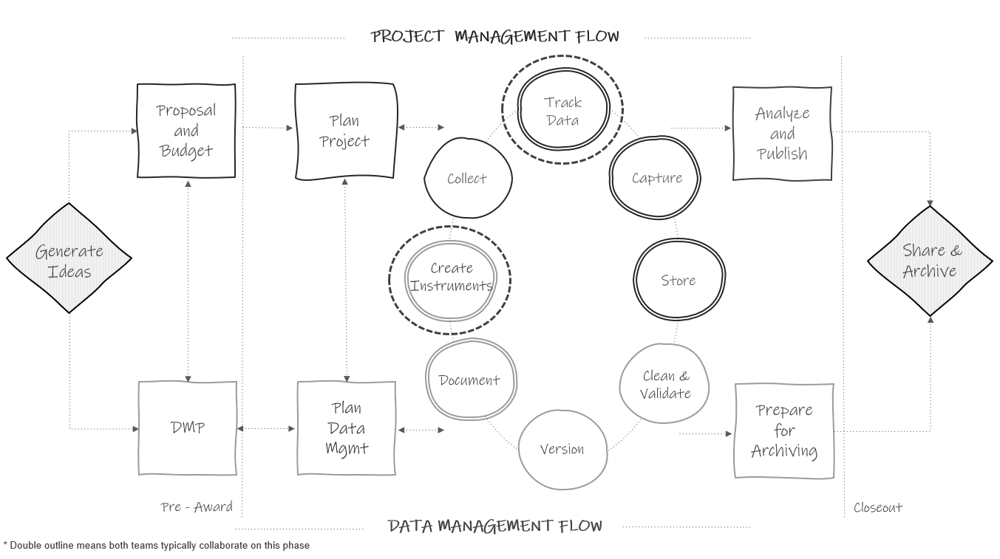

```

During your project you will want to be able to answer both progress and summary questions about your recruitment and data collection activities.

1. How many participants consented to be in our study? How many have we lost during our study and why?
2. How much progress have we made in this cycle of data collection? How much data do we have left to collect?
3. How many forms did we collect each cycle and why are we missing data for some forms?

Questions like these will arise many times throughout your study for both internal project coordination purposes, as well as for external progress reporting and publication purposes. Yet, how will you answer these questions? Will you dig through papers, search through emails, and download in-progress data, each time you need to answer a question about the status of your project activities? A better solution is to track all project activities in a participant tracking database. 

A participant tracking database is an essential component of both project management and data management. This database contains all study participants, their relevant study information, as well as tracking information about their completion of project milestones. This database has two underlying purposes.

1. To serve as a roster of study participants and a "master key" [@pacific_university_oregon_data_2014] that houses both identifying participant information as well as assigned unique study identifiers. 
2. To aid in project coordination and reporting, tracking the movement of participants as well as completion of milestones, throughout a study. 

This database is considered your single source of truth concerning everything that happened throughout the duration of your project. Any time a participant consents to participate, drops from the study, changes their name, completes a data collection instrument, is provided a payment, or moves locations, a project coordinator, or other designated team member, updates the information in this one location. Tracking administrative information in this one database, rather than across disparate spreadsheets, emails, and papers, ensures that you always have one definitive source to refer to when seeking answers about your sample and your project activities.

> **Note**
>
> I want to reiterate this single source of truth concept. Information is often coming in from multiple sources (e.g., data collectors in the field, emails to project coordinators from teachers, conversations with administrators). It is important to train your team that all relevant contact information that is gleaned (e.g., name change, new email, moved out of district) must be updated in the participant tracking database alone. If people track this information in other sources, such as their own personal spreadsheets, there is no longer a single source of truth, there are multiple sources of truth. This makes it very difficult to keep track of what is going on in a project. Whether a single person is designated to update information in this database, or multiple, make sure team members know either how to update information or who to contact to update information.

## Benefits

A thorough and complete participant database that is updated regularly is beneficial for the following reasons:

1. Protecting participant confidentiality
    - Assigning unique study identifiers (i.e., codes) that are only linked to a participant's true identity within this one database is necessary for maintaining participant confidentiality. This database is stored in a restricted secure location (see Chapter \@ref(store)), separate from where the identifiable and coded study datasets are stored, and is typically destroyed at a period of time after a project's completion.
2. Project coordination and record keeping
    - This database can be used as a customer relation management (CRM) tool, storing all participant contact information, as well as tracking correspondence. It can also be used as a project coordination tool, storing scheduling information that is useful for planning activities such as data collection.
    - Integrating this database into your daily workflow allows your team to easily report the status of data collection activities (e.g., as of today we have completed 124 out of 150 assessments). Furthermore, checking and tracking incoming data daily, compared to after data collection is complete, reduces the likelihood of missing data.
    - Last, thorough tracking allows you to explain missing data in reports and publications (e.g., teacher 1234 went on maternity leave).
3. Sample rostering
    - At any time, you can pull a study roster from this database that accurately reflects a participant's current status. The tracking information contained in this tool also aids in the creation of documentation including the flow of participants in your CONSORT diagram.
4. Data cleaning
    - As part of your data cleaning process, all raw dataset sample sizes should be compared against what is reported as complete in your tracking database to ensure that no participants are missing from your final datasets
    - Furthermore, this database can be used for de-identifying data. If data is collected with identifiers such as name, a roster from the tracking database can be used to merge in unique study identifiers so that name can be removed. A similar process can be used to merge in other assigned variables contained in the database such as treatment or cohort.

## Building your database

While the tracking phase appears after collection in Figure \@ref(fig:fig10-1), it is most beneficial to build this database before you begin recruiting participants, typically during the same time that you are building your data collection tools, in the create instruments phase. This way, as your team recruits participants, you can record information such as name, consent status, and any other necessary identifying contact information in the participant database and begin assigning participants study IDs.

While a project coordinator can build this database, it can be helpful to consult with a data manager, or someone with database expertise, when creating this system. This ensures that your system is set up efficiently and comprehensively.

This database may be a standalone structure, used only for tracking and anonymization purposes, or it may be integrated as part of your larger study system, where all study data is collected and/or entered as well.

### Comparing database types

Before we discuss how to build this database, it is helpful to have a basic understanding of the benefits of using different types of databases. There are essentially two types of databases commonly used for tracking---relational and non-relational. 

1. Relational database
    - Relational databases are typically built in a database software system (e.g., FileMaker, Microsoft Access). In this database, information is organized into tables made up of records (rows) and fields (columns), and tables can be related through keys [@bourgeois_information_2014; @chen_database_2022].
2. Non-relational database
    - Here I am loosely using the term non-relational database to describe tables of information that are not linked (think tabs in a spreadsheet). This type of database is usually built in a spreadsheet program (e.g., Microsoft Excel). While this is technically not considered a database, we will continue to use the term "database", even if this system is built using a spreadsheet program. 

Your study design can inform the type of database you choose to build. While relational databases may be more involved to build, they are also more efficient to use if your study includes a variety of related entities (e.g., students and teachers), tracked over waves of time. However, if you are only tracking one group of participants (e.g., just students) for one wave of data collection, or you have a fairly small study (e.g., participant numbers < 30), then a relational database might be overkill and a simple spreadsheet system will work just fine. Figure \@ref(fig:fig10-2) is a flow chart showing the kinds of decisions to consider when choosing which type of database to build. This decision tree should only be used to help guide your discussion; it does not contain hard-and-fast rules. Rules such as N > 30, should be replaced with criteria that make sense for your project and team.

```{r fig10-2, fig.cap="A decision tree for choosing whether to build a participant tracking database using a relational database or a spreadsheet"}

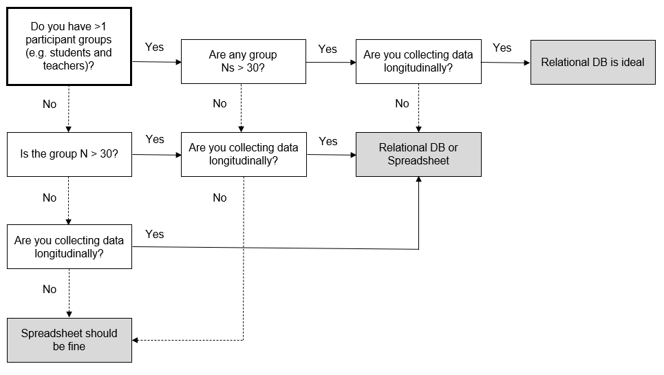

```

In the following sections we will review the benefits of relational databases compared to non-relational databases, especially when working with more complex studies.

#### Relational database

Using a relational database to track participant information, compared to disconnected tabs in a spreadsheet, has many benefits including reducing data entry errors and improving efficiency [@borer_simple_2009]. 

There are three general steps for building a relational database. 

1. Create tables made up of fields (i.e., variables)
2. Choose one or more primary key fields to uniquely identify rows in those tables. These keys should not change at any point. Typically these keys are your assigned unique study IDs.
3. Create relationships between tables through both primary and foreign keys (see Section \@ref(structure-database) for a refresher on primary and foreign keys)

Understanding all the ways to optimize your relational database is outside the scope of this book and also not always necessary for our purposes. Here, the most important thing to consider when building a relational database is to **not duplicate information across tables**. Any one field should only need to be updated in one location, never more than one. If you want to learn more about building databases, there are many freely available resources.

**Resources**

|Source|Resource|
|--------|-----------|
|Dave Bourgeois | Information Systems for Business and Beyond, Chapter 4^[https://pressbooks.pub/bus206/chapter/chapter-4-data-and-databases/]|
|Kim Nguyen | Relational Database Schema Design Overview^[https://medium.com/@kimtnguyen/relational-database-schema-design-overview-70e447ff66f9]|
|Omar Elgabry |A series of posts on database fundamentals ^[https://medium.com/omarelgabrys-blog/database-introduction-part-1-4844fada1fb0]|
|The Nobles |Normalization of Database, the Easy Way^[https://medium.com/swlh/normalization-of-database-the-easy-way-98f96a7a6863]|

Let's compare a very simple example of building a tracking database using a relational model and a non-relational model. In Figure \@ref(fig:fig10-3) we have three entities we need to track in our database---schools, teachers, and students. We built a very simple database with one table for each entity. Within each table we added fields that we need to collect on these subjects. We have also set up our tables to include primary keys (denoted by ovals) and foreign keys (denoted by rectangles). Our keys are all unique study identifiers that we have assigned to our study participants (see Section \@ref(track-ids) for more information on assigning these IDs).

```{r fig10-3, fig.cap="Participant database built using a relational model"}

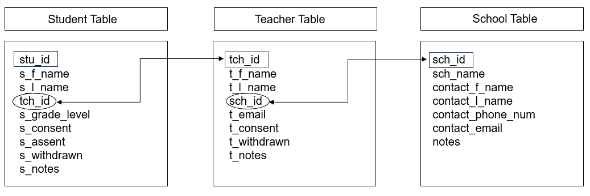

```

We can see that across each table we have no duplicated information. The Student Table only contains student-level information, the Teacher Table only contains teacher-level information, and the School Table only contains school-level information. This is a huge time saver. Imagine if a teacher's last name changes. Rather than updating that name in multiple places, we now only update it once, in the teacher table and make a note of the previous name in the `notes` field. 

If we want to see a table with both student and teacher information, we can simply query our database (i.e., make a request) to create a new table. In some programs, this type of querying may be a simple point and click option, in other programs it may require someone to write some simple code that can then be used at any time by any user. 

Say for example, we needed to pull a roster of students for each teacher. We could easily create and run a query, such as this one written in SQL (structured query language), that joins the student and teacher tables from Figure \@ref(fig:fig10-3) by `tch_id` and then pulls the relevant teacher and student information from both tables.

`SELECT Teacher.t_l_name, Teacher.t_f_name, Student.s_l_name, Student.s_f_name,  Student.s_grade_level`    
`FROM Student LEFT JOIN Teacher ON Student.tch_id = Teacher.tch_id`    
`ORDER BY t_l_name, t_f_name, s_l_name, s_f_name`   

The resulting output is Table \@ref(tab:tab10-1).

```{r tab10-1}

library(tidyverse)

tibble::tribble (~t_l_name, ~t_f_name, ~s_l_name, ~s_f_name, ~s_grade_level,
                "Clark", "Jana", "Arnold", "Darnell", 2,
                 "Clark", "Jana", "Watts", "Irene", 2,
                 "Ramirez", "Bill", "Dixon", "Ernesto", 4,
                 "Ramirez", "Bill", "Gibson", "Emma", 4,
                 "Ramirez" , "Bill", "Webster", "Grant", 4) %>%
  knitr::kable(caption = "Example roster created by querying our relational database tables",
               align = c('c', 'c', 'c', 'c', 'c'))
  
```

Depending on the design of your study and the structure of the database model, writing these queries can become more complicated. It's important to strike a balance between creating a structure that reduces inefficiencies in data entry but also creating something that isn't too complicated to work with based on the expertise of your team.

#### Non-relational database

Now imagine that we built a non-relational model, such as three tabs in an Excel spreadsheet, to track our participant information (see Figure \@ref(fig:fig10-4)). Since we are unable to link these tables together, we need to enter redundant information into each table (denoted by rectangles) in order to see that information within each table without having to flip back and forth across tables to find the information we need. For example, we now have to enter repeating teacher and school names in the Student Table, and if any teacher names change, we will need to update it in both the Teacher Table and in the Student Table for every student associated with that teacher. While this model may work fine for smaller studies, you can imagine how duplicating information would increase data entry time and create more opportunity for data entry errors for a larger, more complicated study with several tables of information [@borer_simple_2009].

```{r fig10-4, fig.cap="Participant database built using a non-relational model with duplicated variables denoted by rectangles"}

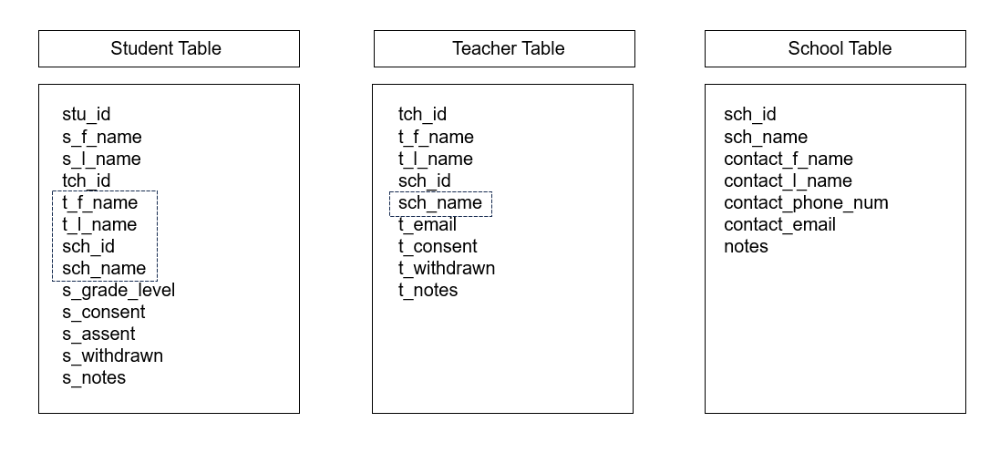

```

### Designing the database

Before you can begin to design your database, you will need to think through the following pieces of information.

1. Do you want to use a relational or non-relational database?
2. How many tables do you want to construct?
    - Consider entities (e.g., student, teacher, school)
    - Consider purpose (e.g., enrollment info, wave 1 data collection tracking, wave 2 data collection tracking)
3. What fields do you want to include in each table?
4. If using a relational database, what fields will you use to relate tables?

Once you make decisions regarding these questions, you can begin to design your database. It can be helpful to visualize your database schema during this process. In Figure \@ref(fig:fig10-5) I am designing a database schema for a scenario where I will only be collecting information from teachers and schools, over two waves of data collection.

```{r fig10-5, fig.cap="Example participant database model using two separate tables for tracking across waves", out.width="80%"}

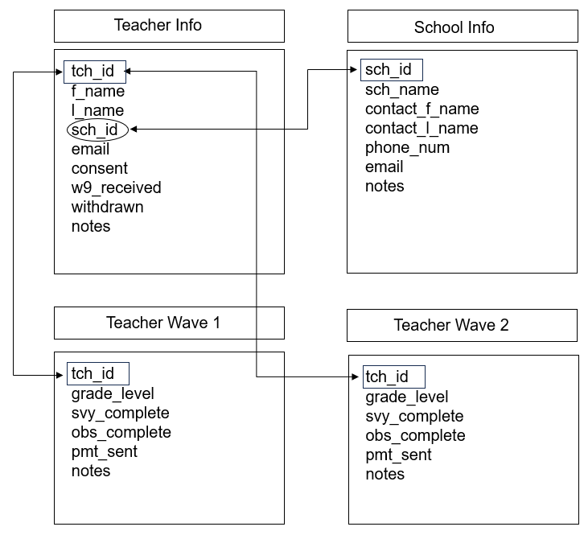

```

I have designed this database model in this way:

1. I have four tables total.
    - Two tables (Teacher Info and School Info tables) have information that should be fairly constant based on my project assumptions (name, email, consent, one-time documents received).
      - If at any time this information changes (e.g., withdrawn status, new last name, new contact person), I would update that information in the appropriate table and make a note of when and why the change occurred in my `notes` field.
    - Two tables are for my longitudinal information.
      - This is where I will track my data collection activities each wave, as well as any information that may change each wave, again based on the assumptions of my project. For example, I may put grade level in my longitudinal tables if I collect data across years because I assume it's possible that teachers may switch grade levels. 
2. I have connected my tables through primary and foreign keys (`tch_id` and `sch_id`).
3. With information separated into four tables, I can also now limit access as needed (e.g., only allow data entry staff access to the de-identified tables, or restricting entry to only the current wave of data preventing accidental overwriting of existing data).

The model in Figure \@ref(fig:fig10-5) is absolutely not the only way you can design your tables. There may be more efficient or more appropriate ways to design this database, but again as long as you are not duplicating information, build what works for you. As an example of a potentially more efficient way to structure this database, I could combine all waves of data collection into one table and create a concatenated (or compound) primary key that uses both `tch_id` and `wave` to uniquely identify rows since `tch_id` would now be duplicated for each wave of data collection (see Figure \@ref(fig:fig10-6)).

```{r fig10-6, fig.cap="Example participant database model using one table to track data across waves", out.width= "80%"}

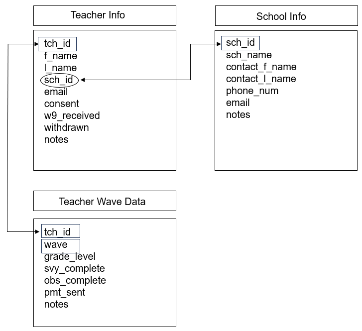

```

If we entered some data into the Teacher Wave Data table in Figure \@ref(fig:fig10-6), it might look something like Figure \@ref(fig:fig10-7). We can see that `tch_id` repeats but the rows are unique when combined with `wave`.

```{r fig10-7, fig.cap="An example of data that contains a concatenated primary key"}

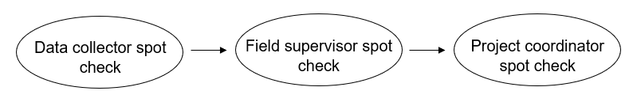

```

While these examples are for a fairly simple scenario, you can hopefully see how you might extrapolate this model to more entities and more waves of data collection, as well as how you might modify it to better meet the needs of your specific project. 

> **Note**
>
> If your study involves anonymous data collection, you will no longer be able to track data associated with any specific individual. However, it is still helpful to create some form of a tracking system. Creating a simplified database, with tables based on your sites for instance (school table, district table) allows you to still track your project management and data collection efforts (e.g., number of student surveys received per school per wave, payment sent to school).

### Choosing fields

As you design your participant tracking database model, you will also need to choose what fields to include in each table. The fields you choose to include will be dependent on your particular study design. While your participant tracking database may be the same database you enter all your study data, for the purposes of this chapter we are only considering fields that are relevant for project coordination and participant de-identification. We are not concerned with fields that are collected as part of your data collection measures (e.g., survey items). You can consider your participant tracking database as an **internal database** that is only used for coordination, summary, and linking purposes. This is not a database where you would export data for external data sharing. 

Below are ideas of fields you may consider adding to your database. Depending on the design and assumptions of your study, some of these may be collected once, others may be collected more than once, longitudinally.

**Ideas of fields to collect:**

- Primary keys (Study IDs)
- Foreign keys 
- Names (participants and sites)  
- Contact information  
- Other necessary linking identifiers (double IDs, district/school IDs)  
- Consent/assent status 
- Inclusion/exclusion criteria status
- Enrollment status
- Withdrawn status
- Relevant dates
- Randomization (treatment/control)  
- Grouping information (cohort)  
- Information relevant to project coordination (grade level, class periods, block schedules)  
- Summary information that may be helpful for participant flow diagrams (# of consents sent out, # of students in class, # of teachers in school) 
- Administrative data status (W-9 received, MOUs received)  
- Data collection status (unique fields for each instrument)
- Data collection administrator names or IDs
- Incentive status (gift cards sent out)  
- Notes  
  - Reasons for changes (for example changes in name, email)
  - Reasons for movement/withdraw  
  - Communication with participants  
  - Reasons for missing data  
  - Errors in data  

#### Structuring fields

As you choose your fields you also need to make some decisions about how you will structure those fields.

1. Set data types for your fields (e.g., character, integer, date)
    - Restrict entry values to only allowable data types to reduce errors
2. Set allowable values and ranges
    - For example, a categorical status field may only allow "complete", "partially complete" or "incomplete"
3. Do not lump separate pieces of information together in a field
    - For example, separate out `first name` and `last name` into two fields
4. Name your fields according to the variable naming rules we discussed in Chapter \@ref(style)

### Choosing a tool

There are many criteria to consider when choosing a tool to build your database in.

- Choose a tool that is customizable to your needs.
  - Can you build a relational table structure?
  - Can you export files? Can you connect to the database via application programming interfaces (APIs)?
  - Can you query data?
- Choose a tool that is user-friendly.
  - You don't want a tool with a steep learning curve for users.
- If you are running a project across multiple sites, consider the accessibility of the tool.
  - For example, you may want a tool that is cloud-based so that all site coordinators can access it.
  - You may also want to make sure multiple users can access it at the same time.
- Choose a tool that is interoperable.
  - For instance, some tools may have difficulties running on certain operating systems.
- Consider cost and licensing.
  - There are many free tools, but they may not provide all of the functionality you want.
  - What products do you already have access to (i.e., your institution has a license for)?
- Consider security.
  - Which tools are approved by your institution to protect the sensitivity level of this data (See Chapter \@ref(hsd))?
  - Can you limit access to the entire database? To specific tables?
    - If multiple people are entering data, you may want to restrict access/editing capabilities for some. tables
  - Protect data loss.
    - Can you backup the system?
    - Can you protect against overwriting data?
    - Can you keep versions of the database in case a mistake is ever made and you need to go back to an older version?
- Data quality protection.
  - Can you set up data quality constraints (e.g., restrict input values/types)? 
  
There are many tool options you can choose from. A sampling of those options is below. These tools represent a wide range from the criteria in this section. Take some time to review your options to see which one best meets your needs.

  - Microsoft Access
  - Microsoft Excel
  - Quickbase
  - Airtable
  - REDCap
  - Claris FileMaker
  - Google Sheets and Google Forms
  - Forms that feed into a relational database, maintained using a SQL database engine such as SQLite, MySQL, or PostgreSQL

## Entering data {#track-enter}

Your last consideration when building your database will be, how do you want your team to enter data into your database? There are many ways to enter data including manually entering data, importing data, integrating your data collection platform and your tracking database, or even scanning forms using QR codes. While some of those options may work great for your project, here we are going to talk about the two simplest and most common options---manually entering data into a tabular view, and manually entering data into a form.

### Entering data in a tabular view

Your first option is to manually enter data in a tabular view for each participant in a row (see Figure \@ref(fig:fig10-8)). This would be the most common, or possibly the only option, when using spreadsheet tools such as Microsoft Excel. However, you can also use this option when entering into other database tools such as Microsoft Access or FileMaker. Depending on the tool, this might have a name such as datasheet or table view. There are both pros and cons to this method.

- Pros: This is the quickest and easiest method. It also allows you to view all the data holistically.
- Cons: This method can lead to errors if someone enters data on the wrong row/record. It can also more easily lead to accidental deletion or overwriting of data.

```{r fig10-8, fig.cap="Example tabular view data entry"}

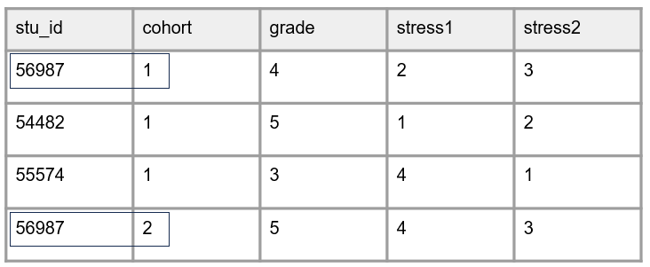

```

### Entering data in a form

Your second option is to create a form (also called a data entry screen) that is linked to your tables (see Figure \@ref(fig:fig10-9)). As you enter data in your forms, it automatically populates your tables with the information. This option is possible in many systems including Microsoft Access, FileMaker, REDCap, and even Google Forms which populates into Google Sheets.

- Pros: This method reduces data entry errors as you are only working on one participant form at a time.
- Cons: Takes some time, and possibly expertise, to set up the data entry forms.

```{r fig10-9, fig.cap="Example form view data entry"}

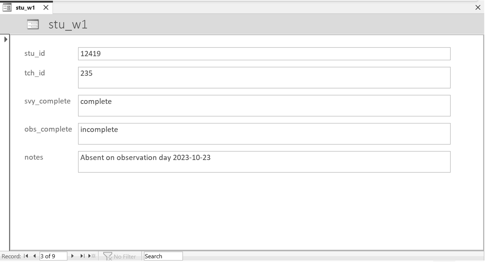

```


> **Note**
>
> If your participant tracking database is separate from your data collection tools, all information will need to be entered by your team using one of the ways mentioned in this section. However, if your participant tracking tool is also your data collection tool (such as those who collect electronic data using REDCap), fields such as data collection status (e.g., `svy_complete`) may not need to be manually entered. Rather they may be automated to populate as "complete" once a participant submits their responses in the data collection tool.

## Creating unique identifiers {#track-ids}

One of the most important parts of keeping this participant tracking database is assigning unique participant identifiers. As soon as participants are entered into your database, a unique study ID should be assigned. If confidentiality was promised to schools or districts, you will also want to assign identifiers to sites as well. Assigning these identifiers is an important part of protecting the privacy of human participants. When publicly sharing your study data, all personally identifying information will be removed and these identifiers (i.e., codes), are what will allow you to uniquely identify and link participants in your data. 

Participant unique identifiers are numeric or alphanumeric values and typically range from 2-10 digits. While there are several ways participant identifiers can be assigned (e.g., created by participants themselves, assigned by your data collection software), most commonly, the research team assigns these identifiers to participants. 

Before assigning identifiers, it can be very helpful to develop an ID schema during your planning phase (see Table \@ref(tab:tab10-2)), and document that schema in an SOP (see Section \@ref(document-sop)). 

```{r tab10-2}

library(tidyverse)

tibble::tribble (~stu_id, ~tch_id, ~sch_id,
                "12000 -- 1300", "200 -- 300", "40 -- 80") %>%
  knitr::kable(caption = "Example of a study ID schema")
  
```

This schema sets the parameters for how participant identifiers are assigned as they are entered into your tracking database (i.e., format, range). There are several best practices to consider when developing your participant ID schema.

1. Participants must keep this same identifier for the entire project.
    - Having a static participant ID allows you to track the flow of each participant through your study and can also provide the added benefit of helping to measure dosage in intervention studies.
    - Keeping the same unique identifier even applies in circumstances where a participant has the opportunity to be re-recruited into your study (as seen in Figure \@ref(fig:fig10-10)). In this situation, the participant still keeps the same ID and you will use a combination of variables to identify the unique instances of that participant (e.g., `stu_id` and `cohort`).
    - When you have multiple rounds of recruitment, it is important to have a procedure in place to check for participants who may already be in your database (e.g., search participant names before adding them into the database). Without this system in place, it is possible that you bring a participant back into your database under a new ID. 

```{r fig10-10, fig.cap="Example of keeping participant IDs for the entire study", out.width = "70%"}

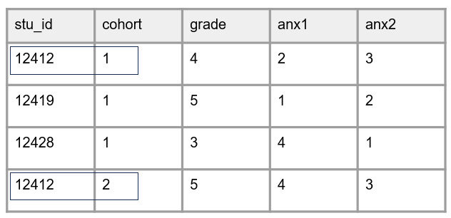

```

2. Participant identifiers must be unique within and across entities.
    - For example, no duplicating IDs within students or across teachers and schools.
    - Not duplicating within entities is imperative to maintain uniqueness of records, while not duplicating across reduces confusion about who a form belongs to and reduces potential errors.
3. The identifier should be randomly assigned and be completely distinct from any personal information to protect confidentiality.
    - Do not sort by identifying information (e.g., names, date of birth) and then assign IDs in sequential order.
    - Do not group by identifying information (e.g., grade level, teacher) and then assign IDs in sequential order.
    - Do not include identifying information (e.g., initials) as part of an identifier.
4. Do not embed project information into the ID if that information has the potential to change.
    - Some researchers prefer to embed a project-level ID or acronym into a participant ID to help with tracking of information, especially when running multiple studies using identical forms across studies. This is absolutely okay because it is assumed this information never changes. 
    - However, embedding a time indicator, such as wave or session, into an identifier variable guarantees that your identifiers will not remain constant. This information should be added to your dataset in other ways (i.e., either as its own variable or concatenated to variable names).
    - Embedding information such as teacher IDs, school IDs, treatment, or cohort also has the potential to cause problems. In longitudinal studies, depending on the study design, it is possible that students move to other study teachers, teachers move to other study schools, or participants get re-recruited into other cohorts. Any of these issues would cause problems if this information was embedded into an ID because the ID would no longer reflect accurate information and would require IDs to be changed, breaking best practice #1. Again, this information can be tracked as separate variables (e.g., `tch_id`, `sch_id`, `cohort`, `treatment`) and added to forms and datasets as needed. Figure \@ref(fig:fig10-11) is an example dataset where `stu_id` = 12428 moved into another teacher's classroom in wave 2 and this would have caused issues if teacher ID was embedded into the `stu_id` variable.

```{r fig10-11, fig.cap="Example of a student changing teachers during a research study", out.width = "70%"}

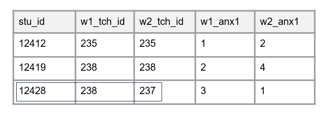

```


5. Last, while less important during the data tracking phase, in your study datasets these identifiers should be stored as character variables. Even if an ID variable is all numbers, it should be stored as character type. This helps prevent people from inappropriately working with these values (i.e., taking a mean of an ID variable).

<br>

> **Note**
>
> The only time you will not assign unique identifiers is when you collect anonymous data. In this situation you will not be able to assign identifiers since you will not know who participants are. However, it is still possible to assign identifiers to known entities such as school sites if anonymity is required.

## Summary

The tracking phase is one of the most important data management practices in an education research project life cycle. Anecdotally, I have seen several teams, without a participant tracking system for their project, end up with lost or unusable data and struggle to recall the details of their data collection efforts. While optimizing the design of your database and entry system is very helpful in reducing both inefficiencies and errors, don't let yourself get lost in the details. Build a system that works for your team and your project. The key takeaways to focus on during this phase are the following:

1. Build a system for tracking the intake of information, as well as for storing your participant key, and keep it up to date.
2. Keep one single source of truth. Don't have information stored in multiple locations.
3. Keep your tracking system secure. Don't allow unauthorized access to participant information (see Chapter \@ref(store) for more information).
4. Assign your participant unique IDs using best practices covered in Section \@ref(track-ids).

