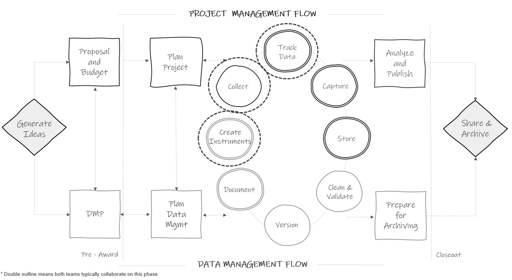
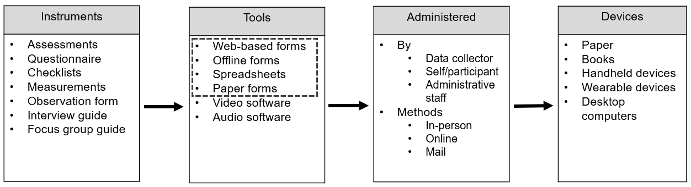

# Data Collection {#collect}

```{r fig11-1, fig.cap="Data collection in the research project life cycle."}



```

When collecting original data as part of your study (i.e., you are administering a survey or assessment as opposed to using an externally collected data source), data management best practices should be interwoven throughout your data collection process. Unfortunately, quality data doesn't just happen because an instrument is created and data is collected. It takes careful consideration, structure, and care on the part of the entire team. The number one way to improve the integrity of your data is to spend time planning your data collection efforts. Not only does planning minimize errors, it also keeps your data secure, valid, and relieves future data cleaning headaches. 

## Quality assurance and control

When planning your data collection efforts, you'll want to have your data sources catalog available (see Section \@ref(document-catalog)). This document will be a guide during your data collection planning period. Recall that each row in that document is an original instrument to be collected for your study. Some of your data sources may also include external datasets, which we will discuss in Chapter \@ref(capture).

In addition to planning data collection logistics for your original data sources (i.e., how will data be collected, who will collect it, and when), teams should spend time prior to data collection anticipating potential data integrity problems that may arise during data collection and putting procedures in place that will reduce those errors [@dime_analytics_data_2021; @northern_illinois_university_data_2023]. As shown in Figure \@ref(fig:fig11-1), creating data collection instruments is typically a collaborative effort between the project management and data management team members. Even if the project management team builds the data collection tools, the data management team is overseeing that the data collected from the tools aligns with expectations set in the data dictionaries. In this chapter we will review two types of practices that both project management and data management team members can implement that will improve the integrity of your data.

1. Quality assurance practices that happen before data is collected.
    - Best practices associated with designing and building your data collection instruments.
2. Quality control practices implemented during data collection.
    - Best practices associated with managing and reviewing data during collection.

## Quality assurance {#collect-assurance}

```{r fig11-2, fig.cap="Common education research data collection methods."}



```

Education researchers collect original data in many ways (see Figure \@ref(fig:fig11-2)). The focus of this chapter will be on data collected via forms (i.e., a document with spaces to respond to questions). Forms are widely used to collect data in education research (i.e., think questionnaires, assessments, observation forms, or a progress monitoring form), yet if poorly developed, they can produce some of the most problematic data issues. 

The focus on forms is not to discount the importance of data collected through other means such as video or audio recording, where issues such as participant privacy and data security and integrity should absolutely also be considered. However, even with those types of data collection efforts, often teams are ultimately still coding that data using some sort of form (e.g., observation form), further supporting the need to build forms that collect quality data.

When collecting information using forms you can certainly do your best to fix data errors after data collection during a cleaning process. However, one of the most effective ways to ensure quality data is to correct it at the source. This means designing items and building data collection tools in a way that produces valid, reliable, and more secure data. When creating your original data collection instruments, there are five ways to collect higher quality data.

1. Using good questionnaire design principles
2. Implementing a series of pilot tests
3. Choosing data collection tools that meet your needs
4. Building your instrument with the end in mind
5. Ensuring compliance

We will discuss each of these phases below. 

> **Note**
>
> If you are collecting data using a standardized assessment, along with a provided tool (e.g., a computer-adaptive testing program, a testing booklet), most of the information in this section will not be applicable as it is best to adhere to all guidelines provided by the assessment company. You can skip to Section \@ref(collect-irb). 

### Questionnaire design {#collect-design}

In Chapter 8 we discussed the importance of documenting all instrument items in your data dictionary before creating your data collection instruments. As you develop items to add to each data dictionary for each original data source, it is vital to consider questionnaire design.

While some instruments (e.g., cognitive assessments) typically have standardized items, other instruments, such as surveys, are often not predefined, allowing researchers freedom in the design of the instrument which can lead to negative effects such as errors, bias, and potential harm [@dime_analytics_data_2021; @northern_illinois_university_data_2023]. Question ordering, response option ordering, question wording, and more can all impact participant responses. While questionnaire design is actually outside of the scope of this book, I have a few tips to help you collect more valid, reliable, and ethical survey data. In addition to following these tips, make sure to consult with a methodologist to ensure that your questionnaire is appropriately designed to answer your research questions, and that you have a plan for issues such as missing data.

1. Follow technical documentation for existing scales.
    - If using an existing scale, as discussed in Section \@ref(document-original), make sure to follow any technical documentation associated with that scale (e.g., item wording, response options, item order). This ensures that you are using the scale as intended, and also improves opportunities to integrate data or replicate findings across other studies that have used the same scales.
    - If you have used a measure before in a previous project, it is also beneficial to keep wording and response options consistent across projects for similar reasons.
1. Use existing standards if possible.
    - Organizations such as the National Institutes of Health and the National Center for Education Statistics have developed repositories (Common Data Elements^[https://www.nlm.nih.gov/oet/ed/cde/tutorial/03-100.html] and Common Education Data Standards^[https://ceds.ed.gov/]) of standardized question wording paired with a set of allowable response options for commonly used data elements. Using standards when collecting variables, such as demographics, provides the following benefits [@icpsr_introduction_2022; @kush_fair_2020]:
        - Reduces bias.
        - Allows for harmonization of data across your own research studies and also across the field.
            - This allows researchers to draw conclusions using larger samples or by comparing data over time.
            - It also reduces the costs of integrating datasets.
        - Improves interpretation of information.
1. Make sure questions are clearly worded and answer choices are clear and comprehensive.
	- Consider how the language might be interpreted. Is the question wording confusing? Can the response options be misinterpreted?
	    - Rather than asking "What county are you from?" when looking for the participant's current location, be more specific and ask, "What county do you currently reside in?".
	    - Rather than asking "Which parent are you?" and providing the response options "m" and "f" (where "m" and "f" could be interpreted as "male" or "female"), clearly write out the response options and make sure they are comprehensive ("mother", "father", "legal guardian", and so forth).
	    - Rather than asking "Do your children not have siblings?" which can be confusing, remove the negative and ask, "Do your children have siblings?" [@reynolds_basics_2022].
	 - Is the question leading/biased?
	    - Are the response options ordered in a leading way?
	 - Is there more than one way to answer this question?
	    - Are response categories mutually exclusive and exhaustive [@icpsr_guide_2020]?
1. Consider data ethics in your questionnaire design [@frederick_four_2020; @gaddy_principles_2020; @kaplowitz_5_2020; @kopper_survey_2023; @mathematica_tips_2023].
    - Consider the why of each item and tie your questions to outcomes.
        - Don't cause undue burden on participants by collecting more data just to have more data.
        - If collecting demographic information, provide an explanation of why that information is necessary and how it will be used in your research.
    - Review question wording.
      - Does it have potential to do harm to participants? Do the benefits outweigh the risks?
      - If sensitive questions are included, make sure to discuss how you will protect respondent's information.
    -  Make questions inclusive of the population while also capturing the categories relevant for research.
        - For demographic information, allow participants to select more than one option.
        - If a demographic question is multiple choice, still include an "other" or "prefer to self-describe" option with an open-text field.
	  - Consider including one general free-text field in your survey to allow participants to provide additional information that they feel was not captured elsewhere.
1. Limit the collection of personally identifiable information (PII).
    - Collecting identifiable information is a balancing act between protecting participant confidentiality and collecting the information necessary to implement a study. We often need to collect some identifying information either for the purposes of record linking or for purposes related to study outcomes (e.g., scoring an assessment based on participant's age). 
    - As a general rule, you only want to collect PII that is absolutely necessary for your project, and no more [@gaddy_principles_2020]. As discussed in Chapter \@ref(hsd), PII can include both direct identifiers (e.g., name or email) as well as indirect identifiers (e.g., date of birth). Before sharing your data, all PII will need to be removed or altered to protect confidentiality (see Section \@ref(share-assess).

<br>

**Resources**

|Source|Resource|
|--------|-----------|
|Jessica Kay Flake, Eiko Fried| Measurement Schmeasurement: Questionable Measurement Practices and How to Avoid Them^[https://doi.org/10.1177/2515245920952393]|
|Pew Research Center|Writing survey questions^[https://www.pewresearch.org/our-methods/u-s-surveys/writing-survey-questions/]|
|Sarah Kopper, Katie Parry|Survey design^[https://www.povertyactionlab.org/resource/survey-design]|
|Stefanie Stantcheva| How to run surveys: A guide to creating your own identifying variation and revealing the invisible^[https://www.nber.org/system/files/working_papers/w30527/w30527.pdf]|
|World Bank|Survey content-focused pilot checklist^[https://dimewiki.worldbank.org/Checklist:_Content-focused_Pilot]|

### Pilot the instrument

Gathering feedback on your instruments is an integral part to the quality assurance process. There are three phases to piloting an instrument [@dime_analytics_survey_2021] (see Figure \@ref(fig:fig11-3)).

1. Gathering internal feedback on items
    - As discussed in Section \@ref(document-dictionary), once all items for each instrument have been added to a data dictionary, have your data management working group (DMWG) (see Chapter \@ref(plan)) review the data dictionary and provide feedback.
2. Piloting an instrument for content
    - Once your DMWG has approved the items to be collected, the second phase of piloting can begin. Create a printable draft of your instrument that can be shared with people in your study population and gather feedback. Consult with your IRB to determine if approval is required before piloting your instrument with your study population.
3. Piloting the instrument for data related issues
    - Once the instrument is created in your chosen data collection tool, share the instrument with your team for review. Here we are most interested in whether or not the data we are collecting are accurate, comprehensive, and usable. We will discuss this phase in greater detail in Section \@ref(collect-build).

Last, as you move through the piloting phases, remember to make updates not only in your tool but also in your data dictionary and any other relevant documentation (e.g., data cleaning plan). 
	  
```{r fig11-3, fig.cap="Data collection instrument pilot phases."}

knitr::include_graphics("img/fig11-3.PNG")

```


### Choose quality data collection tools {#collect-tools}

Once content piloting is completed, teams should be ready to begin building their instruments in their data collection tools (see Figure \@ref(fig:fig11-2) for examples of tools). Research teams may be restricted in the tools they use to collect their data for a variety of reasons including limited resources, research design, the population being studied, sensitivity levels of data, or the chosen instrument (e.g., an existing assessment can only be collected using a provided tool). However, if you have the flexibility to choose how you collect your data, pick a tool that meets the various needs of your project while also providing data quality and security controls. Things to consider when choosing a data collection tool are:

1. Needs of your project
    - Is crowdsourcing required? 
    - Is multi-site access required?
    - Who is entering the data (i.e., data collectors, participants)?
      - If participants are entering data, is the tool accessible for your population?
    - What are the technical requirements for the tool (i.e., will internet be available if you plan to use a web-based tool)?
    - Does the tool have customizable features that are necessary for your instrument (e.g., branching logic, automated email reminders, options to embed data, options to calculate scores in the tool)?
1. Compliance and security
    - Consider the classification level of each data source (see Chapter \@ref(hsd)).
      - Which tools are approved by your institution to protect the sensitivity level of your data?
    - If collecting anonymous data, do you have the option to anonymize responses in the tool (e.g., remove IP Address and other identifying metadata collected by the tool)?
    - Does the tool include data backups?
1. Training needed
    - Is any additional team training needed to allow your team to use and/or build instruments in the tool?
1. Associated costs
    - Is there a cost associated with the tool? Do you have the budget for the tool?
    - Will there be additional costs down the line (e.g., collecting data on paper means someone will need to hand enter the data later)?
1. Data quality features
    - Does the tool allow you to set up data validation?
    - Does the tool have version control?
    - Does the tool have features to deal with fraud/bots?

While there are a variety of tool options, in a nutshell when it comes to data collected via forms, data collection tools can be categorized in one of two ways---electronic or paper. In addition to choosing tools based on the criteria mentioned in this section, there are some general benefits associated with each method that should also be considered, especially when the research team has control over how the data collection tool is built [@cohen_research_2007; @douglas_data_2023; @gibson_data_2021; @icpsr_guide_2020;  @malow_redcap-based_2021; @society_of_critical_care_medicine_building_2018; @van_bochove_data_2023] (see Table \@ref(tab:tab11-1)).

<br>

```{r tab11-1}

library(tidyverse)

tibble::tribble (~"Electronic Data Collection Benefits", ~"Paper Data Collection Benefits",
                "Scalable (easier to reuse, edit, and maintain)", "Intuitive to create and use (no training required)",
                 "Efficient (reduces both cost and effort associated with printing, collecting, and entering data)", "Easy to do cognitive checks (eyeball for errors)",
                 "Prevents inconsistencies in data (e.g., using logic checks and data validation)", "Easier to catch errors early on (in the field)",
                 "Reduces the chances of missing data (e.g., using response validation)", "Can be more accessible for certain populations (e.g., young children)",
                "Opportunity to reduce bias (e.g., through random question ordering)", "",
                "Potential to reach broader populations (e.g., crowdsourcing)", "",
                "Quicker turnaround of analysis-ready data and provides the opportunity to build real-time reporting pipelines (e.g., using APIs)", "") %>%
  knitr::kable(caption = "Comparison of data collection tool benefits")
  
```

> **Note**
>
> If you choose to collect data in an electronic (also called digital) format, I highly recommend using a web-based tool that directly feeds into a shared database rather than through offline tools that store data on individual devices. Using a web-based tool, all data is stored remotely in the same database and can be easily downloaded or connected to at any time. No additional work is required.
>
> However, when collecting data on various tablets in the field, if the forms are offline and cannot be later connected to a web-based form, then all data will be stored individually on each tablet. This not only may be less secure (e.g., a tablet becomes corrupted), it may also require additional data wrangling work including downloading data from each tablet to a secure storage location each day and then combining all files into a single dataset. If you use an electronic tool but your site does not have internet, consider using one of the many tools (e.g., Qualtrics, SurveyCTO) that allow you to collect data using their offline app and then upload that data back to the platform once you have an internet connection again.

**Resources**

|Source|Resource|
|--------|-----------|
|Michael Gibson, Wim Louw|Survey platform comparison^[https://www.povertyactionlab.org/resource/survey-programming]|
|Washington State University Libraries|Software for sensitive data^[https://libguides.libraries.wsu.edu/rdmlibguide/ethics]|
|Benjamin Douglas, et al. | Data quality in online human-subjects research comparison of tools^[https://journals.plos.org/plosone/article?id=10.1371/journal.pone.0279720]|


### Build with the end in mind {#collect-build}

As you create your data collection tool, you will want to build it with the end in mind. This means taking time to consider how the data you collect will be translated into a dataset [@beals_data_2014; @lewis_how_2022; @uk_data_service_research_2023]. Recall from Chapter \@ref(structure), we ultimately need our data to be in a rectangular format, organized according to the basic data organization rules, in order to be analyzable. The process for building your tools with the end in mind is fairly different for electronic tools compared to paper forms, so we are going to talk about these two processes separately.

#### Electronic data collection {#collect-electronic}

If you have ever created a data collection instrument and expected it to export data that looks like the image on the left of Figure \@ref(fig:fig11-4), but instead you export data that looks like the image on the right, then you understand how important it is to spend time planning how data will be collected in your tool. 

```{r fig11-4, fig.cap="A comparison of data collected without planning and data collected with planning."}

knitr::include_graphics("img/fig11-4.PNG")

```

The first thing you will want to do before building your tool is bring out your data dictionary. This data dictionary will be your guide as you build your instrument. Some tools, such as REDCap, provide the option to upload your data dictionary which can then be used to automate the creation of data collection forms as opposed to building them from scratch [@patridge_research_2018]. However, if you are building your instrument manually, adhering to the following guidelines will ensure you collect data that is easier to interpret and more usable, and it will also reduce the amount of time you will need to spend on future data cleaning [@lewis_how_2022].

1. Include all items from your data dictionary.
    - In addition to all original data collection items, this also includes any variables that will be derived during data collection either automatically in your tool or manually entered by data collectors (e.g., total correct, age calculation).
    - This does not, however, include any variables that you plan to derive or add to the data after data collection, during the data cleaning phase (e.g., treatment, standard scores).
1. Name all of your items the correct variable name from your data dictionary [@uk_data_service_research_2023].
    - For example, instead of using the platform default name of `Q2`, rename the item to `tch_years`.
    - As mentioned in Section \@ref(style-varname), it's also best to not concatenate a time component to your variable names if your project is longitudinal. Doing so makes it difficult to reuse your instrument for other time periods, creating additional work for you or your team.
1. Code all values as they are in your data dictionary.
    - For example, "strongly agree" = 1 | "agree" = 2 | "disagree" = 3 | "strongly disagree" = 4
    - Many times, tools assign a default value to your response options and these values may not align with what you've designated in your data dictionary.
    - As you edit your survey, continue to check that your coded values did not change due to reordering, removal, or addition of new response options.
1. Add data validation to reduce errors and missing data [@uk_data_service_research_2023].
    - Content validation for open-text boxes.
      - Restrict entry to the variable type assigned in your data dictionary (e.g., numeric).
      - Restrict entry to the format assigned in your data dictionary (e.g., *YYYY-MM-DD*).
      - Restrict ranges based on allowable ranges in your data dictionary (e.g., *1--50*).
          - This could even include validating against previous responses (e.g., if "SchoolA" was selected in a previous question, grade level should be between *6 and 8*, if "SchoolB" was selected, grade level should be between *7 and 8*).
    - Response validation
      - Consider the use of forced-response and request-response options to reduce missing data.
        - Forced-response options do not allow participants to move forward without completing an item. Request-response options notify a respondent if they skip a question and ask if they still would like to move forward without responding.
        - Be aware that adding a forced-response option to sensitive questions has the potential to be harmful and produce bad data. If adding a forced-response option to a sensitive question, consider allowing those participants to opt-out in another way (e.g., "Prefer not to answer") (@kaplowitz_5_2020; @kopper_survey_2023). 
1. Choose an appropriate question type and format to display each item.
    - Become familiar with the various question types available in your tool (e.g., rank order, multiple choice, text box, slider scale).
    - Become familiar with the various formats (e.g., radio button, drop-down, checkbox).
    - For example, if your item is a rank order question (ranking three items), creating this question as a multi-line, free-text entry form may lead to duplicate entries (such as entering a rank of *1* more than once). However, using something like a rank order question type with a drag and drop format ensures that participants are not allowed to duplicate rankings.
1. If there is a finite number of response options for an item, and the number isn’t too large (less than ~ 20), use controlled vocabularies (i.e., a pre-defined list of values) rather than an open-text field [@openaire_eu_basics_2018; @uk_data_service_research_2023].
    - For example, list school name as a drop-down item rather than having participants enter a school name.
      - This prevents variation in text entry (e.g., "Sunvalley Middle", "sunvalley", "Snvally Middle"), which ultimately creates unnecessary data cleaning work and may even lead to unusable values.
1. If there is an infinite number of response options for an item or the number of options is large, use an open-text box.
    - If you can create a searchable field in your tool, allowing your participants to easily sift through all of the options, you absolutely should. Otherwise, use a text-box as opposed to having participants scroll through a large list of options.
    - Consider adding examples of possible response options to clarify what you are looking for.
    - Using open-ended text boxes does not mean you cannot regroup this information into categories later during a cleaning process. It is just more time-consuming and requires interpretation and decision-making on the part of the data cleaner.
1. Only ask for one piece of information per question. 
    - Separating information prevents confusion in case a participant or data collector swaps the order of information.
    - For example, rather than asking "Please list the number of students in your algebra class and geometry class", split those into two separate questions so those questions download as two separate items in your dataset: "Please list the number in algebra class"; "please list the number in geometry class".
    - This also includes more simple examples such as splitting `first_name` and `last_name` into two separate fields.
1. To protect participant privacy and ensure the integrity of data, consider adding a line to the introduction of your web-based instrument, instructing participants to close their browser upon completion so that others may not access their responses.
1. Last, if possible, export the instrument to a human-readable document to perform final checks.
    - Are all questions accounted for?
    - Are all response options accounted for and coded as they should be?
    - Is skip logic shown as expected?

Once your tool is created, the last step is to pilot for data issues (see Figure \@ref(fig:fig11-3)). Collect sample responses from team members. Create a feedback checklist for them to complete as they review the instrument [@gibson_survey_2020]. Assign different reviewers to enter the survey using varying criteria (e.g., different schools, different grade levels, other branching options). Let team members know that they should actively try to break things---try to enter nonsensical values, try to skip items, try to enter duplicate entries [@kopper_questionnaire_2023]. If there are problems with the tool, now is the time to find out. 

After sample responses are collected from team members, export the sample data using your chosen data capture process (see Chapter \@ref(capture)). Comparing the export to your data dictionary, review the data for the following:

1. Are there any unexpected or missing variables?
2. Are there any unexpected variable names?
3. Are there unexpected values for variables?
4. Are there missing values where you expect data?
5. Are there unexpected variable formats?
6. Is data exporting in an analyzable, rectangular format (see Chapter \@ref(structure))?

If any issues are found either through team feedback or while reviewing the exported sample data, take time to update the tool as needed before starting data collection. This is also the time to update your documentation. As you review your exported file, update your data dictionary to reflect any unexpected variables that are included (e.g., metadata), any unexpected formatting, as well as any newly discovered recoding or calculations that will be required during the data cleaning process. As an example, if upon downloading your sample data, you learn that a "select all" question exports differently than you expected, now is the time to add this information, along with any necessary future transformations, to your data dictionary. This is also a great time to update your data cleaning plan (see Section \@ref(document-plan)) with any new transformations that will be required. 

#### Paper data collection {#collect-paper}

There are many situations where collecting data electronically may not be feasible or the best option for your project. While it is definitely trickier to design a paper tool in a way that prevents bad data, there are still steps you can take to improve data quality.

1. Use your data dictionary as a guide as you create your paper form.
    - Make sure all questions are included and all response options are accurately added to the form.
2. Have clear instructions for how to complete the paper form [@kopper_survey_2023].
   - Make sure to not only have overall instructions at the top of the form but also have explicit instructions for how each question should be completed.
      - Where to write answers (e.g., not in the margin)
      - How answers should be recorded (e.g., *YYYY-MM-DD*, 3-digit number)
      - How many answers should be recorded (e.g., circle only one answer, check all applicable boxes)
      - How to navigate branching logic (e.g., include visual arrows)
3. Only ask for one piece of information per question to reduce confusion in interpretation.

Once your tool is created, you will want to pilot the instrument with your team for data issues (see Figure \@ref(fig:fig11-4)). Using the feedback collected, edit your tool as needed before sending it out into the field.

Last, unless paper data are collected using a machine-readable form, they will need to be manually entered into an electronic format during the data capture phase. While we will talk about data entry specifically in Section \@ref(capture-paper), this point in instrument creation is a great time to create an annotated instrument [@neild_sharing_2022]. This includes taking a copy of your instrument and writing the associated codes alongside each item (i.e., variable name and value codes). This annotated instrument can be useful during the data entry process and serve as a linking key between your instrument and your data dictionary. See Figure \@ref(fig:fig11-5) for an example of an annotated instrument from wave 1 of the Florida State Twin Registry project shared in the LDbase repository [@hart_florida_2021].

```{r fig11-5, fig.cap="Annotated parent survey from wave 1 The Florida State Twin Registry project (2018)."}

knitr::include_graphics("img/fig11-5.PNG")

```

#### Identifiers

When building data collection tools, no matter if they are paper or electronic, it is vitally important to make sure you are collecting unique identifiers [@kopper_survey_2023]. Whether you have participants enter a unique identifier into a form or you link study ID (see Section \@ref(track-ids)) to each form in some other way, it's important to not accidentally collect anonymous data. Without unique identifiers in your data, you will be unable to link data across time and forms. If possible, you want to avoid collecting names as unique identifiers for the following reasons [@mckenzie_falsehoods_2010]:

- To protect confidentiality, we want to use names as little as possible on forms.
  - If they are used on forms, we want to remove them as soon as possible.
- Names are not unique.
  - If you do collect names, you'll want to ask for additional identifying information that when combined, make a participant unique (e.g., student name and email).
- Names change (e.g., someone gets married/divorced).
- There is too much room for error.
  - If names are hand entered, there are endless issues with case sensitivity, spelling errors, special characters, spacing, and so forth.

All of these issues make it very difficult to link data. If you do decide to collect names, remember that you will need to remove names during data processing and replace them with your unique study identifiers (see Section \@ref(clean-check) for more information about this process).

Rather than having to de-identify your data through this cleaning process, another option is to collect a different type of unique identifier, or pre-link unique study identifiers and names in your instrument, removing many of these issues [@dime_analytics_data_2021; @gibson_survey_2020]. We will discuss these methods separately for electronic data and paper data.

> **Note**
>
> If your study is designed to collect anonymous data, then you will not assign study identifiers and no participant identifying information should be collected in your instruments (e.g., name, email, date of birth). You will also want to make sure that if your tool collects identifying metadata, such as IP Address or worker IDs in the case of crowdsourcing tools (e.g., MTurk), this information will not be included in your downloaded data.
>
> Remember that if you collect anonymous data, you will not be able to link data across measures or across time. However, if your study randomizes participants by an entity (e.g., school or district), you will need to collect identifying information from that entity in order to cluster on that information (e.g., school name).

##### Electronic Data

When collecting electronic data, there are many ways you might consider collecting unique identifiers other than names. A few possible options are provided below. The method you choose will depend on your data collection design, your participant population, your tool capabilities, and your team expertise.

1. Create unique links for participants.
    - Many tools will allow you to preload a contact list of participants (from your participant tracking database) that includes both their names and study IDs. Using this list, the tool can create unique links for each participant. This is the most error-proof way to ensure study IDs are entered correctly. 
    - When you export your data, the correct ID is already linked to each participant and you can choose to not export identifying information (e.g., names, emails) in the data. 
    - If using this method, make sure to build a data check into the system. For example, when a participant opens their unique link, verify their identity by asking, “Are you {first name}?” or "Are your initials {initials}?" In order to protect participant identities, do not share full names. 
      - If they say yes, they move forward. If they say no, the system redirects them to someone to contact. This ensures that participants are not completing someone else’s survey and IDs are connected to the correct participant.
2. Provide one link to all participants and separately, in an email, in person, or by mail, provide participants with their study ID to enter into the system. 
    - This might be a preferred method if you are collecting data in a computer lab or on tablets at a school site, or if your tool does not have the option to create unique links.
    - This can possibly introduce error if a participant enters their study ID incorrectly. 
      - Similar to the first option, after a participant enters their ID, verify their identity.
    - Note that participants are only becoming aware of their own study identifier, not the identifiers associated with other participants. However, if your team, or your Institutional Review Board (IRB), is uncomfortable with participants knowing their study IDs you can also consider using a "double ID" which is yet another set of unchanging unique identifiers that you use for the sole purpose of data collection. Those identifiers will need to be tracked in your participant tracking database and will need to be replaced with study IDs in the clean data.
3. If you have not previously assigned study identifiers (e.g., your consent and assent process is a part of your instrument), you can have participants enter their identifying information (e.g., name) and then have the tool assign a unique identifier to the participants.
    - Using this method, you can potentially download two separate files.
      - One with just the instrument data and assigned study ID, with name removed
      - One with just identifying information and assigned study ID (this information will be added to your participant tracking database)
    
##### Paper Data

If you take paper forms into the field consider doing the following to connect your data to a participant [@otoole_data_2018; @reynolds_basics_2022].

- Write the study ID, and any other relevant identifiers (e.g., school ID and teacher ID), on each page of your data collection form and then attach a cover sheet with participant name and other relevant information (see Figure \@ref(fig:fig11-6)). When you return to the office, you can remove the cover sheet and be left with only the ID on the form.
  - It is this ID only that you will enter into your data entry form during the data capture process, no name.
  - Removing the cover sheet ensures that your data entry team only sees the study ID when they enter data, increasing privacy by minimizing the number of people who see participant names.
  - However, before removing the cover sheet, double-check study identifiers against your participant database to make sure the information is correct.
  - Make a plan for the cover sheets (either shred them if they are no longer needed, or store them securely in a locked file cabinet and shred them at a later point).

```{r fig11-6, fig.cap="Example cover sheet for a paper data collection instrument."}

knitr::include_graphics("img/fig11-6.PNG")

```

### Ensure compliance {#collect-irb}

If you are collecting human subjects data and your study is considered research (see the [Glossary](#glossary) for definitions of these terms), it is important to consult with your applicable IRB about their specific requirements before moving forward with any data collection efforts. As discussed in Section \@ref(hsd-institution), an IRB is a committee that assesses the ethics and safety of research studies involving human subjects. If an IRB application is required for your project, the review process can take several weeks or more, and it is common for the IRB to request revisions to submission materials. Make sure to review your timeline and give yourself plenty of time to work through this process before you need to begin recruitment and data collection. 

Informed consent agreements, and assents for participants under the age of 18, are commonly required by IRBs for research studies that collect human subjects data. As mentioned in Section \@ref(hsd-agree), these agreements ensure that participants fully understand what is being asked of them and voluntarily agree to participate in your study. There are several categories of information that may be required for you to include in your consent form (e.g., description of study, types of data being collected, risks and benefits to participant, how participant privacy will be maintained) [@the_turing_way_community_turing_2022]. Make sure to consult with your applicable IRB about their specific requirements. With an increase in federal data sharing requirements, it is very important at this time to also consider how you want to gain consent for public data sharing [@levenstein_data_2018]. There are two risks posed by data sharing and it is important to address both in your consent---loss of privacy and using data for purposes participants did not agree to. @meyer_practical_2018 provides some general best practices to consider when adding language about public data sharing to a consent form.

- Don’t promise to destroy your data (unless your funder/IRB explicitly requires it).
  - Do incorporate data retention and sharing plans including letting participants know who will have access to their data.
- Don’t promise to not share data.
  - Do get consent to retain and share data (consider adding the specific repository you plan to share your data in). 
  - Consider offering tiered levels of consent for participants who may not want all of their data publicly shared but will allow some.
- Don’t promise that research analyses of the collected data will be limited to certain topics.
  - Do say that data may be used for future research and share general purposes (e.g., replication, new analyses).
- Do review the ways you plan to de-identify data and be thoughtful when considering risks of re-identification (e.g., small sample size for subgroups).

There are essentially three different ways you can go about obtaining consent for data sharing [@gilmore_practical_2018]. 

1. Include a line about public data sharing in your consent to participate in research.
    - With this method, a participant who consents is agreeing to both participate in the research study and have their data shared publicly.
2. Have participants consent to data sharing at the same time that you provide the research study consent, but provide a separate consent form for the purposes of public data sharing.
3. Have participants consent to data sharing on a separate consent form, at a later time, after research activities are completed. 
    - Obtaining consent this way ensures the participants are fully aware of the data collected from them and can make an informed decision about the future of that data. 
    
Consult with your IRB to determine the preferred method for obtaining consent for public data sharing. If you use method 2 or 3, it is very important that you not only track your participant study consent status in your tracking database (as discussed in Chapter \@ref(track)), but that you also add a field to track the consent status for data sharing so that you only publicly share data for those that have given you permission to do so. You will also want to consider who is included in your final analysis sample. If you include all consented participants in your analysis, your publicly available dataset will not match your analysis sample if some people did not consent to data sharing. You may need to consider options such as using a controlled access repository to share the full sample for purposes of replication. We will discuss different methods of data sharing in Chapter \@ref(share).

#### Building consent forms

If you are required to collect consent for your study, quality assurance should be considered with these forms as well. Keeping consent and assent forms secure should be a top priority for your team due to the identifiable information on the form. It is also important to be able to clearly identify the consenting individual on the form.  Whether you collect consent on paper or electronically, make sure you have a clear quality assurance plan.

1. Use institution and IRB approved tools to collect consent.   
2. If collecting paper consent, make sure that you will be able to clearly identify the consenting individual (e.g., participant printed name or signature alone may not be sufficient due to duplicate names, nicknames used, or illegible handwriting). One option is to pre-print names and other relevant information on forms or have school staff write participant names on forms before handing them out.  


**Templates and Resources**

|Source|Resource|
|--------|-----------|
|Anja Sautmann| Annotated informed consent checklist^[https://www.povertyactionlab.org/sites/default/files/research-resources/rr_irb_annotated-informed-consent-checklist_0.pdf]|
|Holly Lane, Wilhemina van Dijk|Example parent consent^[https://www.ldbase.org/system/files/documents/2021-04/HS-ParentConsent.txt]|
|ICPSR | Recommended Informed Consent Language for Data Sharing^[https://www.icpsr.umich.edu/web/pages/datamanagement/confidentiality/conf-language.html]|
|Jeffrey Shero, et al.| Informed consent and waiver of consent cheat sheet^[https://osf.io/3czbx]
|Jeffrey Shero, Sara Hart| Informed consent template with a focus on data sharing^[https://figshare.com/articles/preprint/Informed_Consent_Template/13218773]|
|Melissa Kline Struhl|Lookit consent form template 5^[https://github.com/lookit/research-resources/blob/master/Legal/Lookit%20consent%20form%20template%205.md]|
|University of Virginia| A collection of consent and assent templates^[https://research.virginia.edu/irb-sbs/consent-templates]|

## Quality control {#collect-control}

In addition to implementing quality assurance measures before data collection, it is equally important to implement several quality control measures while data collection is underway. Those measures include:

1. Field data management
2. Ongoing data checks
3. Tracking data collection daily
4. Collecting data consistently

We will discuss each of these measures in this section.

### Field data management {#collect-field}

If your data collection efforts include field data collection (e.g., data collectors administering assessments in a school), there are several steps your team can implement that will keep your data more secure in the field, help a project coordinator keep better track of what happens in the field, and will lead to more accurate and usable data. Some best practices for field data collection include the following [@dime_analytics_data_2021]:

- Keep your data secure in the field.
  - Make sure all paper forms are kept in a folder (or even a lock box) with you at all times, and that they are promptly returned to the office (e.g., not left in a car, not left at someone's home).
    - This is especially important when considering paper consent forms. Not only do these forms contain identifiable participant information, but if this form is misplaced, you no longer have consent to collect a participant's data.
  - Ensure all electronic data collection devices (e.g., phones, tablets) are password protected and never left open and unattended. Keep all identifiable information encrypted on your field devices (i.e., data is encoded so that only those with a password can decipher it). You may also consider remote wiping capabilities on portable devices in the case of loss or theft [@otoole_data_2018].
- Create tracking sheets to use in the field.
  - These sheets should include the names and/or identifiers of every participant who data collectors will be collecting data from.
  - Next to each participant, include any other relevant information to track such as 
    - Was the data collected (i.e., a check box)
    - Who collected the data (i.e., data collector initials or ID)
    - Date the data was collected
    - As well as a notes section to describe any potential issues with the data (e.g., "Student had to leave the classroom halfway through the assessment" or "Student refused to continue assessment")
  - This tracking sheet allows the project coordinator to keep track of what is occurring in the field so that information can be accurately recorded in the participant tracking database and forms can be sent back out for completion as needed.
- Check physical data in the field.
  - Immediately upon completing a form, have data collectors do spot checks. If any problems are found, follow up with the participant for correction if possible.
    - Check for missing data
    - Check for duplicate answers given (i.e., two answers circled for a question when there should only be one)
    - Check for answers provided outside of the assigned area (e.g., answers written in the margins)
    - Check calculations and scoring (e.g., basals, ceilings, raw scores)
- Assign a field supervisor. This person is assigned to:
  - Do another round of data checks in the field once the data collector returns physical forms to the on-site central location (e.g., if data collectors have set up in the teacher's lounge).
  - Ensure that all data and equipment is accounted for and returned to the office.
  - Be available for trouble shooting as needed.
- Do another round of physical data spot checking as soon as the data is returned to the office (see Figure \@ref(fig:fig11-7)).
  - The project coordinator may do this round of checking as they are tracking information in the participant database.
  - If any issues are found, note that in the tracking database and send the form back out to the field for correction.
  - If paper forms are mailed back to you from participants, rather than returned from field data collectors, it is still important to do in-office spot checks. If at all possible, reach out to those participants for any corrections.
- When a wave of data collection wraps up, collect feedback from data collectors to improve future data collection efforts.
  - What went well? What didn't?

```{r fig11-7, fig.cap="A series of spot checks that occur with paper data."}

knitr::include_graphics("img/fig11-7.PNG")

```

<br>

**Templates**

|Source|Resource|
|--------|-----------|
|Crystal Lewis| Field tracking sheet template ^[https://osf.io/hd2w3]|

### Ongoing data checks

If you collect data via a web-based form, you will want to perform frequent data quality checks, similar to the checks you performed during the content and data piloting phase. You will want to check for both programming errors (e.g., skip logic programmed incorrectly) as well as response quality errors (e.g., bots, survey comprehension) [@dime_analytics_data_2021; @gibson_data_2021]. Consider the following:

- Checks for comprehension
  - Are any questions being misinterpreted? If your form contains a free-text field, spot-check to see if responses make sense. 
- Checks for missing data
  - Are items being skipped that should not be skipped?
  - Are participants/data collectors not finishing forms?
- Checks for ranges and formats
  - Are values in unexpected formats or falling outside of expected ranges?
- Checks for duplicate forms
  - Are there duplicate entries for participants?
- Is skip logic working as expected?
  - Are people being directed to the correct location based on their responses to items?

Some of these checks can be performed programmatically (i.e., you can write a script in a program such as R to pull and check for things like out of range values on a recurring schedule). Other checks may require manual effort (e.g., such as downloading your data on a recurring schedule and reviewing open-ended questions for nonsensical responses). If errors are found, consider revising your instrument to prevent future errors if this is possible without jeopardizing the consistency of your data.

### Tracking data collection {#track-field}

Throughout data collection your team should be tracking the completion of forms (e.g., consents, paperwork, data collection forms) in your participant database (see Chapter \@ref(track)). This includes paper forms, electronic forms stored on devices, as well as web-based data coming in. Your team may designate one person to track data (e.g., the project coordinator), or they may designate multiple. If you are working across multiple sites, with multiple teams, you will most likely have one or more people at each site tracking data as it comes in. 

Some tracking best practices include:

1. Track daily during data collection.
    - Do not wait until the end of data collection to track what data was collected for each participant.
    - Tracking daily helps ensure that you don't miss the opportunity to collect data that you *thought* you had but never actually collected.
2. Only track data that you physically have (paper or electronic).
    - Never track data as "complete" that someone just tells you they collected. 
      - You can always mark this information in a "notes" field but do not track it as "complete" until you have the physical data. 
3. Only track complete data as "complete".
    - Review all data before marking it as "complete".
    - For paper files, make tracking the step immediately after your spot-checking process. If a form is only partially completed and you plan to send it back out to the field for completion, mark this in the "notes" but do not mark it as "completed". If you have a "partially completed" option, you can mark this option.
    - For electronic files, make tracking the step immediately following your data quality checks. If a form is only partially completed, mark this appropriately in your tracking database.

As mentioned in Chapter \@ref(track), if you use a tool such as REDCap for both collection and tracking, you may not need to do any manual tracking. Completion fields may automatically update as data is collected. You'll need to determine what is needed based on your specific scenario.

### Collecting data consistently

It is important to collect data consistently for the entire project to ensure interoperability and harmonization of information. Keep the following consistent across repeated collections of the same form (e.g., Spanish and English version of a form, Site A and Site B form, wave 1 and wave 2 of collecting a form):

- Variable names
  - Use the same names for the same items.
  - Remember that it's best to not add a time component to your variable names at this time (See Section \@ref(style-time) for more information).
- Variable types and formats
  - For example, if `gender` is collected as a numeric variable on one form, keep it as a numeric variable for all forms.
  - Or, if `svy_date` was collected as *YYYY-MM-DD* on one form, keep it the same format across forms.
- Value codes
  - Make sure response options are consistently coded using the same values (e.g., "no" = 0 | "yes" = 1) (see Section \@ref(style-codes) for more information).
- Question type and format
  - For example, if a slider question was used for "Percent of time on homework", continue to ask that question using a slider question.
  
Failing to collect your data consistently has many consequences.

1. It can make it difficult or impossible to compare outcomes.
2. It makes your work less reproducible.
3. It reduces your ability to combine data (i.e., you cannot append dissimilar variables).
4. It can lead to errors in interpretation.

Last, collecting data consistently also means measuring things in the same way over time or across forms so that you don't bias your results. The slightest change in item wording or response options can result in dramatic changes to outcomes [@icpsr_introduction_2022; @pew_research_center_writing_2023]. If an item absolutely needs to be edited after the study begins (e.g., a response option was left off), version the edited variable (e.g., `stress1` and `stress1_v2`) and note when the variable was edited in your data dictionary. Similarly, if items are added to an instrument at a later point in your study, make sure to follow quality assurance procedures including adding these items to your data dictionary and noting when the items were added, before adding them to your instrument.

## Bot detection

All of the web-based data collection efforts in this chapter assume you are making a private link that you are sharing with a targeted list (e.g., students in a classroom, teachers in a school). However, there may be times when you need to publicly recruit and collect data for your study, and this opens your instrument up for a plethora of data quality issues. Bots, fraudulent data, and incoherent or synthetic responses are all issues that can plague your online data collection efforts, particularly with crowdsourcing platforms [@douglas_data_2023; @veselovsky_artificial_2023; @webb_too_2022]. If possible, avoid using public survey links. One possible workaround is to first create a public link with a screener. Then after participants are verified through the screener, send a private, unique link to the instrument.

If a workaround is not possible and you need to use a public link, some quality assurance suggestions that can help you both secure your instrument and detect fraud include the following [@arndt_collecting_2022; @simone_how_2019; @teitcher_detecting_2015]:  

- Not posting the link on social media  
- Using CAPTCHA verification, or a CAPTCHA alternative, to distinguish human from machine    
- Using tools that allow you to block suspicious geolocations  
- Not automating payment upon survey completion    
- Including open-ended questions   
- Building attention/logic checks into the survey  
- Asking some of the same questions twice (once early on and again at the end)

Last, implement quality control checks for bots or fraudulent responses before analyzing data and before providing payments to participants. The following types of things are worth looking into further:  

- Forms being completed in a very short period of time   
- Forms being collected from suspicious geolocations    
- Duplicated or nonsensical responses to open-ended questions  
- Nonsensical responses to attention or logic checking questions  
- Inconsistent responses across repeated questions 

## Review

Recall from Chapter \@ref(plan), we discussed designing and visualizing a data collection workflow during your planning phase. As we've learned from this chapter, errors can happen at any point in the workflow, so it is important to consider the entire data collection process holistically and integrate both quality assurance and quality control procedures throughout. Figure \@ref(fig:fig11-8) helps us to see when these practices fit into the different phases our workflow.

Once your workflow is developed and quality assurance and control practices are integrated, consider how you will ensure that your team implements these practices with fidelity. Document the specifics of your plan in an SOP (see Section \@ref(document-sop)), including assigning roles and responsibilities for each task in the process. Last, train your team on how to implement the data collection SOP, and implement refresher trainings as needed.

```{r fig11-8, fig.cap = "Integrating quality assurance and control into a data collection workflow"}

knitr::include_graphics("img/fig11-8.PNG")

```

**Resources**

|Source|Resource|
|--------|-----------|
|DIME Wiki| Questionnaire design timeline^[https://dimewiki.worldbank.org/Questionnaire_Design]|
|Sarah Kopper, Katie Parry | Five key steps in the process of survey design^[https://www.povertyactionlab.org/resource/survey-design]|

