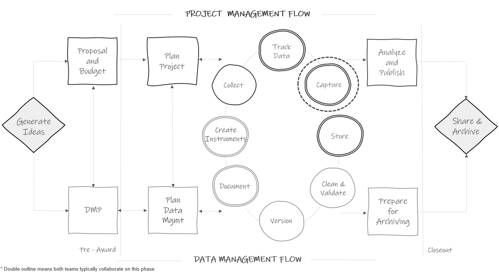
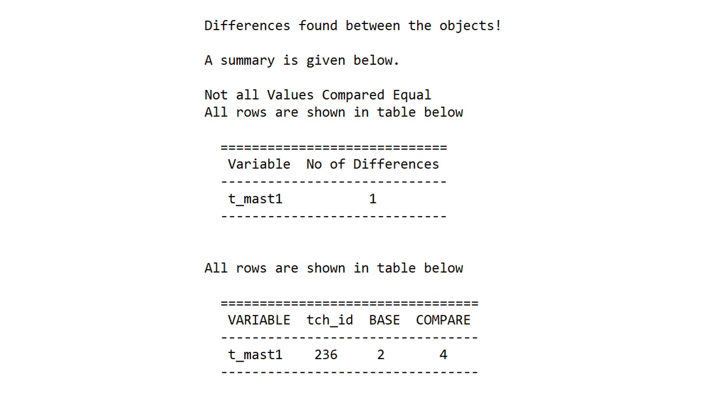

# Data Capture {#capture}

```{r fig12-1, fig.cap="Data capture in the research project life cycle."}



```

After the data collection period is complete, the next phase in the cycle is to capture the data (see Figure \@ref(fig:fig12-1)). Here we are extracting, creating, or acquiring a flat file, consisting of data previously collected electronically or on paper, that we can then save in our designated storage location. In quantitative research we typically want to capture data in an electronic, rectangular format that can be easily analyzed or shared (see Chapter \@ref(structure)). In this chapter we will review common ways to capture data based on three data collection methods (see Figure \@ref(fig:fig12-2)). Similar to data collection, it is possible for data errors to occur during this phase.  In reviewing data capture methods, we will also cover how data quality can be managed during this phase.

```{r fig12-2, fig.cap="Common data capture methods.", out.width = "80%"}

knitr::include_graphics("img/fig12-2.PNG")

```


## Electronic data capture {#capture-electronic}

As discussed in Chapter \@ref(collect), electronic data can be collected using a variety of software (either web-based or offline). Since electronic forms typically funnel data into a spreadsheet or database, it makes the process of data capture much easier compared to paper data. However, there is still much to consider.

1. How will the data be captured?
    - The most common way to capture web-based forms is to download it from your platform.
      - You may also be able to capture data via an API (application programming interface). If you regularly need to capture your data for quality control or other purposes, using an API can be a great way to remove the burden of manually logging into a program and going through the point and click process of downloading a file. Instead, you can write a script, in a program such as R, to extract the data. Once the script is created, you can run it as often as you want. However, this is only an option if your tool has an API available (e.g., Qualtrics).
    - If you are using devices that do not connect to the internet, consider how you will securely pull files off of those devices.
1. What file type will the data be captured in?
    - Most electronic data collection tools provide an option to export to one or more file formats (e.g., SPSS, CSV, XLSX). It is important to choose a file type that is analyzable (i.e., rectangular formatted), as opposed to something like a PDF file. The rectangular file type you choose will mostly depend on your project plans. Things to consider include:
      - Do you want embedded metadata, such as variable and value labels, in your raw file? Again, your choice will narrow your options (e.g., an SPSS file allows you to export the numeric values while also being able to view the variable and value labels in the file).
      - Do you want a non-proprietary, interoperable format? If yes, you will want to capture data in file type, such as CSV, that does not require proprietary software to view.
      - Will any file types create issues for your variables?
        - For instance, XLSX is well known for applying unwanted formatting to values. As an example, if your assessment tool collects age in the format of "years-months", oftentimes Microsoft Excel will change this variable into a date, converting a value such as "10-2" (10 years and 2 months old) to "2-Oct". A more suitable file type in this situation may be a CSV or TXT file, which do not apply formatting.
      - Is there a file structure that you don't want to work with?
        - As an example, the structure of an SPSS file may look different compared to an XLSX file depending on the tool. In a tool like Qualtrics, an XLSX or CSV file may export with multiple header rows whereas an SPSS file does not.
1. What additional formatting options need to be considered?
    - First and foremost, take time to understand the default options of your tool. From there, your tool may provide alternatives to the default. The available options and how they are worded will vary depending on what tool you use. However, examples of options you may encounter include:
      - Options to export the text values for categorical fields or to export the numeric values associated with each category. Your options may be limited by your chosen file type (e.g., text values may be available in a CSV but not in an SPSS file).
      - Options for formatting "select all that apply" (or multiple response) questions. Typically tools provide two options (see Figure \@ref(fig:fig12-3)).
        1. Export all selections in one variable, where each selection is separated by a comma. As you can imagine, this can get messy if you export text responses that contain commas.
        2. Split each option into its own column. 
      - Options for recoding seen but unanswered questions. 
        - Some tools may allow you to recode these blanks to a value such as *-99*. Selecting this option enables you to better determine if values are missing because they were not seen or if they were seen and purposefully skipped. This can be especially helpful for multiple response questions where cell values are blank when an option is not selected. When no options are selected, it can be difficult to determine if the entire question was skipped or if options were purposefully not selected, unless seen but unanswered cells are recoded. 
      - Options to not export variables tagged as identifiers.
        - If your tool allows you to tag certain fields as identifiable (e.g., name, email), you may have the option to exclude those variables in your export.

```{r fig12-3, fig.cap="Two different ways you may export a \"select all that apply\" question."}

knitr::include_graphics("img/fig12-3.PNG")

```

4. Where will the file be stored?  
    - This decision should be based on guidelines you've laid out in your data storage documentation (see Chapter \@ref(store)). 
    
5. How will files be named?  
    - While your tool may provide a name for your file, it may need to be renamed something more meaningful based on your style guide rules (see Section \@ref(style-file)). Most importantly, name your files consistently across data sources and waves.
      
6. What documentation needs to accompany the data capture?  
      - A README can be very beneficial to store alongside the file if there is anything in the file that a future person managing the data should be aware of (see Section \@ref(document-read)).  
      - A changelog can also be very beneficial (see Section \@ref(document-change)) to store with this file. It is common to have to redownload a raw data file due to errors found or new participants added. A changelog can help the team both identify the most recent version of a raw data file, as well as understand the differences between files.  
    
7. What checks need to happen before this data is handed off?  
    - It is important for the person responsible for data capture to do a basic review of the file before handing this data off for the next step.  
      - Does the format of the file look as expected? Does it have data in it? Are all the variables there as expected?  
      - Are all participants in the data? This is an excellent time to compare the number of unique participants in the file to the number of participants with data marked as complete in your participant tracking database. If these numbers do not match, the person in charge of data capture should begin reconciling errors before handing off this data.  
        - Was a participant accidentally dropped from the file? Is someone incorrectly marked as complete in the tracking database? Are there duplicate entries in the file?  
          - If there are errors that can be corrected (e.g., someone incorrectly tracked a data point, a participant was left off in the capture process), those corrections should be made now. If there are corrections that involve manipulating the raw data (e.g., reconciling duplicate IDs in the data, an ID incorrectly entered in the data), those corrections should not be made at this time. Instead, those should be added to a README file to be corrected in the data cleaning phase. 

8. Who will capture the data?  
    - It doesn't necessarily matter who takes on this responsibility. What matters most is that the person has the expertise to capture the data and that this responsibility is documented. If the person capturing the data is not the person who oversees data collection, it is important to still assign the data collection supervisor the responsibility of documenting any relevant information in a README.
  
> **Note**
>
> It is important to never make changes directly to the raw data files. This also includes not making changes directly to the data in your data collection tool. If you see errors in the raw data file that can't be fixed by simply re-downloading the data, make notes in a README for future correction as noted earlier in this section. Those corrections can be made in the data cleaning process. Doing this ensures that your raw data always reflects the true values that the participant reported and allows you to track data lineage. The one exception to this rule is if you accidentally collect data on a non-consented participant. In this case, it may be best to delete data for this participant directly in your data collection tool so that no record is kept.

### Documenting electronic data capture

All of these decisions should be made and documented during the time you are developing data collection tools. Making these decisions early allows you to also implement them during the pilot testing and data checking processes. For instance, if you plan to capture your data by exporting a CSV file from your data collection platform with a variety of options selected, you will want to use this same method during your data piloting and data checking process. This allows you to know exactly what your data will look like once data collection is complete and make adjustments as needed.

As discussed in Chapter \@ref(plan), your data capture process should be added to your workflow diagram and then detailed in an SOP (see Section \@ref(document-sop)). All of the decisions in this process should exist in the relevant SOP. This ensures that workflows are standardized and reproducible. As we've learned in this section, one deviation from the SOP has the potential to produce a very different data product (e.g., the format of a CSV file compared to an SPSS file can vary). Not only can this produce errors, but it can also undermine the reproducibility of a data cleaning pipeline. Imagine a scenario where a data cleaning syntax is written to import a CSV file with an expected format, and that format changes. The pipeline is no longer reproducible. Last, documenting a timeline for when this data capture process should occur can also be beneficial for both the person responsible for data capture and people responsible for subsequent phases such as data cleaning.

Here is an example of data capture steps you might add to a student survey data collection SOP.

```
[Project Coordinator Name]

1. Download a CSV file with the following options selected
    - Use numeric values
    - Recode seen but unanswered questions as -99
    - Split multi-response fields into columns
2. Save the file in wave# -> student -> survey -> raw
    - Name the file "pn_w#_stu_svy_raw_YYYY-MM-DD.csv"
3. Add a README to the folder as needed to describe any known issues with the data
    - Add a changelog as needed when new datasets are downloaded
4. Open and review the file
    - Compare the variables in the file to the data dictionary to ensure the file looks as expected
    - Compare the number of rows in the file to the number of surveys tracked as complete in the participant tracking database
      - If the numbers do not align, correct errors (or note them in a README) and redownload the survey as needed
5. Notify the data manager that the data is ready for cleaning

```

## Paper data capture {#capture-paper}

The most common method for capturing paper forms is manual entry. While capturing electronic data is fairly quick and straightforward, planning for and implementing paper data entry is much more involved. Similar to electronic data collection, you will want to start planning data entry long before your data is collected, and you will need to build your data entry tool before the data capture phase (e.g., when you are creating your data collection tools). 

As you can imagine, manually entering data comes with the potential for many data quality issues. In developing a data entry process, it is important to implement quality assurance and control practices similar to those we discussed in Chapter \@ref(collect).

1. Choose a quality data entry tool
1. Build your data entry form with the end in mind
1. Develop a data entry procedure

### Choose a quality data entry tool

Unless you are entering data into a proprietary scoring tool associated with your instrument, you will need to choose a data entry tool. When choosing this tool, if you are already using a relational database for your participant tracking, it may make the most sense to use this same database for data entry so that data can be stored in one location and tables can be linked (e.g., REDCap, FileMaker, Microsoft Access). However, if you need to choose a new tool for data entry, the criteria for choosing one will be similar to those reviewed in Section \@ref(collect-tools). Considerations for project needs, security, costs, and data quality should all still be reviewed.

In addition to reviewing those criteria, it can also be very beneficial to use a tool that allows you to create entry forms (also called data entry screens), similar to the form we saw in Figure \@ref(fig:fig10-9), rather than entering directly into a spreadsheet. Building a data entry screen that is laid out similar to the paper form can help reduce errors in data entry. Data that is entered into the form is then fed into a table that can be exported.

If however, you choose to use a spreadsheet program such as SPSS or Microsoft Excel for data entry, it is important to be aware of some of the limitations and possible issues with these tools including:  

  - Possible formatting issues
    - For example, Microsoft Excel formatting may cause errors in your data (e.g., dates get formatted as numeric, strings get formatted as dates, leading zeros get dropped from values).
  - Potential to skip around
    - In a spreadsheet, the ability to click anywhere makes it very easy to enter data into the wrong cell or to skip cells completely [@eaker_what_2016]. You may even delete or write over existing data on accident. It's also possible to incorrectly sort data resulting in errors [@reynolds_basics_2022].
      
### Build with the end in mind

When you export or save a dataset from your data entry tool, it should meet all of our data organization rules (see Chapter \@ref(structure)), and all of the variables should be formatted as we have described in our data dictionary, including correct name, variable type, and allowable values. In order to accomplish that goal, you need to build your data entry screens, whether in a spreadsheet or form layout, following rules similar to those discussed in Section \@ref(collect-build). 

1. Include every item on your form.
    - For assessments consider entering both item-level data and summary variables derived in the field. Both types of variables can be beneficial to have in your final project datasets. Make sure that all of these variables are also accounted for in your data dictionary.
1. Make sure that your items are laid out in the same order that they appear on the paper form so that people entering the data can easily follow the flow [@reynolds_basics_2022].
1. Using the annotated instrument we discussed in Section \@ref(collect-paper), name all of the items on your data entry screen to match the final item names (e.g., instead of `Q2` use the final name `tch_years`). 
1. For quicker data entry, with less errors, allow people to enter the numeric values associated with response options on the annotated instrument rather than the text values (e.g., enter *1* rather than "strongly disagree"). Or if you prefer to use text values, build those as drop-down values, removing variation in entry.
1. Design the data entry tool to include both content and response validation.
    - Restrict data type, format, ranges, and values.
    - Do not allow people to skip over items.

Before using your data entry tool, you will want to pilot it for issues, just like we did for electronic data collection tools (see Section \@ref(collect-electronic)). Collect sample responses from team members and collect feedback on what did or did not work well for them while entering data. Then download, using your chosen download format, or simply review the data if it is already in its final format (e.g., Microsoft Excel). Check that the data looks as you expect it to and make edits to the entry tool as needed.

### Develop a data entry procedure {#capture-entry}

While building a reliable data entry tool is absolutely important in ensuring data quality, developing a clear and standard data entry process is even more important. Figure \@ref(fig:fig12-4) shows a series of decisions to make regarding the data entry process.
    
```{r fig12-4, fig.cap="The flow of the decisions to make regarding the data entry process."}

knitr::include_graphics("img/fig12-4.PNG")

```

Let's walk through some of the decisions to be made.

1. Who will create data entry tools, who will enter data, and who will oversee this process?  
1. Where will paper forms be stored and how should they be pulled?
1. Where will entry databases or spreadsheets be stored and how can they be accessed?
1. What are the data entry rules?
    - What values are entered for categorical variables (numeric values or text values)?
    - How should free-text be entered to prevent inconsistencies?         
      - While adding data validation (e.g., only allowing numeric values) will help remove some inconsistencies, further rules may be needed depending on the items. Examples of rules include:
        - Enter decimals with a leading zero (e.g. *0.4* not *.4*)
        - Enter "yes" values as "Y" (e.g., change any values of "y" or "yes" -> "Y")
        - Only enter numeric values for measurements (e.g., *5* not "5cm")
    - How should missing data be handled (e.g., fill with *-99*)?
    - What should be done if a team member comes across common data errors?
      - Someone who has circled more than one response to an item?
      - Someone who has written responses in the margin?
      - Someone who has written a value out of range or an unallowable response?
          - In general, I recommend to enter the exact values a participant has provided and rectify errors during the cleaning process. However, there may be reasons your team has to deal with certain errors during the entry process (e.g., your entry form is set up to only allow values *1--3* and a participant has provided a value of *4*).
1. How should team members denote that a form has been entered?
    - For example, staff can write their initials on a form after entry and then files can be stored in a new drawer or location to denote first or second entry.
1. What steps should be performed before moving on to the next phase of data cleaning?
    - Similar to the process in Section \@ref(capture-electronic), it is imperative that whoever is overseeing the data entry process do a check of the data before handing it off for the next step of data cleaning. 
    - Most importantly, check to see that the correct number of participants exists in the file compared to the number of participants with data marked as collected in your tracking database (i.e., no duplicate entries, no missing entries). 
      - If data entry or data tracking errors exist, fix mistakes as needed before finalizing the entry process.
1. Last, what file type should be exported or saved (e.g., CSV, XLSX, SPSS), where should the files be stored, and how should they be named?
    - Store according to your storage rules (see Chapter \@ref(store)) and name files according to your style guide (see Section \@ref(style-file)).

> **Note**
>
> In general, the data capture phase is a time to do only that, capture the data that is already collected. This is not a time to score, calculate, or add additional fields. This is a time to enter the items that are found on the form. Creating additional variables or performing further data quality checks will occur during the data cleaning phase.
>
> An exception to this rule is if you collected an assessment that requires entry into a proprietary scoring program. Once data is entered, these tools often export a file that includes derived scores for the assessment, and these are still considered raw captured data sources. 


#### Double entry

Last, data quality can be further improved by double entering data. In their studies, @schmitt_data_2011 have found an error-rate between 5% and 10% when data are entered only once and that having a second person double-check data entry improves data quality. While there are several ways of double checking data including visual checking and read aloud methods, the double entry method has been shown to be the most reliable error-reducing technique [@barchard_comparing_2020], ensuring that what is displayed on the paper form is what is entered into the database. A typical double entry process looks something like this.

1. A designated team member creates two identical entry forms. One person enters forms in the first entry screen, a different person enters forms in the second entry screen. Depending on your tool this might be two separate files, two separate tabs in a spreadsheet, or two separate tables or forms in a database.
    - It is important here that the second entry is completed by a different person so that systematic errors that are created by one person's interpretation of information are not repeated across files. 
2. When both entries are complete, a system is used to check for inconsistencies across datasets. 
    - This system varies across tools. Some tools have built in systems for checking for errors across entry screens. Other tools may require you to build your own system (e.g., write formulas to compare cells or draft syntax to compare spreadsheets). Ultimately, once those comparisons are done, you should have a report that tells you where errors exist across the two forms.
3. Using the information gained from comparing entry screens, a designated team member makes corrections [@yenni_developing_2019]. This involves pulling out the original paper forms and seeing what the correct value is for each error.
    - There are varying ways you can make corrections at this point. You can make corrections just to one form, you can make corrections to both forms, or you can make corrections in a third, new form that contains all of the correct data. Different tools will handle this in different ways. 
    - However, if you are creating your own system, consider making corrections in both forms. In this way, you make a correction to whichever entry file has the error. Once all corrections are made, you can run your comparison system again, which will let you know if all errors have been corrected. Once all errors are fixed, you can choose either file to be your "master" raw data file.

The following is one example of what this process could look like.

1. Data is entered into two spreadsheets following quality assurance and control procedures. Then, both files are imported into R.
2. A function from the `diffdf` package^[https://osf.io/saut6] [@gower-page_diffdf_2020] is run to check for errors and a report is returned (see Figure \@ref(fig:fig12-5)).
    - You can see that it identifies an error in our `t_mast1` variable. For `tch_id` = *236*, entry file 1 (*BASE*) has a different value than entry file 2 (*COMPARE*). 
3. Paper forms are checked to see what the true reported answer is and then the value is corrected in the corresponding entry file. If the value is incorrect in both entry files, both files are corrected. 
4. Updated files are imported back into R and the comparison system is run again to ensure no more errors exist.

```{r fig12-5, fig.cap="A report displaying differences between two entry files."}



```
  
Depending on the amount of data that is collected this can be a time-consuming process. Double data entry is a matter of weighing costs and benefits. While double entering all of your data is the best way to reduce data errors, the cost of double entering all of your data might be too high, and you may decide to only double enter a portion of your data and gain a smaller benefit.

### Documenting paper data capture

Whatever your decisions are throughout this process, document them in an SOP and assign team members for each step. This includes assigning someone to create entry files, oversee data entry, create a double entry comparison system, conduct the comparison, make corrections, and do the final checks before handing the data off. Make sure to train your team on this system so that it is implemented consistently. For any types of technical processes, in addition to in-person training sessions, it can also be helpful to record and share videos covering procedures that team members can review as often as necessary.


### Scanning forms

It is possible that you may collect paper data using forms which can be scanned and converted automatically into a machine-readable dataset. Depending on whether your team is personally doing the scanning or whether an external company captures the data, this has the potential to save you time and energy compared to a manual data entry process. These may also have the potential to be less error-prone than manual entry, yet this process is still not error-free and caution should be taken when capturing this data [@jorgensen_validation_1998]. It is still important to do data checks to ensure that the correct values were recorded in the electronic file.

## Extant data {#capture-extant}

It is common in education research to also capture external supplemental data sources to either link to your original data sources or to describe information about your sample. The process for capturing this externally collected data will vary widely depending on the source. Furthermore, the quality and usability of the data can also vary greatly. In this section we are going to review some practices that will help you acquire better, more interpretable data. We will divide this discussion between two types of data sources---non-public and public.

### Non-public data sources

Non-public, or restricted-use, data sources are files that cannot be directly accessed from a public website (e.g., student education records, statewide longitudinal data systems). These data are typically individual-level and may contain sensitive, usually identifiable, information or a combination of variables that could enable identification. Acquiring these sources usually involves a data request process. Every data request system will be different but Figure \@ref(fig:fig12-6) provides an example of what this process might look like. If conducting research in schools, requesting student education records may already be a part of your research request process (see Section \@ref(hsd-permission)). It is important to begin looking into this during your planning phase to understand when the request should be initiated. 

```{r fig12-6, fig.cap="Example non-public confidential data request process."}


```

If not already included in the provider's data request process, it is important to add quality assurance to the process by sharing the following information with a provider.

1. The periods you are requesting data for (e.g., 2023--2024 school year)
2. The variables you are requesting
    - If you plan to link data, make sure your list includes a unique identifier that allows you to link the external data to your existing original data.  
3. Variable details
    - Giving the provider details regarding your preferred variable format can help standardize inputs across sources (e.g., multiple school districts) and reduce confusion [@feeney_using_2021]. Some external data providers will be able to accommodate your specific requests, others will not. If the provider is able to accommodate your specific needs, the following types of information can be helpful to provide: 
      - Variable type (e.g., numeric, text)
      - Variable formats (e.g., `DOB` as YYYY-MM-DD)
      - Value coding (e.g., specify how to code FRPL categories)
      - How to handle missing data (e.g., leave cell blank)
      - How to aggregate summary data (e.g., number of days absent for the full year **or** by term)
      - For calculated variables (e.g., age at assessment) consider requesting the raw inputs to calculate your own values (e.g., request date of assessment and DOB)

Figure \@ref(fig:fig12-7) is an example of how you might format this information for a provider.

```{r fig12-7, fig.cap="Example variable request for an external data provider."}


```

You will also want to make sure you acquire the following information:

1. How and when data will be shared
    - How many data files will be provided and what will each file will contain (e.g., enrollment file, assessment file, attendance file)?
    - What file formats will be provided (e.g., CSV files)?
    - When will data be shared (i.e., timeline)?
    - How will data will be shared (e.g., email, drop in a secure folder)? 
      - If the data contain identifiable information, make sure to use a secure file transfer method (see Chapter \@ref(store)).
2. Who are the points of contact
    - Not only do you need contact information for acquiring the data, you also need to know who to contact for any questions or concerns that come up after the data is received.
3. Any documentation to accompany your file
    - Receiving data dictionaries or codebooks along with your data will be vital in allowing you to correctly interpret variables. This is especially important when observing variations in how variables are measured across sites or even within sites across time (e.g., a test score is measured differently in a subsequent year).
    - If documentation does not exist, provide the data provider with a form to complete that allows them to enter relevant, variable information (see Figure \@ref(fig:fig12-8) for an example).
      - What each variable represents
      - Allowable variable ranges
      - Categorical code definitions
      - How each variable is captured or calculated (e.g., hand-entered)
      - The universe for each variable (e.g., grades *3--5*)
      - Any data quality concerns about any of the variables
    - If you receive new exports each year, make sure to request documentation each year. It is possible that the way variables are collected or recorded change over time.

```{r fig12-8, fig.cap="Sample documentation form for an external data provider to complete."}

knitr::include_graphics("img/fig12-8.PNG")

```

Once you receive external files, make sure to perform quality control checks before saving them and preparing for further data cleaning. 

1. Review files to ensure all participants are accounted for and all requested variables are included.
    - Track the information received in your participant tracking database (i.e., track school record received for `stu_id` = 1234). This will help you determine if you have duplicates or missing cases.
    - Compare the variables in the data to the variables from your request. Is everything accounted for?
    - Reach back out to your contact for help as needed.
2. Make sure you have all necessary information to correctly interpret the data (i.e., any required documentation). 
3. Last, store files in a manner that adheres to applicable agreements and name the files according to your style guide rules.

> **Note**
>
> When working with external datasets, it is possible to encounter inconsistencies across data sources (e.g., a student is shown in a different school across two files), as well as duplicate records within a data source (e.g., a student has two state reading assessment scores) [@levesque_guide_2015]. These anomalies can happen due to human error or due to circumstances such as student mobility. While you may be able to work with your data provider to solve some data issues, for others it may be important for you to develop and document your own data management rules that you consistently apply to your external data sources during the data cleaning phase (e.g., if duplicate assessment records exist, the earliest assessment date is used).

### Public data sources 

Publicly available data sources are typically aggregated (i.e., state-, district-, or school-level) or de-identified individual-level datasets that are available through various agencies such as state departments of education or federal agencies. These datasets are often extracted by downloading a file, although some organizations may have more sophisticated API capabilities. The quality of these datasets may vary. A few tips for working with publicly available datasets are:

1. Extract the data early on in your project.
    - Even if it is not the most up to date data that you need, it's important to get a sense early on for what the data looks like (e.g., what variables are included, what file types data are stored in, how the files are structured). This helps you prepare for future data wrangling needs.
2. Find the associated documentation and read it thoroughly. Types of documentation to look for are:
    - Data dictionaries or codebooks
      - These documents will help you interpret and use variables correctly.
    - Changelogs
      - Public data sources are constantly updating (e.g., new data is acquired, errors are found). It's important to understand what version of the data you are working with.
    - Data quality documentation
      - This documentation helps make you aware of any known issues in the data.
3. Do not hesitate to reach out for help.
    - Typically, the site will include contact information for questions. Never hesitate to reach out to that contact if there is something you do not understand in the data.
4. If extracting data across states (e.g., Missouri Department of Elementary and Secondary Education and Oklahoma State Department of Education), be aware that the information may not be easily comparable. While you may find that some states use similar standards, it is common for states to collect and store data in different ways (e.g., different state assessments, different ways of reporting enrollment). Depending on your data needs, it may be better to use a data source that aggregates information across states. Examples of such data sources include the National Center for Education Statistics' Common Core of Data ([https://nces.ed.gov/ccd/](https://nces.ed.gov/ccd/)) or EDFacts ([https://www2.ed.gov/about/inits/ed/edfacts/index.html](https://www2.ed.gov/about/inits/ed/edfacts/index.html)). If you are needing to use multiple data sources, other tools, such as the Urban Institute's Education Data Explorer ([https://educationdata.urban.org/data-explorer](https://educationdata.urban.org/data-explorer)), have even harmonized variables and documentation across several federal government datasets, allowing researchers to access multiple data sources in a single site.
5. Once files are extracted, store them according to your data storage plans (see Chapter \@ref(store)) and name them according to your style guide rules.

### Documenting external data capture

Make sure every step of your external data capture process is documented in the appropriate locations (e.g., SOP, research protocol). Responsibilities will need to be assigned throughout this process, from investigating data request procedures, to communicating with providers, to acquiring data files. As mentioned in Section \@ref(document-extant), you will also want to make sure these data sources are documented in a data dictionary. It is possible your data source will come with its own data dictionary, but for continuity, you may need to reformat that document to match how your other project data dictionaries are formatted. If your data source does not come with a data dictionary, you will want to create one for this source. This will be useful not only for data cleaning and validation purposes, but also for data sharing purposes later on.

