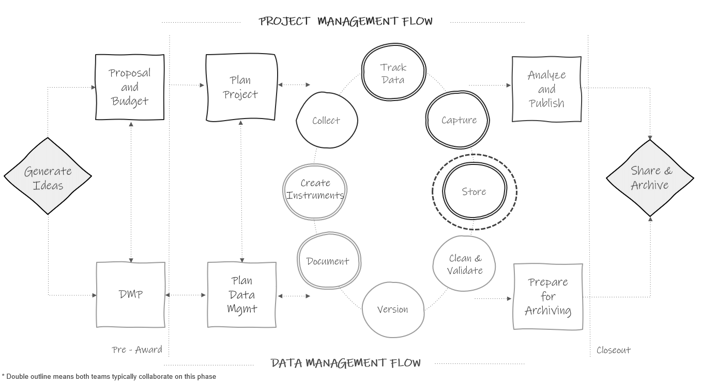

# Data Storage and Security {#store}

```{r fig13-1, fig.cap="Data storage in the research project life cycle."}



```

As you begin to capture data, it is important to have a well-planned structure for securely storing and working with that data during an active study (see Figure \@ref(fig:fig13-1)). Not only do you need a plan for storing data files, but you also need a plan for storing other project files (e.g., meeting notes, documentation, participant tracking databases). Your team should implement this structure early on so that files are stored consistently and securely for the entire project, not just once the data collection life cycle begins. There are several goals to keep in mind when setting up your file storage and security system for an active project.

1. File security: Ensuring that your files are not lost, corrupted, or edited unexpectedly.
2. Protecting confidentiality: Making sure that sensitive information is not seen or accessed by unauthorized individuals.
3. Accessibility and usability of files: Making sure that your team can easily find files and that they are able to understand what the files contain.

## Planning short-term data storage {#store-plan}

When planning a storage and security process, for data files in particular, it is important to gather all relevant information before making a plan. A typical process for developing a plan may begin like this:

1. Review what data needs to be stored and how often.
    - Use documents such as your data sources catalog (see Section \@ref(dmp-catalog)) and your data collection timeline (see Section \@ref(document-supplement)) to better understand your data storage needs.

2. Take an inventory of what data storage solutions are available to you.
    - In terms of electronic data, institutions have different licenses or partnerships with varying software companies and they may approve and not approve different tools (e.g., Dropbox, SharePoint, Box, Google Drive).

3. Consider compliance.
    - Make note of any data storage laws, policies, or agreements that your data is subject to (e.g., IRB policies, data sharing agreements, funder policies).

4. Review classification levels.
    - Review each data source's classification level (see Section \@ref(hsd-dcl)) to ensure that you are choosing storage solutions that are appropriate for the sensitivity level your data.

This process should help narrow down your data storage solutions for each data source. However, from there a series of decisions need to be made depending on the type of data you are working with, paper (e.g., a paper consent form) or electronic (e.g., a CSV file of questionnaire data, a Microsoft Access participant tracking database). The remainder of this section will review a series of decisions to make for each type of data, as well as provide some best practices along the way.

### Electronic data {#store-electronic}

Once you have reviewed all relevant information from Section \@ref(store-plan), several more decisions will need to be made when choosing and setting up your structures for storing and securely working with electronic data.

1. Review additional criteria.
    - After narrowing down storage solutions based on available tools (e.g., cloud storage, institution network drive, personal device) that meet your compliance needs, electronic data storage locations can be further narrowed based on other criteria.
      - Versioning availability: While manual version control is beneficial for major changes, it is very helpful to store your files in a location that has automated file versioning as a fail-safe in case of accidents such as unintended overwriting of files.
      - Size of the storage space: You will need to make sure your storage contains enough space for your files.
        - Consider how many files you will be storing, as well as the amount of information stored in each file (e.g., number of rows and columns in each dataset). The file types you use (e.g., CSV, XLSX, SPSS) also impact the size of a file.
      - Comfort level of your team: It is helpful to choose a storage space that your team is comfortable working in or that you have the ability to train them in how to use it.
      - Accessibility: Consider the accessibility of your storage location for users (e.g., how staff access the location off-site), as well as the compatibility with different operating system.
      - Collaboration: Consider how the storage method handles multi-user editing of files.
      - File sharing: It can be very beneficial to use a storage platform that allows file sharing through links, rather than sharing the actual file. Not only does this better control file access, it also reduces burden and confusion. As an example, if small updates are made to a file after sharing, rather than having to send an updated version, those changes are reflected in the linked file.
      - Costs: Consider if there are any costs associated with your potential storage solutions.

2. Choose a final storage location.
    - While you may be allowed to store files in different locations depending on their sensitivity level, a more effective solution is to create a collaborative research environment [@uk_data_service_research_2023]. To do this, designate the highest level of security needed (e.g., an institution network drive), and keep all, or as many as possible, project-related files stored in that same location, assigning access to files and folders as needed. Keeping all files located in a central, consistent location often provides the benefit of data security (e.g., user access controls, not having different versions of documents on different computers) as well as accessibility (e.g., team members can find documents).
  
3. Design your folder structure according to your style guide.
    - Following your style guide (see Section \@ref(style-directory)), create a folder structure **before** team members begin storing files so that they are stored consistently. 
      - –	Importantly, make sure to set up your structure in a way that stores identifiable information (e.g., participant tracking database, consent forms) separate from your research study data.

4. Set up additional security systems.
    - Data backups.
      - It is important to regularly backup up your data. Consider using something similar to the 3-2-1 rule, keeping three copies of your data, on two different types of storage media, in more than one location to guard against data loss [@briney_data_2015; @uk_data_service_research_2023]. Talk with your institution IT department for help with setting up this system.
    - User access.
      - Assign user access to folders and files based on sensitivity levels, quality control needs, and applicable policies, agreements, or plans.

5. Designate rules for working securely with data.
    - Complete required trainings (e.g., CITI trainings, IT training, internal training).
    - Consistently name folders and files according to the style guide (see Sections \@ref(style-directory) and \@ref(style-file)).
    - Do not keep copies of files.
      - Outside of making data backups, do not keep copies of files in different folders. This opens the door for edits being made to one copy and not the other. If this happens, team members may be working with different versions of files. If you want to have a copy of a file in more than one location (e.g., an SOP in the "documentation" folder and the "project_coordination" folder), some storage systems allow you to link to documents from other location (i.e., the "project_coordination" folder contains a link to an SOP in the "documentation" folder).
    - Secure your devices [@otoole_data_2018; @princeton_university_best_2023].
      - Choose safe passwords to protect devices.
      - Do not leave devices open and unattended when working in the field.
      - Have protection on your devices (e.g., up-to-date antivirus software, firewall, encryption).
      - When working remotely, use password-protected Wi-Fi and use secure connections (e.g., VPN, 2FA) when working with data files.
      - Any files stored on detachable media (e.g., external hard drives, CDs, flash drives) should typically be stored behind two locks when not in use (e.g., a locked file cabinet in a locked storage room).
    - Securely transmit data files.
      - When transmitting data, either internally or externally, it is important that you use secure methods, especially when data contain PII. As a general rule, no moderate or highly sensitive data should be transmitted via email. Use a secure, institution-approved, file transfer method that includes encryption.
      
### Paper data {#store-paper}

Working with paper data involves reviewing another set of decisions when planning for data storage and security. 

1. Choose a final storage location.
    - After reviewing available locations as well as applicable laws, policies, and agreements, you will want to consider additional criteria such as accessibility of the storage site, your physical storage size needs, storage costs, and the security of the location. Most commonly required for any files containing PII is to store them behind two locks.

2. Consistently structure your file cabinets and folders.
    - While you may not have a style guide created for organizing physical folders and files, it is still important to consistently structure and name them for clarity. As an example, organize drawers by time period (e.g., wave 1), and further organize folders by data source (e.g., student survey).

3. Securely work with files.
    - As discussed in Sections \@ref(collect-field) and \@ref(capture-entry), as team members work with files, it is important that staff understand the rules and process for returning files back to the designated storage location when not in use (i.e., no files left on desks). 

### Oversight   

Whether working with electronic or paper data, make sure to assign responsibilities to team members for tasks such as creating electronic directory structures or physical folder structures, adding and removing storage access, overseeing data backups, and monitoring training compliance. Without oversight of these processes, it is easy for errors to occur. 

## Documentation and dissemination

After you make a plan for short-term data storage, that plan should be added to all necessary documentation (e.g., DMP, research protocol, informed consent forms, SOPs). Once your plan has been approved, it is important to not deviate from that plan unless your revisions have also been approved. This is especially important in the case of agreements (e.g., informed consent, data sharing agreements), where it is important to honor any terms laid out in those agreements. 

Last, all information needs to be disseminated to team members to ensure fidelity to your data storage and security plan. Add pertinent information to documents that staff are required to review (i.e., team data security policy or onboarding/offboarding checklists) to ensure the information is reviewed. In addition, make sure to embed this information into any team or project-related staff training.
