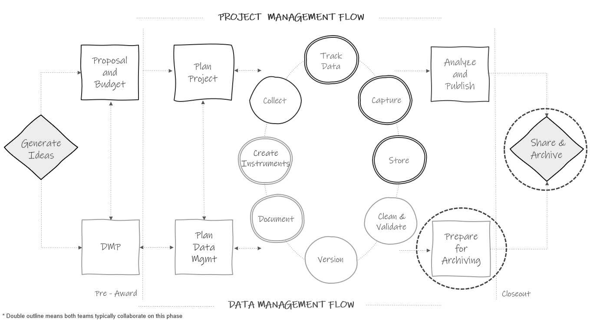

# Data Archiving {#store-long}

```{r fig15-1, fig.cap="Long-term data storage in the research project life cycle"}



```

Once you have gone through all cycles of data collection and you are preparing to wrap up your grant, you will need to switch gears and start thinking about archiving your data to ensure that your files are still accessible and usable, long after a project is complete. While your project may be ending, there are still many reasons to retain your data long-term including future analyses, opportunities to make corrections (e.g., going back to paper files if an error is found in the data), and data retention requirements from funders and institutions. In this section we will discuss how to care for files internally, while public data sharing and archiving will be discussed in Chapter \@ref(share). However, these processes (preparing to internally archive and preparing to publicly share data) will most likely be happening at the same time.

## Long-term storage

The first thing to do when planning to store your data long-term is review your requirements for data retention and destruction. There may be requirements for both data retention and destruction depending on your oversight (see Section \@ref(hsd-oversight)). It is common for oversight to require that you retain your data anywhere from 3-10 years and there may be specific destruction requirements for data that contain personally identifiable information (PII) or data covered by a data use agreement. Make sure to review relevant policies and agreements to determine what is required.

Once you understand requirements, make a plan for retention and destruction. If you are required to retain your data for a specified number of years, consider how you will continue to store data and documents in a way that meets your original goals (e.g., data safety, protecting confidentiality, accessibility and usability of files). You will need to consider both paper and electronic files.

### Paper data

At the end of your project, you will want to begin boxing up paper files for long-term storage. Make sure to clearly label all boxes in case you need to return to files at a later point. Many institutions have records management departments that can assist you with long-term storage of paper files. These departments may be able to store your physical files for a designated set of time, as well as assist in destruction of files once that period has ended. Note that you may not want to use this solution until you are certain you will no longer need to easily access your paper files (e.g., for fixing errors, entering any additional information). If destroying paper files on your own, make sure to choose a quality destruction method such as paper shredding.

### Electronic data

For electronic data long-term storage, you will want to consider two things---file formats and storage location [@borer_simple_2009; @briney_data_2015].

- File formats  
  - First, choose file types that are widely used (i.e., don't require proprietary software) for both accessibility as well as preventing your file formats from becoming obsolete (see Table \@ref(tab:tab15-1)). This means that you can still keep copies of your files in a format such as SPSS if you prefer, but it is good practice to have a second copy of your data in a non-proprietary format such as CSV. Your documentation file formats should also be considered. Formats such as PDF or TXT are often recommended for long-term storage of text documents while CSV is a good format for tabular data dictionaries.  
- Storage location  
  - Similar to choosing file formats, choose a storage location that is accessible and not at risk of becoming corrupt or obsolete (e.g., think obsolescence of floppy disks). Also, make sure that you are able to continue restricting access as needed. If your short-term storage solution meets these requirements (e.g., your institution network drive), you may not need to do anything different in preparing for long-term storage, but it will be important to continue implementing good practices to keep your data safe (e.g., continuing data backups, checking that hardware and software are up to date).   
  - Within your storage location, consider copying all finalized datasets (i.e., cleaned and de-identified) into a "master data" folder for ease of future accessibility. Restrict access to reduce unintended modification of files.  
    - Design this "master data" folder like you would a public repository folder (see Section \@ref(share-file))  
      - Add a README that describes what files the folder contains.  
      - Copy relevant documentation from other locations to this folder (e.g., data dictionaries, project-level documentation).  

When it comes time to destroy data, make sure to permanently delete files, including all backups of files. When deleting PII, this often involves more than just moving files to the recycle bin on your computer. Work with your institution IT department during this process.

<br>    
```{r tab15-1}

library(tidyverse)

tibble::tribble (~Type, ~`Non-proprietary formats`, ~`Other commonly accepted formats`,
                "Text documentation", "TXT, HTML, XML", "PDF, DOCX",
                 "Rectangular documentation", "CSV", "XLSX",
                 "Datasets", "CSV, TSV", "SPSS, STATA, SAS, R, XLSX") %>%
  knitr::kable(caption = "Potential long-term storage file types")
  
```

### Oversight and documentation

Last, make sure to document your plan, including time frames for retention and destruction, in the appropriate locations (e.g., DMP, research protocol, informed consent agreements, team data security policy). Assign and document responsibilities for short-term tasks such as boxing or relocation of files, as well as ongoing long-term tasks such as maintenance or destruction of files.

<br>

**Resources**

|Source|Resource|
|--------|-----------|
|Kristin Briney |Project Close-Out Checklist for Research Data ^[https://authors.library.caltech.edu/records/yr0y9-z4q70]|

## Internal data use {#store-long-use}

At the end of a project, or possibly earlier in the project, team members will want to begin analyzing data. It is important to consider how you will make team members aware of what data is available and how you will allow team members, and other research collaborators, to access data. Most likely you will not want researchers going into folders and grabbing datasets without consulting with a core team member first. Therefore, it is important to develop a system for providing data to researchers on an as-needed basis. Create a data request process for team members, or external collaborators, to request access to finalized study datasets. Several things will need to be considered.

1. Add descriptions of the finalized datasets to a data inventory to inform your team of their availability (see Section \@ref(document-inventory)).  
2. Design a system for requesting access (e.g., designate a person to email, develop a survey form that is submitted to a designated person).
    - In that system, the researcher should describe what data they are requesting, including the exact variables they need and from what time periods, as well as the purpose of their analysis. It may be helpful to build a data request process that involves providing data dictionaries and other documentation to researchers to review before requesting data.
    - This system should also include collecting any required agreement forms from requestors (e.g., data sharing agreements).
3. Decide who needs to review the request to ensure the application is complete (e.g., a data manager), and who needs to give final approval for the data request submission (e.g., a principal investigator).
4. Design a system for gathering data for requestors (e.g., provide researchers with full datasets, narrow datasets based on specific requests).
    - If narrowing datasets for researchers, where will new datasets be stored? (e.g., a "data request" folder)
5. Consider how you will share datasets with researchers (e.g., a secure link to a cloud folder, using secure file transfer).
6. Consider how you will track data requests.
    - It is important to keep track of data requests in case you need to reach back out to researchers for situations such as errors found in the data. One way to do this is to keep a data request log. The log can include information such as name of researcher, date of request, project requesting data for, researcher email, and any other helpful tracking information (e.g., agreement received, dataset shared). Using this log, you can reach back out to researchers as needed to inform them of any updates regarding the shared data.

Here is an example of how you might structure a data request folder.
  
```
data_requests/
├── data_request_log.xlsx
├── lastname1_firstname1
|   ├── projname_lname-fname_data-sharing-agreement_2023-04-08.pdf
│   ├── projname_stu_svy_clean_lname-fname_2023-05-02.csv
│   └── projname_stu_svy_data-dictionary.xlsx
├── lastname2_firstname2
│   ├── archive
│   |   ├── changelog.xlsx
|   |   └── projname_tch_svy_clean_lname2-fname2_2023-05-15.csv
|   ├── projname_lname2-fname2_data-sharing-agreement_2023-04-22.pdf
│   ├── projname_tch_svy_clean_lname2-fname2_2023-06-10.csv
|   └── projname_tch_svy_data-dictionary.xlsx
└── ...

```

Ultimately, you want to establish a standardized and efficient process that reduces the burden on team members responsible for reviewing, approving, and fulfilling data requests and also removes any ambiguity about how users should request access to data [@institute_of_education_sciences_slds_2019]. As always, roles and responsibilities will need to be assigned to each step of this process. Often the person who facilitates internal data requests for one project, will likely be the same person that fulfills data requests for all projects. Document this request process in your data security policy (see Section \@ref(document-security)) so that team members know how to request data and who to work with.

## Using a repository

Last, if maintaining your electronic data long-term sounds like too much effort for your team, there are other options. Many universities have institutional repositories that may include services such as data curation and preservation. Additionally, there are several external repositories that offer curation and preservation services where you may be able to deposit your data for long-term storage. It's possible that depositing your data in one of these two options may also align with publicly sharing your data, which we will review in Chapter \@ref(share).
  