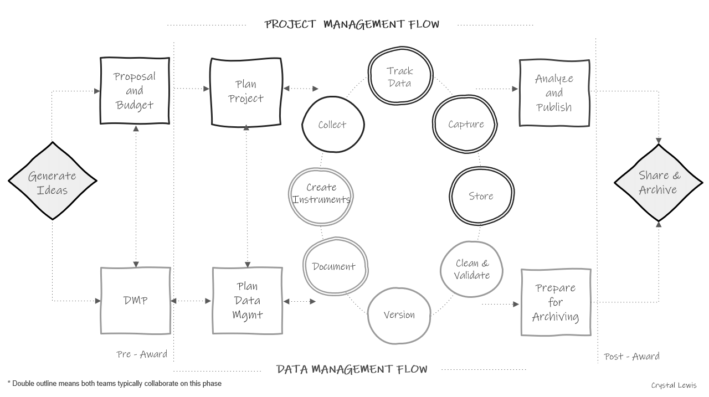

# Research Data Management

## What is research data management?

Research data management (RDM) involves the organization, storage, preservation, and dissemination of research study data [@bordelon_guides_nodate]. Research study data includes materials generated or collected throughout a research process [@national_endowment_for_the_humanities_data_2018]. As you can imagine, this broad definition includes much more than just the management of digital datasets. It also includes physical files, documentation, artifacts, recordings, and more. RDM is a substantial undertaking that begins long before data is ever collected, during the planning phase, and continues well after a research project ends during the archiving phase. 

## Standards

Data management standards refer to rules for how data should be stored, organized, and described [@borghi_promoting_2022]. While some fields have generally adopted metadata standards developed by organizations such as the Data Documentation Initiative [@noauthor_welcome_nodate] and Dublin Core [@noauthor_dcmi_nodate] (we'll talk about this more in documentation [\@ref(documentation)]), and some have adopted data structure standards developed by organizations like the Text Encoding Initiative [@noauthor_tei_nodate], it is common knowledge that there are no agreed-upon norms for how to structure and share data in the field of education [@institute_of_education_sciences_frequently_nodate]. The rules for what data should be produced and how it should be documented is often left up to each individual team, as long as external compliance requirements are met [@tenopir_data_2016-1]. However, with a growing interest in open science practices and expanding requirements for federally funded research to make data publicly available [@office_of_science_and_technology_policy_ostp_2022], data repositories will most likely begin to play a stronger role in promoting standards around data formats and documentation [@borghi_promoting_2022].

While field standards for the structure and format of publicly shared products that aid in the preservation and re-use of data are very much needed, there are actually good reasons to not impose standardization on all data management activities across the field. Granting some flexibility in the process of managing data during active data collection allows teams to implement the best practices that work for their projects, as long as those projects implement practices consistently during their project and produce similar quality outputs across the field.


## Why care about research data management?

Without current agreed-upon standards in the field, it is important for research teams to develop their own data management standards that apply within and across all of their projects. Developing internal standards, implemented in a reproducible data management workflow \@ref(workflow), allows practices to be implemented consistently and with fidelity. There are both external pressures and personal reasons to care about developing research data management standards for your projects.

### External Reasons

1. **Funder compliance**: Any researcher applying for federal funding will be required to submit a data management plan (DMP) along with their grant proposal[@office_of_science_and_technology_policy_ostp_2022]. The contents of these plans may vary slightly across agencies but the shared purpose of these documents is to facilitate good data management practices and to mandate open sharing of data to maximize scientific outputs and benefits to society. Along with this mandatory data sharing policy, comes the incentive to manage your data for the purposes of data sharing [@borghi_promoting_2022].

1. **Journal compliance**: Depending on what journal you publish with, providing open access to the data associated with your publication may be a requirement (see PLOS ONE[@plos_one_data_nodate] as an example). Again, along with data sharing, comes the incentive to manage your data in a thoughtful, responsible, and organized way.

1. **Compliance with legal and ethical mandates**: If you are required to submit your research project to the Institutional Review Board, they will monitor how you manage your data. They care about the welfare, rights, and privacy of research participants and will have rules for how data is managed and stored securely. Additionally your organization may have their own institutional data policies that mandate how data must be cared for and secured [@association_of_academic_health_science_libraries_institutional_2022].

1. **Open science practices**: With a growing interest in open science practices, sharing well managed data, curated in a reproducible way is "a strong indicator to fellow researchers of rigor, trustworthiness, and transparency in scientific research" (Alston & Rick, 2021, p.2 [@alston_beginners_2021]). Sharing data that has been managed in a reproducible way also allows others to learn from your work, validate your results to strengthen evidence, as well as potentially catch errors in your work, preventing decisions being made based on incorrect data [@alston_beginners_2021]. Well-managed data with sufficient documentation can also lead to more collaboration and greater impact as collaborators are able to access and understand your data with ease [@borghi_promoting_2022; @cowles_research_nodate; @eaker_what_2016].

### Personal reasons

Even if you never plan to share your data outside of your research group, there are still many compelling reasons to manage your data in a reproducible and standardized way. 

1. **Facilitates use of your data**: Every member of your research team being able to able to find and understand the data and documentation that they need is a huge benefit. It allows for the easy use and re-use of your data, and hastens efforts like the publication process [@markowetz_five_2015]. Not having to search around for numbers of consented participants or asking which version of the data they should use allows your team to spend more time analyzing and writing and less time playing detective.

1. **Encourages validation**: Implementing reproducible data management practices encourages and allows your team to internally validate and replicate your processes to ensure your outputs are accurate.

1. **Improves continuity**: Data management practices such as documentation ensures project continuity through staff turnover. Having developed thorough protocols allows new staff to pick up right where the former staff member left off and implement the project with fidelity [@borghi_data_2021; @cowles_research_nodate]. Furthermore, good data management enables continuity when handing off projects to collaborators or when picking up your own projects after a long hiatus [@markowetz_five_2015].

1. **Increases efficiency**: Documenting and automating tasks reduces duplication of efforts for repeating tasks, especially in longitudinal studies.

1. **Reduces data curation debt**: Taking the time to implement quality data management through the entire research study reduces data curation debt caused by suboptimal data management practices [@butters_recognizing_2020]. Having poorly managed or documented data may make your data unusable, either permanently or until errors are corrected. Decreasing or removing this debt reduces the time, energy, and resources spent at the end of your study scrambling to get your data up to acceptable standards.

1. **Upholds research integrity**: Errors come in many forms, from both humans and technology. We've seen evidence of this in the papers cited as being retracted for "unreliable data" in the blog [Retraction Watch](https://retractionwatch.com/). Implementing quality control procedures reduces the chances of errors occurring and allows you to have confidence in your data. Without implementing these practices, your research findings could include extra noise, missing data, or erroneous or misleading results.

1. **Improves data security**: Quality data management practices reduce the risk of lost or stolen data, the risk of data becoming corrupted or inaccessible, and the risk of breaking confidentiality agreements.


## Existing Frameworks

Data management does not live in a space all alone. It co-exists with other frameworks that impact how and why data is managed and it is important to be familiar with them as they will provide a foundation for you as you build your data management structures. 

### FAIR

In 2016, the FAIR Principles [@noauthor_fair_nodate] were published in Scientific Data, outlining four guiding principles for scientific data management and stewardship. These principles were created to improve and support the reuse of scholarly data, specifically the ability of machines to access and read data, and are the foundation for how all digital data should be publicly shared [@wilkinson_fair_2016]. The principles are:

F: Findable

All data should be findable through a persistent identifier and have good data documentation. As we move towards automation in our work and life, the need for machine-readable metadata becomes more prevalent for automatic discovery of data.

A: Accessible

You data is accessible if humans can access your data. This can mean your data is available in a repository or through a request system.

I: Interoperable

Use standardized vocabularies as well as formats. Both humans and machines should be able to read and interpret your data. Software licenses should not pose a barrier to usage. Data should be available in open formats that can be accessed by any software such as .csv, .txt, .dat, etc. Furthermore, thorough data documentation should accompany data to allow that data to interoperable.

R: Reusable

Your metadata should provide information on the broad context of your project as well as your data collection to allow for accurate use of your data. You should also have clear licensing for data use.

### SEER

In addition to the FAIR principles, the SEER principles, developed in 2018 by Institute of Education Sciences (IES), provide Standards for Excellence in Education Research [@noauthor_standards_nodate]. While the principles broadly cover the entire life cycle of a research study, they provide context for good data management within an education research study. The SEER principles include:

- Pre-register studies
- Make findings, methods, and data open
- Identify interventions’ core components
- Document treatment implementation and contrast
- Analyze interventions’ costs
- Focus on meaningful outcomes
- Facilitate generalization of study findings
- Support scaling of promising results

### Open Science

The concept of Open Science has pushed quality data management to the forefront, bringing visibility to its cause, as well as advances in practices and urgency to implement them. Open Science aims to make scientific research and dissemination accessible for all, making the need for good data management practices absolutely necessary. Open science advocates for transparent and reproducible practices through means such as open data, open analysis, open materials, preregistration, and open access [@van_dijk_open_2021]. Organizations such as the Center for Open Science [@science_center_nodate], have become a well-known proponents of open science, offering the open science framework (OSF) [@foster_open_2017] as a tool to promote open science through the entire research life cycle. Furthermore, many education funders have aligned their fundee requirements with these open science practices, such as openly sharing study data and pre-registration of study methods.

## Terminology

Before diving into the content of this training, I think it is helpful to cover terminology that will be used in data management. Many concepts in education research have multiple terms and can be used interchangeably. Across different institutions, researchers may use all or some of these terms.


```{=html}
<div id="ferokxlmfz" style="overflow-x:auto;overflow-y:auto;width:auto;height:auto;">
<style>html {
  font-family: -apple-system, BlinkMacSystemFont, 'Segoe UI', Roboto, Oxygen, Ubuntu, Cantarell, 'Helvetica Neue', 'Fira Sans', 'Droid Sans', Arial, sans-serif;
}

#ferokxlmfz .gt_table {
  display: table;
  border-collapse: collapse;
  margin-left: auto;
  margin-right: auto;
  color: #333333;
  font-size: 16px;
  font-weight: normal;
  font-style: normal;
  background-color: #FFFFFF;
  width: auto;
  border-top-style: solid;
  border-top-width: 2px;
  border-top-color: #A8A8A8;
  border-right-style: none;
  border-right-width: 2px;
  border-right-color: #D3D3D3;
  border-bottom-style: solid;
  border-bottom-width: 2px;
  border-bottom-color: #A8A8A8;
  border-left-style: none;
  border-left-width: 2px;
  border-left-color: #D3D3D3;
}

#ferokxlmfz .gt_heading {
  background-color: #FFFFFF;
  text-align: center;
  border-bottom-color: #FFFFFF;
  border-left-style: none;
  border-left-width: 1px;
  border-left-color: #D3D3D3;
  border-right-style: none;
  border-right-width: 1px;
  border-right-color: #D3D3D3;
}

#ferokxlmfz .gt_title {
  color: #333333;
  font-size: 125%;
  font-weight: initial;
  padding-top: 4px;
  padding-bottom: 4px;
  padding-left: 5px;
  padding-right: 5px;
  border-bottom-color: #FFFFFF;
  border-bottom-width: 0;
}

#ferokxlmfz .gt_subtitle {
  color: #333333;
  font-size: 85%;
  font-weight: initial;
  padding-top: 0;
  padding-bottom: 6px;
  padding-left: 5px;
  padding-right: 5px;
  border-top-color: #FFFFFF;
  border-top-width: 0;
}

#ferokxlmfz .gt_bottom_border {
  border-bottom-style: solid;
  border-bottom-width: 2px;
  border-bottom-color: #D3D3D3;
}

#ferokxlmfz .gt_col_headings {
  border-top-style: solid;
  border-top-width: 2px;
  border-top-color: #D3D3D3;
  border-bottom-style: solid;
  border-bottom-width: 2px;
  border-bottom-color: #D3D3D3;
  border-left-style: none;
  border-left-width: 1px;
  border-left-color: #D3D3D3;
  border-right-style: none;
  border-right-width: 1px;
  border-right-color: #D3D3D3;
}

#ferokxlmfz .gt_col_heading {
  color: #333333;
  background-color: #FFFFFF;
  font-size: 100%;
  font-weight: normal;
  text-transform: inherit;
  border-left-style: none;
  border-left-width: 1px;
  border-left-color: #D3D3D3;
  border-right-style: none;
  border-right-width: 1px;
  border-right-color: #D3D3D3;
  vertical-align: bottom;
  padding-top: 5px;
  padding-bottom: 6px;
  padding-left: 5px;
  padding-right: 5px;
  overflow-x: hidden;
}

#ferokxlmfz .gt_column_spanner_outer {
  color: #333333;
  background-color: #FFFFFF;
  font-size: 100%;
  font-weight: normal;
  text-transform: inherit;
  padding-top: 0;
  padding-bottom: 0;
  padding-left: 4px;
  padding-right: 4px;
}

#ferokxlmfz .gt_column_spanner_outer:first-child {
  padding-left: 0;
}

#ferokxlmfz .gt_column_spanner_outer:last-child {
  padding-right: 0;
}

#ferokxlmfz .gt_column_spanner {
  border-bottom-style: solid;
  border-bottom-width: 2px;
  border-bottom-color: #D3D3D3;
  vertical-align: bottom;
  padding-top: 5px;
  padding-bottom: 5px;
  overflow-x: hidden;
  display: inline-block;
  width: 100%;
}

#ferokxlmfz .gt_group_heading {
  padding-top: 8px;
  padding-bottom: 8px;
  padding-left: 5px;
  padding-right: 5px;
  color: #333333;
  background-color: #FFFFFF;
  font-size: 100%;
  font-weight: initial;
  text-transform: inherit;
  border-top-style: solid;
  border-top-width: 2px;
  border-top-color: #D3D3D3;
  border-bottom-style: solid;
  border-bottom-width: 2px;
  border-bottom-color: #D3D3D3;
  border-left-style: none;
  border-left-width: 1px;
  border-left-color: #D3D3D3;
  border-right-style: none;
  border-right-width: 1px;
  border-right-color: #D3D3D3;
  vertical-align: middle;
}

#ferokxlmfz .gt_empty_group_heading {
  padding: 0.5px;
  color: #333333;
  background-color: #FFFFFF;
  font-size: 100%;
  font-weight: initial;
  border-top-style: solid;
  border-top-width: 2px;
  border-top-color: #D3D3D3;
  border-bottom-style: solid;
  border-bottom-width: 2px;
  border-bottom-color: #D3D3D3;
  vertical-align: middle;
}

#ferokxlmfz .gt_from_md > :first-child {
  margin-top: 0;
}

#ferokxlmfz .gt_from_md > :last-child {
  margin-bottom: 0;
}

#ferokxlmfz .gt_row {
  padding-top: 8px;
  padding-bottom: 8px;
  padding-left: 5px;
  padding-right: 5px;
  margin: 10px;
  border-top-style: solid;
  border-top-width: 1px;
  border-top-color: #D3D3D3;
  border-left-style: none;
  border-left-width: 1px;
  border-left-color: #D3D3D3;
  border-right-style: none;
  border-right-width: 1px;
  border-right-color: #D3D3D3;
  vertical-align: middle;
  overflow-x: hidden;
}

#ferokxlmfz .gt_stub {
  color: #333333;
  background-color: #FFFFFF;
  font-size: 100%;
  font-weight: initial;
  text-transform: inherit;
  border-right-style: solid;
  border-right-width: 2px;
  border-right-color: #D3D3D3;
  padding-left: 5px;
  padding-right: 5px;
}

#ferokxlmfz .gt_stub_row_group {
  color: #333333;
  background-color: #FFFFFF;
  font-size: 100%;
  font-weight: initial;
  text-transform: inherit;
  border-right-style: solid;
  border-right-width: 2px;
  border-right-color: #D3D3D3;
  padding-left: 5px;
  padding-right: 5px;
  vertical-align: top;
}

#ferokxlmfz .gt_row_group_first td {
  border-top-width: 2px;
}

#ferokxlmfz .gt_summary_row {
  color: #333333;
  background-color: #FFFFFF;
  text-transform: inherit;
  padding-top: 8px;
  padding-bottom: 8px;
  padding-left: 5px;
  padding-right: 5px;
}

#ferokxlmfz .gt_first_summary_row {
  border-top-style: solid;
  border-top-color: #D3D3D3;
}

#ferokxlmfz .gt_first_summary_row.thick {
  border-top-width: 2px;
}

#ferokxlmfz .gt_last_summary_row {
  padding-top: 8px;
  padding-bottom: 8px;
  padding-left: 5px;
  padding-right: 5px;
  border-bottom-style: solid;
  border-bottom-width: 2px;
  border-bottom-color: #D3D3D3;
}

#ferokxlmfz .gt_grand_summary_row {
  color: #333333;
  background-color: #FFFFFF;
  text-transform: inherit;
  padding-top: 8px;
  padding-bottom: 8px;
  padding-left: 5px;
  padding-right: 5px;
}

#ferokxlmfz .gt_first_grand_summary_row {
  padding-top: 8px;
  padding-bottom: 8px;
  padding-left: 5px;
  padding-right: 5px;
  border-top-style: double;
  border-top-width: 6px;
  border-top-color: #D3D3D3;
}

#ferokxlmfz .gt_striped {
  background-color: rgba(128, 128, 128, 0.05);
}

#ferokxlmfz .gt_table_body {
  border-top-style: solid;
  border-top-width: 2px;
  border-top-color: #D3D3D3;
  border-bottom-style: solid;
  border-bottom-width: 2px;
  border-bottom-color: #D3D3D3;
}

#ferokxlmfz .gt_footnotes {
  color: #333333;
  background-color: #FFFFFF;
  border-bottom-style: none;
  border-bottom-width: 2px;
  border-bottom-color: #D3D3D3;
  border-left-style: none;
  border-left-width: 2px;
  border-left-color: #D3D3D3;
  border-right-style: none;
  border-right-width: 2px;
  border-right-color: #D3D3D3;
}

#ferokxlmfz .gt_footnote {
  margin: 0px;
  font-size: 90%;
  padding-left: 4px;
  padding-right: 4px;
  padding-left: 5px;
  padding-right: 5px;
}

#ferokxlmfz .gt_sourcenotes {
  color: #333333;
  background-color: #FFFFFF;
  border-bottom-style: none;
  border-bottom-width: 2px;
  border-bottom-color: #D3D3D3;
  border-left-style: none;
  border-left-width: 2px;
  border-left-color: #D3D3D3;
  border-right-style: none;
  border-right-width: 2px;
  border-right-color: #D3D3D3;
}

#ferokxlmfz .gt_sourcenote {
  font-size: 90%;
  padding-top: 4px;
  padding-bottom: 4px;
  padding-left: 5px;
  padding-right: 5px;
}

#ferokxlmfz .gt_left {
  text-align: left;
}

#ferokxlmfz .gt_center {
  text-align: center;
}

#ferokxlmfz .gt_right {
  text-align: right;
  font-variant-numeric: tabular-nums;
}

#ferokxlmfz .gt_font_normal {
  font-weight: normal;
}

#ferokxlmfz .gt_font_bold {
  font-weight: bold;
}

#ferokxlmfz .gt_font_italic {
  font-style: italic;
}

#ferokxlmfz .gt_super {
  font-size: 65%;
}

#ferokxlmfz .gt_two_val_uncert {
  display: inline-block;
  line-height: 1em;
  text-align: right;
  font-size: 60%;
  vertical-align: -0.25em;
  margin-left: 0.1em;
}

#ferokxlmfz .gt_footnote_marks {
  font-style: italic;
  font-weight: normal;
  font-size: 75%;
  vertical-align: 0.4em;
}

#ferokxlmfz .gt_asterisk {
  font-size: 100%;
  vertical-align: 0;
}

#ferokxlmfz .gt_slash_mark {
  font-size: 0.7em;
  line-height: 0.7em;
  vertical-align: 0.15em;
}

#ferokxlmfz .gt_fraction_numerator {
  font-size: 0.6em;
  line-height: 0.6em;
  vertical-align: 0.45em;
}

#ferokxlmfz .gt_fraction_denominator {
  font-size: 0.6em;
  line-height: 0.6em;
  vertical-align: -0.05em;
}
</style>
<table class="gt_table">
  
  <thead class="gt_col_headings">
    <tr>
      <th class="gt_col_heading gt_columns_bottom_border gt_left" rowspan="1" colspan="1">Term</th>
      <th class="gt_col_heading gt_columns_bottom_border gt_left" rowspan="1" colspan="1">Other Terms</th>
      <th class="gt_col_heading gt_columns_bottom_border gt_left" rowspan="1" colspan="1">Definition</th>
    </tr>
  </thead>
  <tbody class="gt_table_body">
    <tr><td class="gt_row gt_left">Anonymous data</td>
<td class="gt_row gt_left">NA</td>
<td class="gt_row gt_left">Identifying information was never collected. This data can not be linked across time or measures.</td></tr>
    <tr><td class="gt_row gt_left">Append</td>
<td class="gt_row gt_left">NA</td>
<td class="gt_row gt_left">Stacking datasets on top of each other (matching variables).</td></tr>
    <tr><td class="gt_row gt_left">Archive</td>
<td class="gt_row gt_left">NA</td>
<td class="gt_row gt_left">The transfer of data to a facility, such as a repository, that preserves and stores data long-term.</td></tr>
    <tr><td class="gt_row gt_left">Attrition</td>
<td class="gt_row gt_left">NA</td>
<td class="gt_row gt_left">The loss of study units from the sample, often seen in longitudinal studies.</td></tr>
    <tr><td class="gt_row gt_left">Clean data</td>
<td class="gt_row gt_left">processed data</td>
<td class="gt_row gt_left">Any data that has been manipulated or modified.</td></tr>
    <tr><td class="gt_row gt_left">Cohort</td>
<td class="gt_row gt_left">NA</td>
<td class="gt_row gt_left">A group of participants recruited into the study at the same time.</td></tr>
    <tr><td class="gt_row gt_left">Confidential data</td>
<td class="gt_row gt_left">pseudonymisation, coded data, indirectly identifiable</td>
<td class="gt_row gt_left">Personally identifiable information (PII) in your data has been removed and names are replaced with a code and the only way to link the data back to an individual is through that code. The identifying code file (linking key) is stored separate from the research data.</td></tr>
    <tr><td class="gt_row gt_left">Confidentiality</td>
<td class="gt_row gt_left">NA</td>
<td class="gt_row gt_left">Confidentiality concerns data. Ensuring participants agree to how their private and identifable information will be managed and disseminated.</td></tr>
    <tr><td class="gt_row gt_left">Control</td>
<td class="gt_row gt_left">business as usual</td>
<td class="gt_row gt_left">The individual or group does not receive the intervention.</td></tr>
    <tr><td class="gt_row gt_left">Cross-sectional</td>
<td class="gt_row gt_left">NA</td>
<td class="gt_row gt_left">Data is collected on participants for a single time point.</td></tr>
    <tr><td class="gt_row gt_left">Data</td>
<td class="gt_row gt_left">research data</td>
<td class="gt_row gt_left">The recorded factual material commonly accepted in the scientific community as necessary to validate research findings (OMB Circular A-110).</td></tr>
    <tr><td class="gt_row gt_left">Database</td>
<td class="gt_row gt_left">relational database</td>
<td class="gt_row gt_left">An organized collection of related data stored in tables that can be linked together by a common identifier.</td></tr>
    <tr><td class="gt_row gt_left">Dataset</td>
<td class="gt_row gt_left">dataframe, spreadsheet</td>
<td class="gt_row gt_left">A structured collection of data usually stored in tabular form. A research study usually produces one final dataset per entity/unit (ex: teacher dataset, student dataset).</td></tr>
    <tr><td class="gt_row gt_left">De-identified data</td>
<td class="gt_row gt_left">anonymized data</td>
<td class="gt_row gt_left">Identifying information has been removed or distorted and the data can no longer be re-associated with the underlying individual (the linking key no longer exists).</td></tr>
    <tr><td class="gt_row gt_left">Derived Data</td>
<td class="gt_row gt_left">NA</td>
<td class="gt_row gt_left">Data created through transformations of existing data.</td></tr>
    <tr><td class="gt_row gt_left">Directory</td>
<td class="gt_row gt_left">file structure</td>
<td class="gt_row gt_left">A cataloging structure for files and folders on your computer.</td></tr>
    <tr><td class="gt_row gt_left">Experimental Data</td>
<td class="gt_row gt_left">NA</td>
<td class="gt_row gt_left">Data collected from a study where researchers randomly introduce an intervention and study the effects.</td></tr>
    <tr><td class="gt_row gt_left">Extant Data</td>
<td class="gt_row gt_left">NA</td>
<td class="gt_row gt_left">Existing data sources created from external to the research team/study.</td></tr>
    <tr><td class="gt_row gt_left">File formats</td>
<td class="gt_row gt_left">NA</td>
<td class="gt_row gt_left">Education research data is typically collected in one of three file formats: text( .txt, .pdf, .docx), tabular (.xlsx, .csv, .sav) , multimedia (.mpeg, .wav).</td></tr>
    <tr><td class="gt_row gt_left">Identifiable data</td>
<td class="gt_row gt_left">NA</td>
<td class="gt_row gt_left">Data that includes personally identifiable information.</td></tr>
    <tr><td class="gt_row gt_left">Longitudinal</td>
<td class="gt_row gt_left">NA</td>
<td class="gt_row gt_left">Data is collected on participants over a period of time.</td></tr>
    <tr><td class="gt_row gt_left">Merge</td>
<td class="gt_row gt_left">join, link</td>
<td class="gt_row gt_left">Combining datasets together in a side by side manner (matching on an identifier).</td></tr>
    <tr><td class="gt_row gt_left">Missing data</td>
<td class="gt_row gt_left">NA</td>
<td class="gt_row gt_left">Occurs when there is no data stored in a variable for a particular observation/respondent.</td></tr>
    <tr><td class="gt_row gt_left">Observational Data</td>
<td class="gt_row gt_left">NA</td>
<td class="gt_row gt_left">Data collected from a study where researchers are observing the effect of an intervention without manipulating who is exposed to the intervention. This includes many formats that education researchers collect data with (ex: survey, observation, assessment).</td></tr>
    <tr><td class="gt_row gt_left">Participant database</td>
<td class="gt_row gt_left">study roster, demographic file, master list, master key, linking key, code key, key code, main list, identifiers dataset, crosswalk, record keeping, tracking, participant tracking</td>
<td class="gt_row gt_left">This database, or spreadsheet, includes any identifiable information on your participants as well as their assigned study ID. It is your only own means of linking your confidential research study data to a participant’s true identity. It is also used to track data collected across time and measures as well as participant attrition.</td></tr>
    <tr><td class="gt_row gt_left">Path</td>
<td class="gt_row gt_left">file path</td>
<td class="gt_row gt_left">A string of characters used to locate files in your directory system.</td></tr>
    <tr><td class="gt_row gt_left">PII</td>
<td class="gt_row gt_left">NA</td>
<td class="gt_row gt_left">Personally identifiable information is protected information that can directly or indirectly identify a study participant. It includes but is not limited to name, social security number, email, birthdate, district or school name.</td></tr>
    <tr><td class="gt_row gt_left">Privacy</td>
<td class="gt_row gt_left">NA</td>
<td class="gt_row gt_left">Privacy concerns people. Ensuring others are given control to the access of themselves and their information.</td></tr>
    <tr><td class="gt_row gt_left">Qualitative data</td>
<td class="gt_row gt_left">NA</td>
<td class="gt_row gt_left">Non-numeric data typically made up of text, images, video or other artifacts.</td></tr>
    <tr><td class="gt_row gt_left">Quantitative data</td>
<td class="gt_row gt_left">NA</td>
<td class="gt_row gt_left">Numerical data that can be analyzed with statistical methods.</td></tr>
    <tr><td class="gt_row gt_left">Randomized Controlled Trial</td>
<td class="gt_row gt_left">RCT</td>
<td class="gt_row gt_left">A study design that randomly assigns participants to a control or treatment condition. In education research you often hear about two types of RCTs. The first being the Individual-Level Randomized Controlled Trial (I-RCT) in which individuals (such as students) are randomized directly to the treatment or control group. The second is a Cluster Randomized Controlled Trial (C-RCT), sometimes also called group-randomized, in which clusters of students (such as classrooms) are randomized.</td></tr>
    <tr><td class="gt_row gt_left">Raw data</td>
<td class="gt_row gt_left">primary, untouched</td>
<td class="gt_row gt_left">Unprocessed data collected directly from a source.</td></tr>
    <tr><td class="gt_row gt_left">Replicable</td>
<td class="gt_row gt_left">NA</td>
<td class="gt_row gt_left">Being able to produce the same results if the same procedures are used with different materials.</td></tr>
    <tr><td class="gt_row gt_left">Reproducible</td>
<td class="gt_row gt_left">NA</td>
<td class="gt_row gt_left">Being able to produce the same results using the same materials and procedures.</td></tr>
    <tr><td class="gt_row gt_left">Simulation Data</td>
<td class="gt_row gt_left">NA</td>
<td class="gt_row gt_left">Data generated through imitations of a real-world process using computer models.</td></tr>
    <tr><td class="gt_row gt_left">Standardization</td>
<td class="gt_row gt_left">NA</td>
<td class="gt_row gt_left">Developing a set of agreed upon technical standards and applying them within and across all research projects.</td></tr>
    <tr><td class="gt_row gt_left">Study</td>
<td class="gt_row gt_left">NA</td>
<td class="gt_row gt_left">a single funded research project resulting in one more more datasets to be used to answer a research question.</td></tr>
    <tr><td class="gt_row gt_left">Study ID</td>
<td class="gt_row gt_left">participant ID, location ID, site ID, unique identifier (UID), subject ID, participant code, record id</td>
<td class="gt_row gt_left">This is a numeric or alphanumeric identifier that is unique to every participant, site or object in order to create confidential and de-identified data. These identifiers allow researchers to link data across time or measure.</td></tr>
    <tr><td class="gt_row gt_left">Subject</td>
<td class="gt_row gt_left">case, participant, site, record</td>
<td class="gt_row gt_left">A person or place participating in research and has one or more piece of data collected on them.</td></tr>
    <tr><td class="gt_row gt_left">Syntax</td>
<td class="gt_row gt_left">code, program</td>
<td class="gt_row gt_left">Programming statements written in a text editor. The statements are machine-readable instructions processed by your computer.</td></tr>
    <tr><td class="gt_row gt_left">Treatment</td>
<td class="gt_row gt_left">experiment</td>
<td class="gt_row gt_left">The individual or group receives the intervention.</td></tr>
    <tr><td class="gt_row gt_left">Variable</td>
<td class="gt_row gt_left">column, field, question</td>
<td class="gt_row gt_left">Any phenomenon you are collecting information on/trying to measure. These variables will make up columns in your datasets or databases.</td></tr>
    <tr><td class="gt_row gt_left">Variable name</td>
<td class="gt_row gt_left">header</td>
<td class="gt_row gt_left">A shortened symbolic name given the variable in your data to represent the information it contains.</td></tr>
    <tr><td class="gt_row gt_left">Wave</td>
<td class="gt_row gt_left">time period, time point, event, session</td>
<td class="gt_row gt_left">Intervals of data collection over time.</td></tr>
  </tbody>
  
  
</table>
</div>
```


## The Research Life Cycle

The remainder of this book will be organized into chapters that dive into phases of the research data life cycle. It is imperative to understand this research life cycle in order to see the flow of data through a project, as well as to see how everything in a project is connected. If phases are skipped, the whole project will suffer.

You can see in the image below how throughout the project, data management and project coordination work in parallel and collaboratively. These teams may be made up of the same people or different members, but either way, both workflows must happen and they must work together.

<div class="figure" style="text-align: center">

<p class="caption">(\#fig:unnamed-chunk-2)The research project life cycle</p>
</div>

Let's walk through this chart.

  1. In a typical study we first begin by **generating ideas**, deciding what we want to study.
  2. Then, most likely, we will look for funding to implement that study. This is where the two paths begin to diverge. If the team is applying for federal funding, the proposal and budget are created in the project management track, while the 2-5 page required **data management plan** (DMP) is created in the data track. Again, it may be the same people working on both of these pieces.
  3. Next, if the project is funded, the project team will begin planning things such as hiring, recruitment, data collection, and how to implement the intervention. At the same time, those working on the data team will begin to **plan** out how to specifically implement the 2-5 page DMP submitted to their funder and start putting any necessary structures into place.
  4. Once planning is complete, the team moves into the cycle of data collection. It is called a cycle because if your study is longitudinal, every step here will occur cyclically. Once one phase of data collection wraps up, the team re-enters the cycle again for the next phase of data collection, until all data collection is complete for the entire project.
     - The data management and project management team begin the cycle by starting **documentation**. You can see that this phase occurs collaboratively because it is denoted with a double outline. Both teams begin developing documentation like data dictionaries, style guides, and protocols.
     - Once documentation is started, both teams begin to create any necessary **data collection instruments**. These instruments will be created with input from the documentation. During this phase the team may also develop their participant tracking database.
     - Next, the project management team moves into the **data collection** phase. This may involve recruitment and consenting, as well as data collection. At this point, the data management team just provides support as needed.
     - As data is collected, the project team will **track data** as it is collected in the participant tracking database. The data management team will collaborate with the project management team to help troubleshoot anything related to the actual tracking database.
     - Next, once data is collected, the teams move into the **data capture** phase. This is where teams are actively retrieving or converting data. For electronic data this may look like downloading data from a platform or having data sent to the team via a secure transfer. For physical data, this may look like teams entering paper data into a database. Oftentimes, this again is a collaborative effort between the project management team and the data team.
     - Once the data is captured, it needs to be **stored**. While the data team may be in charge of setting up and monitoring the storage efforts, the project team may be the ones actively retrieving and storing the data.
     - Next the teams move into the **cleaning and validation** phase. At this time the data team is reviewing data cleaning plans, writing data cleaning scripts and actively cleaning data from the most recent data collection round.
     - And last, the data team will **version** data as it is updated or errors are found.
  5. The teams then only move out of the active data collection phase when all data collection for the project is complete. At this time the project team begins analyzing study data and working on publications. They are able to do this because of the organized processes implemented during the data collection cycle. Since data was managed and cleaned throughout, data is ready for analysis as soon as data collection is complete. Then, while the project team is analyzing data, the data team is doing any additional **preparation to archive** data for public sharing.
  6. Last, the team submits data for **public sharing**.
    
As you work through the remaining chapters of this book, this chart will be a guide to navigating where each phase of practices fits into the larger picture. 

