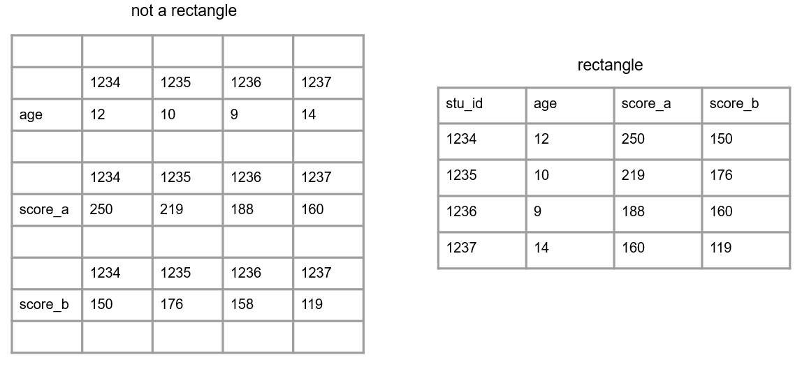
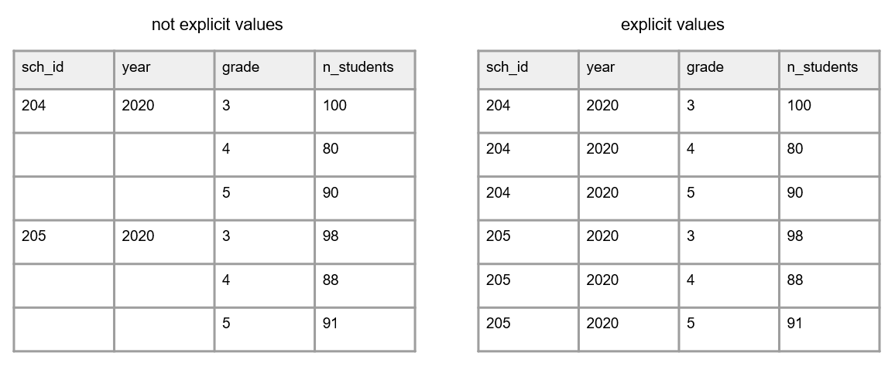
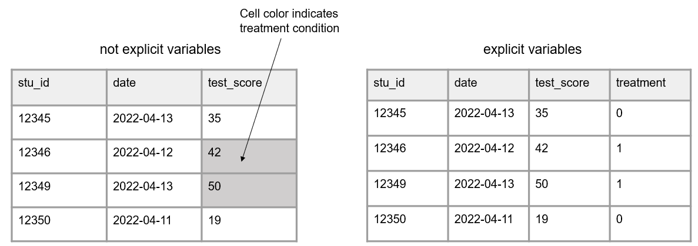
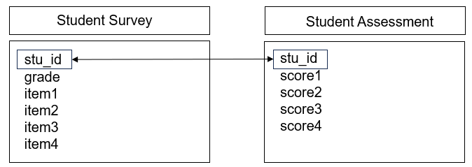
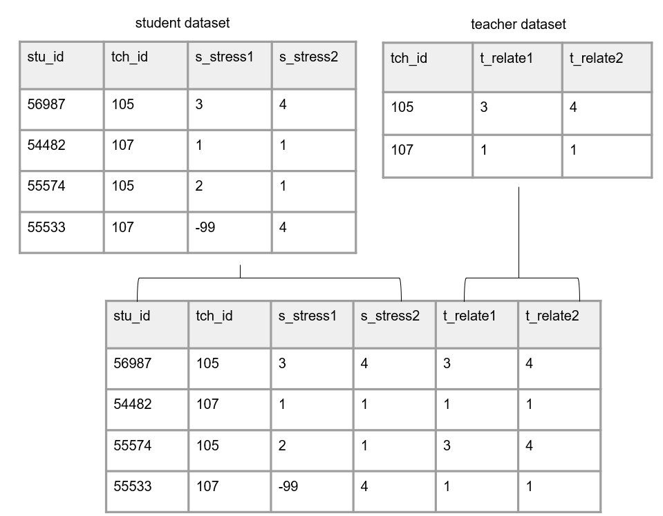

# Data Structure {#structure}

Before we jump into the data life cycle, we need to have a basic understanding of what data looks like. Understanding the basic structure of data helps us write our Data Management Plan, organize our data management process, create our data dictionaries, build our data collection tools, and clean our data, all in ways that allow us to have analyzable information.

## Basics of a dataset

In education research, data is often collected internally by your team using an instrument such as a questionnaire, an observation, an interview, or an assessment. However, data may also be collected from external entities, such as districts, states, or other agencies.

Those data come in many forms (e.g., video, transcripts, documents, data files), represented as text, numbers, or multimedia [@usgs_what_2023]. In the world of quantitative education research, we are often working with digital data in the form of a dataset, a structured collection of data. These datasets are organized in a rectangular format which allow the data to be machine-readable. Even in qualitative research, we are often wrangling data to be in a format that is analyzable and allows categorization.

These rectangular (also called tabular) datasets are made up of columns and rows. 

(\#fig:fig3-1)Basic format of a dataset

### Columns {#columns}

The columns in your dataset will consist of the following types of variables:

- Variables you collect (from an instrument or from an external source)
- Variables you create (e.g., cohort, intervention, time, derivations)
  - Unless your data is collected anonymously, one of these variables must include values that uniquely identify subjects in your data (e.g., a student unique identifier). 

**Column attributes**

It is important to know that variables have the following attributes:

1. Unique names
    - No variable name in a dataset can repeat. We will talk more about variable naming when we discuss style guides in Chapter \@ref(style).
2. A measurement type
    - Examples include numeric, character, or date, which can also be more narrowly defined as needed (e.g., continuous, categorical)
3. Acceptable values 
    - Examples include categorical values (e.g., "yes"|"no") or expected ranges (e.g., *1-25* or *2021-08-01 to 2021-12-15*). Anything outside of those acceptable values or ranges is considered an error.
4. Labels
    - Descriptions of what the variable represents. This may be a label that you, as the variable creator, assigns (e.g., "Treatment condition") or it may be the actual wording of an item (e.g., "Do you enjoy pizza?").

### Rows

The rows in your dataset are aligned with subjects, or cases, in your data. Subjects in your dataset may be students, teachers, schools, locations, and so forth. The unique subject identifier variable mentioned above will denote which row belongs to which subject. 

### Cells

The cells are the observations associated with each case in your data. Cells are made up of key/value pairs, created at the intersection of a column and a row. Consider an example where we collect a survey from students. In this dataset, each row is made up of a unique student in our study, each column is an item from the survey, and each cell contains a value/observation that corresponds to that row/column pair (i.e., that participant and that question).

(\#fig:fig3-2)Representation of a cell value

## Dataset organization rules

In order for your dataset to be machine-readable and analyzable, it should adhere to a set of structural rules [@broman_data_2018; @wickham_tidy_2014]. 

1. The first rule is that your data should make a rectangle. The first row of your data should be your variable names (only use one row for this). The remaining data should be made up of values in cells.

(\#fig:fig3-3)A comparison of non-rectangular and rectangular data

2. Column values should be consistent. Both humans and machines have difficulty categorizing information that is not coded consistently.
    - For text categorical values, use controlled vocabulary and keep consistent spelling, case, and spacing
    - For date values, keep consistent format
    - For numeric values, keep consistent decimal places

(\#fig:fig3-4)A comparison of inconsistent and consistent variable values

3. Your columns should adhere to your variable type.
    - For example, if you have a numeric variable, such as age, but you add a cell value that is text, your variable no longer adheres to your variable type. Machines will now read this variable as text.
  

(\#fig:fig3-5)A comparison of variables adhering and not adhering to a data type

  
4. A variable should only collect one piece of information. If a variable contains more than one piece of information you may have the following issues:
   - You lose the granularity of the information (e.g., `location` = "Los Angeles, CA" is less granular than having a `city` variable and a `state` variable separately)
   - Your variable may become unanalyzable (e.g., a variable with a value "220/335" is not analyzable as a numeric variable). If you are interested in a rate, you can calculate a `rate` variable with a value of *.657*.
   - You may lose the variable type (e.g., if you want an `incident_rate` variable to be numeric, and you assign a value of "220/335", that variable is no longer numeric)
  

(\#fig:fig3-6)A comparison of two things being measured in one variable and two things being measured across two variables

5. All cell values should be explicit. This means all cells that are not missing values should be filled in with a physical value. 
    - Consider why a cell value is empty
      - If a value is actually missing, you can either leave those cells as blank or fill them with your pre-determined missing values (e.g., -99). See Section \@ref(style-missing) for ideas on coding missing values.
      - If a cell is left empty because it is implied to be the same value as above, the cells should be filled with the actual data
      - If an empty cell is implied to be 0, fill the cells with an actual 0

(\#fig:fig3-7)A comparison of variables with empty cells and variables with not empty cells

6. All variables should be explicit. No variables should be implied using color coding.
    - If you want to indicate information, add an indicator variable to do this rather than cell coloring    
    

(\#fig:fig3-8)A comparison of variables with implicit values and variables with explicit values

## Linking data

Up until now we have been talking about one, standalone dataset. However, it is more likely that your research project will be made up of multiple datasets, collected from different participants, from a variety of instruments, and possibly across different time points. At some point you will most likely need to link those datasets together. 

In order to think about how to link data, we need to discuss two things, database design and data structure.

### Database design {#structure-database}

A database is "an organized collection of data stored as multiple datasets" [@usgs_what_2023]. Sometimes this database is actually housed in a database software system (such as SQLite or FileMaker), and other times we are loosely using the term database to simply define how we are linking disparate datasets together that are stored individually in some file system. No matter the storage system, the general concepts here will be applicable.

In database terminology, each dataset we have is considered a "table". Each table includes one or more variables that uniquely define rows in your data (i.e., a primary key). Tables may also contain variables associated with unique values in another table (i.e., foreign keys). Each table can be connected through both primary and foreign keys. This linking of tables creates a relational database and we will talk more about this structure when we discuss participant data tracking (see Chapter \@ref(track)).

Let's take the simplest example, where we only have primary keys in our data. Here we collected two pieces of data from students, a survey and an assessment, in one time period. Figure \@ref(fig:fig3-9) shows what variables were collected from each instrument and how each table can be linked together through a primary key (denoted by rectangles).

(\#fig:fig3-9)Linking data through primary keys

However, we are often not only collecting data across different forms, but we are also collecting nested data across different participants (e.g., students, nested in classrooms, nested in schools). Let's take another example where we collected data from three instruments: a student assessment, a teacher survey, and a school intake form. Figure \@ref(fig:fig3-10) shows what variables exist in each dataset (with primary keys being denoted by rectangles) and how each table can be linked together through a foreign key (denoted by ovals).

(\#fig:fig3-10)Linking data through foreign keys

And as you can imagine, as we add more forms, or begin to collect data across time, the database structure begins to become even more complex. Figure \@ref(fig:fig3-11) is another example where we collected two forms from students (a survey and an assessment), two forms from teachers (a survey and an observation), and one form from schools (an intake form). While the linking structure begins to look more complex, we see that we can still link all of our data through primary and foreign keys. Forms within participants can be linked by primary keys, and forms across participants can be linked by foreign keys.

(\#fig:fig3-11)Linking data through primary and foreign keys

### Data structure {#structure-datastructure}

When it comes time to link our data, there are two ways we often think about linking or structuring our data, wide or long.

#### Wide format

When we structure our data in a wide format, all data collected on a unique subject will be in one row. Subjects should not be duplicated in your data in this format. 

This type of format can be used for the following situations:  
    
- To link forms within subjects, within and/or across time
    - This is commonly used to create comprehensive subject-level datasets (e.g., all student data combined into a student-level dataset)
- To link forms across participants
    - Such as a student survey and teacher survey

The easiest scenario to think about this format is with repeated measure data. If we collect a survey on participants in both wave 1 and 2, those waves of data will all be in the same row (joined together on a unique ID) and each wave of data collection will be appended to a variable name to create unique variable names. This is typically a one-to-one merge where each participant will only appear once in each dataset. 

(\#fig:fig3-12)Example linking forms across time in wide format

A more complicated scenario is merging across participants (e.g., merging teacher data into student data). This is often a many to one join (e.g., multiple students are associated with the same teacher), meaning upon merging, teacher data will be repeated for all students in their classroom. Although describing all of the different types of joins will be outside the scope of this book, there are many resources available to help you decide which join type is appropriate for your needs ^[https://r4ds.hadley.nz/joins].

(\#fig:fig3-13)Example linking forms across participants in wide format

> **Note**    
It is important to note here, that if your data do not have unique identifiers, as is in the case of anonymous data, you will be unable to merge data in a wide format.

#### Long format

In education research, long data is mostly used as a specific way to structure data that is collected over time. In long data a participant can, and often will, repeat in your dataset, and unique rows will now be identified through a combination of variables (e.g., `stu_id` and `wave` together will be your primary key). 

Again, the most straightforward way to think about this is with repeated measure data, where repeating subject IDs in a row will represent different time points for a participant. Here instead of joining forms on a unique id, we stack forms on top of each other, often called appending data. Rows are stacked on top of one another and variables are aligned by variable name. Now instead of linking data by an ID, data is "linked" by variable names. It is important here that variable names and types stay identical over time in order for this structure to work.

In this scenario, we no longer add the data collection wave to variable names. However, we would need to add a time period variable to denote the wave associated with each row of data.

(\#fig:fig3-14)Data structured in long format

#### Choosing wide vs long

There are different reasons for structuring your linked data one way or another. Storing linked data in long format is usually considered to be more efficient than storing in wide format, potentially requiring less memory. However, when it comes time for analysis, specific data structures may be required. For example, repeated measure procedures typically require data to be in wide format, where the unit of analysis is the subject. While mixed model procedures typically required data to be in long format, where the unit of analysis is each measurement for the subject [@grace-martin_wide_2013]. It may be that you structure data in one format for one reason (e.g., storing or sharing), and then restructure data into another format a different reason (e.g., analysis). Luckily, this type of restructuring can be done fairly quickly in many statistical programs. We will further review decision making around data structure in Chapters \@ref(clean) and \@ref(share).

## File formats {#structure-format}

These rectangular datasets can be saved in a variety of file formats. Some common formats used in education research include interoperable formats such as CSV or TSV, or proprietary formats such as XLSX, SPSS, or Stata files. 

When you save your files, they will have a file size. Both the number of columns as well as the number of rows in your dataset will contribute to your file size. Just to get a feel for what size your files might be, small datasets (for example 5 columns and <100 rows) may be less than 100 KB. Datasets with several hundred variables and several thousand cases may start to be in the 1,000-5,000 KB range. The type of file you use also changes the size of your data. Saving data in a format that contains embedded metadata (such as variable and value labels), such as an SPSS file, will greatly increase your file size. We will talk about the pros and cons to different file formats in Chapters \@ref(store) and \@ref(share).
