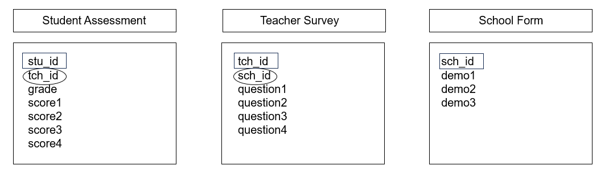
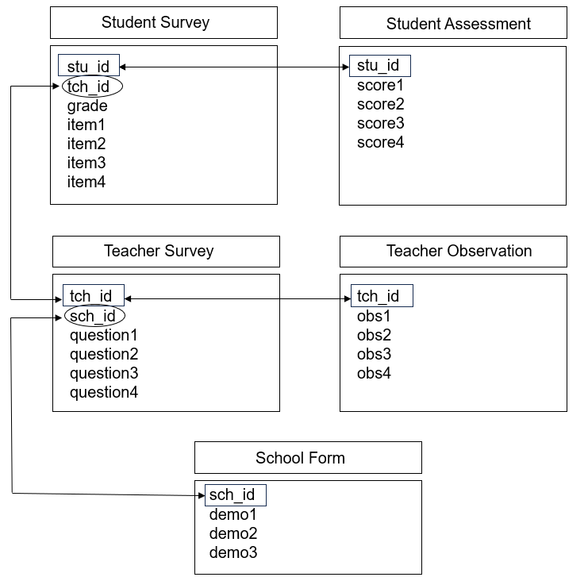
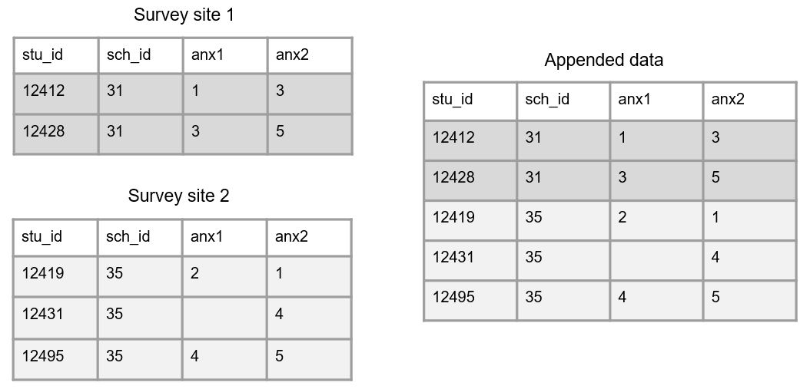
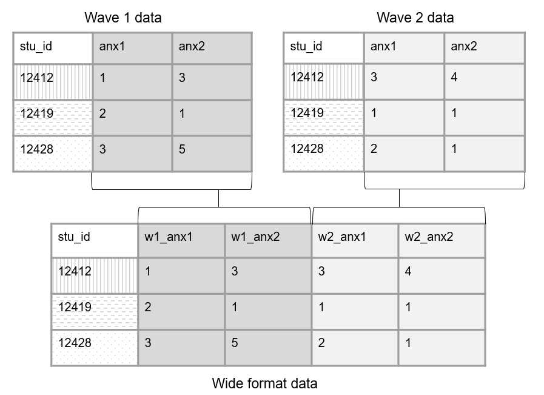
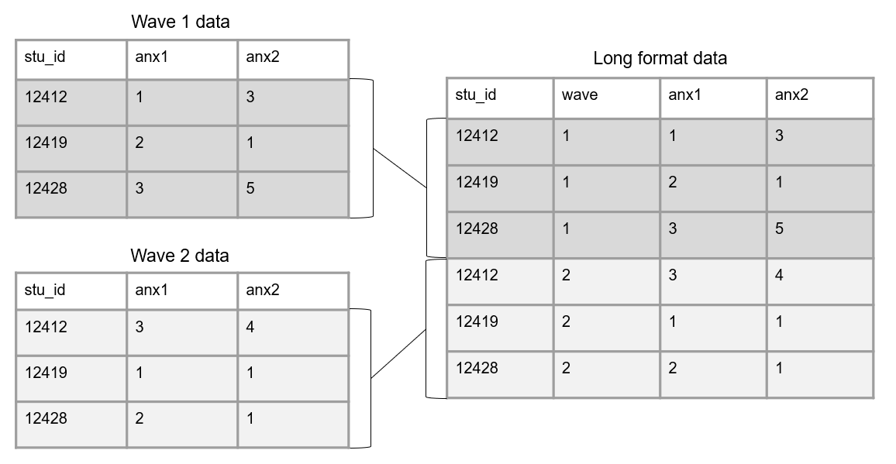

# Data Structure {#structure}

Before we jump into the data life cycle, we need to have a basic understanding of what data looks like. Understanding the basic structure of data helps us write our Data Management Plan, organize our data management process, create our data dictionaries, build our data collection tools, and clean our data, all in ways that allow us to have analyzable information.

## Basics of a dataset

In education research, data is often collected internally by your team using an instrument such as a questionnaire, an observation, an interview, or an assessment. However, data may also be collected from external entities, such as districts, states, or other agencies.

Those data come in many forms (e.g., video, transcripts, documents, data files), represented as text, numbers, or multimedia [@usgs_what_2023]. In the world of quantitative education research, we are often working with digital data in the form of a dataset, a structured collection of data. These datasets are single tables (or flat files) organized in a rectangular format which allow the data to be machine-readable. 

These rectangular (also called tabular) datasets are made up of columns and rows. 

{width=80%}

### Columns {#columns}

The columns in your dataset will consist of the following types of variables:

- Variables you collect (from an instrument or from an external source)
- Variables you create (e.g., cohort, intervention, time, derivations)
  - Unless your data is collected anonymously, at least one of these variables must include values that uniquely identify subjects in your data (e.g., a student unique identifier). 

**Column attributes**

It is important to know that variables have the following attributes:

1. Unique names
    - No variable name in a dataset can repeat. We will talk more about variable naming when we discuss style guides in Chapter \@ref(style).
2. A measurement type
    - Examples include numeric, character, or date, which can also be more narrowly defined as needed (e.g., continuous, categorical)
3. Acceptable values 
    - Examples include categorical values (e.g., "yes"|"no") or expected ranges (e.g., *1--25* or *2021-08-01 to 2021-12-15*). Anything outside of those acceptable values or ranges is considered an error.
4. Labels
    - Descriptions of what the variable represents. This may be a label that you, as the variable creator, assigns (e.g., "Treatment condition") or it may be the actual wording of an item (e.g., "Do you enjoy pizza?").

### Rows

The rows in your dataset are aligned with subjects, or cases, in your data. Subjects in your dataset may be students, teachers, schools, locations, and so forth. The unique subject identifier variable mentioned above will denote which row belongs to which subject. 

### Cells

The cells are the observations associated with each case in your data. Cells are made up of key/value pairs, created at the intersection of a column and a row. Consider an example where we collect a survey from students. In this dataset, each row is made up of a unique student in our study, each column is an item from the survey, and each cell contains a value/observation that corresponds to that row/column pair (i.e., that participant and that question).

{width=70%}

## Dataset organization rules {#structure-rules}

In order for your dataset to be machine-readable and analyzable, it should adhere to a set of structural rules [@broman_data_2018; @wickham_tidy_2014]. 

1. The first rule is that your data should make a rectangle. The first row of your data should be your variable names (only use one row for this). The remaining data should be made up of values in cells.

{width=100%}

2. Column values should be consistent. Both humans and machines have difficulty categorizing information that is not measured, coded, or formatted consistently.
    - For text categorical values, use controlled vocabulary and keep consistent spelling, case, and spacing
    - For date values, keep consistent format
    - For numeric values, measure in consistent units and keep consistent decimal places

{width=100%}

3. Your columns should adhere to your variable type.
    - For example, if you have a numeric variable, such as age, but you add a cell value that is text, your variable no longer adheres to your variable type. Machines will now read this variable as text.
  
{width=100%}
  
4. A variable should only collect one piece of information. If a variable contains more than one piece of information you may have the following issues:
   - You lose the granularity of the information (e.g., `location` = "Los Angeles, CA" is less granular than having a `city` variable and a `state` variable separately)
   - Your variable may become unanalyzable (e.g., a variable with a value "220/335" is not analyzable as a numeric variable). If you are interested in a rate, you can calculate a `rate` variable with a value of *.657*.
   - You may lose the variable type (e.g., if you want an `incident_rate` variable to be numeric, and you assign a value of "220/335", that variable is no longer numeric)
  
{width=100%}

5. All cell values should be explicit. This means all cells that are not missing values should be filled in with a physical value. 
    - Consider why a cell value is empty
      - If a value is actually missing, you can either leave those cells as blank or fill them with your pre-determined missing values (e.g., -99). See Section \@ref(style-missing) for ideas on coding missing values.
      - If a cell is left empty because it is implied to be the same value as above, the cells should be filled with the actual data
      - If an empty cell is implied to be 0, fill the cells with an actual 0

{width=100%}

6. All variables should be explicit. No variables should be implied using color coding.
    - If you want to indicate information, add an indicator variable to do this rather than cell coloring    
    
{width=100%}

## Linking data {#structure-link}

Up until now we have been talking about one, standalone dataset. However, it is more likely that your research project will be made up of multiple datasets, collected from different participants, from a variety of instruments, and possibly across different time points. At some point you will most likely need to link those datasets together. 

In order to think about how to link data, we need to discuss two things, database design and data structure.

### Database design {#structure-database}

A database is "an organized collection of data stored as multiple datasets" [@usgs_what_2023]. Sometimes this database is actually housed in a database software system (such as SQLite or FileMaker), and other times we are loosely using the term database to simply define how we are linking disparate datasets together that are stored individually in some file system. No matter the storage system, the general concepts here will be applicable.

In database terminology, each dataset we have is considered a "table". Each table includes one or more variables that uniquely define rows in your data (i.e., a primary key). Tables may also contain variables associated with unique values in another table (i.e., foreign keys). See Figure \@ref(fig:fig3-9) for an example of three tables that contain primary keys (denoted by rectangles) and foreign keys (denoted by ovals). Furthermore, tables can be joined either horizontally or vertically.

{width=100%}

#### Horizontal joins

Joining tables horizontally, also called merging, involves matching rows by one (e.g., `stu_id`) or more (e.g., `first_name` and `last_name`) keys, resulting in a table of combined information. There are several different types of horizontal joins (e.g., left, right, inner, full). While diving into the different types of joins is outside of the scope of this book, resources for further learning will be provided. For now, just assume that the joins we discuss are all left joins (i.e., all records from our first table will be matched to any available records in our second table).

To better understand horizontal joins, let's take the simple example in Figure \@ref(fig:fig3-10), where we only have a primary keys (`stu_id`) in each table, no foreign keys. Here we collected two forms from students (a survey and an assessment). When we join these tables on our primary key, it will be a one-to-one merge because each student only appears once in each table. 

{width=90%}

However, we are often not only collecting data across different forms, but we are also collecting nested data across different entities (e.g., students, nested in classrooms, nested in schools). Let's look at another example where we collected data from both students (an assessment) and teachers (a survey). Figure \@ref(fig:fig3-11) shows how we can now link the foreign key in the student assessment (`tch_id`) with the primary key (`tch_id`) in the teacher survey. In this scenario, we are doing a many to one join (i.e., multiple students are associated with the same teacher), meaning upon merging, teacher data will be repeated for all students in their classroom. 

{width=90%}

And as you can imagine, as we add more forms, the database structure begins to become even more complex. Figure \@ref(fig:fig3-12) is an example where we collected two forms from students (a survey and an assessment), two forms from teachers (a survey and an observation), and one form from schools (an intake form). While the linking structure begins to look more complex, we see that we can still link all of our data through primary and foreign keys. Forms within participant types can be linked by primary keys, and forms across participant types can be linked by foreign keys.

{width=70%}

> **Note**    
It is important to note here, that if you do not have unique identifiers in your tables, as is in the case of anonymous data, you will be unable to join data horizontally.

#### Vertical joins

Joining tables vertically, also called appending, involves stacking forms on top of each other. Here, rather than joining by primary and foreign keys, we are matching columns by variable names. In this case, variable names and variable types should be identical across forms in order for the matching to work. 

Let's take a simple example where we collected a survey from two different sites, using two different forms. Those forms were entered into two separate tables and we want to combine that data. Figure \@ref(fig:fig3-13), shows how we could vertically join those tables.

{width=100%}

**Resources**

|Source|Resource|
|--------|-----------|
|Data Carpentry |A review of different types of horizontal joins ^[https://tavareshugo.github.io/r-intro-tidyverse-gapminder/08-joins/index.html]|
|David E. Caughlin| A review of horizontal and vertical joins ^[https://rforhr.com/join.html]|

### Data structure {#structure-datastructure}

When working with longitudinal data in particular, it's important to consider how you want to structure your data before performing joins. There are essentially two ways we can structure repeated measures data, in wide format or long format.

#### Wide format

When we structure our data in a wide format, all data collected on a unique subject will be in one row. Subjects should not be duplicated in your data in this format. 

In order to structure data in wide format, we join our tables horizontally. Before joining though, each wave of data collection will be appended to a variable name to create unique variable names. Figure \@ref(fig:fig3-14) shows of an example of how we could structure two waves of data collection in wide format. 

{width=80%}

#### Long format

In long data a participant can, and often will, repeat in your dataset, and unique rows will now be identified through a combination of variables (e.g., `stu_id` and `wave` together will be your primary key). 

In order to structure data in long format, we join our tables vertically. In this scenario, we no longer add the data collection wave to variable names. However, a time period variable should be added to denote the wave associated with each row of data. Figure \@ref(fig:fig3-15) shows of an example of how we could structure two waves of data collection in long format. 

{width=100%}

#### Choosing wide vs long {#structure-reshape}

There are different reasons for structuring your longitudinal data one way or another. Storing data in long format is usually considered to be more efficient than storing in wide format, potentially requiring less memory. However, when it comes time for analysis, specific data structures may be required. For example, repeated measure procedures typically require data to be in wide format, where the unit of analysis is the subject. While mixed model procedures typically required data to be in long format, where the unit of analysis is each measurement for the subject [@grace-martin_wide_2013]. It may be that you structure data in one format for one reason (e.g., storing or sharing), and then restructure data into another format a different reason (e.g., analysis). Luckily, this type of restructuring can be done fairly quickly in many statistical programs. We will further review decision making around data structure in Chapters \@ref(clean) and \@ref(share).
