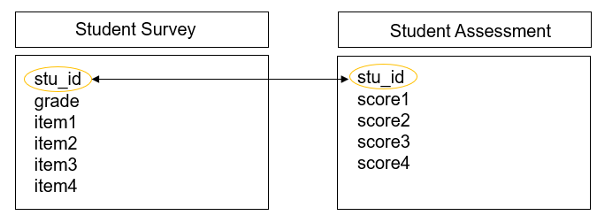
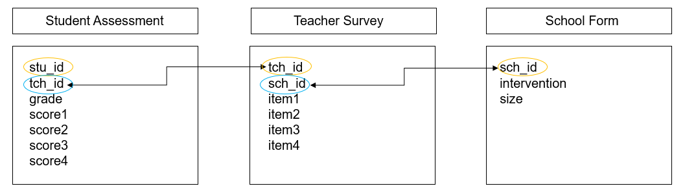
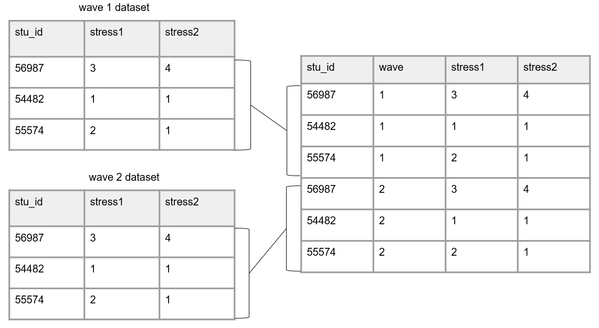

# Data Structure

Because data management is made up of just that, data, we need to have a basic understanding of what data looks like. Understanding the basic structure of data helps us write our Data Management Plan, organize our data management process, create our data dictionaries, build our data collection tools, and clean our data, all in ways that allow us to have analyzable data.

## Basics of a dataset

In education research, data is often collected internally by your team using an instrument such as a questionnaire, an observation, an interview, or an assessment. However, data may also be collected from external entities, such as districts, states, or other agencies.

Those data come in many forms (ex: video, transcripts, documents, files), represented as text, numbers, or multimedia [@usgs_what_nodate]. In the world of quantitative education research, we are often working with digital data in the form of a dataset, a structured collection of data. These datasets are organized in a rectangular format which allow the data to be machine readable. Even in qualitative research, we are often wrangling data to be in a format that is analyzable and allows categorization.

These rectangular (also called tabular) datasets are made up of columns and rows. 

{width=80%}

### Columns

The columns in your dataset will consist of one or both of the following types of variables:

- Variables you collect (from an instrument or from an external source)
- Variables you create/add (ex: cohort, intervention, time, derivations)

Unless your data is collected anonymously, every dataset **must** also have the following:

- One or more variables that are **unique identifiers**, sometimes called primary keys. These are variables that uniquely define rows in your dataset (i.e. help you identify duplicate rows). 
- If you plan to link datasets across entities (ex: link teachers to schools or students to teachers) then you will also need secondary unique identifiers in your dataset (also called foreign keys) that allow you to link across datasets.

We will talk more about creating these identification variables in our data tracking section \@ref(ids).

#### Column attributes

It is important to know that variables have the following attributes:

1. Unique names (no variable name in a dataset can repeat). We will talk more about variable naming when we discuss Style Guides [**see style guides**].
2. A measurement type (ex: numeric, character, date) which can also be more narrowly defined as needed (ex: continuous, categorical)
3. Acceptable values (ex: yes/no) or expected ranges (ex: 1-25 or 2021-08-01 to 2021-12-15). Anything outside of those acceptable values or ranges is considered an error.
4. Labels, descriptions of what the variable represents. This may be a label that you as the variable creator assigns (ex: "Treatment condition") or they may be the actual wording of an item (ex: "Do you enjoy pizza?").

### Rows

The rows in your dataset are aligned with participants or cases in your data. Participants in your data may be students, teachers, schools, locations, and so forth. The unique identifier variable mentioned above will denote which row belongs to which participant. 

### Cells

The cells are the observations associated with each participant. Cells are made up of key/value pairs, created at the intersection of a column and a row. Consider an example where we collect a survey from students in the fall of 2022. In this dataset, each row is made up of a unique student in our study, each column is an item from the survey, and each cell contains a value/observation that corresponds to that row/column pair (that participant and that question).

{width=70%}

## Dataset organization rules

In order for your dataset to be machine-readable and analyzable, it should adhere to a set of structural rules [@broman_data_2018; @wickham_tidy_2014]. 

1. The first rule is that your data should make a rectangle. The first row of your data should be your variable names (only use one row for this). The remaining data should be made up of values in cells.

{width=100%}

2. Your columns should adhere to your variable type.
    - For example, if you have a numeric variable, such as age, but you add a cell value that is text, your variable no longer adheres to your variable type. Machines will now read this variable as text.
  
{width=100%}
  
3. A variable should only collect one piece of information. If a variable contains more than one piece of information you may have the following issues:
   - You lose the granularity of the information (ex: `location` = `Los Angeles, CA` is less granular than having a `city` variable and a `state` variable separately)
   - Your variable may become unanalyzable (ex: a variable with a value `220/335` is not analyzable as a numeric variable). If you are interested in a rate, you can calculate a `rate` variable with a value of `.657`.
   - You may lose the variable type (ex: if you want an `incident_rate` variable to be numeric, and you assign a value of `220/335`, that variable is no longer numeric)
  
{width=100%}

4. All cell values should be explicit. This means all cells should be filled in with a physical value. 
   - No cells should be empty
     - If a value is actually missing, make sure it contains a value to denote the missing data (ex: NA) to show that the cell was not left blank unintentionally  
     - If a cell is left empty because it is "implied" to be the same value as above, the cells should be filled with the actual data  
     - If the value for the cell is "implied" to be 0, fill the cells with 0  

{width=100%}

  - No values should be implied using color coding 
     - If you want to indicate information, add an indicator variable to do this rather than cell coloring  
      
{width=100%}
      
5. Your data should not contain duplicate rows. You do not want duplicate rows of a measurement collected **on the same participant**, **at the same time period**. Different types of duplicate rows can occur:
   - A true duplicate row where an entire row is duplicated (the row values are the same for every variable). This may happen if someone enters the same form twice.
   - A unique identifier is duplicated but the row values may or may not be the same across all of the variables. This could happen because one of three reasons:
     1. An instrument is accidentally collected more than once on the same participant in a collection period. This type of duplicate would need to be remedied.
     2. A unique identifier was entered incorrectly. In this case you don't actually have a duplicate, you just have an incorrect unique identifier. This error would need to be remedied.
     3. More than one variable is used to identify unique participants and the row is not actually a duplicate. 
        - Take for example a student id and a class id. Multiple unique identifiers may be used if data is collected on participants in multiple locations and treated as unique data. In this case, the data is not truly duplicate because the combined identifiers are unique. 
        - Another example of this is if your data is organized in long format (discussed below \@ref(structure)). In this case unique study identifiers may repeat in the data but they should not repeat for the same form and same time period in your data.
    
{width=100%}

## Linking data

Up until now we have been talking about one, standalone dataset. However, it is more likely that your research project will be made up of multiple datasets, collected from different participants, from a variety of instruments, and possibly across different time points. And at some point you will most likely need to link those datasets together. 

In order to think about how to link data, we need to discuss two things: data structure and database design.

### Database design

A database is "an organized collection of data stored as multiple datasets" [@usgs_what_nodate]. Sometimes this database is actually housed in a database software system (such as SQLite or FileMaker), and other times we are loosely using the term database to simply define how we are linking disparate datasets together that are stored individually in some file system. No matter the storage system, the general concepts here will be applicable.

In database terminology, each dataset we have is considered a "table". And each table has a primary key that identifies unique entries within a table and each table can be connected through both primary and foreign keys. This linking of tables creates a relational database and we will talk more about this structure when we discuss participant data tracking \@ref(tracking).

Let's take the simplest example, where we only have primary keys in our data. Here we collected two pieces of data from students (a survey and an assessment) in one time period. The image below shows what variables were collected from each instrument and how each table can be linked together through a primary key (circled in yellow).

{width=70%}

However, we are often not only collecting data across different forms, but we are also collecting nested data across different participants (ex: students, nested in classrooms, nested in schools, and so on). Let's take another example where we collected data from three instruments, a student assessment, a teacher survey, and a school intake form. The image below shows what variables exist in each dataset (with primary keys still being circled in yellow) and how each table can be linked together through a foreign key (circled in blue).

{width=100%}

And as you can imagine, as we add more forms, or begin to collect data across time, the database structure begins to become even more complex. Here is another example where we collected two forms from students (a survey and an assessment), two forms from teachers (a survey and an observation), and one form from schools (an intake form). While the linking structure begins to look more complex, we see that we can still link all of our data through primary and foreign keys. Forms within participants can be linked by primary keys, and forms across participants can be linked by foreign keys.

{width=70%}

### Data structure {#structure}

When it comes time to link our data, there are two ways we often think about linking or structuring our data, wide or long.

**Wide format**

When we structure our data in a wide format, all data collected on a unique participant will be in one row. Participants should **not** be duplicated in your data in this format. 

This type of format can be used for the following situations:

- To link forms within time  
- To link forms across time  
- To link forms across participants  

The easiest scenario to think about this format is with repeated measure data. If we collect a survey on participants in both wave 1 and 2, those waves of data will all be in the same row (joined together on a unique ID) and each wave of data collection will be appended to a variable name to create unique variable names. We will dive deeper into different types of joins in our data cleaning section [**see cleaning**].

Limitations: It is important to note here, that if your data do not have unique identifiers (primary and/or foreign keys), you will be unable to merge data in a wide format.

{width=80%}

**Long format**

In education research, long data is mostly used as a specific way to structure data that is collected over time. In long data a participant can and will repeat in your dataset. 

Again, the most straight forward way to think about this is with repeated measure data, where each row will be a new time point for a participant. Here instead of merging forms on a unique id, we stack forms on top of each other, often called appending data. Rows are stacked on top of one another and variables are aligned by variable name. Now instead of linking data by an id, data is now "linked" by variable names. It is important here that variable names and types stay identical over time in order for this structure to work.

In this scenario, we no longer add the data collection wave to variable names. However, we would need to add a time period variable to denote the wave associated with each row of data.

{width=100%}

**Choosing wide vs long**

There are different reasons for constructing your data one way or another. And it may be that you store or share your data in one format, and then restructure data into another format when it comes time for analysis. 

Storing data in long format is usually considered to be more efficient, potentially requiring less memory. However, when it comes time for analysis, specific data structures may be required. For example, repeated measure procedures typically require data to be in wide format, where the unit of analysis is the subject. While mixed model procedures typically required data to be in long format, where the unit of analysis is each measurement for the subject [@grace-martin_wide_2013]. We will further review decision making around data structure in our data cleaning chapter [**see data cleaning**].

## File types

These rectangular datasets can be saved in a variety of file types. Some common file types in education research include interoperable formats such as .csv, .txt, .dat, or .tsv, or proprietary formats such as .xlsx, .sav, or .dta. 

When you save your files, they will have a file size. Both the number of columns as well as the number of rows in your dataset will contribute to your file size. Just to get a feel for what size your files might be, small datasets (for example 5 columns and <100 rows) may be less than 100 KB. Datasets with several hundred variables and several thousand cases may start to be in the 1,000-5,000 KB range. The type of file you use also changes the size of your data. Saving data in a format that contains embedded metadata (such as variable and value labels), such as a .sav file, will greatly increase your file size. We will talk about the pros and cons to different file formats in the chapter on data sharing [**see data sharing**].

