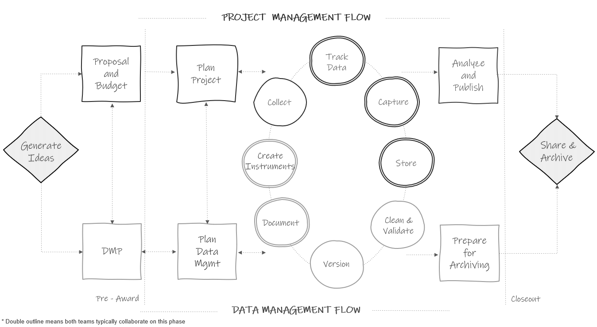

# Research Data Management Overview {#rdm}

## What is research data management?

Research data management (RDM) involves the organization, storage, preservation, and dissemination of research study data [@borghi_promoting_2022]. Research study data includes materials generated or collected throughout a research process [@national_endowment_for_the_humanities_data_2018]. As you can imagine, this broad definition includes much more than just the management of digital datasets. It also includes physical files, documentation, artifacts, recordings, and more. RDM is a substantial undertaking that begins long before data are ever collected, during the planning phase, and continues well after a research project ends during the archiving and sharing phase.

## Data management standards

It’s important for research data management practices to be structured around standards---rules for how data should be collected, formatted, described, and shared [@borghi_promoting_2022; @koos_research_2023]. Implementing standards for procedures such as how variables should be collected and named, which items from common measures should be shared, and how data should be formatted and documented, leads to more findable and usable data within fields and provides the added benefit of allowing researchers to integrate datasets without painstaking work to harmonize the data.

Some fields have adopted standards across the research life cycle, such as CDISC standards used by clinical researchers [@cdisc_cdisc_2023], other fields have adopted standards specifically around metadata, such as the TEI standards used in digital humanities [@burnard_what_2014] or the ISO 19115 standard used for geospatial data [@michener_ten_2015], and through grassroots efforts, other fields such as psychology are developing their own standards for things such as data formatting and documentation [@kline_technical_2018] based on the FAIR principles and inspired by the BIDS standard [@bids-contributors_brain_2022]. Yet, it is common knowledge that there are currently no agreed-upon norms in the field of education research [@institute_of_education_sciences_frequently_2023; @logan_within_2023]. The rules for how to collect, format, and document data are often left up to each individual team, as long as external compliance requirements are met [@tenopir_data_2016].

Without agreed-upon standards in the field, it is important for research teams to develop their own data management standards that apply within and across all of their projects. Developing internal standards, implemented in a reproducible data management workflow, allows practices to be implemented consistently and with fidelity. 

## Why care about research data management?

There are both external pressures and personal reasons to care about developing research data management standards for your projects.

### External reasons

1.  **Funder compliance**: Any researcher applying for federal funding will be required to submit a data management plan (see Chapter \@ref(dmp)) along with their grant proposal [@holdren_ostp_2013; @nelson_ostp_2022]. The contents of these plans may vary slightly across agencies, but the shared purpose of these documents is to facilitate good data management practices and to mandate open sharing of data to maximize scientific outputs and benefits to society. Along with this mandatory data sharing policy comes the incentive to manage your data for the purposes of data sharing [@borghi_promoting_2022].

2.  **Journal compliance**: Depending on what journal you publish with, providing open access to the data associated with your publication may be a requirement (see PLOS ONE ([https://journals.plos.org/plosone/](https://journals.plos.org/plosone/)) and AMPPS ([https://www.psychologicalscience.org/publications/ampps](https://www.psychologicalscience.org/publications/ampps)) as examples). Again, along with data sharing, comes the incentive to manage your data in a thoughtful, responsible, and organized way.

3.  **Compliance with mandates**: Depending on your research design and the sensitivity level of the data you are collecting (see Section \@ref(hsd-dcl)), there are a variety of policies as well as legal or contractual obligations you may need to consider when managing data (see Section \@ref(hsd-oversight)). If you are required to submit your project to an Institutional Review Board (IRB), the board will review and monitor your data management practices. Concerned with the welfare, rights, and privacy of research participants, your IRB will have rules for how data is securely collected, managed, and shared [@filip_san_2023]. Your data may also be subject to laws, such as HIPAA or FERPA, which regulate the privacy and exchange of personal information. If working with research partners, you may also need to monitor and honor any conditions laid out in data sharing or other legal agreements. Additionally, your organization may have their own institutional data policies that mandate how data must be cared for and secured.

4.  **Open science practices**: With a growing interest in open science practices, sharing well-managed and documented data helps to build trust in the research process [@renbarger_champions_2022]. Sharing data that is curated in a reproducible way is "a strong indicator to fellow researchers of rigor, trustworthiness, and transparency in scientific research" [@alston_beginners_2021, p.2]. It also allows others to replicate and learn from your work, validate your results to strengthen evidence, as well as potentially catch errors in your work, preventing decisions being made based on incorrect data. Sharing your data with sufficient documentation and standardized metadata can also lead to more collaboration and greater impact as collaborators are able to access and understand your data with ease [@borghi_promoting_2022; @eaker_what_2016].

5.  **Data management is a matter of ethics**: In education research we are often collecting data from human participants. As a result, data management is an ethical issue. It is our responsibility to have well-designed research studies with data collection, management, ownership, and sharing practices that consider the environmental, social, cultural, historical, and political context of the data we are working with [@alexander_telling_2023]. Furthermore, collecting data from human participants means people are giving their time and energy and entrusting us with their information. Implementing poor data management that leads to irrelevant, unusable, or compromised data is a huge disservice to research participants and erodes trust in the research process [@feeney_ethical_2022; @gammons_research_2022].

### Personal reasons

There are also many compelling personal reasons to manage your data in a reproducible and standardized way.

1.  **Reduces data curation debt**: Taking the time to plan and implement quality data management throughout the entire research study reduces data curation debt caused by suboptimal data management practices [@butters_recognizing_2020]. Having poorly collected, managed, or documented data may make your data unusable, either permanently or until errors are corrected. Decreasing or removing this debt reduces the time, energy, and resources spent possibly recollecting data or scrambling at the end of your study to get your data up to acceptable standards.

2.  **Facilitates use of your data**: Every member of your research team being able to find and understand your project data and documentation is a huge benefit. It allows for the easy use and reuse of your data and hastens efforts like the publication process [@markowetz_five_2015]. Not having to search around for participant numbers or having to ask which version of a file to use allows your team to spend more time analyzing and less time playing detective. 

3.  **Encourages validation**: Implementing reproducible data management practices encourages and allows your team to internally replicate and validate your processes to ensure your outputs are accurate [@alston_beginners_2021].

4.  **Improves continuity**: Data management practices, such as documentation, ensure implementation fidelity during your project. This includes consistently implementing practices during a longitudinal project or across sites. It also improves project continuity through staff turnover. Having thoroughly documented procedures allows new staff to pick up right where the former staff member left off and implement the project with fidelity [@borghi_data_2021; @princeton_university_research_2023]. Furthermore, good data management enables continuity when handing off projects to collaborators or when picking up your own projects after a long hiatus [@markowetz_five_2015].

5.  **Increases efficiency**: Documenting and automating data management tasks reduces duplication of efforts for repeating tasks, especially in longitudinal studies.

6.  **Upholds research integrity**: Errors come in many forms, from both humans and technology [@kovacs_role_2021; @strand_error_2021]. We've seen evidence of this in the papers cited as being retracted for "unreliable data" in the blog Retraction Watch ([https://retractionwatch.com/](https://retractionwatch.com/)). Implementing quality assurance and control procedures reduces the chances of errors occurring and allows you to have confidence in your data. Without implementing these practices, your research findings could include extra noise, missing data, or erroneous or misleading results.

7.  **Improves data security**: Quality data management and preservation practices reduce the risk of lost or stolen data, the risk of data becoming corrupted or inaccessible, and the risk of breaking confidentiality agreements.

## Existing frameworks

Data management does not live in a space all alone. It coexists with other frameworks that impact how and why data are managed, and it is important to be familiar with them as they will provide a foundation for you as you build your data management structures.

### FAIR {#rdm-fair}

In 2016, the FAIR Principles were published in Scientific Data [@wilkinson_fair_2016], outlining four guiding principles for scientific data management and stewardship. These principles were created to improve and support the reuse of scholarly data, specifically the ability of machines to access and read data. They are the foundation for how all digital data should be publicly shared. The principles are:

F: Findable

All data should be findable through a persistent identifier and have thorough, searchable metadata. These practices aid in the long-term discovery of information and provide registered citations.

A: Accessible

Users should be able to access your data. This can mean your data is available in a repository or through a request system. At minimum, a user should be able to access the metadata, even if the actual data are not openly available.

I: Interoperable

Your data and metadata should use standardized vocabularies as well as formats. Both humans and machines should be able to read and interpret your data. Licenses should not pose a barrier to usage. Data should be available in open formats that can be accessed by any software (e.g., CSV, TXT, DAT).

R: Reusable

To provide context for the reuse of your data, your metadata should give insight into data provenance, providing a project description, an overview of the data workflow, as well as what authors to cite for appropriate attribution. You should also have clear licensing for data use.

### SEER

The SEER principles, developed in 2018 by the Institute of Education Sciences (IES), provide Standards for Excellence in Education Research [@institute_of_education_sciences_standards_2022]. While the principles broadly cover the entire life cycle of a research study, they provide context for good data management within an education research study. The SEER principles include:

-   Preregister studies
-   Make findings, methods, and data open
-   Identify interventions' core components
-   Document treatment implementation and contrast
-   Analyze interventions' costs
-   Focus on meaningful outcomes
-   Facilitate generalization of study findings
-   Support scaling of promising results

### Open science

The concept of open science has pushed quality data management to the forefront, bringing visibility to its cause, as well as advances in practices and urgency to implement them. Open science aims to make scientific research and dissemination accessible for all, making the need for good data management practices absolutely necessary. Open science advocates for transparent and reproducible practices through means such as open data, open analysis, open materials, preregistration, and open access [@van_dijk_open_2021]. Organizations, such as the Center for Open Science ([https://www.cos.io](https://www.cos.io/)), have become a well-known proponent of open science, offering the open science framework (OSF) [@foster_open_2017] as a tool to promote open science through the entire research life cycle. Furthermore, many education funders have aligned their requirements with these open science practices, such as openly sharing study data and preregistration of study methods.

> **Note**
>
> When working with specific populations, there may be other principles to consider that complement FAIR principles and open science practices and provide further guidance for working with and protecting data collected from those specific communities. As an example, when conducting research with Indigenous populations, it is important to consider Indigenous data sovereignty which recognizes the rights of Indigenous peoples to own, control, access, and use data collected about their communities and lands, and to engage Indigenous communities when planning data management for your study [@carroll_care_2020; @national_institutes_of_health_supplemental_2022].

## Terminology

Before moving forward in this book, it is important to have a shared understanding of terminology used. Many concepts in education research have synonymous terms that can be used interchangeably. Across different institutions, researchers may use all or some of these terms. Please review the [Glossary](#glossary) to gain a better understanding of how terms will be used throughout this book.

## The research life cycle

The remainder of this book will be organized into chapters that provide best practices for each phase of the research project life cycle. It is imperative to understand this life cycle in order to see the flow of data through a project, as well as to understand how everything in a project is connected. If phases are skipped, the whole project will suffer.

In Figure \@ref(fig:fig2-1), you can see how throughout the project, data management roles and project coordination roles work in parallel and collaboratively. These teams may be made up of the same people or different members, but either way, both workflows must happen, and they must work together.

(\#fig:fig2-1)The research project life cycle.

Let's walk through this chart.

1.  In a typical study, a team first begins by **generating ideas**, deciding what they want to study.
2.  Then, most likely, they will look for grant funding to implement that study. This is where the two paths begin to diverge. If the team is applying for federal funding, the proposal and budget are created in the project management track, while the supplemental required **data management plan** (DMP) is created in the data track. Again, it may be the same people working on both of these pieces.
3.  Next, if the grant is awarded, the project team will begin planning things such as hiring, recruitment, data collection, or how to implement the intervention. At the same time, those working on the data team will begin to **plan** how to specifically implement the two-to-five-page data management plan submitted to their funder and start putting any necessary structures into place.
4.  Once planning is complete, the team moves into the cycle of data collection. It is called a cycle because if your study is longitudinal, every step here will occur cyclically. Once one phase of data collection wraps up, the team re-enters the cycle again for the next phase of data collection, until all data collection is complete for the entire project.
    -   The data management and project management teams begin the cycle by starting **documentation**. You can see that this phase occurs collaboratively because it is denoted with a double outline. Both teams begin developing documentation such as data dictionaries and standard operating procedures.
    -   Once documentation is started, both teams collaboratively begin to **create data collection instruments**. These instruments will be created with input from the documentation and their development will involve several quality assurance procedures. During this phase the teams may also develop their participant tracking database.
    -   Next, the project management team moves into the **data collection** phase. In addition to data collection, this phase may also involve preliminary activities such as recruitment and consenting of participants, as well as hiring and training of data collectors. While the data management team may not be directly involved in the physical collection of data, they continue to support the project management team with quality control as needed. 
    -   As data is collected, the project team will **track incoming data** in the participant tracking database. The data management team will collaborate with the project management team to help troubleshoot anything related to the tracking database or any issues discovered with the data during tracking.
    -   Next, once data is collected, the teams move into the **data capture** phase. This is where teams are actively retrieving electronically collected data or converting paper data into a digital format. Oftentimes, this again is a collaborative effort between the project management team and the data team.
    -   Once the data is captured, the file needs to be **stored**. While the data team may be in charge of setting up and monitoring the storage efforts, the project team may be the ones actively retrieving and storing the data.
    -   Next the teams move into the **cleaning and validation** phase. At this time the data team is reviewing data cleaning plans, writing data cleaning scripts, and actively cleaning data from the most recent data collection round.
    -   Last, the data team will create and save new **versions** of data as it is updated, or errors are found.
5.  The teams then only move out of the active data collection phase when all data collection for the project is complete. At this time the project team begins analyzing study data and working on publications as well as any final grant reports. They are able to do this because of the organized processes implemented during the data collection cycle. Since data was managed and cleaned throughout, data is ready for analysis as soon as data collection is complete. Then, while the project team is analyzing data, the data team is doing any additional **preparation to archive** data for long-term storage and public sharing.
6.  Last, as the grant is closing out, the team submits data for **public sharing**.

As you work through the remaining chapters of this book, Figure \@ref(fig:fig2-1) will be a guide to navigating where each phase of practices fits into the larger picture. If at any point you feel overwhelmed by the information in this book, the [Appendix](appendix) provides a summary of some of the most common activities that occur in each phase. This digestible list can be a helpful reminder that all of this information can be boiled down to achievable tasks that are implemented over an extended period of time. 
