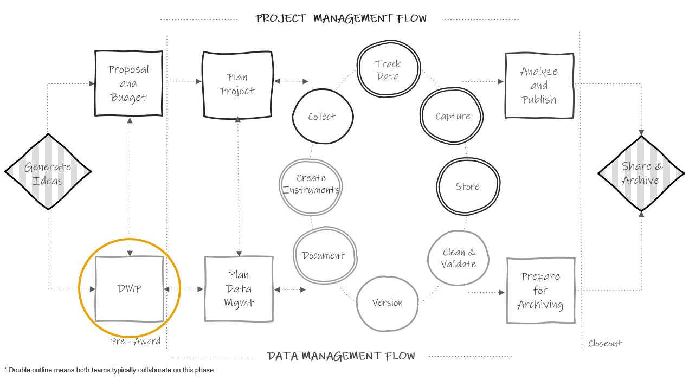

# Data Management Plan {#dmp}

{width=70%}

## History and purpose

Since 2013, even earlier for the National Science Foundation, most federal agencies that education researchers work with have required a data management plan (DMP) or data management and sharing plan (DMSPs) as part of their funding application [@holdren_ostp_2013]. While the focus of these plans is mostly on the future outcome of data sharing, the data management plan is a means of ensuring that researchers will thoughtfully plan for a research study that will result in data that can be shared with confidence, and free from errors, uncertainty, or violations of confidentiality. President Obama’s May 2013 Executive Order declared that “the default state of new and modernized government information resources shall be open and machine readable" [@the_white_house_executive_2013]. In August of 2022, the Office of Science and Technology Policy (OSTP) doubled down on their data sharing policy and issued a memorandum stating that all federal agencies must update their public access policies no later than December 31, 2025, to make federally funded publications and their supporting data accessible to the public with no embargo on their release [@nelson_ostp_2022]. Even sooner than this, organizations like the National Institutes of Health mandated that grant applicants, beginning January 2023, must submit a plan for both managing and sharing project data[@national_institutes_of_health_data_nodate]. The National Science Foundation (NSF) also released version 2.0 of their public access plan in February of 2023, describing how agency plans to ensure that all scientific data associated with peer-reviewed publications that was funded by NSF is publicly shared [@national_science_foundation_nsf_2023].

### Why are DMPs important?

Funding agencies see DMPs as important in maximizing scientific outputs from investments and increasing transparency. Mandating data sharing for federally funded projects leads to many benefits including accelerating discovery, greater collaboration, and building trust among data creators and users. In addition to the benefits viewed by funders, there are intrinsic benefits that come from having to write a data management plan. Having to thoughtfully plan and having transparency in that plan leads to better data management. Knowing that you will eventually be sharing your data and documentation with others outside of your team can motivate researchers to think hard about how to organize their data management practices in a way that will produce data that they trust to share with the outside world [@center_for_open_science_creating_nodate].

## What is it?

Generally, a data management plan is a supplemental 2-5 page document, submitted with your grant application, that contains details about how you plan to store, manage, and share your research data products. For most funders these DMPs are not part of the scoring process, but they are reviewed by a panel or program officer. Some funders may provide feedback or ask for revisions if they believe your plan and/or your budget and associated costs are not adequate.

### What to include?

What to include in a DMP varies some across funding agencies and the landscape of requirements is currently evolving. You should check each funding agency’s site for their specific DMP requirements when submitting a proposal. With that said there are typically 10 common categories covered in a data management plan [@center_for_open_science_creating_nodate; @gonzales_ten_2022; @icpsr_guide_nodate; @michener_ten_2015] which we will review below.

1. Roles and responsibilities
    - What are the staff roles in management and long-term preservation of data?
    - Who ensures accessibility, reliability, and quality of data?
    - Is there a plan if a core team member leaves the project or institution?
2. Types and amount of data
    - How is data captured? (e.g., surveys, assessments, observations)
    - Will data be item-level? Summary scores? Metadata only?
      - Datasets from a project may need to be shared in different ways due to legal, ethical, or technical reasons.
    - Will you share raw data and clean data?
    - What are the expected number of files? Expected number of rows/cases in each file?
3. Format of data
    - Will data be in an electronic format?
    - Will it be provided in a non-proprietary format? (e.g., .csv)
    - Will more than one format be provided? (e.g., .sav and .csv)
    - Are there any tools needed to manipulate shared data?
4. Documentation
    - What documentation will you share? (Consider project-level, dataset-level, and variable-level documentation)
    - What metadata will you create? 
    - What format will your documentation be in? (e.g., .xml, .csv, .pdf)
    - What supplemental documents do you plan to include when sharing data? (e.g., consort diagrams, data collection instruments, consent forms)
5. Standards
    - Do you plan to use any standards for things such as metadata, data formatting, terminology, or persistent identifiers (PIDs)?
6. Method of data sharing
    - How will you share your data? (e.g., Institutional archive, data repository, PI website)
    - Will data be restricted and is a data enclave required?
    - Is a data use agreement required?
    - How will you license your data?
    - Will your data have persistent unique identifiers?
7. Circumstances preventing data sharing
    - Do you have any data covered by FERPA/HIPAA that doesn't allow data sharing?
    - Do you work with any partners that do not allow you to share data? (e.g., School districts, tribal regulations)
    - Are you working with proprietary data?
8. Privacy and rights of participants
    - How will you prevent disclosure of personally identifiable information when you share data? How will you anonymize data (if applicable)?
    - Do participants sign informed consent agreements? Does the consent communicate how participant data are expected to be used and shared?
9. Data security
    - How will you maintain participant privacy and confidentiality during your project?
    - How will you prevent unauthorized access of data?
    - Consider IRB requirements here.
10. Schedule for data sharing
    - When will you share your study data and for how long?
11. Pre-registration (less commonly required)
    - Where and when will you pre-register your study?

Again, the specifics of what should be included in each category will vary by funder. Here are sites to visit to learn more about the four most common federal education research funder DMP requirements.

  - Institute of Education Sciences ^[https://ies.ed.gov/funding/datasharing_implementation.asp]
  - National Institutes of Health ^[https://sharing.nih.gov/data-management-and-sharing-policy/planning-and-budgeting-DMS/writing-a-data-management-and-sharing-plan]
  - National Institute of Justice ^[https://nij.ojp.gov/funding/data-archiving]
  - National Science Foundation ^[https://www.nsf.gov/bfa/dias/policy/dmpdocs/ehr.pdf]
  

## Getting help

Since DMPs are written before a project is funded, and therefore before additional staff members may be hired, oftentimes the investigators developing the grant proposal are the ones who write the DMP. However, when constructing your DMP it is well worth your time to enlist help. If you have an existing data manager or data team, you will most certainly want to consult with them when writing your plan to ensure your decisions are feasible. If you work for a university system, your research data librarians are also excellent resources with a wealth of knowledge about writing comprehensive data management plans. And last, if you plan to share your final data with a repository or institutional archive you will want to contact your repository when writing your plan as well. The repository may have its own requirements for how and when data must be shared and it is helpful to outline those guidelines in your data management plan at the time of submission. You can also specifically write the name of your repository into your data management plan as well. Last, you may want to obtain the help of your colleagues. Your colleagues have likely written DMPs before and many people are willing to share their plans as a way to help others better understand what to include.

Your DMP is a living document and you can always update your plan during or after your project completion. It may be helpful to keep in contact with your program officer regarding any potential changes throughout your project.

If you are looking for guidance in writing a DMP, a variety of generic DMP templates for different federal agencies are available, as well as actual copies of submitted DMPs that some researchers graciously make publicly available for example purposes.

**Template and Resources**

|Source|Resource|
|--------|-----------|
|DMPTool | Templates organized by funding agencies ^[https://dmptool.org/public_templates]|
|Figshare | DMP prompts specific to depositing data with Figshare ^[https://help.figshare.com/article/how-to-write-a-data-management-plan-dmp-and-include-figshare-in-your-data-sharing-plans]|
|Hao Ye, et al.| NIH DMS Plan checklist ^[https://osf.io/awypt/]|
|Harvard Longwood Medical Area RDM Working Group| Annotated DMP template ^[https://osf.io/ztjf2]|
|ICPSR | NIH DMS Plan template with specific recommendations for depositing data with ICPSR ^[https://www.icpsr.umich.edu/files/ICPSR/nih/FINAL_ICPSR-NIH-DMS-Plan-Template_2023.docx]|
|NIH | Sample DMS Plan for human survey data ^[https://www.nichd.nih.gov/sites/default/files/inline-files/Example_DMS_Plan-Human-Survey-NIH_Format_Page_V2.pdf]|
|Sara Hart | A submitted DMP that is publicly available for example purposes ^[https://figshare.com/articles/preprint/Example_of_a_Data_Management_Plan/13218743]|
|UMN Libraries | Submitted DMP examples from University of Minnesota researchers ^[https://www.lib.umn.edu/services/data/dmp-examples]|

## Budgeting {#budget}

As briefly mention above, funding agencies acknowledge that there are costs associated with implementing your data management plan and allow you to explain these costs in your budget narrative. Costs associated with the entire data life cycle should be considered and may include costs associated with data management personnel, specialized infrastructure, tools needed to collect, enter, organize, document, store, or share study data [@uk_data_service_data_2022], as well as fees associated with data preservation. Make sure to review your funder's documentation for information about allowable costs[@samuel_j_wood_library_research_nodate] and time frame for incurring costs. Examples of potential allowable costs include [@national_institutes_of_health_budgeting_nodate]:

- Costs associated with curating and de-identifying data
- Costs associated with developing data documentation
- Fees associated with depositing data for long-term sharing in a repository

It can be difficult to estimate the costs of everything that is associated with the vast landscape of managing data. Luckily a few organizations have developed resources to aid in estimating those costs. 

**Resources**

|Source|Resource|
|--------|-----------|
|UK Data Service | Data management costing tool and checklist ^[https://ukdataservice.ac.uk//app/uploads/costingtool.pdf]|
|University of Twente | Estimating RDM costs review list ^[https://www.utwente.nl/en/service-portal/services/lisa/resources/files/library-public/dcc-rdm-costs-estimation.pdf]|
|Utrecht University| Estimating the costs of data management review list ^[https://www.utwente.nl/en/service-portal/services/lisa/resources/files/library-public/dcc-rdm-costs-estimation.pdf]|
|DataOne| Considerations for providing budget information for a DMP ^[https://dataoneorg.github.io/Education/bestpractices/provide-budget-information]|
|J-PAL| Research proposal budget considerations ^[https://www.povertyactionlab.org/resource/grant-proposals]|
