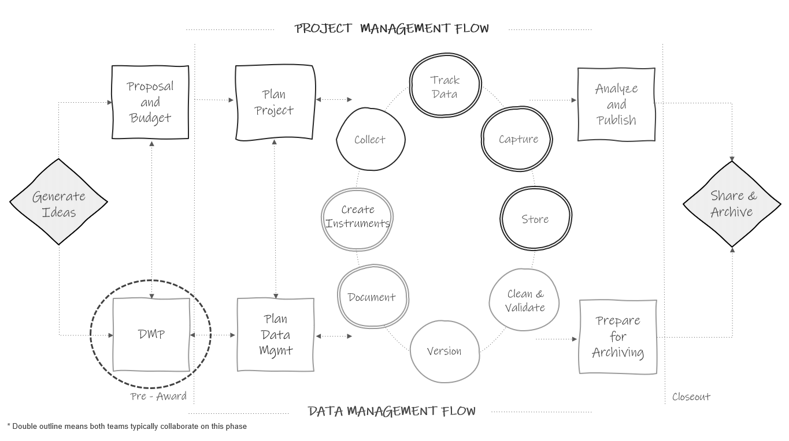
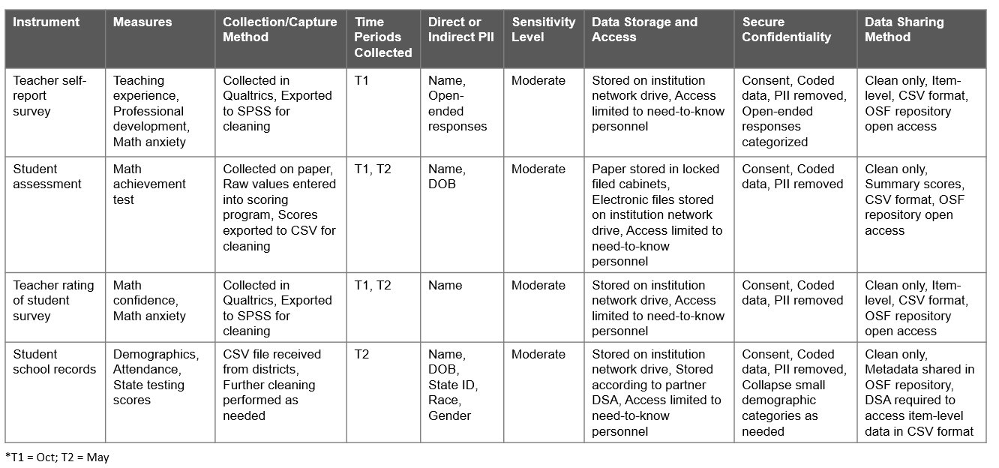

# Data Management Plan {#dmp}

(\#fig:fig5-1)Data management plan in the research project life cycle

## History and purpose

Since 2013, even earlier for the National Science Foundation, most federal agencies that education researchers work with have required a data management plan (DMP) as part of their funding application [@holdren_ostp_2013]. While the focus of these plans is mostly on the future outcome of data sharing, the data management plan is a means of ensuring that researchers will thoughtfully plan for a research study that will result in data that can be shared with confidence, and free from errors, uncertainty, or violations of confidentiality. President Obama’s May 2013 Executive Order declared that “the default state of new and modernized government information resources shall be open and machine readable" [@the_white_house_executive_2013]. In August of 2022, the Office of Science and Technology Policy (OSTP) doubled down on their data sharing policy and issued a memorandum stating that all federal agencies must update their public access policies no later than December 31, 2025, to make federally funded publications and their supporting data accessible to the public with no embargo on their release [@nelson_ostp_2022]. Even sooner than this, organizations like the National Institutes of Health (NIH) mandated that grant applicants, beginning January 2023, must submit a plan for both managing and sharing project data [@national_institutes_of_health_final_2023]. The National Science Foundation (NSF) also released version 2.0 of their public access plan in February of 2023, describing how the agency plans to ensure that all scientific data, funded by the NSF and associated with peer-reviewed publications, is publicly shared [@national_science_foundation_nsf_2023].

> **Note**    
In the last year, agencies have begun revising the phrase "data management plan" to include the word "sharing" to better represent the shifting emphasis on sharing publicly funded data. As an example, NIH now uses the term Data Management and Sharing Plan (DMS Plan), while the Institute of Education Sciences (IES) has chosen to use the term Data Sharing and Management Plan (DSMP) ^[https://ies.ed.gov/funding/pdf/2024_84305a.pdf]. For the sake of simplicity, the term DMP is used throughout this book to generally represent these plans, no matter the precise name, across all federal agencies.

### Why are DMPs important?

Funding agencies see DMPs as important in maximizing scientific outputs from investments and increasing transparency. Mandating data sharing for federally funded projects leads to many benefits including accelerating discovery, greater collaboration, and building trust among data creators and users. In addition to the benefits viewed by funders, there are intrinsic benefits that come from having to write a data management plan. Having to thoughtfully plan and having transparency in that plan leads to better data management. Knowing that you will eventually be sharing your data and documentation with others outside of your team can motivate researchers to think hard about how to organize their data management practices in a way that will produce data that they trust to share with the outside world [@center_for_open_science_creating_2023]. Even if a DMP is not required by a funder, it should always be the first step of your planning process. Although brief, this document serves as the foundation for all future planning and provides your team with a shared understanding of data management expectations. 

## What is it?

Typically, a data management plan is a supplemental 2-5 page document, submitted with your grant application, that contains high level decisions about how you plan to collect, store, manage, and share your research data products. For most funders these DMPs are not part of the scoring process, but they are reviewed by a panel or program officer. Some funders may provide feedback or ask for revisions if they believe your plan and/or your budget and associated costs are not adequate. Although this document is usually submitted to your funder, it should be considered a living document to be updated as plans change throughout a study.

### What to include?

What to include in a DMP varies some across funding agencies and the landscape of requirements is currently evolving. You should check each funding agency’s site for their specific DMP requirements when submitting a proposal. With that said there are generally 10 common categories covered in a data management plan [@center_for_open_science_creating_2023; @gonzales_ten_2022; @icpsr_guide_2020; @michener_ten_2015] which we will review below.

1. Description of data to be shared (See Chapters \@ref(collect), \@ref(capture), \@ref(clean), \@ref(share))
    - What is the source of data? (e.g., surveys, assessments, observations, extant data)
    - How will data be cleaned and curated data prior to data sharing?
    - What will the level of aggregation be? (e.g., item-level, summary data, metadata only)
      - Datasets from a project may need to be shared in different ways due to legal, ethical, or technical reasons.
    - Will both raw and clean data be shared?
    - What are the expected number of files? Expected number of rows/cases in each file?
1. Format of data to be shared (See Chapters \@ref(clean) and \@ref(share))
    - Will data be in an electronic format?
    - Will it be provided in a non-proprietary format? (e.g., CSV)
    - Will more than one format be provided? (e.g., SPSS and CSV)
    - Are there any tools needed to manipulate or reproduce shared data? (e.g., software, code)
      - Provide details for those tools. (e.g., how they can be accessed, version number, required operating system)
1. Documentation to be shared (See Chapters \@ref(document) and \@ref(share))
    - What documentation will you share?
      - Consider project-level, dataset-level, and variable-level documentation.
    - What format will your documentation be in? (e.g., XML, CSV, PDF)
1. Standards (See Chapters \@ref(document) and \@ref(collect))
    - Do you plan to use any standards for things such as metadata, data formatting, terminology, data collection (e.g., common data elements), or persistent identifiers (PIDs)?
1. Data preservation (See Chapter \@ref(share))
    - Where will data be archived for public sharing?
      - Many agencies are now requiring applicants to name a specific data repository in this section.
    - What are the desirable characteristics of the repository? ^[ https://repository.si.edu/bitstream/handle/10088/113528/Desirable%20Characteristics%20of%20Data%20Repositories.pdf] (e.g., unique persistent identifiers assigned to data, metadata collected, records provenance, licensing)
    - When will you deposit your study data in the repository and for how long will data remain accessible?
    - How will you enable discoverability and reuse of data?
1. Access, distribution, or reuse considerations (See Chapters \@ref(hsd) and \@ref(share))
    - Are there any legal, technical, or ethical factors affecting reuse, access, or distribution of your data?
    - Will any data be restricted?
    - Are access controls required (e.g., a data use agreement, data enclave)?
1. Protection of privacy and confidentiality (See Chapters \@ref(hsd), \@ref(clean), and \@ref(share))
    - Do participants sign informed consent agreements? Does the consent communicate how participant data are expected to be used and shared?
    - How will you prevent disclosure of personally identifiable information when you share data?
1. Data security (See Chapter \@ref(store))
   - How will security and integrity of data be maintained during a project? (e.g., consider data storage, access, backup, and transfer)
1. Roles and responsibilities (See Chapter \@ref(roles))
    - What are the staff roles in management and preservation of data?
    - Who ensures accessibility, reliability, and quality of data?
    - Is there a plan if a core team member leaves the project or institution?
1. Pre-registration
    - Where and when will you pre-register your study?

Again, the specifics of what should be included in each category will vary by funder. Here are sites to visit to learn more about the four most common federal education research funder DMP requirements. 

  - Institute of Education Sciences ^[https://ies.ed.gov/funding/datasharing_implementation.asp] ^[https://ies.ed.gov/funding/pdf/2024_84305a.pdf]
  - National Institutes of Health ^[https://sharing.nih.gov/data-management-and-sharing-policy/planning-and-budgeting-DMS/writing-a-data-management-and-sharing-plan]
  - National Institute of Justice ^[https://nij.ojp.gov/funding/data-archiving]
  - National Science Foundation ^[https://www.nsf.gov/bfa/dias/policy/dmpdocs/ehr.pdf]
  
## Creating a data sources catalog {#dmp-catalog}

In preparation for writing your DMP, it can be helpful to create a data sources catalog that allows you to visually see what data sources you are collecting, what the sensitivity level of those sources are, and how they will be collected, managed, stored, and shared [@filip_san_2023]. While this catalog will not cover all the questions required in a DMP, this table allows you to strategically plan the details for how you will manage and share data for each source. This type of catalog cannot only help you write your DMP, but can also serve as an excellent planning or discussion tool throughout your entire project. Ultimately, each data source in your catalog, multiplied by the number of cohorts and/or waves it is collected, will give you an approximate estimate of your final number of distinct data files at the end of your study.

Some fields you can add to this catalog include:

- Source information
  - Instrument (e.g., survey, assessment)
  - Record level (i.e., who is this instrument collected on)
  - Source (i.e., who completes the instrument)
  - Measures included in the instrument
- Collection and capture method
- Data collection waves
- Planned number and size of data files for each source (e.g., two student assessment files (T1, T2), with ~500 rows per file)
- PII included
- Sensitivity level based on your institution's policies
- Data storage and access plan
- Data ownership
- How confidentiality will be secured
- Data sharing method

Figure \@ref(fig:fig5-2) is a simplified example of building this catalog for a hypothetical study. In this example, if we only collected data for one year, we would end up with six datasets at the end of our study, three teacher-level files and three student-level files. In chapter \@ref(share), we will discuss whether to share these as separate datasets, or larger files combined by unit of analysis (e.g., combined student-level file, combined teacher-level file).

(\#fig:fig5-2)Example data sources catalog

## Getting help

Since DMPs are written before a project is funded, and therefore before additional staff members may be hired, oftentimes the investigators developing the grant proposal are the ones who write the DMP. However, when constructing your DMP it is well worth your time to enlist help. If you have an existing data manager or data team, you will most certainly want to consult with them when writing your plan to ensure your decisions are feasible. If you work for a university system, your research data librarians are also excellent resources with a wealth of knowledge about writing comprehensive data management plans. Also, if you plan to share your final data with a repository or institutional archive you will want to contact their team when writing your plan as well. The repository may have its own requirements for how and when data must be shared and it is helpful to outline those guidelines in your data management plan at the time of submission. Last, you may want to obtain the help of your colleagues. Your colleagues have likely written DMPs before and many people are willing to share their plans as a way to help others better understand what to include.

As mentioned earlier, your DMP is a living document and you can always update your plan during or after your project completion. It may be helpful to keep in contact with your program officer regarding any potential changes throughout your project.

If you are looking for guidance in writing a DMP, a variety of generic DMP templates for different federal agencies are available, as well as actual copies of submitted DMPs that some researchers graciously make publicly available for example purposes.

**Template and Resources**

|Source|Resource|
|--------|-----------|
|DMPTool | Templates organized by funding agencies ^[https://dmptool.org/public_templates]|
|Figshare | DMP prompts specific to depositing data with Figshare ^[https://help.figshare.com/article/how-to-write-a-data-management-plan-dmp-and-include-figshare-in-your-data-sharing-plans]|
|Hao Ye, et al.| NIH DMS Plan checklist ^[https://osf.io/awypt/]|
|Harvard Longwood Medical Area RDM Working Group| Annotated DMP template ^[https://osf.io/ztjf2]|
|ICPSR | NIH DMS Plan template with specific recommendations for depositing data with ICPSR ^[https://www.icpsr.umich.edu/files/ICPSR/nih/FINAL_ICPSR-NIH-DMS-Plan-Template_2023.docx]|
|NIH | Sample DMS Plan for human survey data ^[https://www.nichd.nih.gov/sites/default/files/inline-files/Example_DMS_Plan-Human-Survey-NIH_Format_Page_V2.pdf]|
|Sara Hart | A submitted DMP that is publicly available for example purposes ^[https://figshare.com/articles/preprint/Example_of_a_Data_Management_Plan/13218743]|
|UMN Libraries | Submitted DMP examples from University of Minnesota researchers ^[https://www.lib.umn.edu/services/data/dmp-examples]|

## Budgeting {#budget}

Funding agencies acknowledge that there are costs associated with implementing your data management plan and allow you to explain these costs in your budget narrative. Costs associated with the entire data life cycle should be considered and may include costs associated with data management personnel, specialized infrastructure, tools needed to collect, enter, organize, document, store, or share study data [@uk_data_service_data_2022], as well as fees associated with data preservation. Make sure to review your funder's documentation for information about allowable costs [@samuel_j_wood_library_research_2023] and time frame for incurring costs. Examples of potential allowable costs include [@national_institutes_of_health_budgeting_2023]:

- Costs associated with curating and de-identifying data
- Costs associated with developing data documentation
- Fees associated with depositing data for long-term sharing in a repository

It can be difficult to estimate the costs of everything that is associated with the vast landscape of managing data. Recommended amounts range anywhere from 5-30% of your budget for data stewardship [@mons_invest_2020; @reynolds_data_2014]. Luckily a few organizations have developed resources to aid in estimating these costs. Although exercise caution when using tools; they may not always account for every cost and could result in an underestimation of costs [@michigan_state_university_budgeting_2023]. 

**Resources**

|Source|Resource|
|--------|-----------|
|DataOne| Considerations for providing budget information for a DMP ^[https://dataoneorg.github.io/Education/bestpractices/provide-budget-information]|
|J-PAL| Research proposal budget considerations ^[https://www.povertyactionlab.org/resource/grant-proposals]|
|National Institutes of Mental Health Data Archive | NDA Data Submission Cost Estimation Tool^[https://s3.amazonaws.com/nda.nih.gov/Documents/NDA_Data_Submission_Cost_Estimation_Tool.xlsx]|
|UK Data Service | Data management costing tool and checklist ^[https://ukdataservice.ac.uk//app/uploads/costingtool.pdf]|
|University of Twente | Estimating RDM costs review list ^[https://www.utwente.nl/en/service-portal/services/lisa/resources/files/library-public/dcc-rdm-costs-estimation.pdf]|
|Utrecht University| Estimating the costs of data management review list ^[https://www.utwente.nl/en/service-portal/services/lisa/resources/files/library-public/dcc-rdm-costs-estimation.pdf]|

