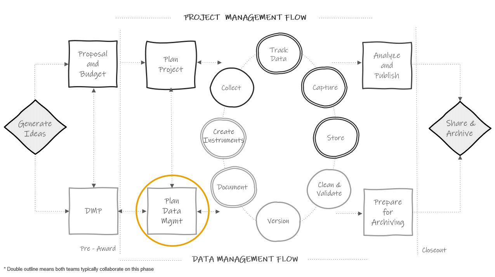
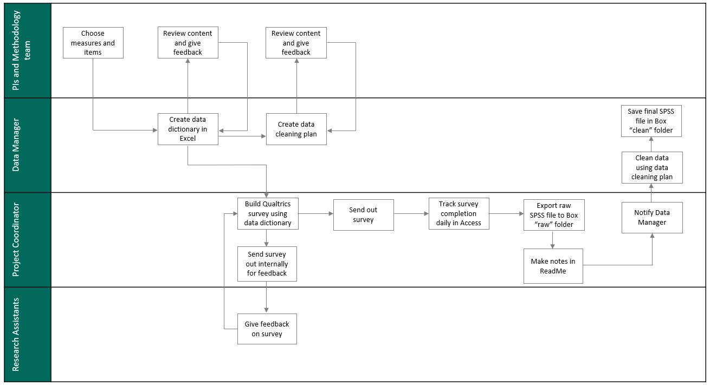

# Planning Data Management {#plan}

(\#fig:unnamed-chunk-1)Planning in the research project life cycle

Planning data management is distinct from the 2-5 page data management plan (DMP) discussed in the previous chapter. Here we are spending a few weeks, maybe months, meeting regularly with our team and gathering information to develop detailed instructions for how we plan to manage data according to our DMP. This data management planning happens at the same time that the project team is planning for project implementation (things like how to collect data, how to hire staff, what supplies are needed, how to recruit participants, how to communicate with sites, etc). Team members such as PIs, project coordinators, and data managers, may be assisting in both planning processes.

## Why spend time on planning?

Funder required data management plans are hopeful outlines for future practices. However, the broad theory behind our DMPs do not actually prepare us for the complex implementation of those plans in practice[@borycz_implementing_2021]. Therefore, it is important to spend time, before your project begins, planning and preparing for data management. It is an upfront time investment but this sort of slow science leads to better data outcomes. Reproducibility begins in the planning phase. Taking time to create, document, and train staff on data management standards before your project begins helps to ensure that your processes are implemented with fidelity and can be replicated consistently throughout the entire study. 

Planning the day to day management of your project data has many other benefits as well. It allows you to anticipate and overcome barriers to managing your data, such as communication issues, training needs, or potential tool issues. This type of planning also saves you time in the long run, removing the last minute scrambling that can occur when trying to organize your data at the end of a project. Last, this type of planning can mitigate errors. Viewing errors as problems created by poorly planned workflows, rather than individual failures, helps us to see how data management planning can lead to better data[@strand_error_nodate]. While data management planning can not remove all chances of errors creeping into your data[@eaker_what_2016], it can most certainly reduce those errors and prevent them from "compounding over time"(Alston & Rick, 2021, p.4 [@alston_beginners_2021]).

## Goals of planning

This planning phase should include a series of regular meetings with core decision makers. While there are many aspects of a research study to plan that should also occur during this time (ex: planning an intervention, planning analyses), here we are focusing on planning for data management (including data collection). Most likely you will want the PI/Co-PIs in attendance along with core project staff and your data management team. During this planning time, there are several goals to keep in mind.

1. To finalize project goals laid out in a grant proposal (i.e. what data will be collected)
1. To finalize a timeline for goals (i.e. when is data collected)
1. To lay out specific tasks needed to accomplish goals (i.e. how will data be collected, stored, managed)
1. To assign [roles and responsibilities](#roles) (i.e. who will be responsible for tasks)
1. To make decisions around task management and communication (i.e. how will tasks be monitored and communication tracked)

Make sure to come to every meeting with an agenda to stay on track and to take detailed notes. These notes will be the basis for creating all of your documentation in the next phase. All meeting notes can be stored in a central location such as a planning folder with notes ordered by date or in a running document. 

At the end of the planning period, the team should have a clear plan for what the project goals are, when goals should be accomplished, how goals will be accomplished, who is in charge of completing tasks associated with goals, and what additional resources are needed to accomplish goals.

## Planning checklists

Along with your existing data management plan, checklists are great tools to help guide your discussions as you work through this planning process with your team. Below are some sample checklists, one for each phase of the research cycle. These checklists can be added to or amended and brought to your planning meetings to help your team think through the various data management decisions that need to be made at each phase of your research project.

- Roles and Responsibilities[@lewis_roles_nodate]
- Task Management[@lewis_task_nodate]
- Documentation[@lewis_documentation_nodate]
- Data Collection[@lewis_data_nodate-5]
- Data Tracking[@lewis_data_nodate-4]
- Data Capture[@lewis_data_nodate-3]
- Data Storage and Security[@lewis_data_nodate-2]
- Data Cleaning[@lewis_data_nodate-1]
- Data Sharing[@lewis_data_nodate]

### Decision-making process

As you move through the remaining chapters of this book, you will begin to learn recommended practices for each phase of the research cycle. Going through each checklist above, you can start to fill in the practices that work for your project for each phase of the study. 

This decision-making process is personalized. Borghi and Van Gulick[@borghi_promoting_2022] view this process as a series of steps that a research team chooses, out of a the many possibilities not chosen. Maybe you won’t always be able to implement the “best practices” but you can decide what is good enough for your team based on motivations, incentives, needs, resources, skill set, and rules and regulations.

For example, one team may collect survey data on paper because their participants are young children, hand enter it into Excel because that is the only tool they have access to, and double enter 20% because they don’t have the capacity to enter more than that. Another team may collect paper data because they are collecting data in the field, hand enter the data into FileMaker because that is the tool their team is familiar with, and double enter 100% because they have the budget and capacity to do that.

Below is a very simplified example of the decision making process, based on the Borghi and Van Gulick[@borghi_promoting_2022] flow chart. Of course in real life we are often choosing between many more than just two options!

(\#fig:unnamed-chunk-2)A simplified decision-making process

### Checklist considerations

It's important to consider how each team and project are unique as you work through these planning checklists. A technique that might work well for one team, may not work out so well for another. Make sure to consider the following:

1. All external requirements
    - Do your practices align with the plan laid out in your DMP? If no, you may need to revise your DMP to match your new decisions - remember your DMP is a living document.
    - Do your practices meet all other external compliance requirements such as those from your Institutional Review Board, your institutional policies, project partner requirements, or government mandates?
2. The skill set of your team
    - How does the skill set of your team align with the practices you plan to implement? Will additional training be required?
3. Your available tools
    - What tools are available to your team? 
    - Does your organization only allow you to use certain platforms for data storage? 
    - What is the complexity of your tools? Will additional training be needed?
4. Your budget
    - Do you have the budget to implement all of the practices you want to implement or will you need to plan something more feasible?
5. Complexity of your project
    - The size of your project, the amount and types of data you are collecting, the number of participants or the populations you are collecting data from, the sensitivity level of the data you are collecting, the number of sites you are collecting data at, and the number of partners and decision makers you are working with, all factor into your data management planning
6. Shared investment
    - Is your entire team invested in quality data management? 
    - Is the entire team motivated to adhere to the standards and instructions laid out in your data management planning? If no, what safeguards can you implement to help prevent errors from creeping into your data?

## Data management workflow

The last step of this planning phase is to build your workflows. Workflows allow data management to be seamlessly integrated into your data collection process. Often illustrated with a flow diagram, a workflow is a series of **repeatable** tasks that help you move through the stages of the research life cycle in an “organized and efficient manner”[@desk_csp_nodate]. As you walk through your checklists, you can begin to enter your decisions into a workflow diagram that show actionable steps in your data management process. The order of your steps should follow the general order of the data management life cycle (specifically the data collection cycle). You will want to have a workflow diagram for every piece of data that you collect. So for example, if you collect the following three items below, you will have three workflow diagrams.

- Student online survey
- Student paper assessment
- Student district level administrative data

Your diagrams should include the who, what, where, and when of each task in the process. Adding these details are what make the process actionable [@borycz_implementing_2021]. Your diagram can be displayed in any format that works for you and it can be as simple or as detailed as you want it to be. A template like this one below works very well for thinking through high level workflows. Remember, this is a repeatable process. So while this diagram is linear (steps laid out in the chronological order in which we expect them to happen), this process will be repeated every time we collect this same piece of data.

(\#fig:unnamed-chunk-3)A simple workflow template

Here is how we might complete this diagram for a student survey.

(\#fig:unnamed-chunk-4)Example student survey workflow

But the format truly does not matter. Here is a diagram of the same student survey workflow as above, with more detailed added, and this time using a swimlane template instead, where each lane displays the tasks associated with that individual and the iterative processes that occur within and across lanes.

(\#fig:unnamed-chunk-5)Example student survey workflow using a swimlane template

If you have a working [data collection timeline](#supplement) already created, you can even build time into your workflow. Here is another example of the same survey workflow again, this time displayed using a Gantt chart [@poverty_action_lab_gantt_nodate] in order to better capture the expected timeline.

While these workflow diagrams are excellent for high level views of what the process will be, we can see that we are unable to put fine details into this visual. So the last step of creating a workflow is to put all steps into a standard operating procedure (SOP). In your SOP you will add all necessary details of the process. You can also attach your diagram as an addendum or link your sops and diagrams in other ways for reference. We will talk more about creating [SOPs](#sop) in our chapter on documentation.

### Benefits to visualizing a workflow

Visualizing your decisions in diagram format has many benefits. First, it allows your team to conceptualize their specific tasks in the process, as well as the timing at which their tasks occur, and any dependencies associated with those tasks. It also allows your team to see how their roles and responsibilities fit into the larger research process[@briney_foundational_2020]. Showing how data management is integrated into the larger research workflow can help team members view data management as part of their daily routine, rather than “extra work”[@borghi_promoting_2022]. And last, reviewing workflows as a team and allowing members to provide feedback may help create buy-in for data management processes, potentially leading to better adherence to practices.

### Workflow considerations

Similar to the questions you need to consider when reviewing your planning checklists, you also need to evaluate the following things when developing your personalized workflow.

- Does your flow preserve the integrity of your data? Is there any point where you might lose or comprise data?[@hansen_dataflowtoolkitdk_2017]
- Is there any point in the flow where data is not being handled securely? Someone gains access to identifiable information that should not have access?
- Is your flow in accordance with all of your compliance requirements (IRB, FERPA, HIPAA, Institutional Data Policies, etc.)?
- Is your flow feasible for your team (based on size, skill level, motivation, etc.)?
- Is your flow feasible for your budget and available resources?
- Is your flow feasible for the amount and types of data you are collecting?
- Are there any bottlenecks in the workflow? Areas where resources or training are needed? Any areas where tasks should be re-directed?

## Task management systems

While tools such as our checklists, workflow diagrams, and [SOPs](#sop) allow us to document and share our processes, it can be tricky to manage the day to day implementation of those processes. The planning phase is a great time to choose a task management system[@gentzkow_code_2014]. Keeping track of various deadlines and communications across scattered sources can be overwhelming and using a task management system may help remove ambiguity about the status of task progress. Rather than having to regularly check in via email for status updates or reading through various meeting notes to learn about decisions made, a task management system allows you to assign tasks to responsible parties, set deadlines based on [timelines](#supplement), track progress, and capture communication and decisions all in one location.

There are many existing tools that allow teams to assign and track tasks, schedule meetings, track project timelines, and document communication. Without endorsing any particular product, some project/task management tools that I know education research teams have used include:

- Trello
- Smartsheet
- Todoist
- Microsoft Planner
- Notion
- Basecamp
- Confluence
- Asana

Of course, as with all processes we've discussed so far, a task management system is only useful if your team is trained to use it, is invested in using it, and actually uses it as part of their daily routine. So make sure to consider this as you choose what tool, if any, is right for you.

