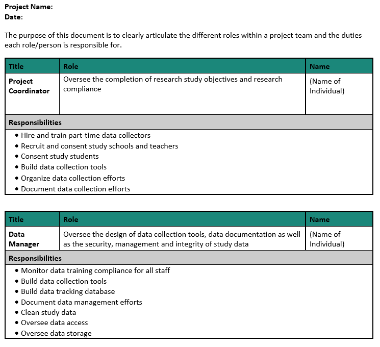

# Project Roles and Responsibilities

(\#fig:unnamed-chunk-1)Planning in the research project life cycle

Part of the DMP and planning data management phase, as noted in previous chapters, will include assigning roles and responsibilities. In terms of data management, it is important to assign and document roles, not just presume roles [@service_roles_nodate] for many reasons including for the security of data, the continuity of practices, and for the standardization of workflows.

## Typical roles in a research project

Before diving in to how to assign and document roles for a project, it is important to get an understanding of typical roles on an education research project team. Your team may be lucky enough to have all of (or multiple of) these roles. Other times, just one person, such as the Principal Investigator (PI), may take on all or multiple of these roles. With that said, if your budget allows it, I highly recommend hiring individuals to fill each of the roles mentioned below to allow team members to specialize and excel in their area of expertise. While learning all aspects of a project is highly recommended to create a cohesive team that works collaboratively, team members that take on too many project roles can be spread too thin and project goals may suffer.

### PI and Co-PI

The PIs (or project directors), as well as Co-PIs, are the individuals who prepare and submit the grant proposal and are responsible for the administration of that grant. There are often more than one PI on a project including at least someone with content area knowledge as well as a methodologist. PIs and Co-PIs have varying levels of involvement in research projects and are typically, not always, more hands off in the day to day administration. Even if some tasks are delegated to other research staff, PIs and Co-PIs are ultimately responsible for Institutional Review Board (IRB) submissions and for meeting IRB requirements, as well as for submitting MOUs, budgets, effort reporting, continuing review reports, and any final technical finding reports.

### Project Coordinator

The project coordinator (or project manager) is an essential member of the research team. As the name implies, this person typically coordinates all research activities and ensures compliance with agencies such as the Institutional Review Board. Tasks they may oversee include recruitment and consenting of participants, creation of data collection materials, creation of protocols, training data collectors, data collection scheduling, and more. The project coordinator may also supervise many of the other research team roles, such as research assistants.

### Data Manager

The data manager is also an essential member of the team. This person is responsible for the organizing, cleaning, documenting, storing, and dissemination of research project data. This team member works very closely with the project coordinator, as well as the PI, to ensure that data management is considered throughout the project life cycle. Tasks a data manager may oversee include data storage, security and access, building data collection and tracking tools, cleaning and validating data, data documentation, and organizing data for sharing purposes.

This role is vital in maintaining the standardization of data practices. If you do not have the budget to hire a full-time data manager, make sure to assign someone on your team to oversee the flow of data, ensuring that throughout the project data is documented, collected, entered, cleaned and stored consistently and securely. 

### Project Team Members

This role refers to any staff hired to help implement a research project which may include full-time staff members or even part-time graduate students. Project team members are typically out in the field, collecting data, or they may also assist in other areas such as preparing data collection materials or assisting with data management. Senior project team members may also assist in implementing training or acting as data collection leads in the field.

### Other Roles

The size of a research team and the roles that exist are dependent on factors such as funding, the type of research study, the intervention being studied, or the organization of your specific research institution. Some teams may include additional roles, not mentioned above, such as research director, lab manager, software engineer, database manager, postdoc, analyst, statistician, administrative professional, hourly data collector, outreach coordinator, or coach/interventionist, all who may assist in the research cycle in other ways. Some of these roles will assist in the research data life cycle as seen in the diagram above. Some may be on a path that is hidden from the diagram but still happening, behind the scenes, alongside the process. Take for instance, the role of a coach implementing an intervention that is being studied. Their role isn't shown on original diagram but their work is happening alongside the data collection cycle. 

(\#fig:unnamed-chunk-2)Life cycle diagram updated to show hidden processes

## Goals of assigning Roles and Responsibilities

There are several goals of assigning roles and responsibilities [@valentine_best_nodate].

1. To assign specific team members to project roles and delineate the responsibilities of those roles
1. Assess equity in responsibilities  
    - Including time needed to complete tasks
    - Number of responsibilities assigned to each team member (not overloading any one team member)
1. To assess the skills needed for responsibilities
1. To assess any training need to fill gaps in knowledge
1. Estimate costs associated with roles
1. Contingency plans  
    - For transitions out of the role or for absenteeism

Early on in the project you will start to generally assign roles in your data management plan. Remember you are often required to state who will be responsible for tasks such as data integrity and security. Then, once your project is funded and you start to have a better idea of your goals and your budget, you can flesh out the details of your roles. During the planning phase, using tools such as your planning checklists will help you think through more specific responsibilities and tasks associated with each role.

### Documenting roles and responsibilities

Once roles and responsibilities have been assigned, those decisions should be documented to avoid any ambiguity about who is doing what. While documentation is a topic that will be covered in the next chapter, I think it is helpful to break the rules and discuss just this one document here while we are covering the topic of assigning roles. 

A general roles and responsibilities document is one way to document your decisions [@ucdavis_pmlc_nodate; @colorado_school_of_mines_table_nodate]. In addition to being a planning document, it can also serve as a reference document that allows your team to easily see who is on the project team, what roles they play, and who to contact for questions regarding various project aspects (for example - who to contact for data storage access). 

This document can be laid in any format that conveys the information clearly to your team. Below are two example templates. Note that these templates only list overarching responsibilities, not specific tasks. Specific actionable steps will be laid out in other process documentation such as Standard Operating Procedures [**see Documentation**] where names are attached to each task.

(\#fig:unnamed-chunk-3)Roles and responsibilities document organized by role

(\#fig:unnamed-chunk-4)Roles and responsibilities document organized by phase

Reviewing roles and responsibilities in a format like this allows you to start to see how responsibilities are assigned and decide if tasks need to be redistributed in any way. You can also then start to fill in more details as needed.

1. Required skillset

In assigning roles and responsibilities, make sure to consider the skills that are needed to be successful in each position. For example, when considering the role of a data manager and the responsibilities associated with that role, you may look for skillsets in the following buckets: 

1. Interpersonal skills
  - Detail oriented
  - Organized
  - Problem solver
  - Inquisitive
  - Excellent communicator (bridging gaps between technical audiences and non-technical audiences)
2. Domain skills
  - Experience working with education data
  - Understands data privacy (FERPA, HIPAA)
3. Technical skills
  - Understanding of database structure
  - Experience building data pipelines
  - Coding experience
  - Specific software/tool experience
  
The specific skills needed for each role will depend on your project needs as well as the skillsets of the other members of the team.

2. Training needs

In addition to considering skills needed for certain roles, also consider what training is needed to fulfill assigned responsibilities. In roles that work with data, training may include mandated courses from a program like the Collaborative Institutional Training Initiative (CITI) or it may be signing up for training on how to use a specific tool or software. Make sure that your team members are well-equipped to perform their responsibilities before the project begins.

3. Estimate costs

If you are working on roles and responsibilities after your grant has been funded, then your grant budget has already submitted. However, it can still be helpful to start assigning costs associated with overall roles (based on the experience/skillset of the person filling the role) or even broken down by associated responsibilities (based on things like percent effort or time to complete each task). If discrepancies between the original budget and updated costs are found, often funders will allow PIs to amend budgets.

4. Contingency plans

In your document you can also add notes about backup plans should a staff member leave the project or be absent for an extended period of time. This may include cross training staff or a plan for training replacement staff.

5. Other additions

Since there is no one template for creating a roles and responsibility document, you can really add whatever information helps to most clearly convey the information. Some additional columns you may consider adding include:

- Links to related standard operating procedures (ex: for building a participant tracking database you may link to the specific SOP that lays out steps for building the tool)
- Names of other staff members (if any) that assist with or also contribute to each responsibility
- Timing of each responsibility (ex: weekly, ongoing, the month of February)

