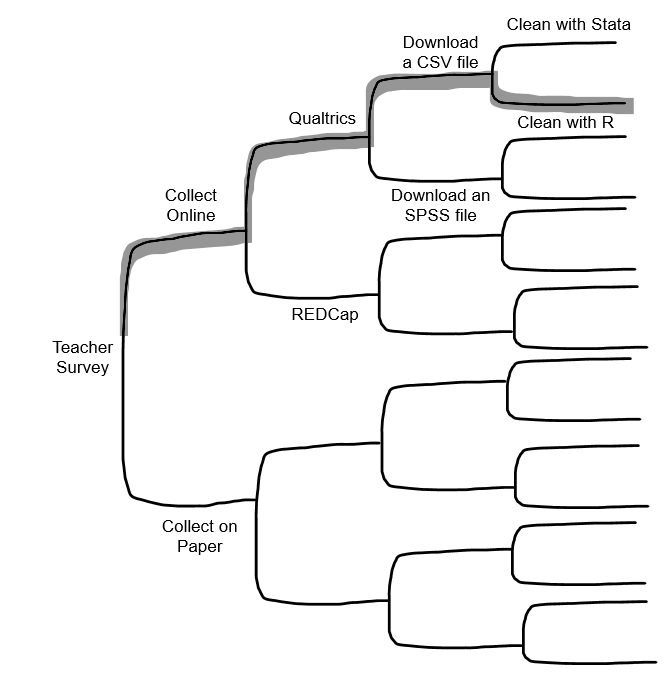
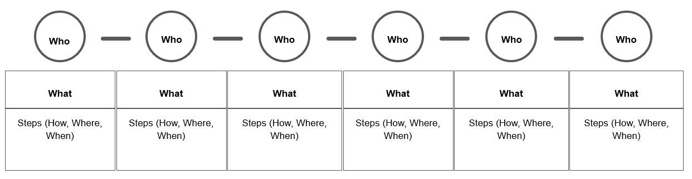
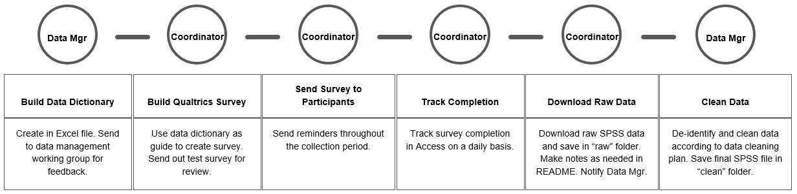
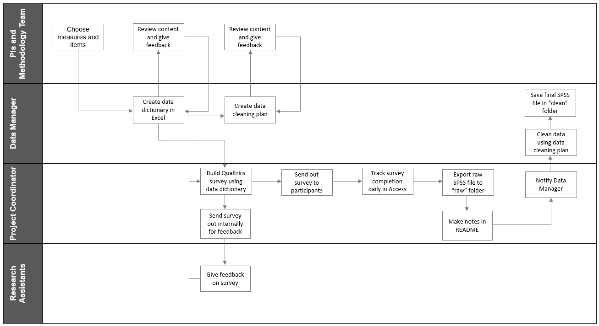
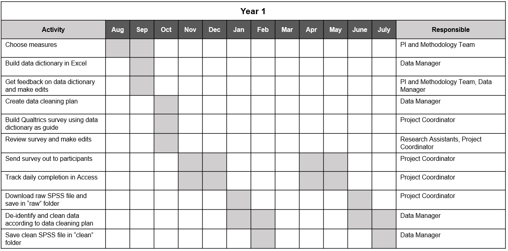

# Planning Data Management {#plan}

(\#fig:fig6-1)Planning in the research project life cycle

Planning data management is distinct from the 2-5 page data management plan (DMP) discussed in the Chapter \@ref(dmp). Here we are spending a few weeks, maybe months, meeting regularly with our team and gathering information to develop detailed instructions for how we plan to manage data according to our DMP. This data management planning happens at the same time that the project team is planning for project implementation (e.g., how to collect data, how to hire staff, what supplies are needed, how to recruit participants, how to communicate with sites). Team members such as investigators, project coordinators, and data managers, may be assisting in both planning processes.

## Why spend time on planning?

Funder required data management plans are hopeful outlines for future practices. However, the broad theory behind our DMPs do not actually prepare us for the complex implementation of those plans in practice [@borycz_implementing_2021]. Therefore, it is important to spend time, before your project begins, planning and preparing for data management. It is an upfront time investment but this sort of slow science leads to better data outcomes. Reproducibility begins in the planning phase. Taking time to create, document, and train staff on data management standards before your project begins helps to ensure that your processes are implemented with fidelity and can be replicated consistently throughout the entire study. 

Planning the day-to-day management of your project data has many other benefits as well. It allows you to anticipate and overcome barriers to managing your data, such as communication issues, training needs, or potential tool issues. This type of planning also saves you time in the long run, removing the last-minute scrambling that can occur when trying to organize your data at the end of a project. Last, this type of planning can mitigate errors. Viewing errors as problems created by poorly planned workflows, rather than individual failures, helps us to see how data management planning can lead to better data [@strand_error_2021]. While data management planning cannot remove all chances of errors creeping into your data [@eaker_what_2016], it can most certainly reduce those errors and prevent them from "compounding over time" [@alston_beginners_2021, p.4].

## Goals of planning

This planning phase should include a series of regular meetings with core decision makers. For this purpose, it can be helpful to form a data management working group (DMWG), consisting of investigators, key project staff, and other decision makers (e.g., methodologists), who can attend planning meetings and provide feedback as needed throughout the project [@van_bochove_data_2023]. There are several goals to accomplish during these planning meetings.

1. Further flesh out project goals laid out in a grant proposal (e.g., confirm measures being collected in your study).
1. Finalize a timeline for goals (e.g., confirm the data collection timeline).
1. Lay out specific tasks required to accomplish data management plans.
1. Assign roles and responsibilities for specific tasks.
1. Make decisions around how to manage tasks and communication.

Make sure to come to every meeting with an agenda to stay on track and to take detailed notes. These notes will be the basis for creating all of your documentation (see Chapter \@ref(document)). 

At the end of the planning period, the team should have a clear plan for what the project goals are, when goals should be accomplished, how goals will be accomplished, who is in charge of completing tasks associated with goals, and what additional resources are needed to accomplish goals.

## Planning checklists {#plan-checklist}

Along with your existing data management plan and other grant application materials, checklists are great tools to help inform your meeting agendas as you work through this planning process with your team. Below are sample checklists, one for each phase of the research cycle. These checklists can be added to or amended and brought to your planning meetings to help your team think through the various data management decisions that need to be made at each phase of your research project. 

**Planning checklists**

- Roles and Responsibilities ^[https://osf.io/ghtc6]
- Task Management ^[https://osf.io/8x3s4]
- Documentation ^[https://osf.io/bckh8]
- Data Collection ^[https://osf.io/ckwtr]
- Data Tracking ^[https://osf.io/ahz4f]
- Data Capture ^[https://osf.io/pc8nt]
- Data Storage and Security ^[https://osf.io/y3z9s]
- Data Cleaning ^[https://osf.io/7t4rg]
- Data Archiving ^[https://osf.io/u4exh]
- Data Sharing ^[https://osf.io/jkgwz]

> **Note**    
If this is your first time working through this book, these checklists are a great way to summarize content from each chapter. As you learn best practices for a phase, pull up the checklist specific to that chapter to begin thinking through which practices are feasible for your specific project. 

### Decision-making process

This decision-making process is personalized. @borghi_promoting_2022 view this process as a series of steps that a research team chooses, out of all the many possibilities not chosen. Maybe you won’t always be able to implement the “best practices” but you can decide what is good enough for your team based on motivations, incentives, needs, resources, skill set, and rules and regulations.

For example, one team may collect survey data on paper because their participants are young children, hand enter it into Microsoft Excel because that is the only tool they have access to, and double enter 20% because they don’t have the capacity to enter more than that. Another team may collect paper data because they are collecting data in the field, hand enter the data into FileMaker because that is the tool their team is familiar with, and double enter 100% because they have the budget and capacity to do that.

Figure \@ref(fig:fig6-2) is a very simplified example of the decision-making process, based on a @borghi_promoting_2022 flow chart. Of course, in real life we are often choosing between many more than just two options!

(\#fig:fig6-2)A simplified decision-making process

### Checklist considerations

It's important to consider how each team and project are unique as you work through these planning checklists. A technique that might work well for one team, may not work well for another. Make sure to consider the following:

1. All external requirements
    - Do your practices align with the plan laid out in your DMP? If no, you may need to revise your DMP to match your new decisions (remember your DMP is a living document).
    - Do your practices meet all other compliance requirements (e.g., IRB requirements, IT department requirements, consent agreements, data sharing agreements)?
2. The skill set of your team
    - How does the skill set of your team align with the practices you plan to implement? Will additional training be required?
3. Your available tools
    - What tools are available to your team? 
    - Are your tools appropriate for the sensitivity level of your files? 
    - What is the complexity of your tools? Will additional training be needed?
4. Your budget
    - Do you have the budget to implement all of the practices you want to implement, or will you need to plan something more feasible?
5. Complexity of your project
    - The size of your project, the amount and types of data you are collecting, the number of participants or the populations you are collecting data from, the sensitivity level of the data you are collecting, the number of sites you are collecting data at, and the number of partners and decision makers you are working with, all factor into your data management planning
6. Shared investment
    - Is your entire team invested in quality data management? 
    - Is the entire team motivated to adhere to the standards and instructions laid out in your data management planning? If no, what safeguards can you implement to help prevent errors from creeping into your data?

## Data management workflow

The last step of this planning phase is to build your workflows. Workflows allow data management to be seamlessly integrated into your data collection process. Often illustrated with a flow diagram, a workflow is a repeatable series of sequential tasks [@lucidchart_what_2019] that help you move through the stages of the research life cycle in an organized and efficient manner. As you walk through your checklists, you can begin to enter your decisions into a workflow diagram that shows actionable steps in your data management process. The order of steps should follow the general order of the data management life cycle (specifically the data collection cycle). Your team will want to have a workflow diagram for every source in your data sources catalog (see Section \@ref(dmp-catalog)). So for example, if you collect the following three items, you will have three workflow diagrams.

- Student online survey
- Student paper assessment
- Student school records

Your diagrams should include the who, what, where, and when of each task in the process. Adding these details are what make the process actionable [@borycz_implementing_2021]. Your diagram can be displayed in any format that works for you and it can be as simple or as detailed as you want it to be. A template like the one in Figure \@ref(fig:fig6-3) works well for thinking through high-level workflows. Remember, this is a repeatable process. So, while this diagram is linear (steps laid out in the chronological order in which we expect them to happen), this process will be repeated every time we collect this same piece of data.

(\#fig:fig6-3)A simple workflow template

Figure \@ref(fig:fig6-4) is how we might complete a simplified diagram for a student survey.

(\#fig:fig6-4)Example simplified student survey workflow

But the format truly does not matter. Figure \@ref(fig:fig6-5) is a diagram of the same student survey workflow as Figure \@ref(fig:fig6-4), but with more detail added, and this time using a swimlane diagram where each lane displays the tasks associated with that individual and the iterative processes that occur within and across lanes.

(\#fig:fig6-5)Example student survey workflow using a swimlane diagram

If you have a working data collection timeline (see Section \@ref(document-supplement)) already created, you can even build time into your workflow. Figure \@ref(fig:fig6-6) is another example of the same survey workflow again, this time displayed using a Gantt chart [@duru_grant_2021] in order to better capture the expected timeline.

(\#fig:fig6-6)Example student survey workflow using a Gantt chart

While these workflow diagrams are excellent for high-level views of what the process will be, we can see that we are unable to put fine details into this visual. So, the last step of creating a workflow is to put all tasks (and all final decisions associated with those tasks) into a standard operating procedure (SOP). In your SOP you will add all necessary details of the process. You can also attach your diagram as an addendum or link your SOPs and diagrams in other ways for reference. We will talk more about creating SOPs in Section \@ref(document-sop).

### Benefits to visualizing a workflow

Visualizing your decisions in diagram format has many benefits. First, it allows your team to conceptualize their specific tasks in the process, the timing at which their tasks occur, and any dependencies associated with those tasks. It also allows your team to see how their roles and responsibilities fit into the larger research process [@briney_foundational_2020]. Showing how data management is integrated into the larger research workflow can help team members view data management as part of their daily routine, rather than “extra work” [@borghi_promoting_2022]. And last, reviewing workflows as a team and allowing members to provide feedback may help create buy-in for data management processes, potentially leading to better adherence to practices.

### Workflow considerations

Similar to the questions you need to consider when reviewing your planning checklists, you also need to evaluate the following things when developing your personalized workflows [@hansen_dataflowtoolkitdk_2017].

- Does your flow preserve the integrity of your data? Is there any point where you might lose or comprise data?
- Is there any point in the flow where data is not being handled securely? Can someone gain access to identifiable information they should not have access to?
- Is your flow in accordance with all of your compliance requirements?
- Is your flow feasible for your team (based on size, skill level, motivation, etc.)?
- Is your flow feasible for your budget and available resources?
- Is your flow feasible for the amount and types of data you are collecting?
- Are there any bottlenecks in the workflow? Any areas where resources or training are needed? Any areas where tasks should be re-directed?

## Task management systems

While tools such as our checklists, workflow diagrams, and SOPs allow us to document and share our processes, it can be tricky to manage the day-to-day implementation of those processes. The planning phase is a great time to choose a task management system [@gentzkow_code_2014]. Keeping track of various deadlines and communications across scattered sources can be overwhelming and using a task management system may help remove ambiguity about the status of task progress. Rather than having to regularly check in via email for status updates or reading through various meeting notes to learn about decisions made, a task management system allows you to assign tasks to responsible parties, set deadlines based on timelines, track progress, and capture communication and decisions all in one location.

There are many existing tools that allow teams to assign and track tasks, schedule meetings, track project timelines, and document communication. Without endorsing any particular product, some project/task management tools that I know education research teams have used include:

- Trello
- Smartsheet
- Todoist
- Microsoft Planner
- Notion
- Basecamp
- Confluence
- Asana

Of course, as with all processes we've discussed so far, a task management system is only useful if your team is trained to use it, is invested in using it, and actually uses it as part of their daily routine. So, make sure to consider this as you choose what tool, if any, is right for you.
