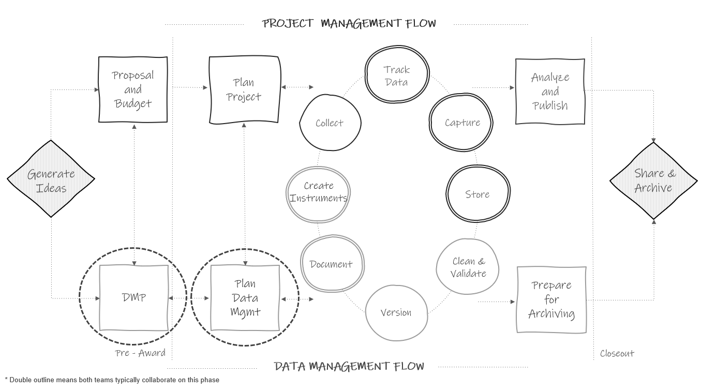
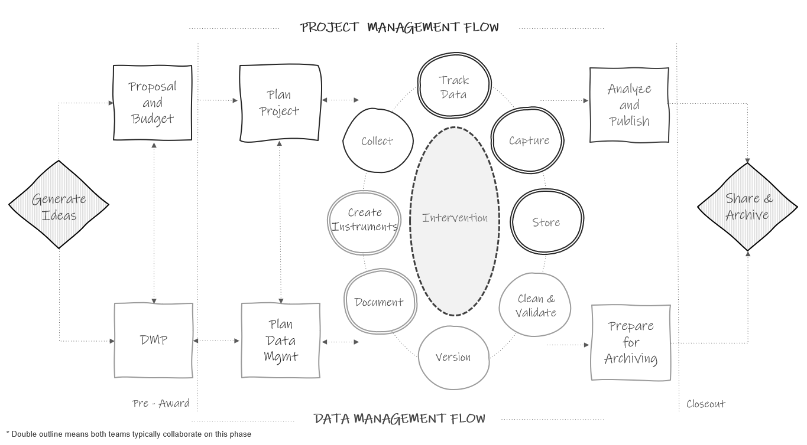
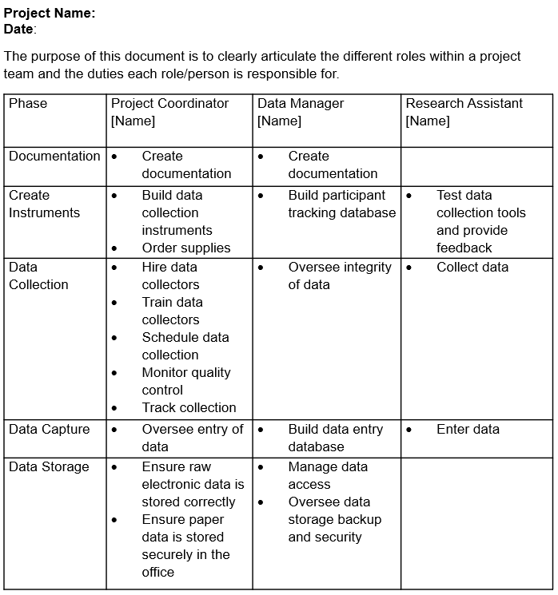

# Project Roles and Responsibilities {#roles}

(\#fig:fig7-1)Planning in the research project life cycle

Part of the DMP and planning data management phase, as noted in previous chapters, will include assigning roles and responsibilities. In terms of data management, it is important to assign and document roles, not just presume roles, for many reasons including the following [@uk_data_service_research_2023]:

1. It allows team members to begin standardizing workflows.
1. When team members know exactly what is expected of them, it keeps data more secure.
1. Creating contingency plans for when staff can no longer fulfill their roles allows for the continuity of practices.

## Research project roles

Before diving in to how to assign and document roles for a project, it is important to get an understanding of typical roles on an education research project team. Your team may be lucky enough to have all, or several of these roles. Other times, just one person, such as the principal investigator, may take on all or multiple of these roles. With that said, if your budget allows it, I highly recommend hiring individuals to fill each of the roles mentioned below to allow team members to specialize and excel in their area of expertise. While learning all aspects of a project is highly recommended to create a cohesive team that works collaboratively, team members that take on too many project roles can be spread too thin and project goals may suffer.

### Investigators

The investigators, also know as PIs (principal investigators) and co-PIs, are the individuals who prepare and submit the grant proposal and are responsible for the administration of that grant. There is often more than one investigator on a project including someone with content area knowledge, as well as a methodologist. PIs and Co-PIs have varying levels of involvement in research projects and are typically, not always, more hands off in the day-to-day administration. Even if some tasks are delegated to other research staff, PIs and Co-PIs are ultimately responsible for meeting grant requirements, as well as requirements from other oversight departments or partners (e.g., Institutional Review Board (IRB) submissions, agreement compliance, effort reporting, progress reporting) [@washington_university_in_st_louis_roles_2023].

### Project coordinator

The project coordinator (or project manager) is an essential member of the research team. As the name implies, this person typically coordinates all research activities and ensures compliance with agencies such as the IRB. Tasks they may oversee include recruitment and consenting of participants, creation of data collection materials, creation of protocols and standard operating procedures (SOPs), training data collectors, data collection scheduling, and more. The project coordinator may also supervise many of the other research team roles, such as research assistants.

### Data manager

The data manager is also an essential member of the team. This person is responsible for the organizing, cleaning, documenting, storing, and dissemination of research project data. This team member works closely with the project coordinator, as well as the investigators, to ensure that data management is considered throughout the project life cycle. Tasks a data manager may oversee include data storage, security and access, building data collection and tracking tools, data cleaning and validation, data documentation, and organizing data for sharing purposes.

This role is vital in maintaining the standardization of data practices. If you do not have the budget to hire a data manager, make sure to assign someone on your team to oversee the flow of data, ensuring that throughout a project, data is documented, collected, entered, cleaned, and stored consistently and securely. 

### Project team members

This role refers to any staff hired to help implement a research project which may include full-time staff members, with titles such a research or project assistants for instance, or it may include part-time team members, such as graduate students. Project team members are often out in the field, collecting data, or they may also assist in other areas such as preparing data collection materials, entering data, or assisting with data management. Senior project team members may also assist in implementing training or acting as data collection leads in the field.

### Other roles

The size of a research team and the roles that exist are dependent on factors such as funding, the type of research study, the intervention being studied, or the organization of your specific research center. Some teams may include additional roles, not mentioned previously, such as research director, lab manager, software engineer, database manager, postdoc, analyst, statistician, administrative professional, hourly data collector, outreach coordinator, or coach/interventionist, all who may assist in the research cycle in other ways. Some of these roles will assist in the research data life cycle as seen in Figure \@ref(fig:fig7-1). Some may be on a path that is hidden from the diagram but still happening, behind the scenes, alongside the process. Take for instance, the role of a coach implementing an intervention that is being studied (see Figure \@ref(fig:fig7-2)). Their tasks aren't shown on the original diagram but their work is happening alongside the data collection cycle. 

(\#fig:fig7-2)Life cycle diagram updated to show hidden processes

## Assigning roles and responsibilities

Early on in a project you may start to generally assign roles in your data management plan (DMP). Remember if you submitted a DMP, you are often required to state who will be responsible for activities such as data integrity and security. Then, once your project is funded and you start to have a better idea of your goals and your budget, you can flesh out the details of your roles. During the planning phase, using tools such as your planning checklists will help you think through more specific responsibilities associated with each role. When assigning roles and responsibilities, there are several factors to consider [@valentine_best_2011].

1. Required skill set
    - In assigning roles and responsibilities, consider the skills that are needed to be successful in each position. For example, when considering the role of a data manager and the responsibilities associated with that role, you may look for skills in the following buckets: 
      - Interpersonal skills (Detail-oriented, organized, good communicator)  
      - Domain skills (Experience working with education data, understands data privacy - FERPA, HIPAA)  
      - Technical skills (Understanding of data organization, experience building data pipelines, coding experience, specific software/tool experience)  
    - The specific skills needed for each role will depend on your project needs as well as the skill sets of the other team members.

2. Training needs
    - In addition to considering skills needed for certain roles, also consider what training is needed to fulfill assigned responsibilities. In roles that work with data, training may include mandated courses from a program like the Collaborative Institutional Training Initiative (CITI) or it may be signing up for training on how to use a specific device or software. Make sure that your team members are well-equipped to perform their responsibilities before the project begins.

3. Estimated costs
    - If you are working on roles and responsibilities after your grant has been funded, then your grant budget has already been submitted. However, it can still be helpful to think through costs associated with roles (based on the experience/skill set of the person filling the role) or even broken down by associated responsibilities (based on things like percent effort or time to complete each task). If discrepancies between the original budget and updated costs are found, funders often allow investigators to amend budgets.

4. Assess equity in responsibilities
    - Review how responsibilities are allocated. Consider both the time needed to complete tasks and the number of responsibilities assigned to each team member. Make sure you are not overloading any one team member. The quality of work declines when staff are overloaded, so reassign tasks as needed.

5. Contingency plans
    - You should also begin thinking through backup plans should a staff member leave the project or be absent for an extended period of time. This may include cross training staff or a plan for training replacement staff.

## Documenting roles and responsibilities {#roledoc}

After assigning roles and responsibilities, those decisions should be documented to avoid any ambiguity about who is doing what. While these roles may be briefly documented in a data management plan, it is important to more thoroughly document this information as well. 

There are many reasons to document staff roles and responsibilities and to store that information in a central, accessible location.

1. It allows your team to easily reference the document to see who is on the project team, what roles they play, and who to contact for questions regarding various project aspects (e.g., who to contact for data storage access). 
2. As new tasks arise, team members can refer to the document to see who is best fit for the assignment.  
3. Last, reviewing roles and responsibilities in a document also helps you more clearly see what responsibilities are assigned and how they are assigned. After reviewing the document, you can make further revisions if responsibilities need to be added or further redistributed in any way.

Figure \@ref(fig:fig7-3) is one example of a roles and responsibilities document that organizes information by roles. Note that this document only lists overarching responsibilities, not detailed steps associated with tasks. Specific actionable steps will be laid out in other process documentation such as standard operating procedures (see Section \@ref(document-sop)), where names are attached to each task. 

(\#fig:fig7-3)Roles and responsibilities document organized by role

However, this document can be laid out in any format that conveys the information clearly to your team. Figure \@ref(fig:fig7-4) is an example of organizing information by phases of the research life cycle. 

(\#fig:fig7-4)Roles and responsibilities organized by phase

Last, any additional information can be added to these documents to help clarify responsibilities, such as:

- Links to related standard operating procedures (e.g., for building a participant tracking database you may link to the specific SOP that lays out steps for building the tool).
- Names of other staff members (if any) that assist with or also contribute to each responsibility.
- Timing of each responsibility (e.g., weekly, ongoing, the month of February).
- Name of team members who will take on responsibilities in case of a team member's absence.
