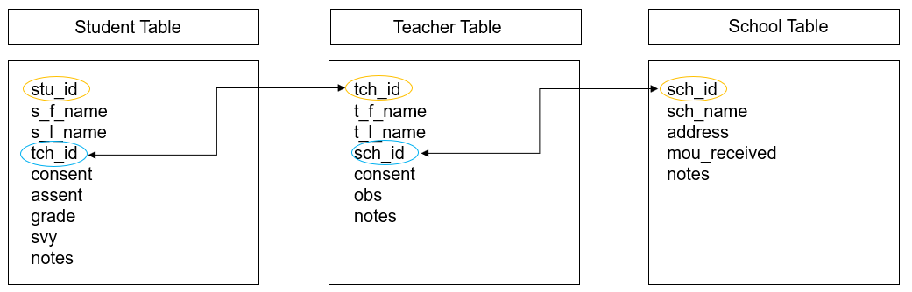
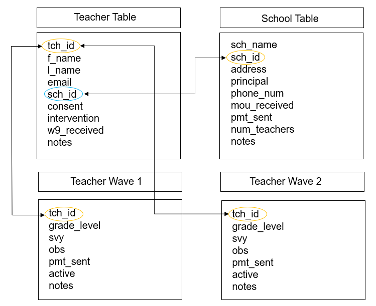

# Data Tracking {#track}

<div class="figure" style="text-align: center">

<p class="caption">(\#fig:unnamed-chunk-1)Data documentation in the research project life cycle</p>
</div>


A participant tracking database is an essential component of both project management and data management. This database contains all study participants, their relevant study information, as well as tracking information about their completion of project milestones. This database has two underlying purposes.

1. To serve as a roster of study participants as well as a "master key" [@pacific_university_oregon_data_2014] that houses both identifying participant information as well as assigned unique study identifiers. Assigning study identifiers that are only linked to a participant's true identity within this one database is necessary for maintaining participant confidentiality.
2. To aid in project coordination, tracking the movement of participants as well as completion of study events throughout a project. 

This database is considered your single source of truth concerning everything that happened throughout the life span of your study. Any time a participant consents to be in the study, drops from the study, changes their name, completes a measure, is provided an payment, or moves locations, it is all updated in this one location. Tracking all information in this one database, rather than across disparate spreadsheets and emails, ensures that you always have one definitive source of truth about your project activities.

## Benefits

A thorough and complete participant database is necessary for the following reasons:

1. Securing data de-identification
    - This database is your one linking key between your study ID and a participant's true identity. All of your study datasets should have name removed and should only contain study ID.
2. Project coordination and record keeping
    - An assigned staff member, typically a project coordinator, will be in charge of entering and updating information in this database
    - Throughout data collection this staff member will need to track changes in participant status as well as the completion of project activities
    - This daily tracking allows the team to easily report of the status of collection, as well as reducing the likelihood that any data collection is accidentally missed.
    - This tracking also allows you to explain missing data in reports and publications (ex: Teacher 1234 went on maternity leave)
3. Consort diagram creation
    - This database aids in the creation of documentation including the flow of participants in your consort diagram creation
4. Dataset verification
    - As part of your data cleaning process, all raw data sample sizes should compared against what is reported as complete in your participant database to ensure that no participants are missing from your final datasets.

## Building your database

It is beneficial to be build this database before you begin recruiting participants, typically during the same time that you are building your data collection tools. This way, as your team recruits and consents participants, you can record their name, assign them a study ID, and enter any other necessary identifying information (ex: email) into the participant database. Depending on your database system, you may even be able to scan and upload copies of your consent forms into the database.

While a project coordinator can set up this database, it can be helpful to consult with a data manager, or someone with relational database expertise, when setting up this system. This ensures that your system is set up efficiently and comprehensively.

This database may be a standalone structure, used only for tracking and anonymization purposes. Or it may be integrated as part of your larger study system, where all study data is collected and/or entered as well.

### Relational databases

Before we talk about how to build this database, it is helpful to have a basic understanding of the benefits of relational databases, first introduced in our [Data Structure](#database) chapter. A relational database organizes information into tables (made up of records/rows and fields/columns) using a normalized schema [@Microsoft and pressbooks FIX] and tables are related through keys. Using a relational database to track participant information, compared to disparate, non-connected spreadsheets, has many benefits.

1. Reduces redundancy and improves efficiency
2. Increases performance
3. Decreases required storage
4. Reduces entry errors

Let's compare a very simple example of building a tracking database using a relational model and a non-relational model.

In this first image we have 3 entities we need to track in our database, schools, teachers and students. We built a very simple model with one table for each entity. Within each table we added variables that we need to collect on these participants. We have also set up our tables to include primary keys (which uniquely identify rows in each table) and foreign keys (which includes values that correspond to the primary key of another table). Our keys are all unique study identifiers that we have assigned to our study participants.

<div class="figure" style="text-align: center">

<p class="caption">(\#fig:unnamed-chunk-2)Participant database built in using a relational model</p>
</div>

We can see here that in each table we have no duplicated, repeating information. The student table only contains information about the student, the teacher table only contains information about the teacher, and the school table only contains school level information. This is a huge time saver. Imagine if a teacher's last name changes. Rather than updating that name in multiple places, we now only update it once, in the teacher table. 

If we want to see a table with both student and teacher information, we can simply query our database to create this table. In some programs, this type of querying may be a simple point and click option, in other programs it may require someone to first write some simple queries that can be used at any time by any user. Say for example, we needed to pull a roster for each teacher. We could easily create and run a query, such as this SQL query, that joins the student and teacher tables above by `tch_id` and then pulls the relevant teacher and student information from both tables:

`SELECT Teacher.t_l_name, Teacher.t_f_name, Student.s_l_name, Student.s_f_name,  Student.grade`
`FROM Student INNER JOIN Teacher ON Student.tch_id = Teacher.tch_id`
`ORDER BY Teacher.t_l_name, Teacher.t_f_name, Student.s_l_name, Student.s_f_name`


```{=html}
<div id="iezbryyjbp" style="overflow-x:auto;overflow-y:auto;width:auto;height:auto;">
<style>html {
  font-family: -apple-system, BlinkMacSystemFont, 'Segoe UI', Roboto, Oxygen, Ubuntu, Cantarell, 'Helvetica Neue', 'Fira Sans', 'Droid Sans', Arial, sans-serif;
}

#iezbryyjbp .gt_table {
  display: table;
  border-collapse: collapse;
  margin-left: auto;
  margin-right: auto;
  color: #333333;
  font-size: 16px;
  font-weight: normal;
  font-style: normal;
  background-color: #FFFFFF;
  width: auto;
  border-top-style: solid;
  border-top-width: 2px;
  border-top-color: #A8A8A8;
  border-right-style: none;
  border-right-width: 2px;
  border-right-color: #D3D3D3;
  border-bottom-style: solid;
  border-bottom-width: 2px;
  border-bottom-color: #A8A8A8;
  border-left-style: none;
  border-left-width: 2px;
  border-left-color: #D3D3D3;
}

#iezbryyjbp .gt_heading {
  background-color: #FFFFFF;
  text-align: center;
  border-bottom-color: #FFFFFF;
  border-left-style: none;
  border-left-width: 1px;
  border-left-color: #D3D3D3;
  border-right-style: none;
  border-right-width: 1px;
  border-right-color: #D3D3D3;
}

#iezbryyjbp .gt_title {
  color: #333333;
  font-size: 125%;
  font-weight: initial;
  padding-top: 4px;
  padding-bottom: 4px;
  padding-left: 5px;
  padding-right: 5px;
  border-bottom-color: #FFFFFF;
  border-bottom-width: 0;
}

#iezbryyjbp .gt_subtitle {
  color: #333333;
  font-size: 85%;
  font-weight: initial;
  padding-top: 0;
  padding-bottom: 6px;
  padding-left: 5px;
  padding-right: 5px;
  border-top-color: #FFFFFF;
  border-top-width: 0;
}

#iezbryyjbp .gt_bottom_border {
  border-bottom-style: solid;
  border-bottom-width: 2px;
  border-bottom-color: #D3D3D3;
}

#iezbryyjbp .gt_col_headings {
  border-top-style: solid;
  border-top-width: 2px;
  border-top-color: #D3D3D3;
  border-bottom-style: solid;
  border-bottom-width: 2px;
  border-bottom-color: #D3D3D3;
  border-left-style: none;
  border-left-width: 1px;
  border-left-color: #D3D3D3;
  border-right-style: none;
  border-right-width: 1px;
  border-right-color: #D3D3D3;
}

#iezbryyjbp .gt_col_heading {
  color: #333333;
  background-color: #FFFFFF;
  font-size: 100%;
  font-weight: normal;
  text-transform: inherit;
  border-left-style: none;
  border-left-width: 1px;
  border-left-color: #D3D3D3;
  border-right-style: none;
  border-right-width: 1px;
  border-right-color: #D3D3D3;
  vertical-align: bottom;
  padding-top: 5px;
  padding-bottom: 6px;
  padding-left: 5px;
  padding-right: 5px;
  overflow-x: hidden;
}

#iezbryyjbp .gt_column_spanner_outer {
  color: #333333;
  background-color: #FFFFFF;
  font-size: 100%;
  font-weight: normal;
  text-transform: inherit;
  padding-top: 0;
  padding-bottom: 0;
  padding-left: 4px;
  padding-right: 4px;
}

#iezbryyjbp .gt_column_spanner_outer:first-child {
  padding-left: 0;
}

#iezbryyjbp .gt_column_spanner_outer:last-child {
  padding-right: 0;
}

#iezbryyjbp .gt_column_spanner {
  border-bottom-style: solid;
  border-bottom-width: 2px;
  border-bottom-color: #D3D3D3;
  vertical-align: bottom;
  padding-top: 5px;
  padding-bottom: 5px;
  overflow-x: hidden;
  display: inline-block;
  width: 100%;
}

#iezbryyjbp .gt_group_heading {
  padding-top: 8px;
  padding-bottom: 8px;
  padding-left: 5px;
  padding-right: 5px;
  color: #333333;
  background-color: #FFFFFF;
  font-size: 100%;
  font-weight: initial;
  text-transform: inherit;
  border-top-style: solid;
  border-top-width: 2px;
  border-top-color: #D3D3D3;
  border-bottom-style: solid;
  border-bottom-width: 2px;
  border-bottom-color: #D3D3D3;
  border-left-style: none;
  border-left-width: 1px;
  border-left-color: #D3D3D3;
  border-right-style: none;
  border-right-width: 1px;
  border-right-color: #D3D3D3;
  vertical-align: middle;
}

#iezbryyjbp .gt_empty_group_heading {
  padding: 0.5px;
  color: #333333;
  background-color: #FFFFFF;
  font-size: 100%;
  font-weight: initial;
  border-top-style: solid;
  border-top-width: 2px;
  border-top-color: #D3D3D3;
  border-bottom-style: solid;
  border-bottom-width: 2px;
  border-bottom-color: #D3D3D3;
  vertical-align: middle;
}

#iezbryyjbp .gt_from_md > :first-child {
  margin-top: 0;
}

#iezbryyjbp .gt_from_md > :last-child {
  margin-bottom: 0;
}

#iezbryyjbp .gt_row {
  padding-top: 8px;
  padding-bottom: 8px;
  padding-left: 5px;
  padding-right: 5px;
  margin: 10px;
  border-top-style: solid;
  border-top-width: 1px;
  border-top-color: #D3D3D3;
  border-left-style: none;
  border-left-width: 1px;
  border-left-color: #D3D3D3;
  border-right-style: none;
  border-right-width: 1px;
  border-right-color: #D3D3D3;
  vertical-align: middle;
  overflow-x: hidden;
}

#iezbryyjbp .gt_stub {
  color: #333333;
  background-color: #FFFFFF;
  font-size: 100%;
  font-weight: initial;
  text-transform: inherit;
  border-right-style: solid;
  border-right-width: 2px;
  border-right-color: #D3D3D3;
  padding-left: 5px;
  padding-right: 5px;
}

#iezbryyjbp .gt_stub_row_group {
  color: #333333;
  background-color: #FFFFFF;
  font-size: 100%;
  font-weight: initial;
  text-transform: inherit;
  border-right-style: solid;
  border-right-width: 2px;
  border-right-color: #D3D3D3;
  padding-left: 5px;
  padding-right: 5px;
  vertical-align: top;
}

#iezbryyjbp .gt_row_group_first td {
  border-top-width: 2px;
}

#iezbryyjbp .gt_summary_row {
  color: #333333;
  background-color: #FFFFFF;
  text-transform: inherit;
  padding-top: 8px;
  padding-bottom: 8px;
  padding-left: 5px;
  padding-right: 5px;
}

#iezbryyjbp .gt_first_summary_row {
  border-top-style: solid;
  border-top-color: #D3D3D3;
}

#iezbryyjbp .gt_first_summary_row.thick {
  border-top-width: 2px;
}

#iezbryyjbp .gt_last_summary_row {
  padding-top: 8px;
  padding-bottom: 8px;
  padding-left: 5px;
  padding-right: 5px;
  border-bottom-style: solid;
  border-bottom-width: 2px;
  border-bottom-color: #D3D3D3;
}

#iezbryyjbp .gt_grand_summary_row {
  color: #333333;
  background-color: #FFFFFF;
  text-transform: inherit;
  padding-top: 8px;
  padding-bottom: 8px;
  padding-left: 5px;
  padding-right: 5px;
}

#iezbryyjbp .gt_first_grand_summary_row {
  padding-top: 8px;
  padding-bottom: 8px;
  padding-left: 5px;
  padding-right: 5px;
  border-top-style: double;
  border-top-width: 6px;
  border-top-color: #D3D3D3;
}

#iezbryyjbp .gt_striped {
  background-color: rgba(128, 128, 128, 0.05);
}

#iezbryyjbp .gt_table_body {
  border-top-style: solid;
  border-top-width: 2px;
  border-top-color: #D3D3D3;
  border-bottom-style: solid;
  border-bottom-width: 2px;
  border-bottom-color: #D3D3D3;
}

#iezbryyjbp .gt_footnotes {
  color: #333333;
  background-color: #FFFFFF;
  border-bottom-style: none;
  border-bottom-width: 2px;
  border-bottom-color: #D3D3D3;
  border-left-style: none;
  border-left-width: 2px;
  border-left-color: #D3D3D3;
  border-right-style: none;
  border-right-width: 2px;
  border-right-color: #D3D3D3;
}

#iezbryyjbp .gt_footnote {
  margin: 0px;
  font-size: 90%;
  padding-left: 4px;
  padding-right: 4px;
  padding-left: 5px;
  padding-right: 5px;
}

#iezbryyjbp .gt_sourcenotes {
  color: #333333;
  background-color: #FFFFFF;
  border-bottom-style: none;
  border-bottom-width: 2px;
  border-bottom-color: #D3D3D3;
  border-left-style: none;
  border-left-width: 2px;
  border-left-color: #D3D3D3;
  border-right-style: none;
  border-right-width: 2px;
  border-right-color: #D3D3D3;
}

#iezbryyjbp .gt_sourcenote {
  font-size: 90%;
  padding-top: 4px;
  padding-bottom: 4px;
  padding-left: 5px;
  padding-right: 5px;
}

#iezbryyjbp .gt_left {
  text-align: left;
}

#iezbryyjbp .gt_center {
  text-align: center;
}

#iezbryyjbp .gt_right {
  text-align: right;
  font-variant-numeric: tabular-nums;
}

#iezbryyjbp .gt_font_normal {
  font-weight: normal;
}

#iezbryyjbp .gt_font_bold {
  font-weight: bold;
}

#iezbryyjbp .gt_font_italic {
  font-style: italic;
}

#iezbryyjbp .gt_super {
  font-size: 65%;
}

#iezbryyjbp .gt_two_val_uncert {
  display: inline-block;
  line-height: 1em;
  text-align: right;
  font-size: 60%;
  vertical-align: -0.25em;
  margin-left: 0.1em;
}

#iezbryyjbp .gt_footnote_marks {
  font-style: italic;
  font-weight: normal;
  font-size: 75%;
  vertical-align: 0.4em;
}

#iezbryyjbp .gt_asterisk {
  font-size: 100%;
  vertical-align: 0;
}

#iezbryyjbp .gt_slash_mark {
  font-size: 0.7em;
  line-height: 0.7em;
  vertical-align: 0.15em;
}

#iezbryyjbp .gt_fraction_numerator {
  font-size: 0.6em;
  line-height: 0.6em;
  vertical-align: 0.45em;
}

#iezbryyjbp .gt_fraction_denominator {
  font-size: 0.6em;
  line-height: 0.6em;
  vertical-align: -0.05em;
}
</style>
<table class="gt_table">
  <caption>(#tab:unnamed-chunk-3)Example roster created by querying our relational database tables</caption>
  
  <thead class="gt_col_headings">
    <tr>
      <th class="gt_col_heading gt_columns_bottom_border gt_left" rowspan="1" colspan="1">t_l_name</th>
      <th class="gt_col_heading gt_columns_bottom_border gt_left" rowspan="1" colspan="1">t_f_name</th>
      <th class="gt_col_heading gt_columns_bottom_border gt_left" rowspan="1" colspan="1">s_l_name</th>
      <th class="gt_col_heading gt_columns_bottom_border gt_left" rowspan="1" colspan="1">s_f_name</th>
      <th class="gt_col_heading gt_columns_bottom_border gt_right" rowspan="1" colspan="1">grade_level</th>
    </tr>
  </thead>
  <tbody class="gt_table_body">
    <tr><td class="gt_row gt_left">Hoover</td>
<td class="gt_row gt_left">Elizabeth</td>
<td class="gt_row gt_left">Simpson</td>
<td class="gt_row gt_left">Lisa</td>
<td class="gt_row gt_right">2</td></tr>
    <tr><td class="gt_row gt_left">Hoover</td>
<td class="gt_row gt_left">Elizabeth</td>
<td class="gt_row gt_left">Wiggum</td>
<td class="gt_row gt_left">Ralph</td>
<td class="gt_row gt_right">2</td></tr>
    <tr><td class="gt_row gt_left">Krabappel</td>
<td class="gt_row gt_left">Edna</td>
<td class="gt_row gt_left">Prince</td>
<td class="gt_row gt_left">Martin</td>
<td class="gt_row gt_right">4</td></tr>
    <tr><td class="gt_row gt_left">Krabappel</td>
<td class="gt_row gt_left">Edna</td>
<td class="gt_row gt_left">Simpson</td>
<td class="gt_row gt_left">Bart</td>
<td class="gt_row gt_right">4</td></tr>
    <tr><td class="gt_row gt_left">Krabappel</td>
<td class="gt_row gt_left">Edna</td>
<td class="gt_row gt_left">Van Houten</td>
<td class="gt_row gt_left">Milhouse</td>
<td class="gt_row gt_right">4</td></tr>
  </tbody>
  
  
</table>
</div>
```

Now imagine that we built a non-relational database, such as three tabs in an Excel spreadsheet,  to track our participant information. Since we are unable to set up a system that links these tables together, we need to enter redundant information into each table (such as teacher or school name) in order to see that information within each table without having to flip back and forth across tables to find the information we need. Using this method we now have to enter repeating teacher names, repeating school names and so on. And if any teacher names change, we will need to update it in both the teacher table and in the student table for every student associated with that teacher.

<div class="figure" style="text-align: center">

<p class="caption">(\#fig:unnamed-chunk-4)Participant database built in using a non-relational model</p>
</div>

If your study includes a variety of entities, tracked over waves of time, a relational database will be very helpful to build. If however, you are only tracking one entity (ex: just students) for one wave of data collection, then a database might be overkill and a simple spreadsheet will work just fine.

### Building the database

Before you can begin to construct your database, you will need to collect the following pieces of information.

1. Who are your entities/units of analysis?
    - students, teachers, classrooms, districts, and so on
2. Are you collecting data longitudinally? Across more than one wave?
3. Do you want to use a relational table structure?
    - If yes, how do you want to construct and relate our tables?
4. What variables do we want to include in each table?

Once you collect those pieces of information, you can begin to design your database structure. It can be helpful to visualize your database model during this process. In the example below, I am designing a database structure for a scenario where I will be collecting information on teachers and schools, over two waves of data collection. 

<div class="figure" style="text-align: center">

<p class="caption">(\#fig:unnamed-chunk-5)Example participant database model</p>
</div>

1. I have 4 tables total
    - Two tables have information that should be constant (name, email, one time payments sent out, one time MOUs received)
      - If at any time this constant information changes (ex: new last name, new principal), I would update that information in the appropriate table and make a note of when and why the change occurred in my "notes" field
    - Two tables are for my longitudinal information
      - This is where I will track my data collection activities each wave
2. I have connected my tables through primary and foreign keys

While this example is for a fairly simple scenario, you can hopefully see how you might extrapolate this model to more entities and more waves of data collection, as well as how you might modify it to better meet the needs of your specific project. 

### Choosing fields

As you design your database model, you will also need to choose what fields to include in each table. The fields you choose to include will be dependent on your particular study design. While your participant tracking database may be the same database you enter all of your study data, for the purposes of this chapter we are only considering fields that are relevant for project coordination and participant de-identification. We are **not** concerned with additional fields that may be collected as part of your data collection measures such as survey items, demographics collected from project measures, and so on. You can consider your participant tracking database as an **internal** database that is only used for coordination, summary, and linking purposes. This is not a database where you would export data for external data sharing.

**Ideas of static fields to collect:**

- Study IDs (Primary and foreign keys for a relational database)
- Names (Participants and sites)
- Contact information
- Other necessary linking identifiers (double IDs, district/school IDs)
- Information necessary for data collection scheduling (blocks, class times, grade level)
- Consent/assent status
- Randomization information (cohort, group)
- Condition (treatment/control)
- Summary information for rates (# of consents sent out, # of students in class)
- Administrative status (W-9 received, MOUs received)
- Movement/drop out status
- Notes
  - Reasons for changes (name, grade level, email)
  - Reasons for movement/drop out

**Ideas of fields to collect longitudinally:**

- Data collection status (unique fields for each instrument)
- Incentive status (gift cards sent out)
- Notes
  - Communication with participants
  - Reasons for missing data
  - Errors in data

#### Restricting fields

As you choose your fields you also need to make some decisions about how you will structure those fields.

1. Set data types for your fields (ex: character, integer, date).
    - Restrict entry values to only allowable data types to reduce errors
2. Set allowable values and ranges
    - For example, a categorical status field may only allow "complete", "pending" or "incomplete"
3. Do not lump separate pieces of information together in a field
    - For example separate out first name and last name into two fields
4. Name your fields according to the variable naming rules we discussed in our [Style Guide](#varname) chapter

### Choosing a tool

There are many criteria to consider when choosing a tool to build your database in.

- Choose a tool that is customizable to your needs
  - Can we build a relational table structure?
  - Can we export files? Can we connect to the database via application programming interfaces (APIs)?
  - Can we query data?
- Choose a tool that is user-friendly
  - You want a tool that requires little technical knowledge. We don't want a tool with a steep learning curve for users. Remember, project coordinators are most likely our end user.
- If you are running a project across multiple sites, consider the accessibility of the tool
  - For example, you may want a tool that is cloud-based so everyone can access it
  - You may also want to make sure multiple users can access it at the same time
- Choose a tool that is interoperable
  - For instance, some tools may have difficulties running on certain operating systems
- Consider cost and licensing
  - There are many free tools, but they may not provide all of the functionality you want
  - What products do we already have access to, our institution has a license for?
- Consider security
  - Security in terms of participant confidentiality
    - Does the tool meet HIPAA/FERPA requirements?
    - Can we limit access?
  - Protect data loss
    - Can we backup the system?
    - Can we protect against overwriting data?
- Data quality protection
  - Can we set up data quality constraints? For example, restrict input types/values.
    
There are many tool options you can choose from. A sampling of those options are below. These tools represent a wide range from the criteria above. Take some time to review your options to see which one best meets your needs.

  - Microsoft Access
  - Microsoft Excel
  - QuickBase
  - Airtable
  - REDCap
  - Claris FileMaker
  - Google Sheets and Google Forms
  - Forms that feed into a relational database, maintained using a SQL (structured query language) database engine such as SQLite, MySQL, or PostgreSQL


### Entering data

Assuming at this point you have designed your database model, chosen the fields you want to collect, and have chosen a tool. 


If your participant tracking tool is also your data collection/data capture tool (such as those who collect data using RedCap), these data collection status fields may not be manually entry. Rather they may be automated to populate as complete once a participant actually completes an instrument.
  


## Creating participant IDs {#ids}

## How to use it - flow

Tracking best practices
