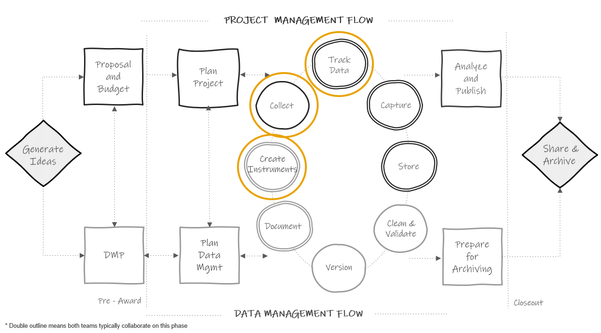

# Data Tracking {#track}

(\#fig:unnamed-chunk-1)Data documentation in the research project life cycle

## Why track data?

## Build a system

## Creating participant IDs {#ids}

## When to build it, who builds it, tools to build it in
