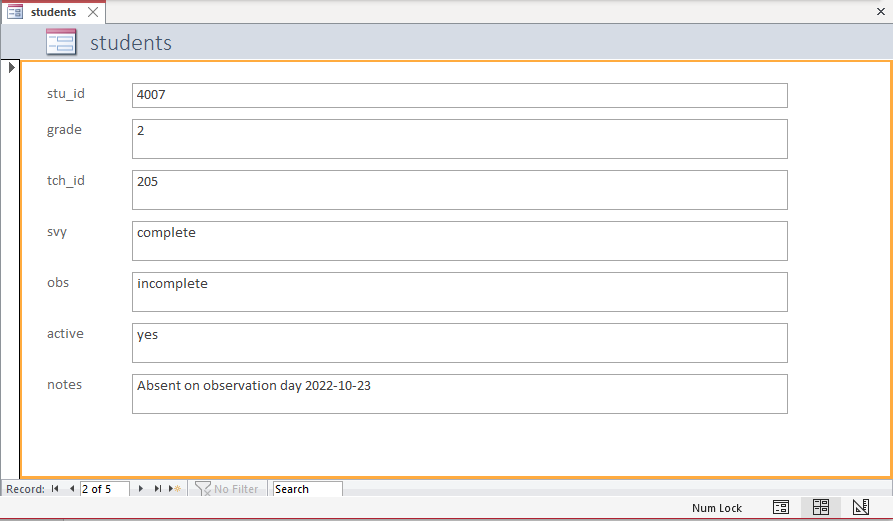

# Data Tracking {#track}

<div class="figure" style="text-align: center">

<p class="caption">(\#fig:fig9-1)Tracking in the research project life cycle</p>
</div>

During your project you will want to be able to answer both progress and summary questions about your recruitment and data collection activities.

1. How many participants consented to be in our study? How many have we lost during our study and why?
2. How much progress have we made in this cycle of data collection? How much data do we have left to collect?
3. How many forms did we collect each cycle and why are we missing data for some forms?

Questions like these will arise many times throughout your study for both your own project coordination purposes, as well as for external progress reporting and publication purposes. Yet, how will you answer these questions? Will you dig through papers, search through emails, and download in progress data, each time you need to answer a question about the status of your project activities? A better solution is to track all project activities in a participant tracking database. 

A participant tracking database is an essential component of both project management and data management. This database contains all study participants, their relevant study information, as well as tracking information about their completion of project milestones. This database has two underlying purposes.

1. To serve as a roster of study participants as well as a "master key" [@pacific_university_oregon_data_2014] that houses both identifying participant information as well as assigned unique study identifiers. 
2. To aid in project coordination and reporting, tracking the movement of participants as well as completion of study events throughout a study. 

This database is considered your single source of truth concerning everything that happened throughout the duration of your project. Any time a participant consents to participate, drops from the study, changes their name, completes a data collection measure, is provided a payment, or moves locations, a project coordinator, or other designated team member, updates the information in this one location. Tracking administrative information in this one database, rather than across disparate spreadsheets, emails, and papers, ensures that you always have one definitive source to refer to when seeking answers about your sample and your project activities.

## Benefits

A thorough and complete participant database that is updated regularly is beneficial for the following reasons:

1. Data de-identification
    - Assigning unique study identifiers that are only linked to a participant's true identity within this one database is necessary for maintaining participant confidentiality. This database is stored in a restricted secure location (see Chapter \@ref(storage)), separate from where de-identified study datasets are stored, and is typically destroyed at a period of time after a project's completion.
2. Project coordination and record keeping
    - This database can be used as a customer relation management (CRM) tool, storing all participant contact information, as well as tracking correspondence. It can also be used as a project coordination tool, storing scheduling information that is useful for planning activities such as data collection.
    - Integrating this database into your daily workflow allows your team to easily report the status of data collection activities (e.g., as of today we have completed 124 out of 150 assessments). Furthermore, checking and tracking incoming data daily, compared to after data collection is complete, reduces the likelihood of missing data.
    - Last, thorough tracking allows you to explain missing data in reports and publications (e.g., Teacher 1234 went on maternity leave).
3. Sample rostering
    - At any time you can pull a study roster from this database that accurately reflects a participant's current status. The tracking information contained in this tool also aids in the creation of documentation including the flow of participants in your CONSORT diagram.
4. Data cleaning
    - As part of your data cleaning process, all raw data sample sizes should compared against what is reported as complete in your participant database to ensure that no participants are missing from your final datasets
    - Furthermore, this database can be used for de-identifying data. If data is collected with identifiers such as name, a roster from the tracking database can be used to merge in unique study identifiers so that name can be removed. A similar process can be used to merge in other assigned variables contained in the database such as treatment or cohort.

## Building your database

It is beneficial to build this database before you begin recruiting participants, typically during the same time that you are building your data collection tools. This way, as your team recruits and consents participants, you can record their name, assign them a study ID, and enter any other necessary identifying contact information into the participant database. Depending on your database system, you may even be able to scan and upload copies of your consent forms into the database.

While a project coordinator can build this database, it can be helpful to consult with a data manager, or someone with relational database expertise, when creating this system. This ensures that your system is set up efficiently and comprehensively.

This database may be a standalone structure, used only for tracking and anonymization purposes. Or it may be integrated as part of your larger study system, where all study data is collected and/or entered as well.

### Relational databases

Before we discuss how to build this database, it is helpful to have a basic understanding of the benefits of relational databases, first introduced in Chapter \@ref(structure). Using a relational database to track participant information, compared to disparate, non-connected spreadsheets, has many benefits including reducing data entry errors and improving efficiency. A relational database organizes information into tables, made up of records (rows) and fields (columns), and tables are related through keys [@bourgeois_information_2014; @chen_database_2022]. The general steps for building a relational database are below. 

1. Decide what fields you want to collect and on who you want to collect them. 
2. Group those fields by entity (students, teachers, schools) and purpose. Create tables for those groups.
3. Choose one or more fields to uniquely identify rows in those tables as primary keys. These keys should not change at any point. Typically these keys are your assigned unique study IDs.
4. Create relationships between tables through both primary and foreign keys

We can also further refine our database through normalization, structuring our database according to normal form rules [@bourgeois_chapter_2014; @nguyen_relational_2017; @the_nobles_normalization_2020] to reduce redundancy and improve data integrity. Going in to more detail about normalization is outside of the scope of this book and building a database that follows all the normal form rules requires specific expertise, which most teams may not have. So with that said, it is perfectly acceptable to build a database that is not perfectly optimized but that works well for your team! The most important thing to consider when building a relational database is to not duplicate information across tables. Any one field should only need to be updated in one location, never more than one.

Let's compare a very simple example of building a tracking database using a relational model and a non-relational model.


#### Relational model

In Figure \@ref(fig:fig9-2) we have three entities we need to track in our database: schools, teachers, and students. We built a very simple database with one table for each entity. Within each table we added fields that we need to collect on these participants. We have also set up our tables to include primary keys (which uniquely identify rows in each table) and foreign keys (which includes values that correspond to the primary key of another table). Our keys are all unique study identifiers that we have assigned to our study participants.

<div class="figure" style="text-align: center">

<p class="caption">(\#fig:fig9-2)Participant database built using a relational model</p>
</div>

We can see here that in each table we have no duplicated, repeating information. The student table only contains student level information, the teacher table only contains teacher level information, and the school table only contains school level information. This is a huge time saver. Imagine if a teacher's last name changes. Rather than updating that name in multiple places, we now only update it once, in the teacher table. 
If we want to see a table with both student and teacher information, we can simply query our database to create a new table. In some programs, this type of querying may be a simple point and click option, in other programs it may require someone to write some simple queries that can then be used at any time by any user. 

Say for example, we needed to pull a roster of students for each teacher. We could easily create and run a query, such as this SQL query, that joins the student and teacher tables above by `tch_id` and then pulls the relevant teacher and student information from both tables:

`SELECT t_l_name, t_f_name, s_l_name, s_f_name,  grade`    
`FROM Student INNER JOIN Teacher ON Student.tch_id = Teacher.tch_id`    
`ORDER BY t_l_name, t_f_name, s_l_name, s_f_name`    


```{=html}
<div id="mpqhequasm" style="overflow-x:auto;overflow-y:auto;width:auto;height:auto;">
<style>html {
  font-family: -apple-system, BlinkMacSystemFont, 'Segoe UI', Roboto, Oxygen, Ubuntu, Cantarell, 'Helvetica Neue', 'Fira Sans', 'Droid Sans', Arial, sans-serif;
}

#mpqhequasm .gt_table {
  display: table;
  border-collapse: collapse;
  margin-left: auto;
  margin-right: auto;
  color: #333333;
  font-size: 16px;
  font-weight: normal;
  font-style: normal;
  background-color: #FFFFFF;
  width: auto;
  border-top-style: solid;
  border-top-width: 2px;
  border-top-color: #A8A8A8;
  border-right-style: none;
  border-right-width: 2px;
  border-right-color: #D3D3D3;
  border-bottom-style: solid;
  border-bottom-width: 2px;
  border-bottom-color: #A8A8A8;
  border-left-style: none;
  border-left-width: 2px;
  border-left-color: #D3D3D3;
}

#mpqhequasm .gt_heading {
  background-color: #FFFFFF;
  text-align: center;
  border-bottom-color: #FFFFFF;
  border-left-style: none;
  border-left-width: 1px;
  border-left-color: #D3D3D3;
  border-right-style: none;
  border-right-width: 1px;
  border-right-color: #D3D3D3;
}

#mpqhequasm .gt_title {
  color: #333333;
  font-size: 125%;
  font-weight: initial;
  padding-top: 4px;
  padding-bottom: 4px;
  padding-left: 5px;
  padding-right: 5px;
  border-bottom-color: #FFFFFF;
  border-bottom-width: 0;
}

#mpqhequasm .gt_subtitle {
  color: #333333;
  font-size: 85%;
  font-weight: initial;
  padding-top: 0;
  padding-bottom: 6px;
  padding-left: 5px;
  padding-right: 5px;
  border-top-color: #FFFFFF;
  border-top-width: 0;
}

#mpqhequasm .gt_bottom_border {
  border-bottom-style: solid;
  border-bottom-width: 2px;
  border-bottom-color: #D3D3D3;
}

#mpqhequasm .gt_col_headings {
  border-top-style: solid;
  border-top-width: 2px;
  border-top-color: #D3D3D3;
  border-bottom-style: solid;
  border-bottom-width: 2px;
  border-bottom-color: #D3D3D3;
  border-left-style: none;
  border-left-width: 1px;
  border-left-color: #D3D3D3;
  border-right-style: none;
  border-right-width: 1px;
  border-right-color: #D3D3D3;
}

#mpqhequasm .gt_col_heading {
  color: #333333;
  background-color: #FFFFFF;
  font-size: 100%;
  font-weight: normal;
  text-transform: inherit;
  border-left-style: none;
  border-left-width: 1px;
  border-left-color: #D3D3D3;
  border-right-style: none;
  border-right-width: 1px;
  border-right-color: #D3D3D3;
  vertical-align: bottom;
  padding-top: 5px;
  padding-bottom: 6px;
  padding-left: 5px;
  padding-right: 5px;
  overflow-x: hidden;
}

#mpqhequasm .gt_column_spanner_outer {
  color: #333333;
  background-color: #FFFFFF;
  font-size: 100%;
  font-weight: normal;
  text-transform: inherit;
  padding-top: 0;
  padding-bottom: 0;
  padding-left: 4px;
  padding-right: 4px;
}

#mpqhequasm .gt_column_spanner_outer:first-child {
  padding-left: 0;
}

#mpqhequasm .gt_column_spanner_outer:last-child {
  padding-right: 0;
}

#mpqhequasm .gt_column_spanner {
  border-bottom-style: solid;
  border-bottom-width: 2px;
  border-bottom-color: #D3D3D3;
  vertical-align: bottom;
  padding-top: 5px;
  padding-bottom: 5px;
  overflow-x: hidden;
  display: inline-block;
  width: 100%;
}

#mpqhequasm .gt_group_heading {
  padding-top: 8px;
  padding-bottom: 8px;
  padding-left: 5px;
  padding-right: 5px;
  color: #333333;
  background-color: #FFFFFF;
  font-size: 100%;
  font-weight: initial;
  text-transform: inherit;
  border-top-style: solid;
  border-top-width: 2px;
  border-top-color: #D3D3D3;
  border-bottom-style: solid;
  border-bottom-width: 2px;
  border-bottom-color: #D3D3D3;
  border-left-style: none;
  border-left-width: 1px;
  border-left-color: #D3D3D3;
  border-right-style: none;
  border-right-width: 1px;
  border-right-color: #D3D3D3;
  vertical-align: middle;
}

#mpqhequasm .gt_empty_group_heading {
  padding: 0.5px;
  color: #333333;
  background-color: #FFFFFF;
  font-size: 100%;
  font-weight: initial;
  border-top-style: solid;
  border-top-width: 2px;
  border-top-color: #D3D3D3;
  border-bottom-style: solid;
  border-bottom-width: 2px;
  border-bottom-color: #D3D3D3;
  vertical-align: middle;
}

#mpqhequasm .gt_from_md > :first-child {
  margin-top: 0;
}

#mpqhequasm .gt_from_md > :last-child {
  margin-bottom: 0;
}

#mpqhequasm .gt_row {
  padding-top: 8px;
  padding-bottom: 8px;
  padding-left: 5px;
  padding-right: 5px;
  margin: 10px;
  border-top-style: solid;
  border-top-width: 1px;
  border-top-color: #D3D3D3;
  border-left-style: none;
  border-left-width: 1px;
  border-left-color: #D3D3D3;
  border-right-style: none;
  border-right-width: 1px;
  border-right-color: #D3D3D3;
  vertical-align: middle;
  overflow-x: hidden;
}

#mpqhequasm .gt_stub {
  color: #333333;
  background-color: #FFFFFF;
  font-size: 100%;
  font-weight: initial;
  text-transform: inherit;
  border-right-style: solid;
  border-right-width: 2px;
  border-right-color: #D3D3D3;
  padding-left: 5px;
  padding-right: 5px;
}

#mpqhequasm .gt_stub_row_group {
  color: #333333;
  background-color: #FFFFFF;
  font-size: 100%;
  font-weight: initial;
  text-transform: inherit;
  border-right-style: solid;
  border-right-width: 2px;
  border-right-color: #D3D3D3;
  padding-left: 5px;
  padding-right: 5px;
  vertical-align: top;
}

#mpqhequasm .gt_row_group_first td {
  border-top-width: 2px;
}

#mpqhequasm .gt_summary_row {
  color: #333333;
  background-color: #FFFFFF;
  text-transform: inherit;
  padding-top: 8px;
  padding-bottom: 8px;
  padding-left: 5px;
  padding-right: 5px;
}

#mpqhequasm .gt_first_summary_row {
  border-top-style: solid;
  border-top-color: #D3D3D3;
}

#mpqhequasm .gt_first_summary_row.thick {
  border-top-width: 2px;
}

#mpqhequasm .gt_last_summary_row {
  padding-top: 8px;
  padding-bottom: 8px;
  padding-left: 5px;
  padding-right: 5px;
  border-bottom-style: solid;
  border-bottom-width: 2px;
  border-bottom-color: #D3D3D3;
}

#mpqhequasm .gt_grand_summary_row {
  color: #333333;
  background-color: #FFFFFF;
  text-transform: inherit;
  padding-top: 8px;
  padding-bottom: 8px;
  padding-left: 5px;
  padding-right: 5px;
}

#mpqhequasm .gt_first_grand_summary_row {
  padding-top: 8px;
  padding-bottom: 8px;
  padding-left: 5px;
  padding-right: 5px;
  border-top-style: double;
  border-top-width: 6px;
  border-top-color: #D3D3D3;
}

#mpqhequasm .gt_striped {
  background-color: rgba(128, 128, 128, 0.05);
}

#mpqhequasm .gt_table_body {
  border-top-style: solid;
  border-top-width: 2px;
  border-top-color: #D3D3D3;
  border-bottom-style: solid;
  border-bottom-width: 2px;
  border-bottom-color: #D3D3D3;
}

#mpqhequasm .gt_footnotes {
  color: #333333;
  background-color: #FFFFFF;
  border-bottom-style: none;
  border-bottom-width: 2px;
  border-bottom-color: #D3D3D3;
  border-left-style: none;
  border-left-width: 2px;
  border-left-color: #D3D3D3;
  border-right-style: none;
  border-right-width: 2px;
  border-right-color: #D3D3D3;
}

#mpqhequasm .gt_footnote {
  margin: 0px;
  font-size: 90%;
  padding-left: 4px;
  padding-right: 4px;
  padding-left: 5px;
  padding-right: 5px;
}

#mpqhequasm .gt_sourcenotes {
  color: #333333;
  background-color: #FFFFFF;
  border-bottom-style: none;
  border-bottom-width: 2px;
  border-bottom-color: #D3D3D3;
  border-left-style: none;
  border-left-width: 2px;
  border-left-color: #D3D3D3;
  border-right-style: none;
  border-right-width: 2px;
  border-right-color: #D3D3D3;
}

#mpqhequasm .gt_sourcenote {
  font-size: 90%;
  padding-top: 4px;
  padding-bottom: 4px;
  padding-left: 5px;
  padding-right: 5px;
}

#mpqhequasm .gt_left {
  text-align: left;
}

#mpqhequasm .gt_center {
  text-align: center;
}

#mpqhequasm .gt_right {
  text-align: right;
  font-variant-numeric: tabular-nums;
}

#mpqhequasm .gt_font_normal {
  font-weight: normal;
}

#mpqhequasm .gt_font_bold {
  font-weight: bold;
}

#mpqhequasm .gt_font_italic {
  font-style: italic;
}

#mpqhequasm .gt_super {
  font-size: 65%;
}

#mpqhequasm .gt_two_val_uncert {
  display: inline-block;
  line-height: 1em;
  text-align: right;
  font-size: 60%;
  vertical-align: -0.25em;
  margin-left: 0.1em;
}

#mpqhequasm .gt_footnote_marks {
  font-style: italic;
  font-weight: normal;
  font-size: 75%;
  vertical-align: 0.4em;
}

#mpqhequasm .gt_asterisk {
  font-size: 100%;
  vertical-align: 0;
}

#mpqhequasm .gt_slash_mark {
  font-size: 0.7em;
  line-height: 0.7em;
  vertical-align: 0.15em;
}

#mpqhequasm .gt_fraction_numerator {
  font-size: 0.6em;
  line-height: 0.6em;
  vertical-align: 0.45em;
}

#mpqhequasm .gt_fraction_denominator {
  font-size: 0.6em;
  line-height: 0.6em;
  vertical-align: -0.05em;
}
</style>
<table class="gt_table">
  <caption>(#tab:fig9-3)Example roster created by querying our relational database tables</caption>
  
  <thead class="gt_col_headings">
    <tr>
      <th class="gt_col_heading gt_columns_bottom_border gt_left" rowspan="1" colspan="1">t_l_name</th>
      <th class="gt_col_heading gt_columns_bottom_border gt_left" rowspan="1" colspan="1">t_f_name</th>
      <th class="gt_col_heading gt_columns_bottom_border gt_left" rowspan="1" colspan="1">s_l_name</th>
      <th class="gt_col_heading gt_columns_bottom_border gt_left" rowspan="1" colspan="1">s_f_name</th>
      <th class="gt_col_heading gt_columns_bottom_border gt_right" rowspan="1" colspan="1">grade</th>
    </tr>
  </thead>
  <tbody class="gt_table_body">
    <tr><td class="gt_row gt_left">Hoover</td>
<td class="gt_row gt_left">Elizabeth</td>
<td class="gt_row gt_left">Simpson</td>
<td class="gt_row gt_left">Lisa</td>
<td class="gt_row gt_right">2</td></tr>
    <tr><td class="gt_row gt_left">Hoover</td>
<td class="gt_row gt_left">Elizabeth</td>
<td class="gt_row gt_left">Wiggum</td>
<td class="gt_row gt_left">Ralph</td>
<td class="gt_row gt_right">2</td></tr>
    <tr><td class="gt_row gt_left">Krabappel</td>
<td class="gt_row gt_left">Edna</td>
<td class="gt_row gt_left">Prince</td>
<td class="gt_row gt_left">Martin</td>
<td class="gt_row gt_right">4</td></tr>
    <tr><td class="gt_row gt_left">Krabappel</td>
<td class="gt_row gt_left">Edna</td>
<td class="gt_row gt_left">Simpson</td>
<td class="gt_row gt_left">Bart</td>
<td class="gt_row gt_right">4</td></tr>
    <tr><td class="gt_row gt_left">Krabappel</td>
<td class="gt_row gt_left">Edna</td>
<td class="gt_row gt_left">Van Houten</td>
<td class="gt_row gt_left">Milhouse</td>
<td class="gt_row gt_right">4</td></tr>
  </tbody>
  
  
</table>
</div>
```

Depending on the design of your study and the structure of the database model, writing these queries can become more complicated. Again, this is where you want to strike a balance between creating a structure that reduces inefficiencies in data entry but also isn't too complicated to query based on the expertise of your team.

#### Non-relational model

Now imagine that we built a non-relational database, such as three tabs in an Excel spreadsheet,to track our participant information (see Figure \@ref(fig:fig9-4)). Since we are unable to set up a system that links these tables together, we need to enter redundant information into each table (such as teacher or school name) in order to see that information within each table without having to flip back and forth across tables to find the information we need. Using this method we now have to enter repeating teacher and school names in the student table, and if any teacher names change, we will need to update it in both the teacher table and in the student table for every student associated with that teacher. This requires more entry time and creates the opportunity for more data entry errors.

<div class="figure" style="text-align: center">

<p class="caption">(\#fig:fig9-4)Participant database built in using a non-relational model</p>
</div>

> **Note** <br> <br>
If your study includes a variety of related entities, tracked over waves of time, a relational database will be very helpful to build. If however, you are only tracking one entity (e.g., just students) for one wave of data collection, then a database might be overkill and a simple spreadsheet will work just fine.

### Structuring the database

Before you can begin to construct your database, you will need to collect the following pieces of information.

1. Who are your entities/units of analysis?
    - students, teachers, classrooms, districts, and so on
2. Are you collecting data longitudinally, across more than one wave?
3. Do you want to use a relational table structure?
    - If yes, how do you want to construct and relate your tables?
4. What fields do you want to include in each table?

Once you collect those pieces of information, you can begin to design your database structure. It can be helpful to visualize your database model during this process. In Figure \@ref(fig:fig9-5) I am designing a database structure for a scenario where I will be collecting information from teachers in schools, over two waves of data collection. 

<div class="figure" style="text-align: center">

<p class="caption">(\#fig:fig9-5)Example participant database model</p>
</div>

I have designed this database model in this way:

1. I have four tables total
    - Two tables have information that should be constant based on my project assumptions (name, email, consent, one time payments sent out, one time documents received)
      - If at any time this constant information changes (e.g., new last name, new principal), I would update that information in the appropriate table and make a note of when and why the change occurred in my "notes" field
    - Two tables are for my longitudinal information
      - This is where I will track my data collection activities each wave, as well as any information that may change each wave, again based on the assumptions of my project. In this example, I assume that grade level may change, maybe because my data collection waves occur across school years and teachers may move around. I also assume that a participant can drop at any point in the study and I want to track their status each wave.
2. I have connected my tables through primary and foreign keys ("tch_id" and "sch_id")

The model above is absolutely not the only way you can design your tables. There may be more efficient or more appropriate ways to design this database, but again as long as you are not duplicating information, build what works for you. As an example of a potentially more efficient way to structure this database, I could combine all waves of data collection into one table and create a concatenated primary key that uses both "tch_id" and "wave" to uniquely identify rows since "tch_id" would now be duplicated for each wave of data collection (see Figure \@ref(fig:fig9-6)).

<div class="figure" style="text-align: center">

<p class="caption">(\#fig:fig9-6)Example participant database model</p>
</div>

While these examples are for a fairly simple scenario, you can hopefully see how you might extrapolate this model to more entities and more waves of data collection, as well as how you might modify it to better meet the needs of your specific project. 

> **Note** <br> <br>
If your study involves anonymous data collection, you will no longer be able to track data associated with any specific individual. However, it is still helpful to create some form of a tracking system. Creating a simplified database, with tables based on your sites for instance (school table, district table) allows you to still track your project management and data collection efforts (e.g., number of student surveys received per school per wave, MOU received).

### Choosing fields

As you design your database model, you will also need to choose what fields to include in each table. The fields you choose to include will be dependent on your particular study design. While your participant tracking database may be the same database you enter all of your study data, for the purposes of this chapter we are only considering fields that are relevant for project coordination and participant de-identification. We are not concerned with fields that are collected as part of your data collection measures (i.e. survey items). You can consider your participant tracking database as an **internal** database that is only used for coordination, summary, and linking purposes. This is not a database where you would export data for external data sharing. 

Below are ideas of field you may consider adding to your database. Depeding on the design and assumptions of your study, some of these may be collected once, others may be collected more than once, longitudinally.

**Ideas of fields to collect:**

- Study IDs (primary and foreign keys for a relational database)
- Names (participants and sites)
- Contact information
- Information relevant to project coordination (grade level, class periods, block schedules)
- Other necessary linking identifiers (double IDs, district/school IDs)
- Information helpful for data collection scheduling (blocks, class times)
- Consent/assent status
- Randomization (treatment/control)
- Grouping information (cohort)
- Summary information for rates (# of consents sent out, # of students in class)
- Administrative data status (W-9 received, MOUs received)
- Movement/drop out status
- Data collection status (unique fields for each instrument)
- Incentive status (gift cards sent out)
- Notes
  - Reasons for changes (for example changes in name, email)
  - Reasons for movement/drop out
  - Communication with participants
  - Reasons for missing data
  - Errors in data

#### Structuring fields

As you choose your fields you also need to make some decisions about how you will structure those fields.

1. Set data types for your fields (e.g., character, integer, date)
    - Restrict entry values to only allowable data types to reduce errors
2. Set allowable values and ranges
    - For example, a categorical status field may only allow "complete", "partially complete" or "incomplete"
3. Do not lump separate pieces of information together in a field
    - For example separate out first name and last name into two fields
4. Name your fields according to the variable naming rules we discussed in Chapter \@ref(style)

### Choosing a tool

There are many criteria to consider when choosing a tool to build your database in.

- Choose a tool that is customizable to your needs
  - Can you build a relational table structure?
  - Can you export files? Can we connect to the database via application programming interfaces (APIs)?
  - Can you query data?
- Choose a tool that is user-friendly
  - You don't want a tool with a steep learning curve for users.
- If you are running a project across multiple sites, consider the accessibility of the tool
  - For example, you may want a tool that is cloud-based so everyone can access it
  - You may also want to make sure multiple users can access it at the same time
- Choose a tool that is interoperable
  - For instance, some tools may have difficulties running on certain operating systems
- Consider cost and licensing
  - There are many free tools, but they may not provide all of the functionality you want
  - What products do you already have access to? Your institution has a license for?
- Consider security
  - Security in terms of participant confidentiality
    - Does the tool meet HIPAA/FERPA requirements?
    - Can we limit access to the entire database? To specific tables?
      - Since this database contains PII you will want to place restrictions on who can access and enter data
  - Protect data loss
    - Can we backup the system?
    - Can we protect against overwriting data?
    - Can we keep versions of the database in case a mistake is ever made and we need to go back to an older version?
- Data quality protection
  - Can we set up data quality constraints? For example, restrict input types/values
    
There are many tool options you can choose from. A sampling of those options are below. These tools represent a wide range from the criteria above. Take some time to review your options to see which one best meets your needs.

  - Microsoft Access
  - Microsoft Excel
  - QuickBase
  - Airtable
  - REDCap
  - Claris FileMaker
  - Google Sheets and Google Forms
  - Forms that feed into a relational database, maintained using a SQL (structured query language) database engine such as SQLite, MySQL, or PostgreSQL


## Entering data

Your last consideration when building your database will be, how do you want your team to enter data into your database? There are many ways to enter data including using SQL statements, importing data, integrating your data collection platform and your tracking database, or even scanning forms using QR codes. While some of those options may work great for your project, here we are going to talk about the two simplest and most common options: manually entering data into a spreadsheet view, and manually entering data into a form.

### Entering data in a spreadsheet view

Your first option is to manually enter data in a spreadsheet format for each participant in a row. This would be the most common (or only) option when using tools such as Microsoft Excel or Google Sheets. However, you can also use this option when entering into other database tools such as Microsoft Access.  There are both pros and cons to this method.

- Pros: This is the quickest and easiest method. It also allows you to view all the data holistically.
- Cons: This method can lead to errors if someone enters data on the wrong row/record.

<div class="figure" style="text-align: center">

<p class="caption">(\#fig:fig9-7)Example spreadsheet view data entry</p>
</div>

### Entering data in a form

Your second option is to create a form that is linked to your tables. As you enter data in your forms, it automatically populates your tables with the information. This option is possible in many systems including Microsoft Access, RedCap, and even Google Forms which populates into Google Sheets.

- Pros: This method reduces data entry errors as you are only working on one participant form at a time
- Cons: Takes some time, and possibly expertise, to set up the data entry forms

<div class="figure" style="text-align: center">

<p class="caption">(\#fig:fig9-8)Example form view data entry</p>
</div>


> **Note** <br> <br>
If your participant tracking database is separate from your data collection tools, all information will need to be entered by your team using one of these ways. However, if your participant tracking tool is also your data collection/data capture tool (such as those who collect data using RedCap), fields such as data collection status (e.g., survey completed) may not need to be manually entered. Rather they may be automated to populate as "complete" once a participant submits their responses in the data collection tool.

## Creating unique identifiers {#ids}

Assigning unique identifiers (UIDs) is an important part of ensuring the protection of the privacy of human participants. Hopefully at this point your team has already created your study id schema and documented it in an [SOP](#sop). However, since this is the point when you will begin actually assigning those IDs, this is a good time to discuss best practices for creating your unique identifier schema. There are several rules to consider when assigning your identifiers.

1. These identifiers are numeric or alphanumeric and typically range from 2-10 digits
2. They must be unique within entities and but also across entities to reduce confusion
    - For example, no duplicating IDs within students or across students and teachers
3. The identifier must be randomly assigned and be completely distinct from any participant information. This ensures both confidentiality as well as consistency (e.g., names change, locations change)
    - The ID should not be associated with name, teacher, location, dob, income, grade level, and so forth. Some examples of what not to do include:
      - Do not sort names alphabetically and then assign IDs in sequential order
      - Do not include initials as part of an identifier
      - Do not include teacher or school identifiers within a student identifier
4. Participants must keep this same identifier for the entire project, never change a participant's ID
    - This applies across all waves of data collection
    - This even applies in circumstances where a participant has the opportunity to be re-recruited into your study more than once (as seen in Figure \@ref(fig:fig9-9)). The participant still keeps the same ID throughout the study. You can use other variables to identify the unique instances of that participant (e.g., cohort associated with that participant)
5. If confidentiality was promised to schools or districts, assign identifiers to sites as well

<div class="figure" style="text-align: center">

<p class="caption">(\#fig:fig9-9)Example of keeping participant IDs for the entire study</p>
</div>

The only time you will not assign unique identifiers is when you collect anonymous data. In this situation you will not be able to assign identifiers since you will not know who participants are. However, it is still possible to assign identifiers to known entities such as school sites if anonymity is required.

## Tracking best practices

Last, it is important to review **how** to use the participant tracking database. As mentioned earlier, this database should be created before you begin recruiting participants so that as soon as participants begin to consent, they can be added to your database. Then once data collection begins, your Institutional Review Board (IRB) approved staff member can begin tracking data as it is collected. Your team may designate one person to track, or they may designate multiple. If you are working across multiple sites, with multiple teams, you will most likely have one or more persons at each site tracking data as it comes in. 

Since this is a highly sensitive database, not only may you want to restrict who has access to your database, but if your tool allows it, it can be helpful to also limit access to specific tables with identifiable information. For instance, project coordinators may have access to all information in the database (including sensitive data), while research assistants have limited access to tables that only include unique identifiers where they can track data collection completion. No matter who is tracking information, it is important to develop a tracking routine, assign roles and responsibilities, add your routine to an SOP (see Chapter \@ref(document)).

Some tracking best practices include:

1. Update all relevant contact information in this database alone, not in other places. 
    - Again, you can allow multiple people to update or designate one contact to funnel all updates through.
2. When tracking data (consents, paperwork, data collection forms) only track data that you physically have (paper or electronic)
    - Never track data as "complete" that someone tells you they collected
      - You can always mark this information in a "notes" field and track when you have the physical data
3. Track daily during data collection
    - Do not wait until the end of data collection to track what data was collected
    - This helps ensure that you don't miss the opportunity to collect data that you *thought* you had but never actually collected
4. Only track complete data as "complete"
    - If a form is only partially completed and you plan to send it back out to the field for completion, mark this in the "notes" but do not mark it as "completed". If you have a "partially completed" option, you can mark this option.


