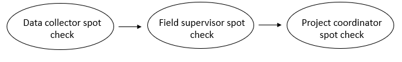

# Data Collection {#collect}

(\#fig:fig10-1)Data collection in the research project life cycle

When collecting original data as part of your study (i.e., you are administering your own survey or assessment as opposed to using existing data), data management best practices should be interwoven throughout your data collection process. The number one way to ensure the integrity of your data is to spend time planning your data collection efforts. Not only does planning minimize errors, it also keeps your data secure, valid, and relieves future data cleaning headaches. 

If you have ever created a data collection instrument and expected it to export data that looks like the image on the left (Figure \@ref(fig:fig10-2)), but instead you export data that looks like the image on the right, then you know what I mean. Collecting quality data doesn't just happen because you create an instrument, it takes careful consideration, structure, and care on the part of the entire team.

(\#fig:fig10-2)A comparison of data collected without planning and data collected with planning

## Quality assurance and control

In addition to planning data collection logistics (i.e. how will data be collected, who will collect it, and when), teams should spend time prior to data collection anticipating potential data integrity problems that may arrive during data collection and putting procedures in place that will reduce those errors [@dime_analytics_data_2021; @northern_illinois_university_data_nodate]. As shown in Figure \@ref(fig:fig10-1), creating data collection instruments is typically a collaborative effort between the project management and data management team members. Even if the project management team builds the tools, the data management team is overseeing that the data collected from the tool aligns with expectations set in the data dictionary. In this chapter we will review two types of practices that both project management and data management team members can implement that will improve the integrity of your data.

1. Quality assurance practices that happen before data is collected
    - Best practices associated with designing and building your data collection instruments
2. Quality control practices implemented during data collection 
    - Best practices associated with managing and reviewing ongoing data collection

Before we dive into collecting data, it's important to first review the ethical and legal considerations of your data collection effort. When working with human subjects it is likely that the Institutional Review Board (IRB) will need to review and approve all of your data collection instruments as well as any agreement forms that will be collected as part of your study. Our next section will provide an overview of the IRB and its requirements as well as best practices for creating agreement forms for participants and partners.

## Institutional Review Board

The IRB is a formal organization designated to review and monitor human participant research and ensure that the welfare, rights, and privacy of research participants are maintained throughout the project [@oregon_state_university_what_2012]. If you are conducting education research with human participants you will most likely have some interaction with and oversight from the IRB. Before reviewing potential requirements, lets review the history of this administrative body.

### Background

In 1974 the IRB was established as part of the National Research Act in response to a long history of unethical research that had been conducted with human participants [@qiao_brief_2018]. In 1979, the Belmont Report [@the_national_commission_for_the_protection_of_human_subjects_of_biomedical_and_behavioral_research_belmont_1979] outlined a set of ethical principles for doing research with human participants. Those ethical principles included the following [@duru_institutional_2023; @huisman_3_nodate]:

1. Respect for persons
    - This included both protecting autonomy of participants by acquiring consent as well as providing a plan to protect participant privacy
      - In practice this means acquiring consent in a way that ensures participants can comprehend what is being asked of them, ensuring that they understand that their participation is voluntary, and ensuring that they understand the plan to protect their privacy
2. Beneficence
    - This involved maximizing good and minimizing harm in the study, for both participants and society at large
      - In practice this means taking time to assess risk and benefits of your study for both the intervention itself as well as the data collection efforts (e.g., how burdensome is the survey)
3. Justice 
    - This included providing additional care and consideration when working with subjects who are vulnerable to coercion or undue influence (e.g., children, prisoners), as well as making sure practices are non-exploitative and that there is fair distribution of costs and benefits across all participants
      - In practice this involves fairness in the selection of participants

Heavily influenced by the Belmont Report, in 1991 the Federal Policy for the Protection of Human Subjects was published, establishing core procedures for human subject protections. The policy, 45 CFR part 46 [@office_for_human_research_protections_45_2016], included four subparts. Subpart A, known as the "Common Rule" for the 15 federal departments and agencies which codified the policy in separate regulations, provided a set of protections for human subjects research including informed consent, review by an IRB, and compliance monitoring [@national_institute_of_justice_common_2007; @office_for_human_research_federal_2009].

In 2018 the Common Rule was revised in order to better protect research participants and to reduce administrative burden [@office_for_human_research_office_for_human_research_revised_2018; @us_department_of_health_and_human_services_whats_nodate]. While many revisions were made, some changes that are applicable to education researchers include the following [@fordham_university_revised_nodate]:

- Revisions and additions to exempt categories, many of which are applicable to research conducted in educational settings 
- Reduced burden of continuing review, particularly for exempt and expedited studies
- Clarifications on how informed consent should be organized, written, and provided

### Requirements

While each institution's IRB submission process is different, typically if your study involves working with human subjects you are required to submit an application to the IRB. As part of your application you will be asked to state what review category your study falls under [@lafayette_college_three_nodate; @northwestern_university_exempt_nodate; @university_of_california_berkeley_exempt_2022].

1. Exempt
    - These studies usually involve minimal risk and fit within categories predefined by your IRB (e.g., evaluating the use of accepted or revised standardized tests). These studies typically involve a shorter review process and a quicker review than non-exempt studies. 
2. Expedited
    - These studies also involve minimal risk but do not meet criteria for exempt status (e.g., collection of voice, video, or image data from non-vulnerable populations).
3. Full Review
    - If a study does not fall into one of the two categories above (e.g., collection of information about illegal behavior), it requires full review, discussed by the full board at a convened meeting.

As part of your application, common documents you may be required to submit include the following [@cabrini_university_submissions_nodate; @duru_institutional_2023]:

1. Certificates from human subjects training (e.g., CITI training^[https://about.citiprogram.org/])
1. Research protocol (see Chapter \@ref(document))
    - When writing your protocol, make sure to review your IRB's rules around data handling and include this information in your plan. IRBs typically have specific rules for things such as how paper and electronic data must be stored and backed up, how long data should be retained, how data can be transferred and shared, and how data should be anonymized [@filip_san_nodate].
1. Study materials (e.g., recruitment materials)
1. Copies of your instruments (e.g., surveys, interview guides, observation forms)
    - Note that these will need to be created before you can submit to your IRB so make sure to consider timing and start building your instruments early enough to give you time to submit to your IRB before data collection
1. Copy of informed consent/assent forms
    - Same as above, give yourself plenty of time to submit before you start participant recruitment
1. If collecting data from sites (e.g., school districts) or sharing data between sites, supporting documentation from those partners may be required (MOUs, data use/sharing agreements, letters of support, confidentiality agreements)
1. If partnering with other institutions, IRB approval letters from partner institutions may also be required

The review process can take several weeks and it is common for the IRB to request revisions to materials. Make sure to review your timeline and give yourself plenty of time to work through this process before you need to begin recruitment and data collection. 

### Agreements

There are several types of agreements that may be required for your research study for both ethical and legal reasons. Here we will discuss the most common type of agreements, informed consent and assent, as well as other agreements used when working with external partners including data sharing agreements, memorandum of understanding documents, and confidentiality agreements. 

#### Consents {#consent}

Informed consent involves obtaining a participant's voluntary agreement to participate in your research study. As described in the Belmont Report [@the_national_commission_for_the_protection_of_human_subjects_of_biomedical_and_behavioral_research_belmont_1979], informed consent should meet the following criteria [@huisman_3_nodate]:

- Describe the study and what is expected of the participant
- Use accessible language to ensure comprehension. Avoid technical jargon and explain terms that may not be easily understood.
- Explain that participation is voluntary
- Review how participant privacy will be maintained

With the revised Common Rule, additional requirements for informed consent were added [@fordham_university_revised_nodate].

- The top of the consent must begin with a concise review of key information that allows participants to make informed decisions
- All information must be presented with sufficient detail to make decisions, not just bulleted lists of facts
- The form must disclose any plans to use participant data for other future research

Figure \@ref(fig:fig10-3) shows common elements that are included in a participant consent form [@bellevue_college_elements_nodate; @the_turing_way_community_turing_2022].

(\#fig:fig10-3)Common topics to include in an informed consent information sheet

Depending on the type of research study, a participant signature or a check box denoting consent may be required. If so, it can be helpful to put the above information on a cover/information sheet, and then have a separate page for signed consent. Before signing, participants should be required to acknowledge that they

- Have read and understood the information provided
- Have been given the opportunity to ask questions
- Understand that their participation is voluntary
- Understand that they may withdraw from the study at any time

Not all studies require active consent [@university_of_virginia_when_nodate]. Some studies may allow passive consent which may be obtained by providing an information sheet to all participants with the following information:

_If you consent to be in this study, no additional action is required; simply move forward with the study._ 
_If you choose to withdraw, you can notify a specified contact._

Your institution's IRB will let you know which type of consent is required for your study and what language is required.

##### Data sharing

With an increase in federal data sharing requirements, it is very important to consider how you want to gain consent for public data sharing. @meyer_practical_2018 provides some general best practices to consider when adding language about public data sharing to a consent form.

- Don’t promise to destroy your data (unless your funder/IRB explicitly requires it)
  - Do incorporate data-retention and sharing plans including letting participants know who will have access to their data
- Don’t promise to not share data
  - Do get consent to retain and share data (consider adding the specific repository you plan to share your data in). 
  - Consider offering tiered levels of consent for participants who may not want all of their data publicly shared but will allow some.
- Don’t promise that research analyses of the collected data will be limited to certain topics
  - Do say that data may be used for future research and share general purposes (e.g., replication, new analyses)
- Do review the ways you plan to de-identify data but be thoughtful when considering risks of re-identification (ex: small sample size for sub-groups)

There are essentially three different ways you can go about obtaining consent for data sharing [@gilmore_practical_2018].

1. Include a line about public data sharing in your consent to participate to research.
    - With this method, a participant who consents is agreeing to both participate in the research study and have their data shared publicly.
2. Have participants consent to data sharing at the same time you provide the research study consent, but provide a separate consent form for the purposes of public data sharing.
3. Have participants consent to data sharing on a separate consent form, at a later time, after research activities are completed. 
    - Obtaining consent this way ensures the participant's are fully aware of the data collected from them and can make an informed decision about the future of that data. 

A limitation of using method 1, as discussed by Gilmore, et al. [-@gilmore_practical_2018], is that if a participant is uncomfortable with their data being publicly shared, you will then also loose them as a study participant. So method 2 or 3 may be your best option. If you choose to go with method 2 or 3, it is very important that you not only track your participant study consent status in your tracking database (as discussed in Chapter \@ref(track)), but that you also add a field to track the consent status for data sharing so that you only publicly share data for those that have given you permission to do so.

#### Assents

If your study involves participants under the age of 18, you may also be required to obtain a participant assent form, in addition to a parent/guardian consent form. The guidelines for when assent is needed varies across IRBs, but typically if a child is age 7 or older [@duru_institutional_2023], both assent and parent consent is needed. While including similar information as provided in the consent, these are usually shorter forms that require much more simplistic language depending on the age of the child.

#### Collecting consent and assent

Last, many institutions have started collecting electronic consent rather than paper consents, especially with a rise in remote data collection efforts. There are benefits to this method including reducing the manual labor of collecting paper forms and removing the need to store paper forms or scan them into an electronic form. However, there are still a few things to consider before collecting electronic consent [@lee_considerations_2020; @malow_redcap-based_2021].

- Make sure your IRB approves this method
- Use institution and IRB approved tools to collect consent (e.g., Qualtrics, DocuSign)
- Find out what information is required by your IRB (e.g., signature, typed name, check box, date)
- Consider how those consents will be stored (e.g., download PDFs, download spreadsheet, store in collection tool)

If you are collecting paper consent or assent, there are still some additional things to consider.

- If consents are sent out as packets, say to schools, make sure to have a system in place to track who each form belongs to. When consents start coming back, it's possible that names are illegible, or there are duplicate names across sites. Tracking the origin of each form could look something like this:
  - Collecting class rosters ahead of time and pre-printing names and other identifiers (e.g., teacher, school) on consents before sending packets out (if this is allowed by both your IRB and the school)
  - Asking teachers to print student and teacher name on each form before the consents/assents are handed out
- If consents are collected by in-person data collectors, you will want a similar process
  - Either pre-print names on forms or have data collectors print names and other identifiers (e.g., teacher, school) on forms as they are collected

**Templates and Resources**

|Source|Resource|
|--------|-----------|
|Anja Sautmann| Annontated informed consent checklist ^[https://www.povertyactionlab.org/sites/default/files/research-resources/rr_irb_annotated-informed-consent-checklist_0.pdf]|
|Holly Lane, Wilhemina van Dijk|Example parent consent ^[https://www.ldbase.org/system/files/documents/2021-04/HS-ParentConsent.txt]|
|Jeffrey Shero, et al.| Informed consent and waiver of consent cheat sheet ^[https://osf.io/3czbx]
|Jeffrey Shero, Sara Hart| Informed consent template with a focus on data sharing ^[https://figshare.com/articles/preprint/Informed_Consent_Template/13218773]|
|University of Virginia| A collection of consent and assent templates ^[https://research.virginia.edu/irb-sbs/consent-templates]|

#### Other agreements

As we discussed in Chapter \@ref(document), a data use agreement (DUA) is a contractual document that lays out expectations for how data will be shared between two or more parties. While the terms data use agreement and data sharing agreement (DSA) are often used interchangeably, I want to differentiate between the two documents. Data use agreements are typically legally binding agreements that provide terms and conditions for working with restricted use data. DUAs are commonly written for data sharing with school districts. In the case of education research, a DUA may include the terms for sharing, working with, and storing identifiable district-level data. 

When working with de-identified, non-sensitive data though, a data sharing agreement is a good option. A DSA is a less formal agreement but is still beneficial if you want to provide terms for how data is used, such as limiting the types of projects that use the data [@ldbase_data_nodate]. We will talk more about these types of agreements in the Chapter \@ref(share).

Another type of agreement, commonly signed when working with partners such a school districts, is a memorandum of understanding (MOU), which establishes the framework for collaboration [@national_center_for_education_statistics_memoranda_nodate; @rel_west_data_nodate]. This document is typically not legally binding, but establishes agreements around things such as responsibilities, communication, and expectations [@duru_grant_2021]. An MOU can be a standalone document or can include a DSA or DUA as part of the document. 

Last, confidentiality agreements and non-disclosure agreements (NDAs) are other types of agreement that may be needed. These documents restrict the use of proprietary or confidential information [@university_of_washington_sharing_nodate] and are legally enforceable agreements.

**Templates and Resources**

|Source|Resource|
|--------|-----------|
|Amy O’Hara| Sample text for data use agreements ^[https://admindatahandbook.mit.edu/book/v1.0-rc4/appendix/dua_appendix.pdf]|
|Florida State University| Example data use agreement ^[https://www.research.fsu.edu/media/1091/hipaadatause.doc]|
|REL West | Data use agreement checklist ^[https://ies.ed.gov/ncee/rel/regions/west/relwestFiles/pdf/CRP_Data_Sharing_Agreements_and_MOUs.pdf]|
|University of North Carolina|Data use agreement decision making flow chart ^[https://research.unc.edu/wp-content/uploads/sites/61/2013/04/CCM3_039360.pdf]|
|Wilhelmina van Dijk, Sara Hart | Example data sharing agreement ^[https://figshare.com/articles/preprint/Example_Data_Sharing_Agreement/14576049]|

## Quality Assurance

(\#fig:fig10-4)Common education research data collection methods

Education researchers collect original data in many ways (see Figure \@ref(fig:fig10-4)). While you can certainly do your best to fix data errors during a data cleaning process, one of the most effective ways to ensure quality data is to correct it at the source. This means designing items and creating data collection tools in a way that produces accurate, valid, and reliable data. When creating your original data collection instruments, there are four ways to collect higher quality data.

1. Questionnaire design
2. Implementing a series of pilot test
3. Choosing data collection tools that meet your needs
4. Building your instrument with the end in mind

We will discuss each of these phases below. The main focus for this section will be on designing instruments that are typically collected using a form (i.e.,a document with spaces to respond to questions). Forms are widely used to collect data in education research (think surveys, assessments, observation forms, or a progress monitoring form in a website), yet if developed poorly, they can produce some of the most problematic data issues.

> **Note**    
If you are collecting data using a standardized assessment, along with a provided instrument (e.g.,an online computer-adaptive testing program), most of the information in this section will not be applicable. In those situations, it is best to adhere to all guidelines provided by the assessment company.

### Questionnaire design

In Chapter \@ref(document) we discussed the importance of documenting all instrument items in your data dictionary before creating your data collection instruments. As you develop items to add to your data dictionary, it is vital to consider questionnaire design.

While some instruments (e.g., cognitive assessments) typically have standardized items, other instruments, such as surveys, are often not predefined, allowing researchers freedom in the design of the instrument which can lead to negative effects such as errors, bias, and potential harm [@dime_analytics_data_2021; @northern_illinois_university_data_nodate]. While this is not a book on questionnaire design, below are a few tips to help you collect more valid, reliable, and ethical survey data.

1. Use existing standards if possible
    - Organizations such as the @national_institutes_of_health_common_nodate and the @national_center_for_education_statistics_common_nodate have developed repositories (Common Data Elements^[https://www.nlm.nih.gov/oet/ed/cde/tutorial/03-100.html] and Common Education Data Standards^[https://ceds.ed.gov/]) of standardized question wording paired with a set of allowable response options for commonly used data elements. Using standards when collecting commonly used variables, such as demographics, provides the following benefits [@icpsr_introduction_2022; @kush_fair_2020]:
        - Reduces bias
        - Allows for harmonization of data across your own research studies and also across the field
            - This allows researchers to draw conclusions using larger samples or by comparing data over time
            - It also reduces the costs of integrating datasets
        - Improves interpretation of information
2. Make sure questions are clearly worded and answer choices are clear and comprehensive
	- Consider how the language might be interpreted
	  - Is the question wording confusing? Can the response options be misinterpreted?
	    - For example, rather than asking "What is your relationship with this student?", which may lead to responses such as "good", reword the question to "How are you related to this student?"
	    - Rather than asking "What county are you from?" when looking for the participant's current location, be more specific and ask "What county do you currently reside in?"
	    - Rather than asking which parent are you? (m/f) where "m" and "f" could be interpreted as "male" or "female", clearly write out the response options and make sure they are comprehensive (mother, father, legal guardian, and so forth)
	  - Is the question leading/biased?
	    - Are the response options ordered in a leading way?
	  - Is there no one way to answer this question?
	    - Are categories mutually exclusive and exhaustive [@icpsr_guide_nodate]?
3. Consider data ethics in your questionnaire design [@kaplowitz_5_2020; @kopper_survey_2021; @mathematica_tips_nodate; @narvaiz_data_nodate]
    - Consider the why of each item and tie your questions to outcomes
        - Don't cause undue burden on participants by collecting more data just to have more data.
        - If collecting demographic information, provide an explanation of why that information is necessary and how it will be used in your research
    - Review question wording
      - Does it have potential to do harm to participants?
      - If sensitive questions are included, make sure to discuss how you will protect respondent's information
    -  Make questions inclusive of the population while also capturing the categories relevant for research
        - If a question is multiple choice, still include an "other" option with an open text field
        - For demographic information, allow participants to select more than one option
	  - Consider including one general free text field in your survey to allow participants to provide additional information that they feel was not captured elsewhere
4. Limit the collection of personally identifiable information
    - Collecting identifiable information is a balancing act between protecting participant confidentiality and collecting the information necessary to implement a study. We often need to collect some identifying information either for the purposes of record linking or for purposes related to study outcomes (e.g., scoring an assessment based on participant's age). 
    - As a general rule, you only want to collect personally identifiable information (PII) that is absolutely necessary for your project, and no more. As discussed in Chapter \@ref(rdm), PII can include both direct identifiers (e.g., name or email) as well as indirect identifiers (e.g., birthdate). Before sharing your data, all PII will need to be removed or altered to protect confidentiality.

**Survey Design Resources**

|Source|Resource|
|--------|-----------|
|Sarah Kopper, Katie Parry|Survey design ^[https://www.povertyactionlab.org/resource/survey-design]|
|Pew Research Center|Writing survey questions ^[https://www.pewresearch.org/our-methods/u-s-surveys/writing-survey-questions/]|
|Stefanie Stantcheva| How to run surveys: A guide to creating your own identifying variation and revealing the invisible ^[https://www.nber.org/system/files/working_papers/w30527/w30527.pdf]|
|World Bank|Survey content-focused pilot checklist ^[https://dimewiki.worldbank.org/Checklist:_Content-focused_Pilot]|

### Pilot the instrument

Gathering feedback on your instruments is an integral part to the quality assurance process. There are three phases to piloting an instrument [@dime_analytics_survey_2021] (see Figure \@ref(fig:fig10-5)):

1. Gathering internal feedback on items
    - As discussed in Chapter \@ref(document), once all items for each instrument have been added to your data dictionary, have your team review the data dictionary and provide feedback
2. Piloting an instrument for content
    - Once the team has approved the items to be collected, the second phase of piloting can begin. Create a printable draft of your instrument that can be shared with people in your study population and gather feedback
3. Piloting the instrument for data related issues
    - Once the instrument is created in your chosen data collection tool, share the instrument with your team for review
    - Here we are most interested in whether or not the data we are collecting are accurate, comprehensive, and usable
    - We will discuss this phase in greater detail below

Last, as you move through the piloting phases, remember to update any changes not only in your instrument but also in your data dictionary and any other relevant documentation.
	  

(\#fig:fig10-5)Questionnaire pilot phases

### Choose quality data collection tools

Once content piloting is completed, teams should be ready to begin building their instruments in their data collection tools (see Figure \@ref(fig:fig10-4)). Research teams may be restricted in the tools they use to collect their data for a variety of reasons including limited resources, research design, the population being studied, or the chosen instrument (e.g., an existing assessment can only be collected using a provided tool). However, if you have the flexibility to choose how you collect your data, pick a tool that meets that meets the various needs of your project while also providing data quality and security controls. Things to consider when choosing a data collection tool are:

1. Pick the tool that meets the needs of your project
    - Is crowdsourcing required? 
    - Is multi-site access required?
    - Who is entering the data (i.e., data collectors, participants)?
      - If participants are entering data, is the tool accessible for your population?
    - What are the technical requirements for the tool (i.e., will internet be available if you plan to use a web-based tool)?
    - Does the tool have customizable features that are necessary for your instrument (e.g., skip logic, automated email reminders, options to embed data, option to calculate scores in the tool)?
1. Compliance and security
    - If you collect identifiable data, is the tool HIPAA compliant? FERPA compliant?
    - Is the tool approved by your institution?
    - If collecting anonymous data, do you have the option to de-identify data before downloading (e.g., remove IP Address)?
1. Training needed
    - Is any additional team training needed to allow your team to use and/or build instruments in the tool?
1. Associated costs
    - Is there a cost associated with the tool? Do you have the budget for the tool?
    - Will there be additional costs down the line (i.e., collecting data on paper means someone will need to hand enter the data later)?
1. Data quality features
    - Does the tool allow you to set up data validation?
    - Does the tool have version control?
    - Does the tool have features to deal with fraud/bots?

While there are a variety of tool options, in a nutshell when it comes to quantitative data, we are collecting data in one of two ways---electronic or paper. In addition to choosing tools based on the above criteria, there are some general benefits associated with each method that should also be considered [@cohen_research_2007; @douglas_data_2023; @gibson_data_2021; @icpsr_guide_nodate;  @malow_redcap-based_2021; @society_of_critical_care_medicine_building_2018; @van_bochove_data_nodate].

(\#fig:fig10-6)Comparison of data collection tool benefits

> **Note**    
If you choose to collect data in an electronic format, I highly recommend using a web-based tools that directly feeds into a shared database rather than through offline tools that store data on individual devices. Using a web-based tool, all data is stored remotely in the same database and can be easily downloaded or connected to at any time. No additional work is required.    
However, if collecting data on various tablets that are used in the field, if the forms are offline and cannot be later connected to a web-based form, then all data will be stored individually on each tablet. This not only may be less secure (e.g., a tablet becomes corrupted), it may also require additional data wrangling work including downloading data from each tablet to a secure storage location each day and then combining all files into a single dataset. If you use an electronic tool but your site does not have internet, consider using the many tools (e.g., Qualtrics or SurveyCTO) that allow you to collect data using their offline app and then upload that data back to the platform once you have an internet connection again.

**Tool Comparison Resources**

|Source|Resource|
|--------|-----------|
|Michael Gibson, Wim Louw|Survey platform comparison^[https://www.povertyactionlab.org/resource/survey-programming]|
|Washington State University Libraries|Software for sensitive data^[https://libguides.libraries.wsu.edu/rdmlibguide/ethics]|
|Benjamin Douglas, et al. | Data quality in online human-subjects research comparison of tools^[https://journals.plos.org/plosone/article?id=10.1371/journal.pone.0279720]|

### Build with the end in mind

Last, you want to build your tool with the end in mind. This means taking time to consider how the data you collect will be translated into a dataset [@beals_data_2014; @lewis_how_2022; @uk_data_service_quality_nodate]. Recall from Chapter \@ref(structure), we ultimately need our data to be in a rectangular format, organized according to the basic data organization rules, in order to be analyzable. 

The process for building your tools with the end in mind is fairly different for electronic tools compared to paper forms so we are going to talk about these two processes separately.

#### Electronic data collection

The first thing you will want to do before building your tool is bring out your data dictionary. This data dictionary will be your guide as you build your instrument. Some tools, such as REDCap, provide the option to upload your data dictionary which can then be used to automate the creation of data collection forms as opposed to building them from scratch [@patridge_research_2018].

However, if you are building your instrument manually, following the guidelines below will ensure you collect data that is easier to interpret and more usable, and it will also reduce the amount of time you will need to spend on future data cleaning [@lewis_how_2022]:

1. Name all of your questionnaire items the correct item name from your data dictionary [@uk_data_service_quality_nodate]
    - For example, rename the Qualtrics default Q1 to s_gender
    - This isn’t a name that your survey participants will see, but it is the variable name you will see when you download your data
    - As we mentioned in Chapter \@ref(style), it's also best to not concatenate a time component to your variable names if your project is longitudinal. If you do, you will no longer be able to reuse your instrument for other time periods, creating additional work for you or your team.
2. Code all values as they are in your data dictionary
    - For example, 1 = strongly agree, 2 = agree, 3 = disagree, 4 = strongly disagree
    - Many times your tools assign a default value to your response options and these values may not align with what you've designated in your data dictionary
    - Again, participants will only see the text values but when you download your data, you will have the correct numeric values associated with each response option
    - As you edit your survey, continue to check that your coded values did not change due to reordering, removal, or addition of new response options
3. Use data validation to reduce errors and missing data [@uk_data_service_quality_nodate]
    - Content validation
      - Restrict entry to the type assigned in your data dictionary (e.g., numeric)
      - Restrict entry to the format assigned in your data dictionary (e.g., YYYY-MM-DD)
      - Restrict ranges based on allowable ranges in your data dictionary (e.g., 1-50)
          - This could even include validating against previous responses (if elementary school was selected in previous question, age should be between 5-12, if middle school was selected, age should be between 11-14)
      - If duplicate responses are not allowed for a question (i.e., rank order), have options drop away after they are chosen
    - Response validation
      - Add a "forced response" option to variables that are absolutely necessary (e.g., unique identifier)
        - Do not add "forced response" to non-essential questions. Doing so can be both harmful to participants and produce bad data. If you add forced response options to non-essential questions, ensure that those questions allow participants to still opt-out.
      - For non-essential questions, add a "request response" option which notifies the respondent that they skipped a question and asks them if they still would like to move forward without responding
4. Choose an appropriate type and format to display the item
    - Become familiar with the various questions types available in your tool (e.g., rank order, multiple choice - select all, multiple choice - select one, text box)
    - Become familiar with the various formats (e.g., radio buttons, drop down, checkboxes)
    - For instance, if your item is a rank order question (ranking 3 items), creating this question as a multi-line free text entry form may lead to duplicate entries (such as entering a rank of 1 more than once). However, using something like a “rank order” question type with a “drag and drop” format ensures that participants are only allowed to drag the 3 existing response options and order them.
5. If there is a finite number of response options, and the number isn’t too large (less than ~ 20) use controlled vocabularies (i.e., a pre-defined list of values) rather than open-text field [@openaire_eu_basics_2018; @uk_data_service_quality_nodate]
    - For example, list school name as a drop-down item rather than having participants enter a school name
      - This prevents variation in text entry (e.g., "South Middle", "SOUTH", "south middle"), which ultimately creates unnecessary data cleaning work and may even lead to unusable values
6. If there is an infinite number of response options or the number of options is large, use an open-text box
    - Consider limiting the number of characters allowed in the text box unless you want to allow users to write paragraphs of information
    - Using open-ended text boxes does not mean you can not regroup this information into categories later through syntax. It is just more time-consuming and requires interpretation and decision making on the part of the data cleaner  
7.Only ask for one piece of information per question
    - Rather than asking "please list the number of students in your algebra class and geometry class", split those into two separate questions so those questions download as two separate items in your dataset
    - This also prevents confusion in case a participant or data collector swaps the order of information
8. To ensure the security and integrity of data, consider adding a line to your survey introduction instructing participants to close their browser at the completion of their survey so that others may not access their responses.
9. Last, if possible, export the instrument to a human-readable document to perform final checks
    - Are all questions accounted for?
    - Are all response options accounted for and coded as they should be?
    - Is skip logic shown as expected?

Once your tool is created, the last step is to pilot the actual instrument for data issues (see Figure \@ref(fig:fig10-5)). Collect sample responses from team members. Create a feedback checklist for them to complete as they review the instrument. Assign different reviewers to enter the survey using varying criteria (e.g., different schools, different grade levels). Let team members know that they should actually try to break things [@kopper_questionnaire_2020]. If there are problems with the tool, now is the time to find out. Try to enter nonsensical values, try to skip items, try to enter duplicate entries. If any issues are found, update the tool as well as your documentation as needed.

Potential feedback checklist items [@gibson_survey_2020]:

1. Can you access the survey? Were there any barriers?
2. Are all questions accounted for? Are the items worded correctly?
3. Are all response options visible for each categorical question?
4. Is data validation working? Were you able to enter unallowable values, data types, or formats?
5. Is the skip logic working?
6. Are you able to skip items that you should not be able to skip?

 

Last, export the sample data and review the data for the following:

1. Are there any unexpected or missing variables?
2. Are there any unexpected variable names?
3. Are there unexpected values for variables?
4. Are there missing values where you expect data?
5. Are there unexpected variable formats?
6. Is data exporting in an analyzable, rectangular format?

#### Paper data collection

There are many situations where collecting data electronically may not be feasible or the best option for your project. While it is definitely trickier to design a paper tool in a way that prevents bad data, there are still steps you can take to improve data quality.

1. First, you still want to pull out your data dictionary to use as a guide as you create your paper form
2. Have clear instructions for how to complete the paper form [@kopper_survey_2021]
   - Make sure to not only have overall instructions at the top of the form but also have explicit instructions for how each question should be completed
      - Where to write answers (e.g., not in the margin)
      - How answers should be recorded (e.g., YYYY-MM-DD, or 3 digit number)
      - How many answers should be recorded (e.g., circle only one answer, check all applicable boxes)
      - How to navigate item skip logic (e.g., include visual arrows)
3. Only ask for one piece of information per question to reduce confusion in interpretation

Once your tool is created, you will want to pilot the instrument with your team. Collect feedback from Figure \@ref(fig:fig10-5) and edit your tool as needed before sending it out into the field.

Last, all data that is collected on paper will need to be entered into an electronic format. While we will talk about data entry specifically in Chapter \@ref(capture), this point in instrument creation is a great time to create an annotated instrument that can be used for future data entry [@neild_sharing_2022]. This includes taking a copy of your instrument and writing the associated codes alongside each item (i.e., variable name, value codes). This can be useful during the data entry process and serve as a linking key between your instrument and your data dictionary (see Figure \@ref(fig:fig10-7)) [@hart_florida_2018].

(\#fig:fig10-7)Annotated instrument from The Florida State Twin Registry project

Another option for capturing paper data in an electronic format is using TeleForm rather than paper. These forms are designed to be scanned by machines. Using TeleForm removes the extra step of future data entry and errors associated with human entry.

#### Identifiers

It is vitally important, when building data collection tools, to make sure you are collecting unique identifiers [@kopper_survey_2021]. Whether you have participants enter a unique identifier into a form or you have linked study ID to each form in some other way, it's important to not accidentally collect anonymous or unidentifiable data. Without unique identifiers in your data, you will be unable to link data across time and forms. If possible, you want to avoid collecting names as unique identifiers for the following reasons [@mckenzie_falsehoods_2010]:

- To protect confidentiality we want to use names as little as possible on forms
  - If they are used on forms, we want to remove them as soon as possible
- Names are not unique
  - If you do collect names, you'll want to ask for additional identifying information that when combined, make a participant unique (e.g., student name and email)
- Names change (e.g., someone gets married/divorced)
- There is too much room for error
  - If names are hand entered, there are endless issues with case sensitivity, spelling errors, special characters, spacing, and so forth

All of the above issues make it very difficult to link data. If you do decide to collect names, remember that you will need to remove names during data processing and replace them with your unique study identifiers.

Figure \@ref(fig:fig10-8) shows what a data de-identification process looks like [@otoole_data_2018]. Dataset 1 would be the incoming survey data with identifiers, Dataset 2 would be a roster exported from your participant database (see Chapter \@ref(track)), and Dataset 3 is your clean, de-identified dataset, created by merging Dataset 1 with Dataset 2 on your unique identifier and dropping your identifying variables. I emphasize here that I used the term "merge" which we will discuss more in Chapter \@ref(clean), as opposed to replacing names with IDs by hand entering identifiers. If at all possible, we want to completely avoid hand entry of study IDs. Hand entry is error-prone and can lead to many mistakes.

(\#fig:fig10-8)Process of creating a de-identified dataset

Rather than having to de-identify your data through this cleaning process, another option is to collect a different type of unique identifier, or pre-link unique study identifiers and names in your instrument, removing many of the issues above [@dime_analytics_data_2021; @gibson_survey_2020]. We will discuss these methods separately for electronic data and paper data below.

1. Electronic Data

There are many ways you might consider collecting unique identifiers other than names. A few possible options are provided below. The method you choose will depend on your data collection design, your participant population, your tool capabilities, and your team expertise.

- Create unique links for participants
  - Many tools will allow you to preload a contact list of participants (from your participant database) that includes both their names and study IDs. Using this list, the tool can create unique links for each participant. This is the most error-proof way to ensure study IDs are entered correctly. 
  - When you export your data, the correct ID is already linked to each participant and you can choose to not export names in the data. 
  - Make sure to build a data check into the system. When a participant opens their unique link, verify their identity by asking, “Are you {first name}?”. Only use first name to protect other participant identities. 
    - If they say yes, they move forward. If they say no, the system redirects them to someone to contact. This ensures that participants are not completing someone else’s survey and IDs are connected to the correct participant.
- Provide one link to all participants and separately, in an email, in person on a sheet of paper, or by mail, provide participants with their study ID to enter into the system. 
  - This might be a preferred method if you are conducting surveys or assessments in a computer lab or on tablets at a school site
  - This can possibly introduce error if a participant enters study ID incorrectly. 
    - Similar to above, after a participant enters their ID, verify their identity by asking, “Are you first name?”. 
      - If they say yes, they move forward. If they say no, the system redirects them to someone to contact
  - Note that participants are only becoming aware of their own study identifier, not the identifiers associated with other participants. However, if your team, or your IRB, is uncomfortable with participants knowing their study IDs you can also consider using a "double ID" which is yet another set of unchanging unique identifiers that you use for the sole purpose of data collection. Those identifiers will need to be tracked in your participant tracking database and will need to be replaced with study IDs in the clean data
- If you have not previously assigned study identifiers (i.e., your consent and assent process is a part of your instrument), you can have participants enter their identifying information (e.g., name) and then have the tool assign a unique identifier to the participants
  - Using this method, you can potentially download two separate files
    - One with just the instrument data and assigned study ID, with name removed
    - One with just identifying information and assigned study ID (this information will be added to your participant tracking database)

 

> **Note**    
All of the options above assume you are making a private link that you are sending to a targeted list (e.g., students in a classroom, teachers in a school). However, there may be times when you need to publicly recruit and collect data for your study and this opens your instrument up for a plethora of data quality issues. Bots, fraudulent data, and incoherent or synthetic responses are all issues that can plague your online data collection efforts, particularly with crowdsourcing platforms [@douglas_data_2023; @veselovsky_artificial_2023; @webb_too_2022]. If you need to use a public link, some suggestions that can help you both secure your instrument and detect fraud include the following [@simone_how_2019; @teitcher_detecting_2015]:   
- Not posting the link on social media  
- Using CAPTCHA verification  
- Using tools that allow you to block suspicious geolocations  
- Not automating payment upon survey completion    
- Including open-ended questions   
- Build attention/logic checks into survey  
- Ask some of the same questions twice (once early on and again at the end)   
Even with these additions to the survey, you will want to check your data thoroughly before analyzing it and before providing payments to participants. We will discuss this more later in this chapter.   
If possible, avoid using public survey links. One possible workaround would be to first create a public link with a screener. Then after participants are verified through the screener, send a private, unique link.
    
2. Paper Data

If you take paper forms into the field consider doing the following to connect your data to a participant [@otoole_data_2018; @reynolds_basics_2022].

- Write the study ID on each page of your data collection form and then use either a removable label with participant name and place that over the ID or attach a cover sheet with identifying information such as student name. When you return to the office, you can remove the name label/cover sheet and be left with only the ID on the form.
  - It is this ID only that you will enter into your data entry form during the data capture process, no name.
  - Removing the label/cover sheet also ensures that your data entry team only sees the study ID when they enter data, increasing privacy by minimizing the number of people who see see participant name.
  - It is important to double and triple check study identifiers against your participant database to make sure the information is correct before removing the label or cover sheet
  - Make a plan for the labels/cover sheets (either shred them if they are no longer needed, or store them securely in a locked file cabinet and shred them at a later point)

(\#fig:fig10-9)Example cover sheet for a paper data collection instrument

> **Note**    
If your study is designed to collect anonymous data, then you will not assign study identifiers and no participant identifying information should be collected in your instruments (e.g., name, email, date of birth). You will also want to make sure to not collect IP addresses as they can be used to identify an individual’s computer. It’s also important to recognize that if you collect anonymous data, you will not be able to link data across measures or across time. However, if your study randomizes participants by an entity (e.g., school or district), you will need to collect identifying information about that entity in order to cluster on that information (e.g., school name). 

## Quality Control

In addition to implementing quality assurance measures during your planning phases, it is equally important to implement several quality control measures while data collection is underway.

1. In field data management
2. Ongoing data checks
3. Tracking data collection daily
4. Collecting data consistently

We will discuss each of these issues below.

### In field data management

If your data collection efforts include in field data collection (e.g., data collectors administering assessments in a school), there are several steps your team can implement to both keep your data more secure in the field, as well as keep better track of what happens in the field and ensure more accurate information. 

This process begins before you begin collecting data. It starts with creating solid standard operating procedures (see Chapter \@ref(document)) for your data collection process and spending time training your data collection staff on those procedures so that you not only keep data more secure and but ensure that your data are collected with fidelity. This includes not only training them on how to implement the instrument, but also how to store and track data in the field. Some considerations for what to include in a data collection SOP are below [@dime_analytics_data_2021].

- Keep your data secure in the field
  - Make sure all paper forms are kept in a folder (or even a lock box) with you at all times and that they are promptly returned to the office (e.g., not left in a car, at someone's home)
  - Make sure all data collection devices (e.g., phone, tablets) are password protected and never left open and unattended. Keep all identifiable information encrypted on your in field devices (i.e., data is encoded so that only those with a password can decipher it). You may also consider remote wiping capabilities on portable devices in the case of loss or theft [@otoole_data_2018]
- Create tracking sheets to go out in the field
  - These sheets should include the names and/or identifiers of every participant data collectors will be collecting data from
  - Next to each participant, include any other relevant information to track, such as 
    - Was the data collected (i.e., a check box)
    - As well as a notes section to describe any potential issues with the data (e.g., "Student had to leave the classroom halfway through the assessment - only partially completed")
  - This tracking sheet allows the project coordinator to keep track of what is occurring in the field so that information can be accurately recorded in the participant tracking database and forms can be sent back out for completion as needed
- Check paper data in the field
  - Immediately upon completing a form, have data collectors do spot checks. If any problems are found, follow up with the participant for correction if possible.
    - Check for missing data
    - Check for duplicate answers given
    - Check for answers provided outside of the assigned area (e.g., answers written in the margins)
    - Check scoring (e.g., basals and ceilings)
- Assign an in field supervisor
  - This person is assigned to 
    - Do another round of data checks in the field once the data collector returns paper forms to the on-site central location (e.g., if data collectors have set up in the teacher's lounge)
    - Ensure that all data and equipment is accounted for and returned to the office
    - Is available for trouble shooting as needed
- Do another round of paper data spot checking as soon as the data is returned to the office (see Figure \@ref(fig:fig10-10))
  - The project coordinator may do this round of checking as they are tracking information in the participant database
  - If any issues are found, note that in the tracking database and send the form back out to the field for correction
  - If your paper forms are mailed back to you from participants, rather than returned from in field data collectors, it is still important to do those in-office spot checks. If at all possible, reach out to those participants for any corrections.
- When data collection wraps up for that period, collect feedback from data collectors to improve future data collection efforts
  - What went well? What didn't?

(\#fig:fig10-10)A series of spot checks that occur with paper data

### Ongoing data checks

If you are collecting data via a web-based form, you will want to perform frequent data quality checks, similar to the checks you performed during the content and data piloting phase. You will want to check for both programming errors (i.e., skip logic programmed incorrectly) as well as response quality errors (e.g. bots, survey comprehension) [@dime_analytics_data_2021; @gibson_data_2021].

- Checks for bots/fraud
  - Are there surveys completed in a very short period of time?
  - Are there surveys in suspicious geolocations?
    - This information may not be available for anonymous data - consult with your IRB
  - Are there nonsensical responses for open-ended questions?
  - Are there nonsensical responses to attention or logic checking questions?
- Checks for comprehension
  - Are any questions being misinterpreted?
- Checks for missing data
  - Are items being skipped that should not be skipped?
  - Are surveys not being completed?
- Checks for ranges and formats
  - Are values unexpected formats or falling outside of unexpected ranges?
- Checks for duplicate surveys
- Is skip logic working as expected?
  - Are people being directed to the correct location based on their responses to items?

Some of these checks can be performed programatically (i.e., you can write a validation script in a program such as R, and run that script on a recurring schedule during data collection to check for things such as values out of range). Other checks may be a manual check of data (e.g., such as downloading your data on a recurring schedule and reviewing open-ended questions for nonsensical responses). If errors are found, consider revising your instrument to prevent future errors if this is possible without jeopardizing the consistency of your data.

### Tracking data collection

Throughout data collection your team should be tracking the completion of forms (e.g. consents, paperwork, data collection forms). Your team may designate one person to track data (e.g., the project coordinator), or they may designate multiple. If you are working across multiple sites, with multiple teams, you will most likely have one or more persons at each site tracking data as it comes in. 

Some tracking best practices include:

1. Only track data that you physically have (paper or electronic)
    - Never track data as "complete" that someone tells you they collected
      - You can always mark this information in a "notes" field and track when you have the physical data
2. Track daily during data collection
    - Do not wait until the end of data collection to track what data was collected
    - This helps ensure that you don't miss the opportunity to collect data that you *thought* you had but never actually collected
3. Only track complete data as "complete"
    - If a form is only partially completed and you plan to send it back out to the field for completion, mark this in the "notes" but do not mark it as "completed". If you have a "partially completed" option, you can mark this option.

### Collecting data consistently

As mentioned in Chapter \@ref(style), it's important to collect data consistently for the entire project to ensure interoperability. Keep the following consistent across both time and forms (e.g., Spanish and English version of a form):

- Variable names
  - Use the same names for the same items (and remember it's best to not add a time component to your variable names at this time)
- Variable types
  - If gender is collected as a numeric variable, keep it as a numeric variable
- Value codes
  - Make sure response options are consistently coded using the same values
- Question type and format
  - If a slider question was used for "Percent of time on homework", continue to ask that question using a slider question
  
Failing to collect your data consistently has many consequences:

1. It can make it difficult or impossible to compare outcomes. 
2. Makes your work less reproducible
3. Reduces your ability to physically combine data (i.e., you cannot append dissimilar variables)
4. Can lead to errors in interpretation

Last, collecting data consistently also means measuring things in the same way over time or across forms so that you don't bias your results. The slightest change in item wording or response options can result in dramatic changes to outcomes [@icpsr_introduction_2022].

## Review

This chapter is a lot. There is so much to consider, both prior to data collection as well as during data collection, and the information varies so much depending on how you collect your data and who you collect your data on. As I've said before, implement what you can. Implementing even some of these practices will lead to higher quality data compared to implementing none of these practices, and that's huge. 

It's also important to consider your entire data collection workflow. Recall Figure \@ref(fig:fig5-5), where we visualized a sample process for collecting an online survey. Knowing that errors can happen at any point in this process, remember to consider the entire workflow holistically, and integrate both quality assurance and quality control procedures throughout (see Figure \@ref(fig:fig10-11)).

As a final reminder, once the workflow is developed, you will want to write the specifics of that plan into an SOP, including assigning roles and responsibilities for each task in the process. Last, train your team regularly on how to implement that data collection SOP so that you continue to collect data in a standardized way. 

(\#fig:fig10-11)Integrating quality assurance and control into a data collection workflow

**Instrument Workflow Resources**

|Source|Resource|
|--------|-----------|
|DIME Wiki| Questionnaire design timeline^[https://dimewiki.worldbank.org/Questionnaire_Design]|
|Sarah Kopper, Katie Parry | Five key steps in the process of survey design^[https://www.povertyactionlab.org/resource/survey-design]|

