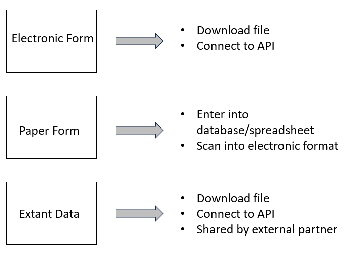
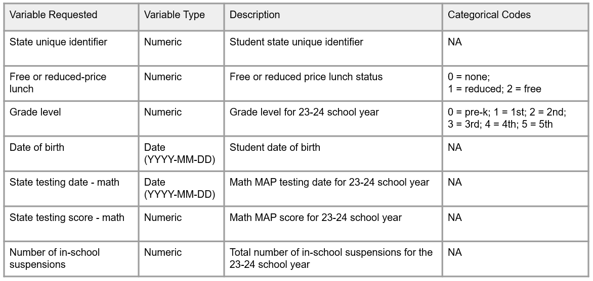
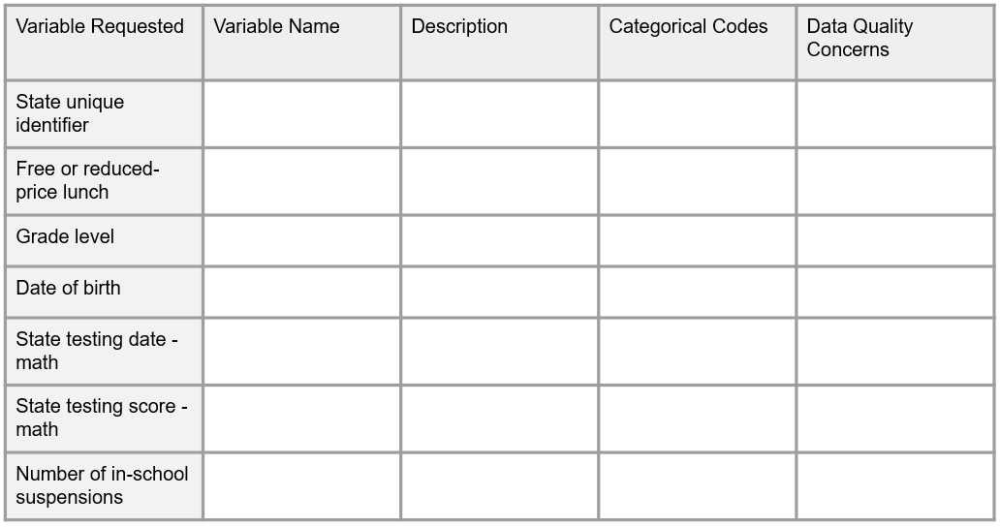

# Data Capture {#capture}

(\#fig:fig11-1)Data capture in the research project life cycle

After the data collection period is complete, the next phase in the cycle is to capture the data, meaning extracting, creating, or acquiring a file that we can save in our designated storage location. In quantitative research we typically want to capture data in an electronic, rectangular format (see Chapter \@ref(structure)). In this chapter we will review common ways to capture data based on three data collection methods (see Figure \@ref(fig:fig11-2)). Similar to data collection, it is possible for data errors to occur during this phase.  In reviewing data capture methods, we will also cover how data quality can be managed during this phase.

(\#fig:fig11-2)Common data capture methods

## Electronic data capture {#capture-electronic}

As discussed in Chapter \@ref(collect), electronic data can be collected using a variety of software (either web-based or offline). Since electronic forms typically funnel data into a spreadsheet or database, it makes the process of data capture much easier compared to paper data. However, there is still much to consider.

1. How will the data be captured?
    - The most common way to capture data in an electronic format is to download it from your platform.
    - Another option you may have for web-based forms is to capture data via an API (application programming interface). If you regularly need to review your data before your final capture, using an API can be a great way to remove the burden of manually logging into a program and going through the point and click process of downloading a file. Instead you can write a script, in a program such as R, to extract the data. Once the script is created, you can run it as often as you want. However, this is only an option if your tool has an API available (e.g., Qualtrics).
1. What file type will the data be captured in?
    - Most electronic data collection tools provide an option to export to one or more file formats (e.g., SAV, CSV, TXT). It is important to choose a file type that is analyzable (i.e., rectangular formatted), as opposed to something like a PDF file. The rectangular file type you choose will mostly depend on your project plans. Things to consider might include:
      - Do you want the text values for responses or the numeric values? Your choice may limit your options.
      - Do you want embedded metadata, such as variable and value labels, in your raw file? Again, your choice will narrow your options.
      - Do you want a non-proprietary, interoperable format? If yes, you will not want to capture data in file types such as XLSX and SAV that require proprietary software to view.
      - Will any file types create issues for your variables?
        - For instance, Microsoft Excel is well-known for applying unwanted formatting to values. As an example, if your assessment tool collects age in the format of `years-months`, oftentimes Microsoft Excel will change this variable into a date, converting a value such as `10-2` (10 years and 2 months old) to `2-Oct`. A more suitable file type in this situation may be a CSV or TXT file, which do not apply formatting.
      - Is there a file structure that you don't want to work with?
        - As an example, the structure of a SAV file may look different compared to a XLSX file depending on the tool. In a tool like Qualtrics, an XLSX or CSV file may export with multiple header rows whereas a SAV file does not.
1. What additional formatting options need to be considered?
    - In addition to choosing a file type, there may be other options that your tool allows you to consider. Examples of what these might look like are:
      - Do you want to export the text values or numeric values for categorical items?
      - How do you want to export "select all" questions?
        - Depending on your chosen file type, you may be allowed to choose how you want to format "select all" questions. Typically your options are to export them in one variable, where each option is separated by a comma, or you can split each option into its own column.
      - How do you want to recode seen but missing values? 
        - This option is commonly provided because "select all" questions are often split out into multiple variables, where a `1` indicates the option was selected, and blank represents either the option was **not selected** or that the item was skipped entirely. 
        - Typically tools provide the option to recode to `0` or `-99`. You can also choose not to recode and leave those responses as blank. If the types of missing data do not matter to your study, then leaving missing values as blank is typically the most straightforward option. However, adding an extreme value like `-99` can make it easier to know if those blank "select all" values are a "no" response (recoded to `-99`) or if those values were never seen and actually represent a missing value (left as blank).
1. Where will the file be stored and how will it be named?
    - This decision should be based on guidelines laid out in your style guide (see Chapter \@ref(style)). Important things to consider here are:
      - If the data contains identifiable information (e.g., name, IP Address, email), it needs to be stored securely with limited access (see Chapter \@ref(storage)).
      - While your tool may provide a name for your file, give it a more meaningful name based on your style guide rules. That name should indicate that it is a raw data file, along with other relevant metadata (e.g., project acronym, type of data, data collection wave, or the date the file was downloaded)
1. What documentation needs to accompany the data capture?
    - As discussed in Section \@ref(document-dataset), there are additional documents that can be helpful to include alongside the file.
      - A Readme can be very beneficial to include if there is anything in the file that a future person managing the data should be aware of.
      - A changelog can also be very beneficial. It is common to have to redownload a raw data file due to errors found or new participants added. A changelog can help the team both identify the most recent version of a raw data file, as well as understand the differences between files.
1. Who will capture the data?
    - It doesn't necessarily matter who takes on this responsibility. What matters most is that the person has the expertise to capture the data and that this responsibility is documented. If the person capturing the data is not the person who oversees data collection, it is important to still assign that person the responsibility of documenting any relevant information in the Readme.  
1. What checks need to happen before this data is handed off?
    - It is important for the person responsible for data capture to do a basic review of the file before handing this data off for the next step.
      - Does the format of the file look as expected? Does it have data in it? Are all the variables there as expected?
      - Are all participants in the data? This is an excellent time to compare the number of unique participants in the file to the number of participants with completed data in your participant tracking database. If these numbers do not match, the person in charge of data capture should begin reconciling errors before handing off this data. 
        - Was a participant accidentally dropped from the file? Is someone incorrectly marked as complete in the tracking database? Are there duplicate entries in the file?
          - If there are errors that can be corrected (e.g., someone incorrectly tracked a data point, a participant was left off in the capture process), those corrections should be made now. If there are corrections that involve manipulating the raw data (e.g., reconciling duplicate IDs in the data), those corrections should not be made at this time. Instead, those should be added to a Readme file to be corrected in the data cleaning phase. 
  
> **Note**    
It is important to never make changes directly to the raw data files. This also includes not making changes directly to the data in your data collection tool. If you see errors in the raw data file that can't be fixed by simply re-downloading the data, make notes in a Readme for future correction as noted above. Those corrections can be made in the data cleaning process. The one exception to this rule is if you accidentally collect data on a non-consented participant. In this case, it may be best to delete data for this participant directly in your data collection tool so that no record is kept.

All of these decisions should be made and documented during the time you are developing data collection tools. Making these decisions early allows you to also implement them during the pilot testing and data checking processes. For instance, if you plan to capture your data by exporting a CSV file from your data collection platform with a variety of options selected, you will want to use this same method during your data piloting and data checking process. This allows you to know exactly what your data will look like once data collection is complete and make adjustments as needed.

As discussed in Chapter \@ref(plan), your data capture process should be added to your workflow diagram and then detailed in an SOP. All of the decisions above should exist in the relevant SOP. This ensures that workflows are standardized and reproducible. As we've learned in this section, one deviation from the SOP has the potential to produce a very different data product (e.g., the format of a CSV file compared to a SAV file can vary). Not only can this produce errors but it can also undermine the reproducibility of a data cleaning pipeline. Imagine a scenario where a data cleaning syntax is written to import a CSV file with an expected format, and that format changes. The pipeline is no longer reproducible. Last, documenting a timeline for when this data capture process should occur can also be beneficial for both the person responsible for data capture, as well as people responsible for subsequent phases such as data cleaning.

## Paper data capture

The most common method for capturing paper forms is manual entry. While capturing electronic data is fairly quick and straightforward, planning for and implementing paper data entry is much more involved. Similar to electronic data collection, you will want to start planning data entry long before your data is collected, and you will need to build your data entry tool before the data capture phase (e.g., when you are creating your data collection tools).

As you can imagine, manually entering data comes with the potential for many data quality issues. In developing a data entry process, it is important to implement quality assurance practices similar to those we discussed in Section \@ref(collect-assurance).

1. Choose a quality data entry tool
1. Build your data entry form with the end in mind
1. Develop a data entry procedure

### Choose a quality data entry tool

When choosing a data entry tool, if you are already using a relational database for your participant tracking, it may make the most sense to use this same database for data entry so that data can be stored in one location and tables can be linked. However, if you need to choose a new tool for data entry, the criteria for choosing one will be similar to those reviewed in Section \@ref(collect-tools). Considerations for project needs, security, costs, and data quality should all still be reviewed.

In addition to reviewing those criteria, it can also be very beneficial to use a tool that allows you to create entry forms, similar to the form we saw in Figure \@ref(fig:fig9-8), rather than entering directly into a spreadsheet. Building a data entry form that is laid out similar to the paper form can help reduce errors in data entry. Data that is entered into the form is then fed into a table that can be exported.

If however, you choose to use a spreadsheet program such as SPSS or Microsoft Excel for data entry, it is important to be aware of some of the limitations and possible issues with these tools including:  

  - Possible formatting issues
    - For example, Microsoft Excel formatting may cause errors in your data (e.g., dates get formatted as numeric, strings get formatted as dates, leading zeros get dropped from values)
  - Potential to skip around
    - In a spreadsheet, the ability to click anywhere makes it very easy to enter data into the wrong cell or to skip cells completely [@eaker_what_2016]. You may even write over existing data on accident. It's also possible to incorrectly sort data resulting in errors [@reynolds_basics_2022].
      
### Build with the end in mind

When you export or save a dataset from your data entry tool, it should meet all of our data structure rules (see Chapter \@ref(structure)), and all of the variables should be formatted as we have described in our data dictionary, including correct name, variable type, and allowable values. In order to accomplish that goal, you need to build your data entry screens, whether in a spreadsheet or form layout, following rules similar to those discussed in Section \@ref(collect-build). 

1. Make sure that your items are laid out in the same order that they appear on the paper form so that people entering the data can easily follow the flow [@reynolds_basics_2022].
2. Using the annotated instrument we discussed in Section \@ref(collect-paper), name all of the items on your data entry screen to match the final item names (e.g., instead of "Q2" use the final name "tch_years"). 
3. For quicker data entry, with less errors, allow people to enter the numeric values associated with response options on the annotated instrument rather than the text values (e.g., enter "1" rather than "strongly disagree"). Or if you prefer to use text values, build those as drop-down values, removing variation in entry.
4. No matter which data entry tool you choose, make sure to include both content and response validation
    - Restrict data type, format, ranges, and values
    - Do not allow people to skip over items

Before releasing your data entry tool into the world, you will want to pilot it for issues, just like we did for electronic data collection tools (see Section \@ref(collect-electronic)). Collect sample responses from team members and collect feedback on what did or did not work well for them while entering data. Then download, using your chosen download format, or simply review the data if it is already in its final format (e.g., Microsoft Excel). Check that the data looks as you expect it to and make edits to the entry tool as needed.

### Develop a data entry procedure

While building a reliable data entry tool is absolutely important in ensuring data quality, developing a clear and standard data entry process is even more important. Make sure to create a data entry process that includes the following things.

1. Where paper forms should are stored, how they should be pulled, and how they should be returned.
    - Consider organizing your forms in a way so that people entering data know what has been entered and what has not been entered
1. Where electronic entry databases or files are stored and how they will be named.
    - Similar to Section \@ref(capture-electronic), you will want to name these files according to your style guide (e.g., `proja_w1_stu_svy_raw_entry1.xlsx`).
1. Specific data entry rules to follow
    - What values to enter for categorical variables (numeric values or text values)
    - If any items allow free-text entry, provide specific data entry rules to prevent inconsistencies. While adding data validation will help remove some inconsistencies, further rules may be needed depending on the items. As an example:
      - Enter decimals with a leading zero (e.g. "0.4" not ".4")
      - Enter "yes" values as "Y" (e.g., change "y" or "yes" to "Y")
      - Only enter numeric values for measurements (e.g., "5" not "5cm")
    - How to code missing data
    - What to do if someone comes across a variety of common data errors. As an example:
      - Someone who has circled more than one response to an item
      - Someone who has written responses in the margin
      - Someone who has written a value out of range or an unallowable response
1. Who to reach out to with questions.
1. How to denote that a form has been entered.
    - For example, staff can write their initials on a form after entry
1. Who to notify when all forms have been entered.
1. Steps to be performed before handing off the entered data.
    - Similar to the process in Section \@ref(capture-electronic), it is imperative that whoever is overseeing the data entry process do a check of the data before handing it off for the next step of data cleaning. Most importantly, check to see that the correct number of participants exist in the file compared to your participant tracking database (e.g., no duplicate entries, no missing entries). If data entry or data tracking errors exist, fix mistakes as needed. If inherent data issues exist, make notes in a Readme to be corrected in the data cleaning phase.
    

(\#fig:fig11-3)The flow of the decisions to make regarding the data entry process

> **Note**    
As a reminder, the data capture phase is a time to do only that, capture the data that is already collected. This is not a time to score, calculate, or add additional fields. This is a time to enter the exact items that are found on the form. Calculations, adding or creating other variables, and further data quality checks will occur during the data cleaning phase.   
The exception to this rule is if you collected an assessment that requires entry into a proprietary scoring program. Once data is entered, these tools often export a file that includes derived scores for the assessment and these are still considered raw captured data sources. As an aside though, if the proprietary scoring program does not export the raw item values along with the derived scores, then consider first manually entering raw items using your own data capture process, and then entering the values into the scoring program so that you can capture both raw values and derived scores. Both types of values can be beneficial to include in your final project datasets.

#### Double entry

Last, it is important to integrate quality control into this data entry process. In their studies, @schmitt_data_2011 have found an error-rate between 5-10% when data are entered only once and that having a second person double-check data entry improves data quality. While there are several ways of double checking data including visual checking and read aloud methods, the double entry method has been shown to be the most reliable error-reducing technique [@barchard_comparing_2020], ensuring that what is displayed on the paper form is what is entered into the database. A typical double entry process looks something like this:

1. A designated team member creates two identical entry forms. One person enters forms in the first entry screen, a different person enters forms in the second entry screen. Depending on your tool this might be two separate files, two separate tabs in a spreadsheet, or two separate tables or forms in a database.
    - It is important here that the second entry is completed by a different person so that systematic errors that are created by one person's interpretation of information are not repeated across files. 
2. When both entries are complete, a system is used to check for inconsistencies across datasets. 
    - This system varies across tools. Some tools have built in systematic ways to check for errors across entry screens. Other tools may require you to build your own system (e.g., write formulas to compare cells or draft syntax to compare spreadsheets). Ultimately, once those comparisons are done, you should have a report that tells you where errors exist across the two forms.
3. Using that report, a designated team member/members makes corrections [@yenni_developing_2019]. This involves pulling out the original paper forms and seeing what the correct value is for each error.
    - There are varying ways you can make corrections at this point. You can make corrections just to one form, you can make corrections to both forms, or you can make corrections in a third, new form that contains all of the correct data. Different tools will handle this in different ways. 
    - However, if you are creating your own system, consider making corrections in both forms. In this way, you make a correction to which ever entry file has the error. Once all corrections are made, you can run your comparison system again, which will now let you know if all errors have been corrected. Once all errors are fixed, you can simply choose either file to be your "master" raw data file.
    - Figure \@ref(fig:fig11-4) is an example using this process. Data has been entered in two spreadsheets, then both files are imported into R where a comparison program is run to check for errors and a report is returned ^[https://cghlewis.github.io/data-wrangling-functions/compare-data-frames/compare-df.html]. You can see that it identifies an error in our "stress1" variable. Entry file 1 ("BASE") has a different value than entry file 2 ("COMPARE"). I would now need to go back to the original files to see what the actual reported answer was and fix the value in the corresponding file. If the value was incorrect in both files, I would correct it in both and then run my comparison system again to ensure no more errors exist before handing the file off.
  

(\#fig:fig11-4)A report displaying differences between two entry files

  
Depending on the amount of data that is collected this can be a time consuming process. Double data entry is a matter of weighing costs and benefits. While double entering all of your data is the best way to reduce data errors, the cost of double entering all of your data might be too high, and you may decide to only double enter a portion of your data and gain a smaller benefit.

Whatever your decisions are throughout this process, document every decision in an SOP and assign team members for each step. This includes assigning someone to create double entry files, oversee data entry, create a double entry comparison system, conduct the comparison, make corrections, and do the final checks before handing the data off. Make sure to train your team on this system so that it is implemented consistently.

> **Note**    
If you are entering data into a proprietary scoring system that does not provide a double entry option, make sure to consider other ways you can reduce data entry errors (e.g., batch upload of double entered raw values).

### Scanning forms

Although less common now, it is possible that you may collect paper data using forms which can be scanned and converted automatically into a machine-readable dataset. Depending on whether your team is personally doing the scanning or whether an external company captures the data, this has the potential to save you time and energy compared to a manual data entry process. These may also have the potential to be less error-prone than manual entry, yet this process is still not error-free and caution should be taken when capturing this data [@jorgensen_validation_1998]. It is still important to do data checks to ensure that the correct values were recorded in the electronic file. 

## Extant data {#capture-extant}

It is common in education research to also capture external supplemental data sources to either link to your original data sources or to describe information about your sample. The process for collecting this data will vary widely depending on the source. Furthermore, the quality and usability of the data can also vary widely. In this section we are going to review some practices that will help you acquire better, more interpretable data. We will divide this discussion between two types of data sources, non-public and public.

### Non-public data sources

Non-public data sources are files that cannot be directly accessed from a public website. These sources are often individual level and may contain protected or sensitive information (e.g., student school records). Acquiring these sources typically involves a data request process (see Figure \@ref(fig:fig11-5)) which may also include one or more of the agreements discussed in Section \@ref(collect-agreements) (e.g., participant consent, DUA). 

(\#fig:fig11-5)Example non-public confidential data request process

If not already included in the provider's data request process, it is important to share the following information:

1. A list of variables you are requesting
    - If you plan to link data, make sure to request a unique identifier that both you've collected and that exists in the external data (e.g., state student unique identifier), or a combination of identifiers (e.g., name and DOB), which allows you to link the external data to your existing original data.  
    - If you are planning to combine data from multiple sources (e.g., multiple school districts), this can require hours of harmonization to make data comparable due to variations in how data is collected across agencies. If there is some flexibility in the request process, it can be helpful to provide details to your data provider about how you would like the variables to be formatted, helping to standardize inputs and removing any room for interpretation [@feeney_using_2021]. 
      - Variable type (e.g., numeric, text)
      - Variable formats (e.g., DOB as YYYY-MM-DD)
      - Value groups (e.g., specify how to code free/reduced lunch groups)
      - How to handle missing data (e.g., leave cell blank)
      - How to aggregate summary data (e.g., Number of days absent for the full year *or* by term)
      - For calculated variables (e.g., age at assessment) consider requesting the raw inputs to calculate your own values (e.g., request date of assessment and DOB)

Figure \@ref(fig:fig11-6) is an example of how you might provide this information to a data provider.

(\#fig:fig11-6)Example variable request for an external data provider

2. Clarify the periods you are requesting data for
    - This may be the current year alone, or you may also need the previous year as well for comparison
3. Ask how and when data will be shared
    - Ask how many data files will be provided and what each file will contain (e.g., enrollment file, assessment file, attendance file)
    - Request a timeline for when data will be shared  
    - Provide a preferred file format for the data (e.g., CSV file)
    - Ask how data will be shared (e.g., email, drop in a secure folder). If the data contain identifiable information, make sure to use a secure file transfer method (see Chapter \@ref(storage)). Once received, make sure to follow any data sharing agreements around how data should be stored.  
4. Identify points of contact
    - Not only do you need contact information for acquiring the data, you also need to know who to contact for any questions or concerns that come up after the data is received.
5. Request documentation to accompany your file
    - Receiving data dictionaries or codebooks along with your data will be vital in allowing you to correctly interpret variables. This is especially important when observing variations in how variables are measured across sites or even within sites across time (e.g., a test score is measured differently in a subsequent year)
    - If documentation does not exist, provide the data provider with a form to complete that allows them to enter relevant, variable information.
      - What each variable represents
      - What each value represents if the variable is categorical
      - How each variable is captured or calculated (e.g., hand entered)
      - The universe for each variable (e.g., grades 3-5)
      - Any data quality concerns about any of the variables
    - If you receive new exports each year, make sure to request documentation each year. It is possible that the way variables are collected or recorded change over time.

Figure \@ref(fig:fig11-7) is an example of a document you can ask your data provider to complete.

(\#fig:fig11-7)Sample documentation form for an external data provider to complete

> **Note**    
When working with external datasets, it is possible to encounter inconsistencies across data sources (e.g., a student is shown in a different school across two files), as well as duplicate records within a data source (e.g., a student has two state reading assessment scores) [@levesque_guide_2015]. These anomalies can happen due to human error or due to circumstances such as student mobility. While you may be able to work with your data provider to solve some data issues, for others it may be important for you to develop and document your own data management rules that you consistently apply to your external data sources during the data cleaning phase (e.g., if duplicate assessment records exist, the earliest assessment date is used).

### Public data sources 

Publicly available data sources are typically aggregated (i.e., state, district, or school level) or de-identified individual level datasets that are available through various agencies such as state departments of education or federal agencies. These datasets are often extracted by downloading a file, although some organizations may have more sophisticated API capabilities. The quality of these datasets may vary. A few tips for working with publicly available datasets are:

1. Find the associated documentation and read it thoroughly. Types of documentation to look for are:
    - Data dictionaries or codebooks
      - These documents will help you interpret and use variables correctly
    - Changelogs
      - Public data sources are constantly updating (e.g., new data is acquired, errors are found). It's important to understand what version of the data you working with.
    - Data quality documentation
      - This documentation helps make you aware of any known issues in the data
2. Do not hesitate to reach out for help
    - Typically the site will include contact information for questions. Never hesitate to reach out to that contact if there is something you do not understand in the data.
3. If extracting data across states (e.g., Missouri Department of Elementary and Secondary Education and Oklahoma State Department of Education), be aware that the information may not be easily comparable. While you may find that some states use similar standards, it is common for states to collect and store data in different ways (e.g., different state assessments, different ways of reporting enrollment). Depending on your data needs, it may be better to use a data source that aggregates information across states. Examples of such data sources include the Department of Education's Common Core of Data ^[https://nces.ed.gov/ccd/] or EDFacts ^[https://www2.ed.gov/about/inits/ed/edfacts/index.html]. Or if you are needing to use multiple data sources, other tools, such as the Urban Institute's Education Data Portal ^[https://educationdata.urban.org/documentation/], have even harmonized variables and documentation across several federal government datasets, allowing researchers to access multiple data sources in a single site.
