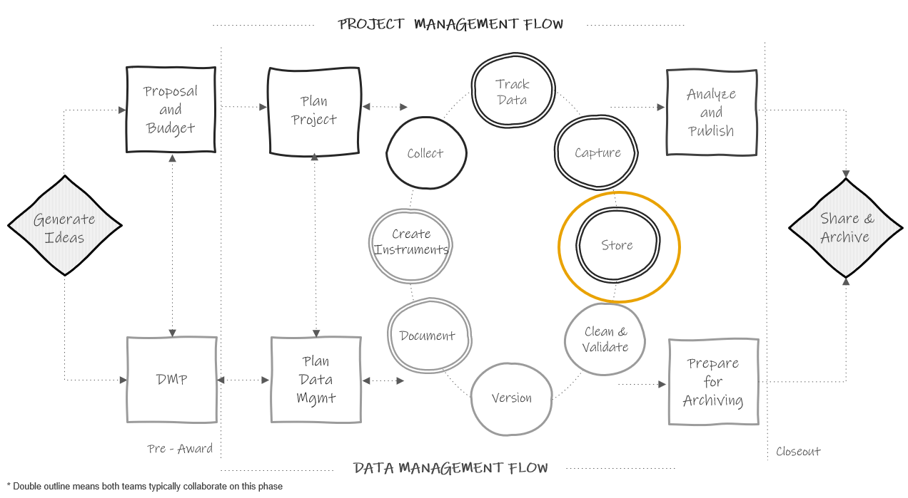

# Data Storage and Security {#store}

(\#fig:fig13-1)Data storage in the research project life cycle

As you begin to capture data, it is important to have a well-planned structure for securely storing and working with that data during an active study. Not only do you need a plan for storing data files, but you also need a plan for storing other project files (e.g., meeting notes, documentation, participant tracking databases). Your team should implement this structure early on so that files are stored consistently and securely for the entire project, not just once the data collection life cycle begins. There are several goals to keep in mind when setting up your file storage and security system for an active project.

1. File safety: Ensuring that your files are not lost, corrupted, or edited unexpectedly
2. Protecting confidentiality: Making sure that sensitive information is not seen or accessed by unauthorized individuals
3. Accessibility and usability of files: Making sure that your team can easily find files and that they are able to understand what the files contain

## Planning short-term data storage {#store-plan}

When planning a storage and security process, for data files in particular, it is important to gather all relevant information before making a plan. A typical process for developing a plan may begin like this:

1. Review what data needs to be stored and how often
    - Use documents such as your data sources catalog (see Section \@ref(dmp-catalog)) and your data collection timeline (see Section \@ref(document-supplement)) to better understand your data storage needs.

2. Take an inventory of what data storage solutions are available to you
    - In terms of electronic data, institutions have different licenses or partnerships with varying software companies and they may approve and not approve different tools (e.g. Dropbox, SharePoint, Box, Google Drive).

3. Consider compliance
    - Make note of any data storage laws, policies, or agreements that your data is subject too (e.g., IRB policies, data sharing agreements, funder policies).

4. Review classification levels
    - Review each data source's classification level (see \@ref(hsd-dcl)) to ensure that you are making decisions that are appropriate for the sensitivity level your data.

This process should help narrow down your data storage solutions for each data source. However, from there a series of decisions need to be made depending on the type of data you are working with, paper (e.g., a paper consent form) or electronic (e.g., a CSV file of questionnaire data, a Microsoft Access participant tracking database). The remainder of this section will review a series of decisions to make for each type of data, as well as provide some best practices along the way.

### Electronic data

Once you have reviewed all relevant information from Section \@ref(store-plan), several more decisions will need to be made when deciding on and setting up your structures for storing and securely working with electronic data.

1. Reviewing additional criteria
    - After narrowing down storage solutions based on available tools (e.g., cloud storage, institution network drive, personal device) that meet your compliance needs, electronic data storage locations can be further narrowed based on other criteria.
      - Versioning availability: While manually versioning is beneficial for major changes, it is very helpful to store your files in a location that has automated versioning as a fail-safe in case of accidents such as unintended overwriting of files.
      - Size of the storage space: You will need to make sure your storage contains enough space for your files.
        - Consider how many files you will be storing, as well as the size of your files (e.g., number of rows and columns in each dataset). Just to get a feel for what size your files might be, small datasets (e.g., 5 columns and <100 rows) may be less than 100 KB. Datasets with several hundred variables and several thousand cases may start to be in the 1,000--5,000 KB range. The type of file you use also changes the size of your data. Saving data in a format that contains embedded metadata, such as an SPSS file, will greatly increase your file size.
      - Comfort level of your team: It is helpful to choose a storage space that your team is comfortable working in or you have the ability to train them in how to use it
      - Accessibility: Consider the accessibility of your storage location for users (e.g., how staff access the location off-site), as well as the compatibility with different operating system
      - Collaboration: Consider how the storage method handles multi-user editing of files
      - File sharing: It can be very beneficial to use a storage platform that allows sharing files through links, rather than sharing the actual file. That way if updates are made to the file, those changes are shown in the link, rather than having to send an updated version of the file.
      - Costs: Consider if there are any costs associated with any of your potential storage solutions

2. Choose a final storage location
    - While you may be allowed to store files in different locations depending on their sensitivity level, a more effective solution is to create a collaborative research environment [@uk_data_service_research_2023]. To do this, designate the highest level of security needed (e.g., an institution network drive), and keep all, or as many as possible, project-related files stored in that same location, assigning access to files and folders as needed. Keeping all files located in a central, consistent location often provides the benefit of data security (e.g., automated backups, not having different versions of documents on different computers) as well as accessibility (i.e., team members can find documents).
  
3. Set up your folder structure according to your style guide
    - Following your style guide, create a folder structure before team members begin storing files so that they are stored consistently. 
      - If not already designated in your style guide, note that a best practice, and possibly a mandate from your institution, is to store your participant tracking database separately from your research study data (i.e., a separate folder with restricted access). Not only does the participant tracking database contain PII, but it is the one linking key between your study codes and your participant names and should not be stored alongside your datasets.
      - Similarly, any informed consent forms collected electronically should also not be stored alongside research study data. They should be stored in a separate, secure location.

4. Set up additional security systems
    - Data backups
      - It is important to regularly backup up your data. Consider using something similar to the 3-2-1 rule, keeping three copies of your data, on two different types of storage media, in more than one location [@briney_data_2015; @uk_data_service_research_2023]. Talk with your institution IT department for help with setting up this system.
    - User access
      - Assign user access to folders and files based on sensitivity levels, quality control needs, and applicable policies, agreements, or plans.

5. Designate rules for working securely with data
    - Complete required trainings (e.g., CITI trainings, IT training, internal training)
    - Consistently name folders and files
      - As you begin to save files in your project folder, you will also want to have team members consistently name and version files according to your style guide. 
    - Do not keep copies of files
      - Outside of making data backups, do not keep copies of files in different folders. This opens the door for edits being made to one copy and not the other. If this happens, different team members may be working with different versions of files. If you want to have a copy of a file in more than one location (e.g., an SOP in the `documentation folder` and the `project coordination folder`), some storage systems allow you to link to documents from other location (i.e., the project coordination folder contains a link to the SOP in the documentation folder).
    - Secure your devices [@otoole_data_2018; @princeton_university_best_2023]
      - Choose safe passwords to protect devices
      - Do not leave devices open and unattended when working in the field
      - Have protection on your devices (e.g., up to date antivirus software, firewall, encryption)
      - When working remotely, use password protected wifi and use secure connections (e.g., VPN, 2FA) when working with data files
      - Any files stored on detachable media (e.g., external hard drive, CDs, flash drives) should typically be stored behind two locked doors when not in use
    - Securely transmit data files
      - When transmitting data, either internally or externally, it is important that you use secure methods, especially when data contain PII. As a general rule, no moderate or highly sensitive data should be transmitted via email. Use a secure, institution approved, file transfer method that includes encryption.
      

### Paper data

Working with paper data involves reviewing another set of decisions while planning for data storage and security. 

1. Choose a final storage location
    - After reviewing available locations as well as applicable laws, policies, and agreements, you will want to consider additional criteria such as accessibility of the storage site, your physical storage size needs, storage costs, and the security of the location. Most commonly required for any files containing PII, is to store them behind two locked doors (e.g., a locked file cabinet in a locked storage room).

2. Consistently structure your file cabinets and folders
    - While you may not have a style guide created for organizing physical folders and files, it is still important to consistently structure and name them for clarity. As an example, organize drawers by data source (e.g., student survey), and further organize folders by time period.

3. Securely work with files
    - As discussed in Section \@ref(collect-field) and Section \@ref(capture-entry), as team members work with files, it is important that staff understand the rules and process for returning files back to the designated storage location when not in use (i.e., no files left on desks).

## Planning long-term storage {#store-long}

(\#fig:fig13-2)Long-term data storage in the research project life cycle

In addition to planning for short-term storage, during an active project, you will need to plan for long-term storage and use of files after a project is complete (see Figure \@ref(fig:fig13-2)). While your project may be ending, there are still many reasons to retain your data long-term including internal reuse, opportunities to make corrections (e.g., going back to paper files if an error is found in the data), and data retention requirements from funders and institutions. In this section we will discuss how to care for internal files, while public data sharing and archiving will be discussed in Chapter \@ref(share).

1. First, review your requirements for data retention and destruction
    - There may be varying requirements for both data retention and destruction depending on your oversight (e.g., institution requirements, funder requirements, data sharing agreement requirements). It is common for oversight to require that you retain your data anywhere from 3-5 years and there may be specific destruction requirements for data that contain PII. Make sure to review documentation from relevant policies to determine what is required.

2. Make a plan for retention and destruction
    - If you are required to retain your data for a specified number of years, consider how you will continue to store data, and documentation, in a way that meets your original goals (e.g., data safety, protecting confidentiality, accessibility and usability of files).
      - Paper
        - When it comes to paper data, many institutions have records management departments that can assist you with long-term storage of paper files. These departments typically store your physical files for a designated set of time, as well as assist in destruction of files once that period has ended. Note that you may not want to use this solution until you are certain you will no longer need to easily access your paper files (e.g., for fixing errors, entering any additional information). If destroying paper files on your own (e.g., sometimes it is required to destroy documents containing PII, such as contact lists or classroom rosters, as soon as they are no longer needed), make sure to choose a quality destruction method such as paper shredding.
    - Electronic
      - For electronic data long-term storage, you will want to consider two things, file formats and storage location [@borer_simple_2009; @briney_data_2015].
        - File formats 
          - First, choose file types that are widely used (i.e., don't require proprietary software) for both accessibility as well as preventing your file formats from becoming obsolete (see Figure \@ref(fig:fig13-3)). This means that you can still keep copies of your files in a format such as SPSS if you prefer, but it is good practice to have a second copy of your data in a non-proprietary format such as CSV. Your documentation file formats should also be considered. Formats such as PDF or TXT are often recommended for long-term storage of text documents while CSV is a good format for tabular data dictionaries.
        - Storage location
          - Similar to choosing file formats, choose a storage location that is accessible and not at risk of becoming corrupt or obsolete (e.g., think obsolescence of floppy disks). If your short-term storage solution meets these requirements (e.g., your institution network drive), you may not need to do anything different in preparing for long-term storage, but it will be important to continue implementing good practices to keep your data safe (e.g., continuing data backups). When it comes time to destroy data, make sure to permanently delete files, including all backups of files. When deleting PII, this often involves more than just moving files to the trash can on your computer. Work with your institution IT department during this process. 

(\#fig:fig13-3)Examples of non-proprietary file formats

3. Consider how you will share data internally
    - At the end of a project, or possibly earlier in the project, it is important to consider where you will store final datasets in your storage location (i.e., a specific folder), how you will notify team members of their availability, and how you will allow team members, and other research partners, to access data. An example of this process may look like this:
      - Storing all finalized datasets (i.e., cleaned and de-identified) in a "master dataset" folder (see Chapter \@ref(clean) for more information)    
      - Adding descriptions of the finalized datasets to a data inventory (see Section \@ref(document-inventory))  
      - Creating a data request process for team members, or external partners, to request access to finalized study datasets for various reporting and analysis purposes. Most likely you will not want researchers going in to "master data" folders and grabbing datasets without consulting with a core team member first. Therefore, it is important to develop a system for providing data to researchers on an as-needed basis. Some recommendations for setting up this system include:  
        - Design a system for requesting access (e.g., designate a person to email, develop a survey form that is submitted to a designated person)
          - In that system, the researcher should describe what data they are requesting (i.e., what variables, from what time periods), as well as the purpose of their analysis. It may be helpful to build a data request process that involves providing data dictionaries and other documentation to researchers to review before requesting data.
        - Decide who needs to review the request to ensure all requested information is available (e.g., a data manager), and who needs to give final approval for the data request submission (e.g., a PI)
        - Design a system for gathering data for requestors (e.g., will you provide researchers with full datasets or will you narrow datasets based on specific requests)
          - If narrowing datasets for researchers, where will new datasets be stored? (e.g., a "data request" folder) (see Figure \@ref(fig:fig13-4))
        - Consider how you will share datasets with researchers (e.g., a secure link to a cloud folder, using secure file transfer)
        - Consider how you will track data requests
          - It is important to keep track of data requests in case of situations such as errors found in the data. In those cases, you can reach back out to researchers to inform them that errors were found and new versions of the data are available.

(\#fig:fig13-4)Example set up for a data request folder

Last, if maintaining your electronic data long-term sounds like too much effort for your team, there are other options. Many universities have institutional repositories that often include services such as data curation and preservation. Additionally, there are several external repositories that offer curation and preservation services where you may be able to deposit your data for long-term storage. It's possible that depositing your data in one of these two options may also align with publicly sharing your data, which we will review in Chapter \@ref(share).
  
## Documenting and disseminating your plan

Once you make a plan for short and long-term data storage, that plan should be added to all required documentation (e.g., DMP, IRB research protocol, informed consent forms). Once your plan has been approved, it is important to not deviate from that plan unless your revisions have also been approved. This is especially important in the case of informed consents. Once participants have agreed to the consent terms, those terms should be honored.

Make sure to assign responsibilities to team members for both short and long-term storage tasks such as creating directory structures, adding and removing storage access, overseeing data backups, monitoring training compliance, and facilitating internal data requests. Without oversight of these processes, it is easy for errors to occur. 

Last, all information needs to be disseminated to team members in the form of documentation and training to ensure fidelity to your data storage and security plan. As discussed in Chapters \@ref(roles) and \@ref(document), while team members can review data management plans and research protocols, this information may be more clearly disseminated, with full details outlined, in documents such as team data security policies and team or project roles and responsibilities documents. In addition, make sure to embed this information into any team or project related staff training.

