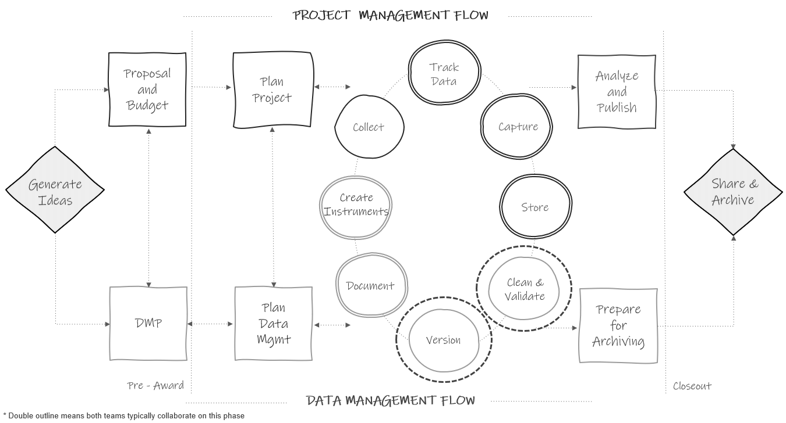

# Data Cleaning {#clean}

(\#fig:fig14-1)Data cleaning in the research project life cycle

Even with the most well-designed data collection and capture efforts, data still require at least some additional processing before it is in a format that you will confidently want to share for analysis (e.g., de-identify and derive variables). In other situations, such as when we are using an externally collected dataset, our data may require quite a bit of wrangling before it is ready to be shared. What is done in the data processing, or data cleaning phase, will largely depend on the planned transformations for your data, as well as the level of quality assurance and control processes implemented during collection and capture. In this chapter we will review some standard data cleaning steps that should be considered for every education research project. 

What is important to emphasize here is that data cleaning needs to happen every wave of data collection. Once a wave of data has been collected and captured and the raw data has been stored, your data cleaning process should begin. In a best case scenario, the data cleaning is wrapped up before your next wave of data collection. Cleaning data each wave, as opposed to waiting until the end of your project, has two large benefits.

1. Allows you to catch errors early on and fix them
    - While cleaning your data you may find that all data is missing unexpectedly for one of your variables, or that values are incorrectly coded, or that you forgot to restrict the input type. If you are cleaning data each wave, you are able to then correct any errors in your instrument in order to collect better data next round.
2. Data is ready when you need it
    - Proposal, report, and publication deadlines come up fast. As various needs arise, rather than having to first take time to clean your data, or waiting for someone on your team to clean it, data will always be cleaned and available for use because it is cleaned on a regularly occurring schedule. 

## Data cleaning for data sharing

Data cleaning is the process of organizing and transforming raw data into a dataset that can be easily accessed and analyzed. Data cleaning can essentially result in two different types of datasets; a dataset curated for general data sharing purposes, and a dataset cleaned for a specific analysis. The former means that the dataset is still in its true, raw form, but has been de-identified and minimally altered to allow the data to be correctly interpreted [@cook_how-guide_2021; @neild_sharing_2022; @van_dijk_open_2021]. A dataset cleaned for general data sharing means that it includes the entire study sample (no one is removed), all missing data is still labelled as missing (no imputation is done), and no analysis-specific variables have been calculated. Any further cleaning is taken care of in another phase of cleaning during analyses.

Ultimately, you can think of data in three distinct phases (see Figure \@ref(fig:fig14-2)).

1. Raw data
    - This is the untouched raw file that comes directly from your data collection source. If your data is collected electronically, this is the file you extract from your tool. If your data is collected on paper, this is the data that has been entered into a machine-readable format.
    - In education research this data is typically not shared outside of the research team as it usually contains identifiable information and often needs further wrangling to be decipherable by an end user.
2. The general clean study data
    - This is the dataset that you will publicly share and is the one we will be discussing in this chapter.
3. Your analytic data
    - This dataset is created from the general clean dataset (either by your team or by other researchers), but is further altered for a specific analysis [@reynolds_basics_2022]. This dataset will typically also be publicly shared in a repository at the time of publication to allow for replication of the associated analysis. Since this dataset is analysis specific, we will not discuss this type of data cleaning in this book. 

(\#fig:fig14-2)The three phases of data

## Data quality criteria {#clean-criteria}

Before cleaning our data, we need to have a shared understanding for what we expect our data to look like once it is cleaned. Adhering to common standards for data quality allows our data to be consistently cleaned and organized within and across projects. There are several data quality criteria that are commonly agreed upon [@decoster_systematic_2023; @elgabry_ultimate_2019; @schmidt_facilitating_2021; @van_bochove_data_2023]. Upon cleaning your data for general data sharing, your data should meet the following criteria.

1. Complete
    - The number of rows in your dataset should match the number of completed forms tracked in your participant tracking database. This means that all forms that you collected have been captured (either entered or retrieved). It also means that you have removed all extraneous data that doesn’t belong (e.g., duplicates, participants who aren’t in the final sample).
    - The number of columns in your data match the number of variables you have in your data dictionary (i.e., no variables were accidentally dropped). Similarly, there should be no unexpected missing data for variables (i.e., if the data was collected, it should exist in your dataset). 
2. Valid
    - Variables conform to the constraints that you have laid out in your data dictionary (e.g., variable types, allowable variable values and ranges, item-level missing values align with variable universe rules and defined skip patterns)
3. Accurate
    - Oftentimes there is no way to know whether a value is true or not. 
      - However, it is possible to use your implicit knowledge of a participant or a data source (i.e., ghost knowledge) [@boykis_ghosts_2021] to determine if values are inaccurate (e.g., a value exists for a school where you know data was not collected that wave). 
      - It is also possible to check for alignment of variable values within and across sources to determine accuracy
        - For example, in a student-level dataset, if grade level = 2, their teacher ID should be associated with a 2nd grade teacher. Or, a date of birth collected from a student survey should match date of birth collected from a school district. 
4. Consistent
    - Variable values are consistently measured, formatted, or coded within a column (e.g., all values of survey date are formatted as YYYY-MM-DD).
    - Across repeated collections of the same form, all variables are consistently measured, formatted, or coded as well (e.g., free/reduced priced lunch is consistently coded using the same code/label pair across all cohorts).
5. De-identified
    - If confidentiality is promised to participants, data needs to be de-identified. At the early phases of data cleaning, this simply means that all direct identifiers (see Chapter \@ref(hsd)) are removed from the data and replaced with study codes (i.e., participant unique identifier). Before publicly sharing data, additional work may be required to remove indirect identifiers as well and we will discuss this more in Chapter \@ref(share).
6. Interpretable
    - Variables are named to match your data dictionary and those variable names should be both human and machine-readable (see Section \@ref(style-varname)). Variable and value labels are added as embedded metadata as needed to aid in interpretation.
7. Analyzable
    - The dataset is in a rectangular (rows and columns), machine-readable format and adheres to basic data structure rules (see Section \@ref(structure-rules)).
    
## Data cleaning checklist {#clean-check}

Recall from Section \@ref(document-plan), that it is helpful to write a data cleaning plan, for each dataset in your data sources catalog (see Section \@ref(document-catalog)), before you begin cleaning your raw data. Writing this plan early on allows you to get feedback on your planned alterations, and it also provides structure to your cleaning process, preventing you from meandering and potentially forgetting important steps. This plan does not need to be overly detailed, but it should include actionable steps to walk through when cleaning your data (see Figure \@ref(fig:fig8-15)).

In many ways, writing this data cleaning plan will be a very personalized process. The steps needed to wrangle your raw data into a quality dataset will vary greatly depending on what is happening in your specific raw data file. However, in order to produce datasets that consistently meet the data quality standards discussed in Section \@ref(clean-criteria), it can be helpful to follow a standardized checklist of data cleaning steps (see Figure \@ref(fig:fig14-3)). These steps, although very general here, once elaborated on in your data cleaning plan, for your specific data source, can help you produce a dataset that meets our data quality standards. Following this checklist helps to ensure that data is cleaned in a consistent and standardized manner within and across projects.

(\#fig:fig14-3)Data cleaning checklist

As you write your data cleaning plan, you can add the checklist steps that are relevant to your data and remove the steps that are not relevant. The order of the steps are fluid and can be moved around as needed. There are two exceptions to this. First, accessing your raw data will always be number one of course, and the most important rule here is to never work directly in the raw data file [@borer_simple_2009; @broman_data_2018]. Either make a copy of the file or connect to your raw file in other ways where you are not directly editing the file. Your raw data file is your single source of truth (SSOT) for that data source. If you make errors in your data cleaning process, you should always be able to go back to your SSOT to start over again if you need to. Second, reviewing your raw data should always be step number two. Waiting to review your data until after you've started cleaning means that you may waste hours of time cleaning data only to learn later that participants are missing, your data is not organized as expected, or even that you are working with the wrong file. 

### Checklist steps {#clean-steps}

Let's review what each step specifically involves so that as you write your data cleaning plan, you are able to determine which steps are relevant to cleaning your specific data source.

1. Access your raw data
    - If you use code to clean your data, you will read your raw data file into a statistical program (e.g., R, Stata) and export a clean data file, ensuring the raw data file is never touched. If you manually clean your data, you should make a copy of the raw data file and rename it to your clean data file, ensuring you are not writing over your SSOT. 
    - Part of accessing your raw data may also involve putting it into an analyzable format (e.g., if your second row of data is variable labels, you will want to drop that second row in this process so that you are only left with variable names in the first row and values associated with each variable in all remaining cells).

2. Do a basic review of your raw data
    - Check the rows in your data
      - Do the number of cases in your data match the number of tracked forms in your participant tracking database? Are there any duplicates?
    - Check the columns in your data
      - Do the number of variables in your data dictionary match the number of variables in your dataset? Remember we are only looking for variables that are captured directly from our source (i.e., not derived variables).
      - Are the variable types and values as expected?

(\#fig:fig14-4)Reviewing rows and columns in a raw data file

3. Find missing data
    - Find missing cases
      - If cases are marked as complete in your tracking database but their data is missing, investigate the error. Was a form incorrectly tracked in your tracking database? Was a form not entered during the data capture phase?
        - If there is an error in your tracking database, fix the error at this time
        - Otherwise, search for missing forms, add them to your raw data, and start again at step number 1 of your data cleaning process.
    - Find missing variables
      - If you are missing any variables, investigate the error. Was a variable incorrectly added to your data dictionary? Or was a variable somehow dropped in the data capture process or in our data import or file copying process?
        - Fix the error in the appropriate location and then start again at step number 1
        
4. Adjust the sample
    - Remove duplicate cases
      - First, make sure your duplicates are true duplicates (not incorrectly assigned names or IDs). Any incorrect identifiers should be corrected at this time. 
      - If you have true duplicates (participants who completed a form more than once or their data was entered more than once), duplicates will need to be removed. Follow the decisions written in your documentation (e.g., research protocol, SOP) to ensure you are removing duplicates consistently. An example rule could be to always keep the first complete record of a form.
    - Remove any participants who are not part of your final sample (i.e., did not meet inclusion criteria)

> **Note**    
In the special case where you purposefully collect duplicate observations on a participant (i.e., for reliability purposes), you will only want to keep one row per participant in your final study dataset. Again, a decision rule will need to be added to documentation so duplicates are dealt with consistently (e.g., always keep the primary observer's record).

5. De-identify data
    - If confidentiality was promised to participants, you will need to make sure your data is de-identified. If your data does not already contain your assigned study IDs, replace all direct identifiers (e.g., names, emails) in your data with study IDs using a roster from your participant tracking database. At this point we are focusing on removing direct identifiers only, but in Chapter \@ref(share), we will also discuss dealing with indirect identifiers before publicly sharing your data.
    - Figure \@ref(fig:fig14-5) shows what a data de-identification process looks like [@otoole_data_2018]. Dataset 1 would be the incoming raw data with identifiers, Dataset 2 would be a roster exported from your participant database, and Dataset 3 is your de-identified dataset, created by joining Dataset 1 with Dataset 2 on your unique identifier/s (e.g., `first_name` and `last_name`) and dropping your identifying variables. I want to emphasize the importance of using a join in your program of choice, as opposed to replacing names with IDs by hand entering identifiers. If at all possible, we want to completely avoid hand entry of study IDs. Hand entry is error-prone and can lead to many mistakes.

(\#fig:fig14-5)Process of creating a de-identified dataset

> **Note**    
At this point in data cleaning, if your data contain open-text responses, you should be reviewing free text for identifiable information. Remove any instance of names and replace with a placeholder such as \<name\> to indicate the information was redacted.

6. Drop any irrelevant columns not included in your data dictionary
    - Here you can think of examples such as the metadata collected by a survey platform. These columns may be completely irrelevant to your study and cause clutter in your final dataset.
    
7. Split columns as needed
    - As discussed in Section \@ref(structure-rules), a variable should only collect one piece of information. Here you will split one variable into multiple variables so that only one thing is measured per variable. 

(\#fig:fig14-6)Splitting one column into multiple columns

8. Rename variables
    - Rename variables to correspond with the names provided in your data dictionary.
    
9. Normalize variables
    - Here, the term normalize is used to summarize the process of returning a variable to its normal state
    - Compare the variable types in your raw data to the variable types you expected in your data dictionary. Do they align? If no, why? 
      - As an example, it may be that you need to remove unexpected characters such as `$` or `%` that are preventing your variables from being a numeric type. Or it could be accidentally inserted white space or letters in your variable.

(\#fig:fig14-7)Normalizing a variable

10. Standardize variables
    - Here, the term standardize is used to convey the process of checking for consistency
    - Are columns consistently measured, coded, and formatted according to your data dictionary? If no, they need to be standardized.
      - This may involve rescaling variables (e.g., age measured in months in wave 1 and age measured in years in wave 2 would need to be rescaled)
      - This may mean updating a variable format (e.g., converting to a consistent date format)
      - Or it may mean collapsing categories of free text categorical variables (e.g., 'm' | 'M' | 'male' = 'male')

> **Note**    
In the case of Figure \@ref(fig:fig14-7), this kind of standardization needs to happen before you can perform steps such as joining on names for de-identification purposes. Linking keys need to be standardized across files before linking can occur.

(\#fig:fig14-8)Standardizing a variable

11. Update variable types
    - After normalizing and standardizing variables, you can now convert any variable types that do not match the types you've listed in your data dictionary (e.g., convert a string to numeric)

> **Note**   
It's important to normalize before updating your variable types. Updating your variable types before normalizing could result in lost data (i.e., converting a character column to numeric, when the column still contains cells with character values, will often recode those cells to missing).
    
12. Recode variables
    - If your categorical value codes (see Chapter \@ref(style-codes)) do not match your data dictionary, now is the time to recode those (e.g., you expected "no" = 1, but the data exported as "no" = 14)
    - As discussed in Chapter \@ref(structure-rules), this also includes recoding implicit values, explicitly (e.g., if a missing value is implied to be 0, recode them to 0)
    - You can also recode any variables as planned in your data dictionary (e.g., a reverse coded item)

(\#fig:fig14-9)Reverse coding a variable

13. Construct additional variables
    - This is not the time to construct analysis-specific variables. This is the time to create or calculate variables that should always be a part of the core study dataset. These variables should be chosen by your data management working group early on and added to your data dictionary. Examples of variables you might add:
    - time components (e.g., `wave`)
    - grouping variables (e.g., `treatment`)
    - foreign keys (e.g., `sch_id` in a teacher file)
    - measure composite or summary scores
    - completion variables or data quality flags
    - variables created for composite/summary scoring purposes (e.g., `age`)
    - variables that you want added to the core sharing dataset (e.g., categorizing an open-ended text response variable)

> **Note**   
Some of these variables may exist in other sources (e.g., `treatment` may exist in your participant tracking database). If so, these variables won't need to be created or calculated, they can simply be merged into your clean dataset using a technique similar to the one described in data de-identification step. You can export a file from your participant tracking database that contains unique identifier/s as well as the variables you need, and join on similar unique identifiers across files (e.g., `tch_id`), bringing in the necessary variables from an outside source.

14. Add missing values
    - Assign missing value codes based on your designated schema (as documented in your data dictionary and style guide). 

15. Add metadata [@uk_data_service_research_2023]
    - While interoperable file types (e.g., CSV) are highly recommended for storing data, it can be extremely helpful to create another copy of your clean data in a format, such as SPSS, that allows for embedded metadata. These file types allow you to embed variable and value code labels that can be very handy for a data user. This can be especially helpful if you plan to export your variables with numeric values (1 | 0), rather than text values ("yes" | "no"). In this case, rather than having to flip back and forth between a file and a data dictionary to interpret codes, users can review information about the variables within the file itself. While future data users may not have a license for the proprietary file type, these file formats can often be opened in free/open source software (e.g., GNU PSPP) or can usually be easily imported into a variety of other statistical programs which can interpret the metadata (e.g., importing SPSS files into R or Stata).

16. Data validation
    - It is good practice to assume that some amount of error is inevitable, even with the best data management practices in place. Errors in the data can happen for many reasons, some of which come from mistakes during the data collection and capture process, others come from the data cleaning process (e.g., coding errors, calculation errors, joining errors). Yet, errors won't be found if you don't actively look for them [@palmer_advice_2023]. At minimum you should always validate, or check, your data for errors at the end of your data cleaning process. Ideally though, you should be checking every one of your transformations along the way as well.
    - Data validation should begin with the manual method of opening your clean data and eyeballing it. Believe it or not, this can actually be a very useful error-catching technique. However, it should not be your only technique. You should also create tables, calculate summary and reliability statistics, and create univariate and bivariate plots to search for errors. Codebooks are great documents for summarizing and reviewing a lot of this information [@arslan_how_2019]. 
    - You can organize your data validation process by our data quality criteria. The following is a sampling of checks you should complete during your validation process [@cessda_training_team_cessda_2017; @icpsr_guide_2020;@strand_error_2021; @reynolds_basics_2022; @uk_data_service_research_2023]:
      - Complete
        - Check again for missing cases/duplicate cases 
          - It can also be helpful to check Ns by cluster variables for completeness (e.g., number of students per teacher, number of teachers per school) [@decoster_systematic_2023] 
        - Check for missing columns/too many columns
      - Valid and Consistent
        - Check variables for unallowed categories or values out of range
          - Checking by groups can also help illuminate issues (e.g., compare age and grade level) [@riederer_make_2021]
        - Check for invalid, non-unique, or missing study IDs
        - Check for incorrect variable types
        - Check for incorrect formatting
        - Check missing values (i.e., do they align with variable universe rules and skip patterns)
      - Accurate
        - Cross check for agreement across variables (e.g., a student in 2nd grade should be associated with a 2nd grade teacher)
        - Checks for other project-specific unique situations
      - De-identified
        - Are all direct identifiers removed?
      - Interpretable
        - Are all variables correctly named?
        - Is metadata applied to all variables? Is the metadata accurate (e.g., value labels correct, variable labels correct)?
    - If during your validation process you find errors, you first want to determine where the errors originated (i.e., data entry, data export, data cleaning), and correct them in the appropriate location. If errors occurred in the data entry or data export/saving process, this may involve creating a new raw data file and starting the cleaning process again at step 1. 
      - If, however, you find true values that are inaccurate, uninterpretable, or outside of a valid range (i.e., they represent what the participant actually reported), you will need to make a personal decision on how to deal with those. Some examples of how you might deal with true errors include:
        - Leave the data as is, make a note of the errors in documentation, and allow future researchers to deal with those values during the analysis process.
        - Assign a value code (e.g., "inaccurate value" = -90) to recode those values to
        - Create data quality indicator variables to denote which cells have untrustworthy values (e.g., `age` contains the true values and `age_q` contains "no concerns" = 0 | "quality concerns" = 1).
        - If you find inconsistencies across different sources, you could choose one form as your source of truth and recode values based on that form
        - If there are true errors where the correct answer can be easily inferred (e.g., a 3-item rank order question is completed as 1, 2, 4), sometimes logical or deductive editing can be used in those cases and the value is replaced with the logical correction [@ipums_usa_introduction_2023; @seastrom_nces_2002]. 
      - No matter what your decision is, make sure it is documented in the appropriate places for future users (e.g., data dictionary, data cleaning plan, research protocol)

At this point, your dataset should be clean. However, there may be additional transformations to be performed depending on how you plan to store and/or share your datasets.

17. Join data
    - Recall from Section \@ref(structure-link), that there are two ways you may need to join your forms, horizontally or vertically.
      - Joining forms horizontally (merging)
        - This is commonly used to link longitudinal data within participants in wide format. In this case it will be necessary to append a time component to your time varying variable names if they are not already included (e.g., "w1_", "w2_")
        - This type of merging can also be used to link forms within time (e.g., student survey and student assessment) or link forms across participant types (e.g., link student data with teacher data)
      - Joining forms vertically (appending)
        - Appending may be used to combine longitudinal data within participants in long format. Here it will be necessary to include a new variable that indicates the time period associated with each row.
        - However, appending is also often used for combining forms collected from different links or captured in separate tables (e.g., data collected across sites or cohorts) 
    - Depending on how your data is collected or captured, as well as how you want to structure your data, you may use a combination of both merging and appending to create your desired dataset.
    - Once your merging or appending is complete, it will be very important to do additional validation checks. Do you have the correct number of rows and columns after merging or appending?

> **Note**   
As noted in Section \@ref(style-time), in many cases it's actually best to not join data until the time is necessary (e.g., analysis or data sharing). In Section \@ref(share-combine) I discuss reasons you may want to join data for the purposes of data sharing. The exception to this is combining data from multiple sites or cohorts, collected from the same form. In this case, it can be helpful to append data to store from the same form and wave in one dataset. Doing this kind of join early on helps to ensure that your data is consistently formatted across sites/cohorts.

18. Reshape data
    - Recall Section \@ref(structure-datastructure) where we reviewed various reasons for structuring your data in wide or long format. 
      - In wide format, all data collected on a unique subject will be in one row. Here, unique identifiers should not repeat.
      - In long format, participant identifiers can repeat, and unique rows are identified through a combination of variables (e.g., `stu_id` and `wave` together).
    - If at some point after merging or appending your data, you find you need to reshape data into a new format, this restructuring process will need to be added to your data cleaning process. 

> **Note**   
If working with longitudinal data, having your time component concatenated to the beginning or end of a variable name (as it is in Figure \@ref(fig:fig14-10)), rather than embedded into your variable name, makes this back and forth restructuring process much easier to do in statistical programs.

(\#fig:fig14-10)A comparison of long and wide format

19. Save your clean data
    - The final step of your cleaning process will be to export or save your clean data. You can save your files in one or more file types depending on your needs. It can be helpful to save your data in more than one format to meet various analysis, long-term storage, or data sharing needs (e.g., an interoperable format like CSV, and a format that contains embedded metadata such as SPSS). 

## Data cleaning workflow

Data cleaning is not a standalone process. It should be part of a larger, well-planned workflow that is designed to produce standardized, reproducible, and reliable datasets. Ignoring this planning and jumping into data cleaning in a haphazard way only leads to more work after the cleaning process, having to organize our messy work so that others can understand what we did. Assign someone to oversee this workflow and designate a time frame for when data cleaning should both begin and be finalized each wave.

### Preliminary steps

The first part in creating a data cleaning workflow is making sure that your folder structure is set up according to your style guide, and that your folders and files are consistently named according to your style guide. It is also important that the metadata in your names is always provided in the same order (e.g., `project` -> `time` -> `participant` -> `instrument` -> `type`). Breaking away from a standardized naming convention begins to erode the reproducibility of your work. 

Next, you will want to gather all of the necessary documentation that will be used throughout your cleaning process.

1. Data dictionary
    - In this document, variables should be named and coded according to your style guide and all variables and transformations approved by the data management working group.
2. Data cleaning plan
    - This should include a series of steps based off of our standardized data cleaning checklist, and all transformations have been reviewed by the data management working group.
3. README file
    - This includes any README files, stored alongside raw data files, that contain notes that may be relevant to your data cleaning process (e.g., a project coordinator notes that “ID 1234 should actually be ID 1235”). You will want to integrate this information into your data cleaning plan as needed.
4. Participant tracking database
    - Make sure that this database is up to date so that you can compare form completion status numbers to the Ns in your dataset.

Once you gather your documentation, you are ready to begin the data cleaning process.

### Cleaning data using code

While you can clean data through a point and click method in a program like SPSS or Microsoft Excel, cleaning data manually is typically not reproducible, leads to errors, and is time consuming. The number one practice that you can implement to improve the reproducibility, reliability, and efficiency of your work is to clean data using code [@borer_simple_2009]. The code can be written in any program your team chooses (e.g., R, SAS, Stata) and saved in a syntax, or script file, that can then be re-run again at any point. While writing code may seem time consuming up front, it has numerous benefits.  

  - It helps you to be more thoughtful in your data cleaning process  
  - It allows others to review your work and catch potential errors  
  - It can actually save you an enormous amount of time in the future if you plan to clean data for the same form multiple times (in say a longitudinal study)  
  - It allows others to reproduce your work. By simply re-running your code file, they should be able to get the same resulting dataset that you created.   

However, writing code alone will not provide all of the desired benefits. There is more that must be considered.

1. Choose an appropriate tool to code in. Assess things such as:
    - Your comfort level with the program as well as available support
    - Cost and access to the program
    - Interoperability of the program (i.e., will others be able to open, review, and run your code)
    - Limitations (e.g., file size limitations, variable character count limitations)
    - Default settings (e.g., how the program performs rounding, how dates are stored)
1. Follow a coding style guide
    - As discussed in Section \@ref(style-code), coding best practices such as using relative file paths,  including comments, and recording session information, allow your processes to be more reproducible and reduces errors. Adding best practices to a code style guide ensures that all team members are setting up their files in a consistent manner, further improving the usability of code.
1. Review your data upon import
    - As we discussed in Section \@ref(clean-steps), it is imperative that you review your data before beginning to clean it to ensure you have a thorough understanding of what is happening in your file. This review process can become even more relevant if you are reusing a syntax file to clean data collected multiple times (e.g., in a longitudinal study). You may expect your syntax to run flawlessly each time period, yet if anything changes in the data collection or entry process (e.g., a variable name changed, a new item is added, a new variable category is added), your data cleaning syntax will no longer work as intended. It’s best to find this out before you start the cleaning process so you can adjust your data cleaning plan and your code as needed. 
1. Do all transformations in code
    - Cleaning data using code only improves reproducibility if you do all transformations, no matter how small, in the code. No transformations should be done to your data outside of code, even if you think it is something insignificant. Once you work outside of your code, your chain of processing is lost and your work is no longer reproducible. Code files should contain every transformation you make from the raw data to your clean data.
1. Don’t do anything random 
    - Everything in your syntax must be replicable. Yet, there are a few scenarios where, without even realizing it, you could be producing different results each time you run your code.
      - If you randomly generate any numbers in your data (e.g., study IDs), use an algorithmic pseudorandom number generator (PRNG) [@klein_practical_2018]. This can be easily done in most statistical programs by setting a seed. Every time the PRNG is run with the same seed, it will produce the same results (i.e., the same set of random numbers). Without this, you will get a new random set of numbers each time your syntax is run.
      - Another example is when you are removing duplicate cases. Be purposeful about how you remove those duplicates. Do not assume your raw data will always come in the same order. Set parameters in your syntax before dropping cases (e.g., order by date then drop the second occurrence of a case). Otherwise, if at some point, someone unexpectedly shuffles your raw data around and you re-run your syntax, you may end up dropping different duplicate cases.
1. Check each transformation
    - As mentioned in Section \@ref(clean-steps), check your work along the way, don’t wait until the end of your script. For each transformation in your data:
      - Review your variables/cases before and after the transformations.
      - Review all errors and warning codes
        - Some warnings may be innocuous (just messages)
        - Some errors are telling you that your code did not run, you need to fix something
        - Other warnings are telling you that your code did run but it did not run as you expected it to. If you don’t pay attention to these warnings, you may end up with unexpected results. 
1. Validate your data before exporting and review after exporting
    - As we discussed in Section \@ref(clean-steps), before exporting data you will want to run through your final list of sanity checks, based on our data quality criteria, to make sure no mistakes are missed.
      - While eyeballing summary information is helpful, consider writing tests based on your expectations, that produce a result of TRUE or FALSE (e.g., test that `stu_id` falls within the range of 1000--2000).
    - After exporting your data, open the exported file. Does everything look as you expected (e.g., maybe you expected missing data to export as blanks but they exported as "NA")?
1. Do code review
    - If you have more than one person on your team who understands code, code review is a great practice to integrate into your workflow. This is the process of having someone, other than yourself, review your code for things such as readability, usability, and efficiency. Through code review it’s possible to create more interpretable code as well as catch errors you were not aware of. Code review checklists can be implemented to standardize this process.

**Resources**

|Source|Resource|
|--------|-----------|
|Travis Gerke | R Code Review Checklist ^[https://github.com/tgerke/r-code-review-checklist]|

### Cleaning data manually

While cleaning data with code is the preferred method for the reasons previously mentioned, it does require technical expertise that not every team may have. If your team needs to clean data manually, consider two important things.

1. Choose a tool based on the same criteria used when choosing a coding tool (i.e., comfort level, cost and access, interoperability, and default settings). Be aware of the potential formatting issues mentioned in Chapter \@ref(capture) when cleaning with tools like Microsoft Excel.

2. Once you begin cleaning your data manually, it is imperative that you document every transformation to enable reproducibility. This may look different depending on the tool you use. 
    - If cleaning data using the point and click menu in a program such as SPSS, when performing a transformation use a "paste" type button to copy all associated commands into a syntax file that can easily be reused [@kathawalla_easing_2021].
    - If using a program such as Microsoft Excel for data cleaning, add notes into your data cleaning plan that are detailed enough to allow anyone to replicate your exact data cleaning process by hand [@the_carpentries_data_2023].

### Data versioning practices

The last part of the workflow to consider is where you will store your data and how you will version it. As we've discussed previously, as you export or save your clean datasets, make sure to name them appropriately to differentiate between raw and clean datasets. During an active project, it is typically best to keep finalized clean datasets in their respective individual folders (e.g., `stu` -> `wave 1` -> `svy` folder), rather than moving all clean files to a separate "master folder". It is best to wait to move files to a master folder until the end of a project (see Section \@ref(store-long-use)). If changes need to be made to files, it is easier to keep track of files in their original locations. However, what is most important here is to not copy files across folders; keep one single master dataset per data source for authenticity purposes [@cessda_training_team_cessda_2017; @uk_data_service_research_2023]. Also, make sure to limit access as needed based on requirements covered in Chapter \@ref(store).

Once your final datasets are saved, it is common that at some point you will find an error in your data and/or your code. Yet, once you’ve shared your data and code with others, it will be imperative that you do not save over existing versions of those files. You will need to version both your code and your data, following the guidelines laid out in your style guide. Versioning your final files, and keeping track of those different versions in a changelog (see Section \@ref(document-change)), allows you to track data lineage, helping users understand where the data originated as well as all transformations made to the data. While you can version any files that you choose, I am specifically referring to final files here, not in-progress, working files that have not yet been shared with others.

Last, along with assigning someone to oversee data cleaning, it will be important to assign someone to oversee this versioning process. Versioning files and updating documentation takes time and consideration, and that responsibility will need to be explicitly laid out in order to ensure it isn't forgotten. 
