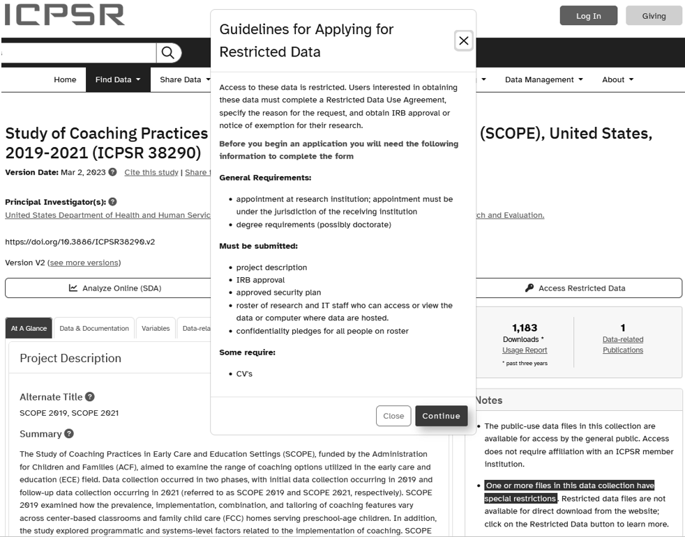

# Data Sharing {#share}

<div class="figure" style="text-align: center">

<p class="caption">(\#fig:fig15-1)Data sharing in the research project life cycle</p>
</div>

Throughout a project, teams are internally sharing data and materials with a variety of people (e.g., team members, collaborators, funders) who use that information for a variety of purposes (e.g., analyses, reports, to answer questions). Yet, at the end of a project, or possibly earlier, it's important for researchers to also consider making their research data available for broader public use. However, publicly sharing project data and materials requires a lot of consideration. In this chapter we will first review reasons for why you should publicly share your data, and then we will work through a series of decisions to make before sharing your data.

## Why share your data? {#share-why}

The most notable reason for openly sharing data is that there are a growing number of supporting organizations (e.g., funders, journals, institutions) that are requiring researchers to share data. Federal agencies in particular want to ensure that there is free, open access to taxpayer-funded funded research [@nelson_ostp_2022]. Beyond requirements though, there are many other reasons researchers should want to share their data [@alston_beginners_2021; @cook_how-guide_2021; @gonzales_ten_2022; @icpsr_guide_2020; @institute_of_education_sciences_policy_2023; @klein_practical_2018; @levenstein_data_2018; @logan_data_2021; @meyer_practical_2018]. One, it benefits the scientific community by improving rigor. Sharing both data and code helps to discourage fabrication and encourages validation of results through both replication and reproducibility of findings. Allowing other researchers to reuse your data also reduces the need to duplicate data collection efforts, saving time, energy, and money, as well as reducing the burden on the communities that are frequently targeted for data collection [@gaddy_principles_2020]. It also encourages diversity of analysis and opinions. Not only may researchers have novel questions not considered by the original investigators, open data also provides the opportunity for researchers to improve upon or experiment with new methods, as well as combine datasets to facilitate new discoveries. Openly sharing data also provides equitable access to high-quality datasets for early career scholars, students, and underrepresented researchers who otherwise may not have the budget, staff, or connections to collect data. Last, data sharing can have the unintended benefit of promoting more efficient and sustainable data management practices. Knowing that data and documentation will eventually be shared outside of the team may motivate researchers to think hard about how to organize their data management practices in a way that will produce materials that they are proud to share with the outside world.

## Data sharing flow chart

There is a series of decisions to be made when sharing your data (see Figure \@ref(fig:fig15-2)). While in some cases data sharing may not occur until the end of your project, many of your data sharing decisions will actually need to be made at the beginning of your project, when you write your DMP (see Chapter \@ref(dmp)). These decisions will inform both your workflow during your active project, as well as the steps you need to perform when preparing your data for archiving. Planning your data management practices around your data sharing plan early on, can also help reduce any significant burden that may otherwise be caused by data sharing [@klein_practical_2018; @levenstein_data_2018].

<div class="figure" style="text-align: center">

<p class="caption">(\#fig:fig15-2)Decisions to be made before publicly sharing study data</p>
</div>

In this section we will walk through the flow chart, discussing what information is needed to make decisions as well as best practices associated with each decision. 

### Are you able to share? {#share-able}

When it comes to data, there are three degrees of sharing [@ghent_university_sharing_2023].

1. Open data
    - This is data that can be publicly shared with no constraints. These are typically data with no ownership concerns and that have minimal disclosure risk (e.g., de-identified, not highly sensitive)
2. Controlled data
    - These are data that are not openly shared, but can be shared in other ways under restricted access and use conditions. This typically involves a data request system including an application and/or data use agreements, and only after a request is approved can data be accessed. This includes things such as data with more than minimal disclosure risk (e.g., highly sensitive information, identifiable information).
3. Closed data
    - These are data that cannot be shared due to legal, ethical, or technical reasons (e.g., proprietary data, data use agreements forbid it, participant consent does not allow data sharing)
    - In these cases, it may still be possible to share some data (i.e., summary statistics, metadata, documentation), to allow the information to be discoverable, reusable, and citable [@logan_data_2021; @neild_sharing_2022]

When preparing to make data sharing decisions, it is helpful to pull out your data sources catalog (see Section \@ref(dmp-catalog)). Walk through each source one by one and consider the reasons that may prevent you from sharing data or require you to share data with restricted access [@klein_practical_2018; @national_institutes_of_health_final_2023; @neild_sharing_2022]. It's important to review each source individually, rather than viewing data holistically, because your data can be differentially shared. Some data may be openly shared while other data is not. Ask yourself questions such as:

- Who is the owner of this data? Do I have permission to share this data? 
    - This may involve reviewing data sharing agreements, licenses, or other documents.
- Do I need consent to share this data? If yes, does my consent form include data sharing language (see Section \@ref(collect-irb))?
- Will I be able to de-identify data to the point where there is minimal disclosure risk?
- Are there other compelling legal, ethical, or technical reasons to not share your study data?

It is important to make decisions based on the philosophy of "as open as possible, as closed as necessary" [@european_commission_directorate-general_for_research__innovation_h2020_2016, p.4]. We want data to be open to facilitate reuse and garner all of the benefits mentioned in Section \@ref(share-why), but data should be closed when necessary to protect the privacy of individuals or to honor other prior agreements. However, many of the reasons for not being able to share your data at all can be mitigated by early planning. Developing consents to clearly explain data sharing plans, and talking with partners early on about plans to share data can help increase the amount of data you can openly share [@klein_practical_2018; @neild_sharing_2022].

### Where to share?

Once you've decided that you are able to share data, either publicly or in another more restrictive manner, you then need to decide where you want to share data. There are many options for sharing your data, with some options being better than others. In most situations, the best option for sharing data will be a public data repository. This may be a repository chosen by you, or it may be a repository designated by a funder or other organization supporting your work. In most cases this is the ideal data sharing location. There are many benefits to sharing in a public repository [@neild_sharing_2022; @uk_data_service_research_2023].

- It meets the FAIR principles of making your data both findable and accessible (Section \@ref(rdm-fair))
- It is the preferred method of data sharing for many supporters (e.g., NIH, IES) and it may be required by others (e.g., NIJ, NIMH, journals such as AMPPS)
- It provides a hands-off approach to data sharing, reducing the burden of maintaining your data and responding to data requests long-term
- It provides a means to securely share restricted-access data if necessary. 
    - Even if you are not able to directly deposit the restricted-use data in a repository (e.g., the repository does not accept restricted-use data, an agency partner requires data to be stored at their site), repositories still support the creation of metadata-only records, which facilitate discovery of your data while still allowing sensitive data to be maintained and shared through the owners own data request system [@gonzales_ten_2022; @logan_data_2021]. 
- Repositories provide support for data sharing, either through direct data curation services or by offering detailed guidelines on what to share.

However, due to supporter requirements (e.g., agency partner, institution, funder, journal), or other legal, technical, or ethical reasons, there may be a reason to share some or all of your data in other ways. The following are alternative ways to share your data [@alston_beginners_2021; @briney_data_2015; @klein_practical_2018; @neild_sharing_2022; @uk_data_service_research_2023].

1. Deposit your data with an institutional archive
    - While this method provides the benefits of reducing the burden on your staff and securely storing your data, this option is not available at all academic institutions and these repositories may provide less service offerings than a public repository. Furthermore, data stored in an institutional archive, as opposed to a public repository, may be less discoverable for researchers outside of your institution.
2. Deposit with a partner agency
    - In some cases, data sharing may only be allowed if you deposit the data with an agency that you partnered with for the study (e.g., a school district). In this case, all data requests will go through that partner.
3. Share through a lab, personal, or project website
    - While this system provides some accessibility, it is not sustainable. This method requires a significant commitment from your team. Sharing in this way requires to you publicize your site to increase visibility, as well as commit the resources to building and maintaining a secure and reliable data request pipeline. Furthermore, websites change and links break, reducing the long-term accessibility of your data. 
4. Informal peer-to-peer sharing
    - Here you might use a data request process similar to the internal one discussed in Section \@ref(store-long-use). Yet, while informal methods such as email may work fine for peers, it doesn’t make a broader audience aware of the availability of your data and keeps the burden of data maintenance and responding to requests on you and your staff. 
5. Supplemental materials attached to an article or stored on a publisher’s website
    - Here a concern is that materials will be lost if a journal changes publishers or a publisher changes its website.
6. A “data available upon request” statement in a publication
    - This is the least recommended option. There are several studies that have found that these data availability statements rarely result in access to data [@stodden_empirical_2018; @vines_availability_2014]. A better alternative is to already have data shared in a location and direct people to that system (e.g., link to a repository).

Figure \@ref(fig:fig15-3), modified from a flow chart created by @borghi_promoting_2022, can help you work through the process of choosing where to share each data source. Ultimately though, no matter where you choose to share your data, it is important to make this decision early on because this decision will impact many of the other decisions that need to be made. In particular, if you choose to deposit data in a repository, you will want to review repository specific requirements and standards to make sure they are accounted for in your DMP (e.g., data format requirements, metadata schemas used) and in your data management processes throughout the study. Making this decision early on also allows you to begin creating a schedule for ongoing data deposits throughout your study if that is something you want to consider doing, or if it is required by your funder [@icpsr_guide_2020].

<div class="figure" style="text-align: center">

<p class="caption">(\#fig:fig15-3)A series of decisions to make when deciding where to share data</p>
</div>

#### Choosing a repository

At this point, you may be ready to choose a repository to share your data in. There is an abundance of available data repositories to choose from but the Registry of Research Data Repositories ([re3data.org](re3data.org)) has indexed repositories, allowing researchers to search the vast landscape of options. Several agencies have also shared criteria to help you narrow down your choices. Both the @national_institutes_of_health_selecting_2023 and the @national_science_and_technology_council_desirable_2022 have released desirable characteristics for data repositories, and the Institute of Education Sciences has also provided their own set of dimensions to review when considering an appropriate repository [@neild_sharing_2022]. While each of these agency lists should be reviewed, the following questions are a starting point for choosing a repository that fits the needs of your project [@briney_data_2015; @gonzales_ten_2022; @goodman_ten_2014; @klein_practical_2018].

1. Is a specific repository required by your supporter (e.g., funder, journal, institution)?
    - If yes, you don't need to proceed any further, this is the repository you should share your data in. Although, you are welcome to share your data in more than one repository if the required repository is one that you feel will not meet your specific needs (e.g., reach a broad audience).
    - If a specific repository is not required, also check to see if your supporter has a preferred list of repositories. If they do, it may be best to narrow your search to the recommended options.

2. Is a domain-specific repository available (i.e., caters to your field or specific data type) or are there generalist repositories that are commonly accepted in your field?
    - Domain-specific repositories may be of more interest to researchers in your field and may be the best option to help facilitate discovery of your datasets. Using a domain-specific repository can also help ensure that you are preserving data according to recognized standards in your field. At minimum though, using generalist repositories that are common in your field improves discoverability.
    - A few domain-specific repositories in the field of education research include ICPSR ([https://www.icpsr.umich.edu](https://www.icpsr.umich.edu)) and LDbase ([https://www.ldbase.org/](https://www.ldbase.org/)).
    - NIH has also established the Generalist Repository Ecosystem Initiative (GREI), which consists of established generalist repositories that support FAIR principles and are collaborating to develop a standard set of services and structures. Generalist repositories in this ecosystem that are commonly used in education research include OSF ([https://osf.io](https://osf.io)), Zenodo ([https://zenodo.org/](https://zenodo.org/)), and Figshare ([https://figshare.com/](https://figshare.com/)).
  
3. Does the repository allow varying access levels?
    - Can de-identified data can be easily accessed by a wide audience?
      - What are the access options (e.g., download)?
      - Are users required to have an account to access data?
    - Are restricted-use files accepted?
      - Is there a transparent process for reviewing data access requests?
      - How are users able to access restricted-use data files (e.g., secure download, virtual data enclave, physical data enclave)?

4. Is there a cost associated with using the repository?
    - Consider both costs to store your data and costs for users to access your data. There may also be costs associated with additional services such as data curation.

5. What are the allowable file formats and sizes?
    - Check size limits for both data files and the entire project. Also check which file formats are allowed. Certain repositories may have file format preferences for both data files and documentation files.
    - You'll also want to make sure that the repository provides files back to users in commonly accepted formats, including at least one non-proprietary format.

6. Does the repository have long-term sustainability?
    - Make sure to review the repository's data retention policies to ensure it meets your requirements
    - You'll also want to ensure that the repository has a plan for long-term management of data (considering both funding and infrastructure).
  
7. Does the repository have linking capabilities?
    - Does the repository allow you to link to projects, publications, code, or data stored on external sites?

8. Are clear use guidelines provided?
    - Is there clear guidance on how data can be used?
    - Are you able to set different reuse conditions for different datasets?
    - Does the repository allow you to add usage licenses? 
      - Licenses set clear terms of use for data. Commonly used license groups include Creative Commons licenses ([https://creativecommons.org/](https://creativecommons.org/)) and Open Data Commons licenses ([https://opendatacommons.org/](https://opendatacommons.org/)). The most commonly used licenses are CC BY and ODC-By which allow others to freely reuse materials as long as they cite the original creator.
  
9. Is metadata collected upon deposit?
    - Does the repository collect comprehensive metadata and does it use schemas that are appropriate for your field?
  
10. Does the repository assign unique persistent identifiers?
    - Unique persistent identifiers (PIDs), such as digital object identifiers (DOIs), provide an enduring reference to a digital object, even if the object's URL changes. Repositories that assign PIDs support discoverability as well as allow researchers to track the use and contributions of their datasets. 

11. Does the repository track data provenance?
    - It is important to have the ability to freely update and remove data as needed. 
    - When data is amended, does the repository record data provenance by versioning materials and assigning updated PIDs? 

12. Are curation and quality assurance services available?
    - Does the repository provide curation services to ensure that data is de-identified, high quality, in interoperable formats, and shared with appropriate metadata?

13. Does the repository measure reuse?
    - This includes things like tracking number of downloads and tracking citations.

14. Does the repository have appropriate security measures in place?
    - This includes measures for both the security of the data itself (e.g., maintaining backups), as well as measures to ensure participant privacy (e.g., ensuring only authorized users are able to access restricted data)
    
### What data to share

The requirements for what data should be shared will most likely vary depending on your supporting agency. As an example, NIH asks researchers to share their final research data which includes any "recorded factual material commonly accepted in the scientific community as necessary to validate research findings, regardless of whether the data are used to support scholarly publications" [@national_institutes_of_health_final_2023]. 

Even if your supporter does not require this broad sharing, in general this is still a good policy to follow. At the end of your study, share all of the data collected and captured for the project, while minding any legal, ethical, and technical reasons that you cannot share some information. This includes sharing all primary data collected through the project, both raw (item-level) and derived variables. It is also includes sharing any secondary data captured and linked to your sources (e.g., school records data) [@icpsr_guide_2020]. 

Before sharing, review any existing agreements or licenses associated with each data source to ensure you are allowed to share and what format you are allowed to share in. Also review any applicable consent agreements. You will not want to share any data outside of the scope of what participants agreed to. Last, before sharing item-level data, review copyright for published scales to see what is allowed. Some publishers may only allow you to share derived scores [@logan_data_2021-1]. 

#### Processing of files

As discussed in Chapter \@ref(clean), there are three levels of data files, raw, clean, and analytic. When publicly sharing project data, I recommend not sharing your raw datasets. This may seem counterintuitive to ideas of transparency and reproducibility, but in education research these raw datasets are often identifiable and despite our best efforts to collect comprehensible data, they are also often not ready to be analyzed. They tend to still require some sample cleaning (e.g., remove duplicates), as well as some variable renaming, recoding, or other transformations to ensure variables are not misused or misinterpreted by future users.

Instead I suggest to share the general clean datasets discussed in Chapter \@ref(clean). These datasets have all direct identifiers removed, they have been curated to allow for easier interpretation of variables, and they contain all of the information necessary to validate any research findings. In the same repository, it is also possible to share any analytic datasets created that will allow replication of any specific reports or publications. 

#### Organizing files {#share-combine}

If you are collecting data across time, across different forms, or across different cohorts, you will want to consider whether or not you want to combine files before sharing or provide distinct files that users can merge on their own [@neild_sharing_2022].

- Combined files
    - Combining datasets may be a great option for longitudinal studies with many waves of data collection. Combining files across time can reduce the burden for future researchers who want to view all data across time for each unit of analysis. You may consider merging data into a wide format for each participant level (e.g., student-level dataset, teacher-level dataset, school-level dataset), where all forms associated with each case are found in one row. See Section \@ref(structure-datastructure) for more information. 

- Separate files
    - Uploading datasets separately is another option. Keeping data in separate files reduces file size. It may also make it easier for future researchers to work with data. For instance, if a user is only interested in one form from one participant, having the forms separated allows researchers to download just the file for that one form, rather than downloading the larger dataset and dropping variables not relevant to their research. If sharing longitudinal datasets separately, you will want to decide if you want to add time components ahead of time to your variable names (e.g., `w1_`, `w2_`), or add a time component variable that researchers can use how they want (e.g., add a `wave` variable). If you decide to share datasets separately in a repository, consider developing a folder and file naming structure that allows researchers to easily know what they are working with. You will also need to ensure that your files have identifiers to link datasets. 

#### File formats

Most funders require data to be shared in an electronic format, and for quantitative data in particular, that usually means a rectangular format. In keeping with FAIR principles, it is recommended to provide data in at least one non-proprietary format (see Table \@ref(fig:fig14-1)). As discussed in Chapter \@ref(store), this not only provides access to a broader audience, but also protects against technological obsolescence.

However, as covered in Chapter \@ref(clean), it can be beneficial to also share data in formats that have embedded metadata (e.g., SPSS, Stata). Providing your data in both a non-proprietary format and a proprietary format that is widely used in the field, can give your user options, while also protecting your data from obsolescence [@institute_of_education_sciences_frequently_2023].

Most importantly though, if sharing in a repository, check to see if there are any data format requirements. ICPSR ^[https://www.icpsr.umich.edu/web/pages/deposit/index.html], for example, encourages submission of files with embedded metadata, such as SPSS, Stata, or SAS files. They then use these files and curate them into ASCII data with setup files to accompany statistical programs. The National Archive of Criminal Justice Data ^[https://www.icpsr.umich.edu/files/NACJD/pdf/Guidelines_for_Depositing_NIJ_and_OJJDP_Data_at_NACJD.pdf] used by NIJ prefers SPSS formats for quantitative data, but will also accept Stata or SAS files.

#### Assess disclosure risk

Before publicly sharing study data, it is imperative that you conduct a disclosure risk assessment. In conducting this assessment you need to review variables that could potentially identify a participant, either directly or indirectly, and also review sensitive variables that have the potential to cause harm to participants if their identity is disclosed. 

1. Direct identifiers
    - As discussed in Chapter \@ref(hsd), these are identifiers that are unique to an individual and can be used to directly identify a participant (e.g., name, email, IP address, student ID). It can be helpful to mark these identifiers in your data dictionary early on to keep track of what should be removed. If you are unsure exactly what direct identifiers to check for, the 18 protected health identifiers listed in the HIPAA Safe Harbor De-Identification Method^[https://www.hhs.gov/hipaa/for-professionals/privacy/special-topics/de-identification/index.html#safeharborguidance] is a good starting point. FERPA also provides a list of personally identifiable information^[https://www.ecfr.gov/current/title-34/subtitle-A/part-99] to review as well.

2. Indirect identifiers
    - While our dataset may be technically de-identified after removing our direct identifiers, it is still important to consider the possibility of deductive disclosure [@institute_of_education_sciences_frequently_2023]. Research has shown that it is still possible to re-identify someone through a combination of indirect identifiers (e.g., ZIP code, date of birth, and age) [@sweeney_k-anonymity_2002]. Further care must be taken to consider if there are any other ways participants can potentially be re-identified in our data. This includes considering the following, paying special attention to common indirect identifiers (see Table \@ref(tab:tab3-1)):
      - Open-ended questions: These variables may contain language that can directly identify individuals
      - Outliers: If someone has extreme values for a variable, it may be easier to identify that individual
      - Small cell sizes: If there is only one person who took a survey on a particular date, or only one person who fits in a specific demographic category, it is easier to re-identify that individual. The NCES Standard 4-2-10, suggests that all cells have at least 3 cases to minimize risk [@seastrom_nces_2002], while others may recommend more stringent requirements such as a minimum of 5 cases [@schatschneider_-identification_2021].
        - Combinations of variables, or crosstabs, can also create small cell-sizes (e.g., a student may be identifiable by school size + special education status + gender + grade level). Generally, the more indirect identifiers you have in your dataset, the more possible combinations exist, increasing the risk of re-identification [@morehouse_responsible_2023].
    - When reviewing this information, consider not only information that the general public may be able to decipher, but also what information may be known to people who know a participant (e.g., administrator, teacher, parent). You also want to consider the amount of potentially publicly available information about a participant or site (e.g., administrative datasets, social media data) and the likelihood that public information could be used to re-identify someone (i.e., by linking public data with your study data) [@filip_san_2023; @meyer_practical_2018; @neild_sharing_2022].

3. Sensitive information
    - In assessing disclosure risk, you also want to review any variables that could cause potential harm to an individual if they were re-identified. Examples of these variables include health information, special education status, disciplinary status, or information on risky behaviors [@morehouse_responsible_2023; @neild_sharing_2022].
    
##### Mitigating disclosure risk

As discussed in Chapter \@ref(clean), direct identifiers should be completely removed from each dataset and replaced with your study IDs. By the time you get to the point of data sharing, this step should hopefully already be completed. Yet, there may be more to consider. As an example, even if schools and districts were not necessarily promised confidentiality, it is beneficial to remove names and replace those locations with unique study IDs as well to further reduce participant re-identification risk. Furthermore, if you have any concerns about the confidentiality of your unique study IDs (e.g., schools have seen the list of identifiers and can associate participants to individual IDs), you may want to consider assigning a new set of IDs in your data before publicly sharing. If you do this, make sure to track both sets of identifiers in your participant tracking database. 

When dealing with both indirect identifiers and sensitive variables, there are a variety of commonly used methods for reducing disclosure risk. Examples of methods that can be easily applied (i.e., do not require any special technical expertise) and do not change the underlying values in the data are listed below [@filip_san_2023; @garfinkel_-identification_2015; @logan_data_2021; @morehouse_responsible_2023; @neild_sharing_2022; @schatschneider_-identification_2021].

- Redaction: Eliminate the entire variable from the data. 
  - It is especially important to redact all open-ended text variables. Although not direct identifiers, participant responses are unique and potentially identifiable, increasing the risk of disclosure. If the open-text information is important to maintain, researchers can group text by common responses, or use a pre-determined coding scheme, and create a new categorical variable. This variable, and the coding scheme, should be documented for future users.
- Suppression: Remove data in a particular cell or row.
  - You can either leave the cell as missing or fill with a code to indicate the value has been suppressed.
- Generalization: Reduce precision in the data. This includes techniques such as:
  - Reporting a range as opposed to distinct values (e.g., range of years teaching as opposed to years)
  - Using rounded values rather than exact numbers
  - Collapsing categories (e.g., creating an "other" category for all special education categories with cells less than 5)
  - Creating summary variables (e.g., use `date of data collection` and `date of birth` to create an age variable, allowing you to remove both `date of birth` and `date of data collection`)
  - Report in larger units (e.g., reporting age in years as opposed to age in months, or reporting state or region-level geography as opposed to county or district)
    - For geography in particular, the HIPAA safe harbor method recommends removing all geography smaller than state [@us_department_of_health_and_human_services_guidance_2012]
- Truncation: Also called top or bottom coding, this involves restricting the upper and lower ranges to mask outliers (e.g., top code any income above \$150k to "\$150k or higher")
- Share unlinked files: If you find that the potential for re-identification is caused when linking across files (e.g., linking a student file to a teacher file), and the indirect information contained in those files is necessary for analysis purposes, you may consider sharing a set of files that do not contain linking variables. However, this is not ideal as it limits future use cases for your data.

In most cases, the easily applied methods should be satisfactory. However, in situations where the risk of disclosure is more than minimal and level of potential harm is also more than minimal, you may consider using more advanced techniques. Since these techniques require more technical expertise and have the potential to drastically alter your data if not applied correctly, it is important to consult with someone who has expertise in these methods before attempting them (e.g., methodologists, repository curators, research data librarians). A few of these advanced techniques include the following:

- Swapping: Matching cases on one or more key variables, then swapping values for the indirect identifiers of interest.
- Perturbing: Adding random statistical noise to the data (e.g., multiply all values of a variable by a random number).
- Microaggregation: Replace an individual's value in a cell with the average value of their small group.

The process of de-identifying data before data sharing should not be done alone. Schedule one or more meetings with your data management working group to review data and develop a plan. Bring in outside expertise as needed, especially when implementing more advanced data de-identification techniques. Last, make sure to document your de-identification methods in the appropriate locations (e.g., research protocol, data cleaning plan, data dictionary).

**Resources**

|Source|Resource|
|--------|-----------|
|Alena Filip |Table 2 provides pros and cons of various de-identification methods ^[https://www.sjsu.edu/research/docs/irb-data-management-handbook.pdf]|
|J-PAL| Table 3 provides a list of direct and indirect identifiers and recommended removal methods ^[https://www.povertyactionlab.org/resource/data-de-identification]|


##### Final review of disclosure risk

De-identification is a process of balancing risks and benefits. In assessing disclosure risk you need to weigh the level of potential harm that may be caused if a participant's identity is uncovered in your data (e.g., legal repercussions, embarrassment) against the potential benefits incurred by sharing data (e.g., advancing science). Even after editing data, the amount of risk is never zero. It is always possible that a user can find a way to re-identify someone through combining variables within your project datasets, or by linking your project data to other publicly available information (e.g., administrative datasets, social media data). During the de-identification process, you want to decrease risks of re-identification without seriously reducing the utility of the dataset (e.g., consider reproducibility of findings). 

If you find that de-identifying the data alters your data in a way that distorts data quality or structure, or if you believe that the risks of sharing your data are still more than minimal, you should consider sharing in a controlled manner [@icpsr_guide_2020; @meyer_practical_2018; @morehouse_responsible_2023; @neild_sharing_2022; @schatschneider_-identification_2021]. As discussed in Section \@ref(share-able), it is still possible to share these files through restricted access. In a repository these files can be shared through means such as secure downloads, virtual data enclaves, or even onsite data enclaves. Access to these restricted data are permitted only through an application process where requestors complete a detailed data use agreement. See Figure \@ref(fig:fig15-4) for an example of a restricted access dataset available from the @united_states_department_of_health_and_human_services_administration_for_children_and_families_office_of_planning_research_and_evaluation_study_2022 in the ICPSR Child and Family Data Archive.

<div class="figure" style="text-align: center">

<p class="caption">(\#fig:fig15-4)An example of a restricted access dataset on ICPSR's Child and Family Data Archive</p>
</div>

If you are not sharing data in a repository that allows you to share restricted data, you can still share metadata in a repository, along with information for users to contact you about requesting access to restricted-use data that you share through your own personal system. No matter where you share data, in order to maximize public benefit, you should still consider openly sharing some data. That may simply be summary statistics (e.g., means, standard deviations) provided in tables. Or it could involve you sharing two sets of files. For example a public access version of a file with sensitive variables removed/altered and a restricted-use version of the same file with sensitive variables retained. However, be sure to consider all possible disclosure risks before sharing to ensure that someone with access to both the restricted and public files are not able to identify individuals. Also make sure that no inconsistencies between files are created during this process [@icpsr_guide_2020; @logan_data_2021; @neild_sharing_2022; @schatschneider_-identification_2021] .

### What documentation to share

In the 2022 OSTP memo [@nelson_ostp_2022], it is stated that all federal agencies will be expected to develop data sharing policies that elicit free, open access to "scientific data underlying peer-reviewed scholarly publications resulting from federally funded research". This should include any and all documentation necessary to interpret and reproduce any findings. This means that you should include all documents necessary for a user to understand data provenance. In considering data documentation, you should also not only consider the amount of documentation, but also the quality. The higher quality of documentation you provide, the higher likelihood that your data will be reused [@goodman_ten_2014].  

In deciding exactly what documents to share, check with your funder to see if specific documents are required. If you are depositing your data in a repository, check what is required there as well. Each repository may mandate or suggest types of documentation to provide. ICPSR^[https://www.icpsr.umich.edu/web/pages/deposit/index.html] for example provides suggested documentation to include, such as codebooks, instruments, README files, project summary documents, and publications.

You will want to share documents from all levels of your project (project, data, and variable). Each level of documentation will provide unique contributions to help users understand the background of your project, how files are related, and how to interpret and use variables. Ideas of what to share from each level are provided (see Chapter \@ref(document) for more details about each of these documents).

1. Project-level documentation
    - Research protocol
      - This document, which may be called other names (e.g., project summary document), provides the what, who, when, where, and how of your study. It is the summation of everything that occurred in a study, and provides users with all of the background knowledge necessary to correctly interpret and use your data.
      - Along with your research protocol, you can also share a variety of other helpful supplemental documents including, but not limited to:
        - Participant flow diagrams
        - Timelines
        - Copies of data collection instruments
        - Copies of consent forms
    - Project-level README
      - A README can serve many purposes, and in this case, a README at the top of your data sharing directory can be beneficial in outlining very high level information about the project (i.e., title, overview, contributors), as well providing a file tree that describes how files are organized in the directory.

An example of a project-level README file.

```
Project title and subtitle

Brief project overview
Describe this project or resource.

Contributors
List all contributors

Repository overview
Provide an overview of the directory structure and files, for example:

|-- readme.md
|-- documentation
	|--readme.md
	|--study_name_project-documentation.pdf
	|--study_name_data-dictionary.xlsx
|-- data
 	|-- readme.md
	|--study_name_student_survey_w1_clean.csv
	|--study_name_student_survey_w2_clean.csv
|-- analysis
	|--readme.md
	|--scripts
	|--output
	|--papers

Applicable instructions
Any instructions/tools necessary to use files or replicate results

Additional resources
Point interested users to any related literature and/or documentation

```
2. Dataset-level documentation
    - Dataset-level README
      - In this case, a README organized in a rectangular or other format can be very helpful to describe a set of files in a specific folder (e.g., a student data folder). This README can list out every file in the folder and provide detailed information that allows users to understand what each file contains as well as how datasets may be linked. This is especially beneficial in cases where you are sharing individual files with the expectation that future users will link them on their own time. Adding this README clarifies what identifiers can be used to link files (see Figure \@ref(fig:fig7-13) for an example).
    - Code/syntax
      - In most cases, it is unlikely you are going to want to publicly share your data cleaning code. For one, you are typically not sharing the raw data associated with your cleaning code, so your cleaning code is not useful for reproducibility purposes. Second, depending on the amount of data you collected and the amount of cleaning that was required for your data, data cleaning code can be a lot for a future user to sift through. Sometimes it can be 20 or more scripts if you have multiple instruments collected, across multiple participants, and multiple waves. Most likely this is not helpful for anyone, outside of just learning more about your coding practices (which I must say, can actually be very helpful from teaching and learning purposes). In most cases though, I recommend to not share your data cleaning code unless you really want to. However, if you plan to share analytic files in your repository, it is imperative that you share any code associated with the creation of those analytic datasets as well as any code necessary to enable reproducibility of findings [@renbarger_champions_2022].
    - Data cleaning plans
      - While I do not recommend sharing data cleaning code, I do think it can be helpful to share your data cleaning plans. Providing these plans provides at least some transparency into the process of transforming your raw data into your clean shareable data.

3. Variable-level documentation
    - Data dictionaries and/or codebooks
      - At least one of these documents must be shared, if not both. Recall that data dictionaries provide an overview of the variables that exist in each dataset, displayed in a tabular format. Codebooks provide somewhat similar information, in addition to summary statistics about what actually exists in your data, and is usually provided in text format.

4. Metadata
    - As discussed in Chapter \@ref(document), if sharing data in a repository, metadata will most likely be collected by the repository when you deposit the materials. While metadata can be added for all levels, at minimum your repository will most likely collect project-level metadata (e.g., title, creator, date, key words). This machine-readable metadata will aid in the discoverability and reusability of your materials.

Before sharing any documentation, make sure you have assessed all forms for disclosure risk. Check code, data dictionaries, review screenshots, and so forth, for any instances where names or other identifying information is used and redact all PII before sharing [@neild_sharing_2022]. It is also important to consider any copyright issues you may encounter. If a published measure does not give you permission to share item-specific information, you may need to remove any exact verbiage from your documentation (e.g., data dictionaries, codebooks) and replace with generic language such as “item 1 of X assessment” [@logan_data_2021-1].

#### File formats

Again, if you are sharing data in a repository, check to see if they have required or suggested documentation formats. For example, ICPSR^[https://www.icpsr.umich.edu/web/pages/deposit/index.html] specifies a variety of formats for documentation submission including Microsoft Word, ASCII, or DDI XML format and they in turn convert your documentation to XML or PDF format. You’ll also want to check if there are any metadata standards your repository complies with, such as DDI standards, and if that requires any additional considerations on your part or if the archive takes care of standardizing information for you.

If not depositing in a repository, or if your repository has no strict requirements, sharing documentation in non-proprietary formats is recommended. These are files anyone can open no matter what software they own. PDFs and text files are generally good formats. If a rectangular format is required, for documents such as a data dictionary, CSV files can be created and still opened in any spreadsheet program. Some researchers have also started to share documentation in searchable formats, including HTML, to make it easier to sift through large amounts of information. 

### When to share

The most important thing to consider here is what is required by your funder, or other supporters. Federal funders will likely have required time frames. As an example, NIH expects that researchers will share their data no later than at the time of publication or by the end of their grant, whichever comes first [@national_institutes_of_health_update_2021]. While other funders, such as NIMH, have expectations that grant awardees will share data throughout the grant on an regular schedule [@national_institute_of_mental_health_notice_2023]. 

Your repository may also have preferences for when data should be deposited. For example, while data can deposited at any time with ICPSR^[https://www.icpsr.umich.edu/web/ICPSR/cms/3944], they recommend to begin uploading data as soon as possible after data collection to allow time for data curation. If you choose to make ongoing deposits of data, you will want to consider if you would like to embargo your data until you are required to share. This means you delay the public release of your data until a later time point of your choosing. This allows you to continually deposit your data, for example to reduce the workload at the end of your study, while also allowing you sole access to your data while your project is active. If you choose to deposit data on an ongoing basis, make sure that your repository allows you to edit, update, and version your data if errors are found or changes are needed at any point during the project.

## Repository file structure {#share-file}

Some repositories have a predefined file structure and will require little to no effort on your part to set this up. However, many repositories are more hands off and will allow you to set up structures in any way that works well for you. Similar to how you followed a style guide (Chapter \@ref(style)) for setting up your internal team and project electronic file structures, you will want to follow style guide rules when setting up your data sharing file structure. Be organized about how you store information and be descriptive in how you name folders and files. You want to remove as many cognitive barriers as possible to increase the likelihood that your materials are reused. If someone opens your project and they feel confused at any point about what they are looking at, it is likely they will leave and move on to a new project. Users want to feel confident that they understand what is in your project and how they should use the materials. 

Here is an example of how you might set up a repository for a small project that collected longitudinal data for both students and teachers. The `analysis` folder would only be added if, in addition to sharing general clean study files, you also plan to include any files created for specific analyses.

```
study_name/
├── project-level_README.txt
├── documentation
|   ├── study_name_project_summary_document.pdf
|   ├── study_name_stu_svy_data-dictionary.csv
|   ├── study_name_tch_svy_data-dictionary.csv
|   ├── data_cleaning_plans
|   |   ├── stu
|   |   |   ├── study_name_stu_svy_data_cleaning_plan_w1.txt
|   |   |   └── study_name_stu_svy_data_cleaning_plan_w2.txt
|   |   ├── tch
|   |   |   ├── study_name_tch_svy_data_cleaning_plan_w1.txt
|   |   |   └── study_name_tch_svy_data_cleaning_plan_w2.txt
├── data
|   ├── stu
|   ├── dataset-level_README.txt
|   |   ├── w1
|   |   |   ├── study_name_stu_svy_clean_w1.csv
|   |   |   └── study_name_stu_svy_clean_w1.sav
|   |   ├── w2
|   |   |   ├── study_name_stu_svy_clean_w2.csv
|   |   |   └── study_name_stu_svy_clean_w2.sav
|   ├── tch
|   ├── dataset-level_README.txt
|   |   ├── w1
|   |   |   ├── study_name_tch_svy_clean_w1.csv
|   |   |   └── study_name_tch_svy_clean_w1.sav
|   |   ├── w2
|   |   |   ├── study_name_tch_svy_clean_w2.csv
|   |   |   └── study_name_tch_svy_clean_w2.sav
├── analysis (if relevant to this repository)
|   ├── README.txt
|   ├── scripts
|   |   └── ...
|   ├── data
|   |   └── ...
|   ├── outputs
|   |   └── ...
|   ├── manuscripts
|   |   └── ...
└──

```

In setting up this structure, also make sure to use any additional services provided by your repository that may also aid discoverability and interpretation (e.g., wikis, linking to other relevant materials).

## Roles and responsibilities

As with every phase in the research life cycle, it is so important to assign roles and responsibilities throughout this process. At the beginning of your project, take an inventory of the expertise and capacity you have to share data and take note of any gaps. 

- Do you need more expertise in data de-identification techniques? 
- Do you need more expertise in developing data use agreements or assigning licenses? 

If yes, begin looking into who may fill these gaps (e.g., research data librarians, methodologists, data curation specialists at your repository). Consider all of the responsibilities that will need to be covered during this process. Many of the required tasks (e.g., data cleaning, documentation) will not require additional planning, as those roles and responsibilities are designated in other phases. However, there are several new tasks (e.g., creating data use agreements, assessing disclosure risk) that will be specific to this phase, and some tasks will vary depending on if you are sharing through a repository or institutional archive (e.g., communicating with repository staff, troubleshooting issues) or sharing on your own (e.g., developing a data request and sharing system). A few organizations have put together data sharing checklists. These checklists may help you begin assigning team members to specified responsibilities.

Once your data sharing plan is formalized, it should be documented in all necessary locations (e.g., DMP, research protocol, SOPs, informed consent forms).

**Resources**

|Source|Resource|
|--------|-----------|
|Data Curation Network |A standardized set of steps and checklists for reviewing datasets before publicly sharing ^[https://datacurationnetwork.org/outputs/workflows/]|
|Institute of Education Sciences| Data sharing checklist on page 30 ^[https://ies.ed.gov/ncee/pubs/2022004/pdf/2022004.pdf]|
|Andrea S. Towse, et al.|Table 1 provides a checklist of data quality checks for data sharing ^[https://www.tandfonline.com/doi/full/10.1080/00224545.2021.1938811]|


## Retraction and revisions

A common concern for researchers around publicly sharing study data and materials is, will errors be found in my data [@beaudry_open_2022; @klein_practical_2018; @levenstein_data_2018]? Yet, while that is a legitimate concern, we need to look at data sharing as an opportunity to implement more rigorous data management practices that hopefully improve data integrity and create less concern for errors [@strand_error_2021]. With that said, it is possible, that after publicly releasing your data, you may find errors. Please don't panic, you can do something about it.

If your data is shared in a repository:

1. Make the appropriate edits to your data and save as a new version.

2. Upload the new version of your data to the repository. Many repositories will assign a new version number, along with a new DOI, to denote the changes in the project. If possible, make note somewhere in the project about the revisions so that users know what changes have been made between versions.

3. If the repository requires/allows users to make an account before accessing the data, they may have a system to email current users to let them know that a new version of the data has been created.

If your data is not in a repository or institutional archive:

1. Do the same as above but instead, consider personally reaching out to anyone that has submitted a data request to you to notify them of the errors in the data.

Last, if you have used your data in a publication, contact your journal to make them aware of the errors you found. The journal may provide options including the opportunity to revise or retract your article.

