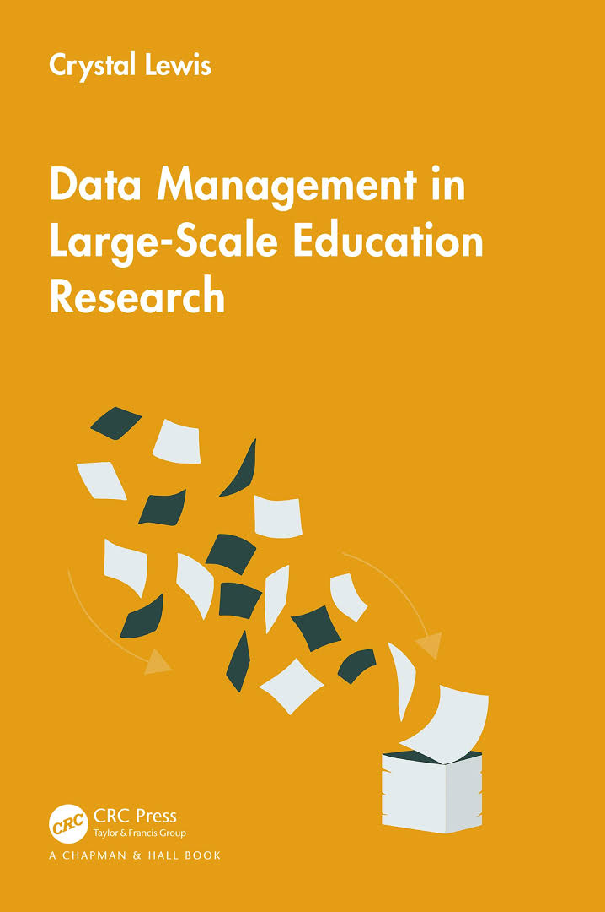

# Preamble

This is the in-progress version of *Data Management in Large-Scale Education Research*. When completed, this book will be published by CRC Press. To see a previous version of this material, please visit this [website](https://cghlewis.github.io/mpsi-data-training/).

 

*The results of educational research studies are only as accurate as the data used to produce them.*   *- Aleata @hubbard_data_2017*

## Introduction

In 2013, without knowing that the term research data management existed, I accepted a position with a prevention science research center. My job was to coordinate the collection and management of data for federally funded randomized controlled trial efficacy studies taking place in K-12 schools, along with a team of investigators, other research staff, part-time data collectors, and graduate students. While I had some experience analyzing and working with education data, i.e. ECLS-K, I had no experience running research grants, collecting original data, or managing research data, but I was excited to learn.

In my time in that position I learned to plan, schedule, and track data collection activities, create data capture tools, organize and document data inputs, and produce usable data outputs; but I didn't learn to do those things through any formal training. There were no books, courses, or workshops that I learned from. I learned from colleagues and a large amount of trial and error. Since then, as I have met more investigators, data managers, and project coordinators in education research, I realize that this is a common method for learning data management---mentoring and "winging it". And while learning data management through these informal methods helps us get by, the ramifications of this unstandardized system are felt by both the project team and future data users.

## Why this book

Research data management is becoming more complicated. We are collecting more data, in sometimes very novel ways, and using more complex technologies, all while increasing the visibility of our work with the push for data sharing and open science practices [@briney_data_2015; @nelson_ostp_2022]. Ad hoc data management practices may have worked for us in the past, but now others need to understand our processes as well, requiring researchers to be more thoughtful in planning their data management routines.

### Lack of training, resources, and standards

In order to implement thoughtful and standardized data management practices, researchers need training. Yet there is a clear lack of data management training in higher education. In a survey of 274 psychology researchers, @borghi_data_2021 found that only 33% of respondents learned data management from college level coursework, while 64% learned from collaborators, and 52% learned from self-education. In their survey of 202 education researchers (PIs and Co-PIs), @ceviren_data_2022 found that over 60% of respondents reported having no formal training in data management, yet across eight different data management practices, respondents were responsible for data management activities anywhere from 25-50% of the time. Similarly, in a survey of 150 graduate students in a school of education, when asked if they needed more training in research data management, the average overall score on a scale from 1 to 100 was 80, while the overall confidence in managing data score was only 40 [@zhou_research_2023]. Furthermore, of the training that does exist, usually provided through university library systems, most material is either discipline agnostic or STEM focused, leaving a gap in training on how to apply skills to the field of education which has unique issues, particularly around working with human subjects data [@nichols_hess_advancing_2017].

Without training, resources and formal support systems are the next best option for learning best practices. Within university systems, in addition to providing periodic training, research data librarians provide data management planning consultation for researchers and their teams. There is also a wealth of existing research data management books and manuals written for broad audiences which I will link to in this book. However, while education researchers are starting to put out some excellent resources [@neild_sharing_2022; @reynolds_basics_2022], I still find there is a dearth of practical guides for researchers to refer to when building a data management workflow in the field of education, especially those working on large-scale longitudinal research grants where there are many moving pieces. Researchers are often collecting data in real-world environments, such as school systems, and keeping that data secure and reliable in a deliberate and orderly way can be overwhelming.

Last, unfortunately, while other fields of research, such as psychology, appear to be banding together to develop standards around how to structure and document data [@kline_technical_2018], the field of education has yet to develop agreed upon rules for things such as data documentation or data formats. This lack of standards leads to inconsistencies in the quality and usability of data products across the field [@borghi_promoting_2022].

### Consequences

A lack of training in data management practices and an absence of agreed upon standards in the field of education leads to consequences. Implementing subpar and inconsistent data management practices, while typically only resulting in frustration and time lost, also has the potential to be devastating, resulting in analyzing erroneous data or even unusable or lost data. In a review of 1,082 retracted publications from the journal PubMed from 2013-2016, authors found that 32% of retractions were due to data management errors [@campos-varela_misconduct_2019]. In a 2013 study surveying 360 graduate students about their data management practices, 14% of students indicated they had to recollect data that had been previously collected because they could not find a file or the file had been corrupted, while 17% of students said they had lost a file and been unable to recollect it [@doucette_drowning_2013]. In their study of 488 researchers who had published in a psychology journal between 2010 and 2018, Kovacs, et al. [-@kovacs_role_2021] asked respondents about their data management mistakes and found that the most serious data management mistakes reported led to a range of consequences including time loss, frustration, and even erroneous conclusions.

Poor data management can even prevent researchers from implementing other good open science practices. In waves 1 and 2 of the Open Scholarship Survey being collected by the Center for Open Science, the team has found that of the education researchers surveyed who are currently not publicly sharing their research data, approximately 15% mentioned "being nervous about mistakes" as a reason for not sharing [@beaudry_open_2022]. Similarly, when surveying 780 researchers in the field of psychology, researchers found that 38% of respondents agreed that a "fear of discovery of errors in the data" posed a barrier to data sharing [@houtkoop_data_2018].

The well-known replication crisis is another reason to be concerned with data management. Failure to implement practices such as quality documentation or standardization of practices (among many other reasons), resulted in one study finding that across 1,500 researchers surveyed, more than 70% had tried and failed to reproduce another researcher's study [@baker_1500_2016].

## About this book

While the field as a whole may not have agreed upon guidelines for data management, there are still practices that are proven to result in more secure, reproducible, and reliable data. My hope is that this book can be a foundation to help researchers think through how to build a quality, standardized data management workflow that works for their team and their projects. As suggested in the title of this book, this content is designed to specifically help teams navigate the complicated workflows associated with large-scale research, such as randomized controlled trial studies, but ultimately these practices are applicable to any research project, no matter the scale.

This book should be viewed as a handbook to be referenced regularly and is not necessarily meant to be read in its entirety in one sitting. While perusing through the entire book to better understand the entire research data life cycle is very helpful, this book is also intended to have chapters referenced as needed when you are ready to start planning a specific phase of your project.

### What this book will cover

This book begins, like many other books in this subject area, by describing the research life cycle and how data management fits within the larger picture. The remaining chapters are then organized by each phase of the life cycle, with examples of best practices provided for each phase. Considerations on whether you should implement, and how to integrate those practices into your workflow will be discussed.

### What this book will not cover

It is important to also point out what this book will not cover. This book is intended to be tool agnostic and provide suggestions that anyone can use, no matter what tools you work with, especially when it comes to data cleaning. Therefore, while I might mention options of tools you can use for different tasks, I will not advocate for any specific tools.

There are also no specific coding practices or actual syntax included in this book. To be honest, in many ways I feel that the actual "data cleaning" phase of data management is the *easiest* phase to implement, as long as you implement good practices up until that point. Because of that, this book introduces practices in all phases leading up to data cleaning that will prepare your data for minimal cleaning. With that said, I do provide examples of what I would expect to see in a data cleaning process, I just do not provide steps for any specific software system. That is beyond the scope of this book.

This book will also not talk about analysis or preparing data for analysis through means such as data imputation, removal of legitimate outliers, or calculating analysis specific variables. Written from the perspective of a data manager, the end goal of data management is to build datasets for general data sharing. This means we will cover practices that keep data in its most complete and true, but usable form, for any future researcher to analyze in a way that works best for them.

## Who this book is for

This book is for anyone involved in a research study involving original data collection. In particular, this book focuses on quantitative data, typically collected from human participants, although I do think that many of the practices covered can also apply to other types of data as well. This book also applies to any team member, ranging from PIs, to data managers, to project staff, to students, to contractual data collectors. The contents of this book are useful for anyone who may have a part in planning, collecting, or organizing research study data.

## Final note

Planning and implementing new data management practices on top of planning the implementation of your entire research grant can feel overwhelming. However, the idea of this book is to find the practices that work for you and your team and implement them consistently. For some teams that may look like implementing just a few of the suggestions mentioned and for others it may involve implementing all of the suggestions. Improving your data management workflow is a process and it becomes easier over time as those practices become part of your normal routine. At some point you may even find that you enjoy working on data management processes as you start to see the benefits of their implementation!

## Acknowledgements

This book is a compilation of lessons I have learned in my personal experiences as a data manager, knowledge collected from existing books and papers (many written by librarians or those involved in the open science movement), as well as advice and stories collected through interviews with other researchers who work with data. I want to be clear that I did not formally study research data management, unlike research data librarians who are experts in this content. Much of this book will be based off of lessons learned from firsthand experience and this book is my attempt to hopefully save others from making the same mistakes I have personally made or seen others make. I can not emphasize enough that if you work for a university and you have the opportunity to consult with a librarian for your project, you absolutely should!

With that said, there is a long list of people I would like to acknowledge for their contributions to this book and for supporting me in this process.

There were many people who graciously allowed me to interview them about their current data management practices. They are Mary McCraken, Ryan Estrellado, Kim Manturuk, Beth Chance, Jessica Logan, Rebecca Schmidt, Sara Hart, and Kerry Shea. These interviews were integral to supplementing my personal knowledge with the broader experience of others in the field. Yet, they affirmed that yes, data management is hard, especially in the context of some of the complicated study designs we work with in education research, and that everyone who works in this field wishes that better training, support systems, and standards existed. Thank you to everyone who gave me an hour of their time to share their experiences and knowledge! I also have to give a special thank you to Jessica Logan for being the first person I met who appreciates all things data management as much as I do, and since having our interview, has provided invaluable support while working on this book.

I also want to thank everyone who took the time to read and provide feedback on chapters of this book for me. This includes Meghan Harris, Alexis Swanz, Allyson Hanson, Rohan Alexander, and Peter Higgins. Your revisions and insight helped make this a more cohesive and useful book!

A special thank you to Keith Herman as well. Many years ago he suggested I write a book titled Data Management in Large-Scale Education Research, based on everything I've learned in my experience as a data manager. At the time I considered his suggestion a fun but impossible idea. Yet after sitting with that idea in the back of my head for several years, I realized his idea was actually not so far-fetched. Thank you to Keith for believing I could do something I didn't even know was possible.

Much appreciation to Wendy Reinke as well. Although she may not know it, she is the first person I learned research data management practices from. Joining a project where she had already created documentation and tracking systems was my first glimpse into building tools that help you manage data and my love of research data management grew out of this experience.

I want to say thank you to the POWER Data Management Issues in Education Research Hub. Regularly meeting with this group of data managers, researchers, students, and professors over the last two years has been an amazing source of both support and learning and has greatly increased my understanding of data management.

Last, thank you to Josh for fully supporting me in the decision to write this book and to Fox for being the reason I remember to step away from my computer from time to time and have fun.
