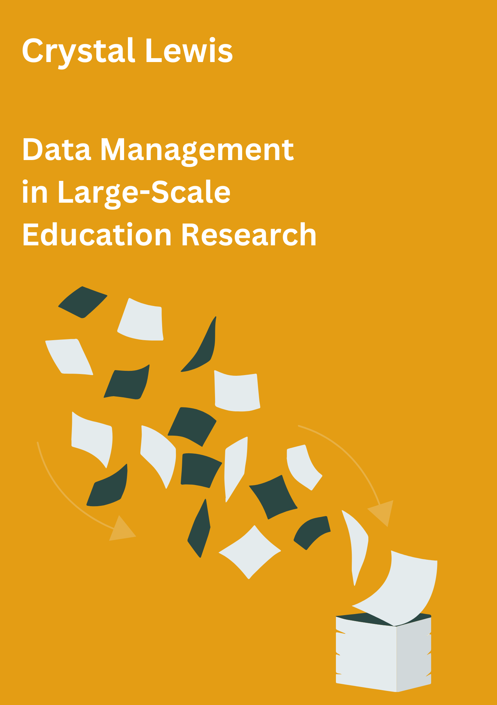

--- 
title: "Data Management in Large-Scale Education Research"
author: "Crystal Lewis"
date: "2022-10-12"
site: bookdown::bookdown_site
documentclass: book
bibliography: [book.bib, packages.bib]
# url: your book url like https://bookdown.org/yihui/bookdown
# cover-image: path to the social sharing image like images/cover.jpg
cover-image: book_featured.PNG
description: |
  This is the in-progress version of *Data Management in Large-Scale Education Research*
biblio-style: apa
csl: chicago-fullnote-bibliography.csl
---

# Preamble

This is the in-progress version of *Data Management in Large-Scale Education Research*. To see a previous version of this material, please visit this [website](https://cghlewis.github.io/mpsi-data-training/).

 

_The results of educational research studies are only as accurate as the data used to produce them._ 
 
  _- Aleata Hubbard_ [@hubbard_data_2017]

## Introduction 

In 2013, without knowing that the term research data management existed, I accepted a job as a Research Associate with a prevention science research center. My job was to coordinate the collection and management of data for federally funded randomized controlled trial efficacy studies taking place in K-12 schools, along with a team of PIs, other full-time staff, part-time data collectors, and graduate students. While I had some experience analyzing and working with education data, i.e. ECKLS-K, I had no experience running research grants, collecting original data, or managing research data, but I was excited to learn.
 
In my time in that position I learned to plan, schedule, and track data collection activities, create data collection tools, organize and document data inputs, and produce usable data outputs; but I didn't learn to do these things through any formal training. There were no books, courses, or workshops that I learned from. I learned from colleagues and a large amount of trial and error. Since then, as I have met more PIs, data managers, and project coordinators in education research, I realize that this is a common method for learning data management (mentoring and “winging it”). And while learning data management through these informal methods helps us get by, what these type of training methods really lack are standards, leading to inconsistencies across the field [@borghi_promoting_2022].

## Why this book

Research data management is becoming more complicated. We are collecting more data, in sometimes very novel ways, and using more complex technologies, all while increasing the visibility of our work with the push for data sharing and open science practices [@briney_data_2015]. Ad hoc data management practices may have worked for us in the past, but now others need to understand our processes as well, requiring researchers to be more thoughtful in planning their data management routines.  

### Lack of training, resources, and standards

In order to implement thoughtful and standardized data management practices, researchers need training. Yet there is a clear lack of data management training in higher education. In a survey of 274 psychology researchers, Borghi and Van Gulick [@borghi_data_2021] found that only 33% of respondents learned data management from college level coursework, while 64% learned from collaborators, and 52% learned from self-education. In their survey of 202 education researchers (PIs and Co-PIs), Ceviren and Logan [@ceviren_ceviren_logan_ehe_forum_2022pdf_2022] found that over 60% of respondents reported having no formal training in data management, yet across eight different data management practices, respondents were responsible for data management activities anywhere from 25-50% of the time.

Without training, resources and formal support systems are the next best option for learning best practices. During my data management journey I have discovered an excellent support system of professionals in university systems, i.e. research data librarians, who can consult with research teams in their data management journey, and I have also come across some solid existing research data management books and manuals which I will link to in this book. However, while education researchers are starting to put out some excellent resources [@neild_sharing_2022; @reynolds_basics_2022], I still find there is a dearth of tangible guides for researchers to refer to when building a data management workflow in the field of education, especially those working on large-scale longitudinal research grants where there are many moving pieces. Researchers are often collecting data in real-world environments, such as school systems, and keeping that data secure and reliable in a deliberate and orderly way can be overwhelming. 

Last, unfortunately, while other fields of research, such as psychology, appear to be banding together to develop standards around data management [@noauthor_psych-ds_nodate], the field of education has yet to develop agreed upon rules for things such as data documentation or data formats. With this lack of standards, researchers are left to create practices that work for their team, leading to inconsistent data management practices across the field.

### Consequences

A lack of training in data management practices and an absence of agreed upon standards in the field of education leads to consequences. Implementing inconsistent data management practices, while typically only resulting in frustration and time lost, also has the potential to be devastating, resulting in analyzing erroneous data or even unusable or lost data. In a review of 1,082 retracted publications from the journal PubMed from 2013-2016, authors found that 32% of retractions were due to data management errors [@campos-varela_misconduct_2019]. In a 2013 study surveying 360 graduate students about their data management practices, 14% of students indicated they had to recollect data that had been previously collected because they could not find a file or the file had been corrupted, while 17% of students said they had lost a file and been unable to recollect it [@doucette_drowning_2013]. In their 2021 study of 488 researchers who had published in a psychology journal between 2010 and 2018, Kovacs et al. [@kovacs_role_2021] asked respondents about their data management mistakes and found that the most serious data management mistakes reported led to a range of consequences including time loss, frustration, and even erroneous conclusions. 

Poor data management can even prevent researchers from implementing other good open science practices. In waves 1 and 2 of the Open Scholarship Survey being collected by the Center for Open Science, the team has found that of the education researchers surveyed who are currently not publicly sharing their research data, about 10% mentioned “being nervous about mistakes” as a reason for not sharing [@osf_cos_2022]. The well known replication crisis is another reason to be concerned with data management. Failure to implement practices such as quality documentation or standardization of practices (among many other reasons), resulted in one study finding that across 1,500 researchers surveyed, more than 70% had tried and failed to reproduce another researcher’s study [@eisenstein_pursuit_2022].

## About this book

My hope is that this book can be a foundation to help researchers think through how to build a consistent and standardized data management workflow that works for their team and their projects. While the field as a whole may not have agreed upon rules for data management, there are still best practices that are proven to result in more reproducible, reliable, and secure data. While this book cannot remove barriers to implementing good data management practices, such as the complexity of your project or the novelty of the technology you are using [@alston_beginners_2021] it hopefully provides you the knowledge and skills necessary to work in these complex environments.

This book should be viewed as a handbook to be referred to regularly and is not necessarily meant to be read in its entirety in one sitting. While perusing through the entire book to better understand the entire research data life cycle is very helpful, this book is also intended to have chapters referenced as needed when you are ready to start planning a specific phase of your project.

### What this book will cover

This book begins, like many other books in this subject area, by describing the research life cycle and how data management fits within the larger picture. The remaining chapters are then organized by each phase of the life cycle, with examples of best practices provided for each phase. Considerations on whether you should implement and how to integrate those practices into your workflow will be discussed.

### What this book will not cover

It is important to also point out what this book will not cover. This book is intended to be tool agnostic and provide suggestions that anyone can use, no matter what tools you work with, especially when it comes to data cleaning. Therefore while I might mention options of tools you can use for different tasks, I will not advocate for any specific tools.

There are also no specific coding practices or actual syntax included in this book. To be honest, in many ways I feel that the actual “data cleaning” phase of data management is the “easiest” phase to implement, as long as you implement good practices up until that point. Because of that, this book introduces practices in all phases leading up to data cleaning that will prepare your data for minimal cleaning. With that said, I do provide examples of what I would expect to see in a data cleaning process, I just do not provide steps for any specific software system. That is beyond the scope of this book. 

This book will also not talk about analysis or preparing data for analysis through means such as data imputation or calculating analysis specific variables. This book is written from the perspective of a data manager, and that perspective is to implement practices that keep data in its most true, but usable form, for any future researcher to analyze in a way that works best for them.

## Who this book is for

This book is for anyone involved in a research study involving original data collection. This book in particular focuses on quantitative data collection, while I do think that many of the practices covered can also apply to qualitative data as well. This book also applies to any team member, ranging from PIs, to data managers, to project staff, to students, to contractual data collectors. The contents of this book are useful for anyone who may have a part in planning, collecting, or organizing research study data. 

## Final note

Planning and implementing new data management practices on top of planning the implementation of your entire research grant can feel overwhelming. However, the idea of this book is to find and implement the practices that work for you and your team, and that may be just a few of the suggestions mentioned or all of the suggestions. Improving your data management workflow is a process and it becomes easier over time as those practices become part of your normal routine. At some point you may even find that you enjoy working on data management processes as you start to see the benefits of their implementation!

## Acknowledgements

This book is a compilation of lessons I have learned in my personal experiences as a data manager, knowledge collected from existing books and papers (many written by librarians or those involved in the open science movement), as well as advice and stories collected through interviews with other researchers who work with data. I want to be clear that I did not study research data management, unlike research data librarians who are experts in this content. Much of this book will be based off of lessons learned from firsthand experience and this book is my attempt to hopefully save others from making the same mistakes I have personally made or seen others make. I can not emphasize enough that if you work for a university and you have the opportunity to consult with a librarian for your project, you absolutely should!

With that said, there is a long list of people I would like to acknowledge for their contributions to this book and for supporting me in this process.

Interviewees:

Others:

<!--chapter:end:index.Rmd-->

# Research Data Management

## What is research data management?

Research data management (RDM) involves the broad process of planning and implementing standardized practices across the research life cycle [@borghi_promoting_2022]. The practices of managing data begin long before data is ever collected, during the planning phase, and continue well after a research project ends during the archiving phase. 

While organizations like Data Documentation Initiative and Dublin Core have developed metadata standards for fields to adopt, it is common knowledge that there are no agreed-upon norms for managing data within and across disciplines within the field of education. The rules for how data should be collected, organized, stored, described, and shared is often left up to each individual team, as long as external requirements of the IRB and funders are met [@tenopir_data_2016-1]. With a growing interest in open science practices and expanding requirements for federally funded research to make data publicly available [@office_of_science_and_technology_policy_ostp_2022], data repositories will most likely begin to play a stronger role in promoting standards for many data management practices around data formats and documentation [@borghi_promoting_2022].

## Why care about research data management?

Without agreed-upon standards in the field, it is important for research teams to develop their own data management standards that apply within and across all of their projects. There are both external pressures and personal reasons to care about developing research data management standards.

### External Reasons

1. **Funder compliance**: Since 2013, even earlier for the National Science Foundation, most federal agencies that education researchers work with have required a data management plan as part of their funding application. While the focus of these plans is mostly on the future outcome of data sharing, the data management plan is a means of ensuring that researchers will thoughtfully plan for a research study that will result in data that can be shared with confidence, free from errors, uncertainty, or violations of confidentiality. President Obama’s May 2013 Executive Order declared that “the default state of new and modernized government information resources shall be open and machine readable" [@the_white_house_executive_2013]. In August of 2022, the Office of Science and Technology Policy (OSTP) doubled down on their data sharing policy and issued a memorandum stating that all federal agencies must update their public access policies no later than December 31, 2025, to make federally funded publications and their supporting data accessible to the public with no embargo on their release [@office_of_science_and_technology_policy_ostp_2022]. Along with this mandatory data sharing policy, comes the incentive to manage your data for the purposes of data sharing [@borghi_promoting_2022].

1. **Journal compliance**: Depending on what journal you publish with, providing open access to the data associated with your publication may be a requirement. Again, along with data sharing, comes the incentive to manage your data in a thoughtful, responsible, and organized way.

1. **Compliance with legal and ethical mandates**: If you are required to submit your research project to the Institutional Review Board, they will monitor how you manage your data. They care about the welfare, rights, and privacy of research participants and will have rules for how data is managed and stored securely.

1. **Open science practices**: With a growing interest in open science practices, sharing well managed data, curated in a reproducible way is "a strong indicator to fellow researchers of rigor, trustworthiness, and transparency in scientific research" (Alston & Rick, 2021, p.2 [@alston_beginners_2021]). Sharing data that has been managed in a reproducible way allows others to learn from your work, validate your results to strengthen evidence, as well as potentially catch errors in your work, preventing decisions being made based on incorrect data [@alston_beginners_2021]. Well-managed data with sufficient documentation can also lead to more collaboration and greater impact as collaborators are able to access and understand your data with ease [@borghi_promoting_2022; @cowles_research_nodate @eaker_what_2016].

### Personal reasons

Even if you never plan to share your data outside of your research group, there are still many compelling reasons to manage your data. 

1. **Contributes to reproducibility**: Reproducible research “is a by-product of careful attention to detail throughout the research process" (Alston & Rick, 2021, p.2 [@alston_beginners_2021]). Even if you are not concerned with others being able to reproduce your work (which is unlikely), you most likely want you and your team members to be able to reproduce each others work, ensuring you can trust your results.

1. **Improve continuity**: Implementing reproducible practices ensures project continuity through staff turnover. Having developed thorough protocols allows new staff to pick up right where the project left off, and implement the project with fidelity [@borghi_data_2021; @cowles_research_nodate; @markowetz_five_2015]. Furthermore, having documented your data cleaning steps and transformations along the way, also allows your collaborators to pick up where you left off to easily continue an analysis project.

1. **Increases efficiency**: Documenting and automating tasks reduces duplication of efforts for repeating tasks, especially in longitudinal studies.

1. **Reduces burden and saves time, energy, and resources**: Taking the time to implement quality data management through the entire research study reduces data curation debt caused by suboptimal data management practices [@butters_recognizing_2020]. Having poorly managed or documented data may make your data unusable, either permanently or until errors are corrected. Decreasing or removing this debt reduces the time, energy, and resources spent at the end of your study scrambling to fix errors made in poorly designed data collection instruments, gathering duplicate data that was lost, or documenting efforts long after most information has been forgotten.

1. **Shortens publication time**: Being able to find and understand your data when you need it is a huge benefit. It allows for the easy use and re-use of your data, and hastens efforts like the publication process [@markowetz_five_2015]. Not having to search around for numbers of consented participants or asking which version of the data you should use allows you to spend more time analyzing and writing and less time playing detective.

1. **Increases reliability**: Errors come in many forms, from both humans and technology. We've seen evidence of this in the papers cited as being retracted for "unreliable data" in the blog [Retraction Watch](https://retractionwatch.com/). Implementing quality control procedures reduces the chances of errors occurring and allows you to have confidence in your data. Without implementing these practices, your research findings could include extra noise, missing data, or erroneous or misleading results.

1. **Improves data security**: Quality data management practices reduce the risk of lost or stolen data, the risk of data becoming corrupted or inaccessible, and the risk of breaking confidentiality agreements.

## Existing Frameworks

## Terminology

## The Research Life Cycle

<!--chapter:end:01-rdm.Rmd-->

# Data Management Plan {#dmp}

## History and purpose

## What is it?

## Why are DMPs important?

## What to include?

## Getting help

## Budgeting

<!--chapter:end:02-dmp.Rmd-->

# Planning Data Management

## Why spend time on planning?

## Planning checklists

## How to move from a planning checklist to a workflow

<!--chapter:end:03-planning.Rmd-->

# Project Roles and Responsibilities

## Why it's important to assign roles

## Typical roles in a research project

<!--chapter:end:05-roles.Rmd-->

# Documentation

## What is documentation?

## Why is documentation important?

## Team Level

## Project Level

## Dataset Level

## Variable Level

<!--chapter:end:06-documentation.Rmd-->

# Data Collection

## Why consider data management in data collection?

## Consents

## Electronic data collection instruments

## Paper data collection instruments

## Interviews/cocus groups

<!--chapter:end:07-data-collection.Rmd-->

# Data Capture

## Electronic data capture

## Paper data capture

## Extant data

<!--chapter:end:08-data-capture.Rmd-->

# Data Storage and Security

## Types of data you'll be storing

## General security rules

## Participant tracking database

## Electronic data

## Detachable media

## Audio/visual data

## Paper data

## Sharing data

<!--chapter:end:09-data-storage.Rmd-->

# Data Cleaning

## Foundational knowledge

## Data structure

## Data cleaning plan

## Data validation

## Why use code?

<!--chapter:end:10-data-cleaning.Rmd-->

# Data Sharing

## Why share your data?

## Considering FAIR principles

## Best practices

## Retractions and revisions

<!--chapter:end:11-data-sharing.Rmd-->

# Wrapping It Up

## Connecting practices to outcomes

## Putting in the work

<!--chapter:end:12-wrap-up.Rmd-->

# Call to Action

## Last thoughts

## Training for future researchers

## Investing in data management and data managers

<!--chapter:end:13-call-action.Rmd-->

# Appendices

<!--chapter:end:14-appendices.Rmd-->

<!--chapter:end:15-references.Rmd-->

